# React Component Architecture

## Scope

`edgerules-react` is a component library, not a complete application. The current checkout contains reusable editing and
navigation surfaces under `src/components/*`; it does not contain the application Shell that arranges those surfaces
into a workspace.

## Component diagram

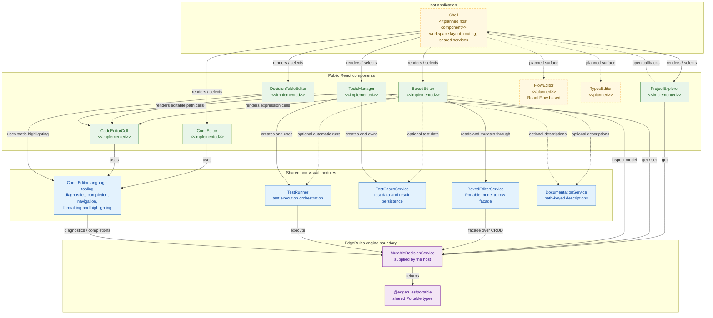

- Between implemented nodes, **solid arrows** represent runtime composition or calls.
- The solid arrows leaving the planned Shell show its intended primary composition.
- Dashed arrows represent optional collaboration, callback flow, or surfaces that are themselves still planned. In
  particular, `CodeEditorCell` reuses the language modules under `code-editor`; it does not render or wrap the
  `CodeEditor` React component.

## Main React components

| Component             | Source and package entry point                                                         | Responsibility                                                                                                                                           | Direct component dependency                                                                                 |
| --------------------- | -------------------------------------------------------------------------------------- | -------------------------------------------------------------------------------------------------------------------------------------------------------- | ----------------------------------------------------------------------------------------------------------- |
| `CodeEditor`          | `src/components/code-editor`; package root and `edgerules-react/code-editor`           | Full-document EdgeRules DSL editing with CodeMirror and engine-backed language features.                                                                 | None. It uses the shared code-editor language modules.                                                      |
| `CodeEditorCell`      | `src/components/code-editor-cell`; package root and `edgerules-react/code-editor-cell` | Compact DSL editor with grid-friendly commit, cancel, blur and focus behavior.                                                                           | None. It uses the shared code-editor language modules rather than `CodeEditor`.                             |
| `BoxedEditor`         | `src/components/boxed-editor`; package root and `edgerules-react/boxed-editor`         | Structured treegrid editor over a `BoxedEditorService`.                                                                                                  | Renders `CodeEditorCell` for active expression cells.                                                       |
| `DecisionTableEditor` | `src/components/decision-table`; package root and `edgerules-react/decision-table`     | DMN-style ruleset table editor backed by `get`/`set` operations.                                                                                         | Renders one `CodeEditorCell` for the active DSL cell and uses shared static highlighting.                   |
| `TestsManager`        | `src/components/tests-manager`; `edgerules-react/tests-manager`                        | Test-case grid, subject selection, persistence and execution orchestration.                                                                              | Renders `CodeEditorCell` for editable path cells.                                                           |
| `ProjectExplorer`     | `src/components/project-explorer`; package root and `edgerules-react/project-explorer` | Lazily loaded tree navigation for contexts, variables, functions, decision tables and types.                                                             | None. It reports navigation intent through callbacks instead of importing editors.                          |
| `FlowEditor`          | Not present and not exported.                                                          | Planned React Flow-based visual editor for input, function, ruleset, terms, chart and output nodes.                                                      | No source dependency can be asserted until it is implemented.                                               |
| `TypesEditor`         | Not present and not exported.                                                          | Planned editor for EdgeRules type definitions.                                                                                                           | No source dependency can be asserted until it is implemented.                                               |
| `Shell`               | Not present and not exported.                                                          | Planned application integration layer that owns workspace layout, active-editor routing, shared engine/service instances and navigation callback wiring. | Composes the public components; it belongs to a host application unless later added as a library component. |

## Dependency rules

### Shell owns cross-editor navigation

Major editors remain independently renderable. `ProjectExplorer` exposes `onOpenVariables`, `onOpenFunction`,
`onOpenDecisionTable` and `onOpenTypes` callbacks. A Shell should translate those callbacks into active-editor state and
resolve the selected model path into the props or source text expected by the corresponding editor. This avoids direct
dependencies such as `ProjectExplorer` importing `DecisionTableEditor`.

### The engine remains the model authority

React components do not implement rule evaluation and should not keep a second persisted copy of the model. The host
supplies a service compatible with the required subset of `MutableDecisionService`:

- `ProjectExplorer` reads with `get`;
- `DecisionTableEditor` reads and commits with `get`/`set`;
- `BoxedEditor` works through `BoxedEditorService`, a facade over engine CRUD;
- `TestsManager` inspects the model and its `TestRunner` executes it; and
- code-editor language tooling asks the service for diagnostics and completions.

Portable model nodes and errors cross this boundary using `@edgerules/portable` types.

## Project state architecture

> Project State Architecture is in development and not completed

### Primary decision

Do **not** create a state-owning React component named `ProjectState`.

Create these two separate concepts:

| Concept             | Kind                    | Responsibility                                                                |
| ------------------- | ----------------------- | ----------------------------------------------------------------------------- |
| `ProjectSession`    | Framework-neutral store | Owns one loaded working copy, its services, commands, history and save state. |
| `ProjectProvider`   | React component         | Injects one stable `ProjectSession` instance into a workspace subtree.        |
| `useProjectSlice`   | React hook              | Subscribes a component to one immutable session slice.                        |
| `Shell`             | React component         | Owns active session ID, tabs, routes and session lifetime.                    |
| `ProjectRepository` | Persistence port        | Loads and conditionally saves durable project revisions.                      |

**Reason:** the engine, documentation, tests and React Flow stores already change outside React. A framework-neutral
external store gives them one transaction boundary. React Context should distribute the stable store instance, not a
large changing project value.

### State ownership

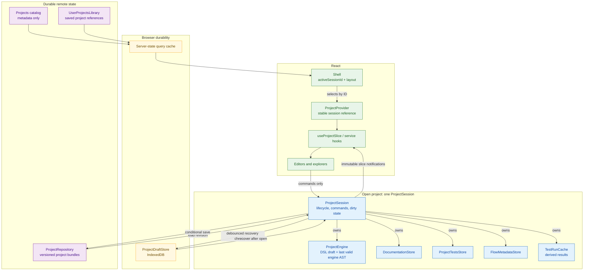

| State                                                    | Owner                        | Durable authority           | React access                       |
| -------------------------------------------------------- | ---------------------------- | --------------------------- | ---------------------------------- |
| Catalog results, filters, pages                          | Server-state query cache     | Catalog sources             | Query hooks                        |
| User's project references                                | `UserProjectsLibraryService` | User account backend        | Query and mutation hooks           |
| Active project/tab ID                                    | `Shell`                      | URL or optional preference  | `useState` or router state         |
| Loaded project aggregate                                 | `ProjectSession`             | `ProjectRepository`         | `ProjectProvider` + selector hooks |
| DSL semantic model                                       | `ProjectEngine`              | Valid DSL in project bundle | Engine facade passed to editors    |
| Uncommitted invalid DSL text                             | `ProjectEngine.dslDraft`     | IndexedDB draft only        | DSL editor selector                |
| Documentation                                            | `DocumentationStore`         | `documentation.json`        | `DocumentationService` facade      |
| Authored tests                                           | `ProjectTestsStore`          | `tests.json`                | `TestCasesService` subject facade  |
| Latest test results                                      | `TestRunCache`               | None; optionally IDB cache  | Test result hook                   |
| React Flow positions, viewport and presentation metadata | `FlowMetadataStore`          | `flow.json`                 | Flow selectors                     |
| Dialogs, hover, selection and uncommitted field input    | Closest React component      | None                        | `useState` / `useReducer`          |
| Dirty, saving, conflict, undo and redo state             | `ProjectSession`             | Draft checkpoint            | Project status selector            |

### Canonical project aggregate

One durable revision contains all authored project data:

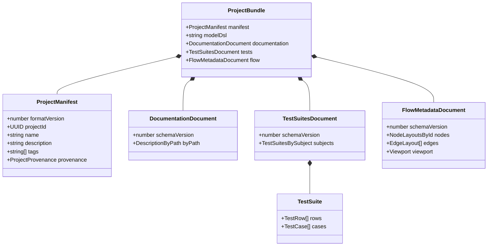

Logical repository layout:

```text
project.json
model.edge
documentation.json
tests.json
flow.json
```

Rules:

1. `model.edge` is the only persisted business-rule semantics.
2. `documentation.json`, `tests.json` and `flow.json` are versioned in the same project revision.
3. `flow.json` stores presentation data only. Executable graph semantics must be derived from or committed to DSL.
4. Test results are derived and excluded from `tests.json`; only inputs, assertions and authored row configuration are
   project data.
5. Every JSON document has its own `schemaVersion`; `project.json.formatVersion` versions the aggregate.
6. IDs are stable UUIDs. Names and paths are mutable labels, never storage identity.
7. A repository revision token is an envelope field, not authored project content.

### Catalog library, user library and opening

```mermaid
flowchart LR
  Sources["GitHub / S3 / curated sources"]
  CatalogService["ProjectsCatalogService"]
  CatalogUI["ProjectsLibrary"]
  UserService["UserProjectsLibraryService"]
  UserRepo["UserProjectsRepository"]
  UserUI["UserProjectsLibrary"]
  Manager["ProjectSessionManager"]
  RepoRouter["ProjectRepositoryRouter"]
  Workspace["Project workspace"]

  Sources -->|"descriptors + pagination"| CatalogService
  CatalogService --> CatalogUI
  CatalogUI -->|"add(mode: link or fork)"| UserService
  UserService --> UserRepo
  UserRepo --> UserUI
  UserUI -->|"open(libraryEntryId)"| Manager
  Manager --> RepoRouter
  RepoRouter -->|"LoadedProject"| Manager
  Manager --> Workspace
```

`ProjectsLibrary` and `UserProjectsLibrary` hold descriptors and references, not loaded project content.

| Operation      | Result                                                                                   |
| -------------- | ---------------------------------------------------------------------------------------- |
| Add as `link`  | Save a reference to the source project; preserve source permissions and revision policy. |
| Add as `fork`  | Create a new writable project ID and origin; retain `forkedFrom` provenance.             |
| Select project | Resolve its `UserProjectRef`, load one revision, then create/reuse a `ProjectSession`.   |
| Close project  | Dispose engine and subscriptions; retain only a recoverable local draft if dirty.        |

The add mode must be explicit. A silent copy loses provenance; a silent link can surprise users when edits are not
permitted.

`UserProjectsRepository` should normally be account-backed for cross-device access. A user-owned GitHub/S3 index can
implement the same port. IndexedDB alone is suitable only for an explicitly device-local product.

### Open-project sequence

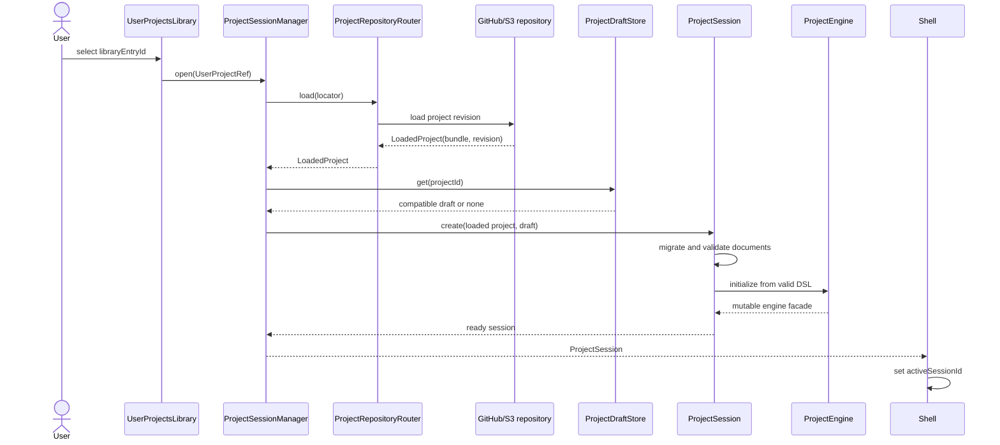

Failure policy:

| Failure                                             | Behavior                                                                            |
| --------------------------------------------------- | ----------------------------------------------------------------------------------- |
| Remote unavailable, matching cached revision exists | Open cache in offline mode; remote save disabled.                                   |
| Project schema is older                             | Run pure, versioned migrations before constructing stores.                          |
| Project schema is newer                             | Open read-only with an upgrade-required error.                                      |
| Remote DSL is invalid                               | Open recovery/code view; do not construct structured editors from an invalid model. |
| Draft base revision differs from remote             | Offer recover/compare/discard; never apply silently.                                |

## React project-state component diagram

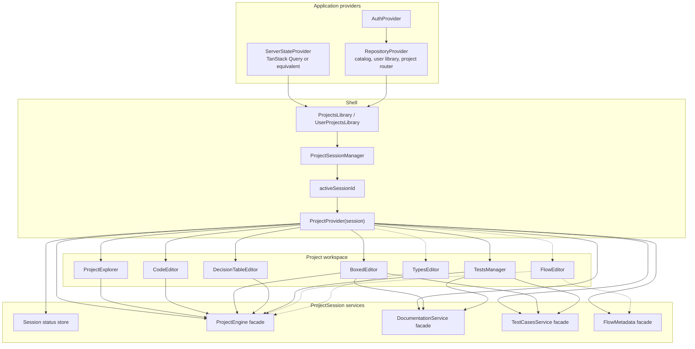

React rules:

| Rule                  | Decision                                                             | Argument                                                                             |
| --------------------- | -------------------------------------------------------------------- | ------------------------------------------------------------------------------------ |
| Context value         | A stable `ProjectSession` reference only.                            | Prevent every project change from rerendering the entire workspace.                  |
| Store subscription    | `useSyncExternalStore` through domain hooks.                         | Engine and service mutations are external to React and require consistent snapshots. |
| Snapshots             | Immutable and referentially stable until the relevant slice changes. | React compares snapshots with `Object.is`.                                           |
| Selection             | Store `activeSessionId`, node ID and path; derive objects.           | Avoid duplicated state becoming inconsistent.                                        |
| Remote metadata       | Query cache, not copied into component state.                        | Catalog data is asynchronous, shared and remotely owned.                             |
| Mutations             | Typed session commands; never cross-service writes from components.  | One command can update every affected artifact atomically.                           |
| Derived values        | Selectors or render-time derivation.                                 | Avoid persisted `isDirty`, counts or selected objects duplicating source data.       |
| Component-local state | Keep transient editing and UI state near the component.              | Project scope is unnecessary for hover, menus and dialogs.                           |

## Main project-state APIs

### Catalog and repository classes

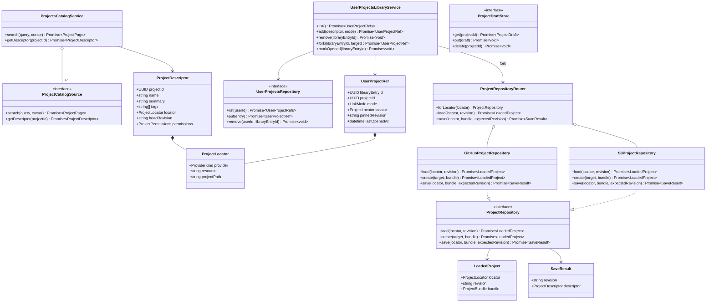

### Session and slice classes

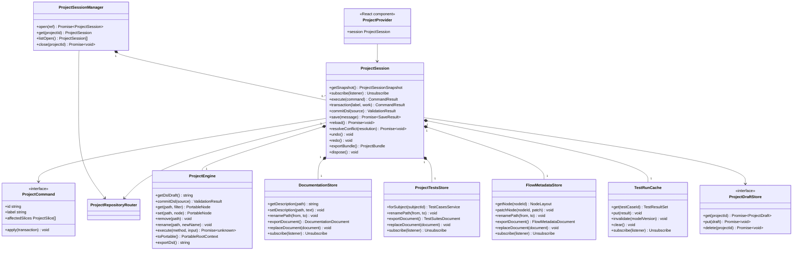

API invariants:

| API                          | Invariant                                                                                              |
| ---------------------------- | ------------------------------------------------------------------------------------------------------ |
| `ProjectRepository.save`     | Requires `expectedRevision`; it never performs unconditional overwrite.                                |
| `ProjectSession.execute`     | Applies one typed command, records undo, marks affected slices and notifies once.                      |
| `ProjectSession.transaction` | Cross-slice changes either all commit in memory or all roll back; slice notifications flush afterward. |
| `getSnapshot`                | Returns the same immutable object until observable session status changes.                             |
| `exportBundle`               | Fails while DSL is invalid or a transaction is open.                                                   |
| `commitDsl`                  | Replaces the semantic engine only after full parse/link validation succeeds.                           |
| `exportDsl`                  | Serializes the engine AST after structured edits; it must not return the stale editor input.           |
| `save`                       | Exports one aggregate, validates it, performs compare-and-swap and clears dirty state only on success. |
| `resolveConflict`            | Uses base/local/remote inputs; it never chooses last-writer-wins silently.                             |

## Project session state machine

Use one discriminated state, not independent booleans such as `isLoading`, `isSaving`, `hasConflict` and `hasError`.

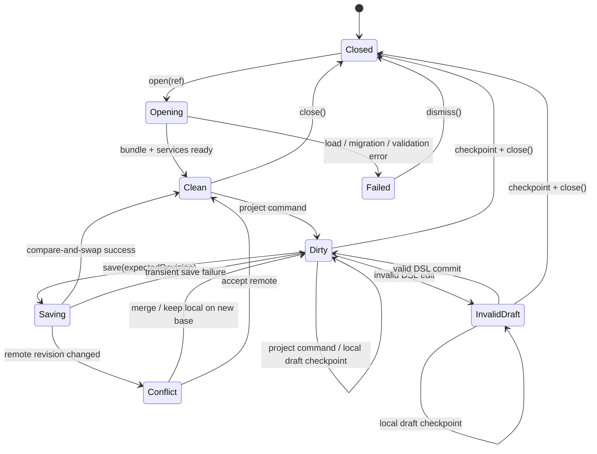

Minimum session snapshot:

```ts
type DslValidity = {status: 'valid'} | {status: 'invalid'; diagnostics: ProjectDiagnostic[]};

type ProjectSessionSnapshot =
  | {phase: 'opening'; projectId: string}
  | {
      phase: 'ready';
      projectId: string;
      revision: string;
      localVersion: number;
      dirtySlices: ProjectSlice[];
      dslValidity: DslValidity;
    }
  | {phase: 'saving'; projectId: string; revision: string; localVersion: number}
  | {phase: 'conflict'; projectId: string; baseRevision: string; remoteRevision: string}
  | {phase: 'failed'; projectId: string; error: ProjectError}
  | {phase: 'closed'; projectId: string};
```

DSL validity is a nested ready-state value because an invalid code draft remains editable, but it is not saveable.

## Atomic command flow

Every mutation that can affect paths must go through `ProjectSession`. Example: rename `customer` to `applicant`.

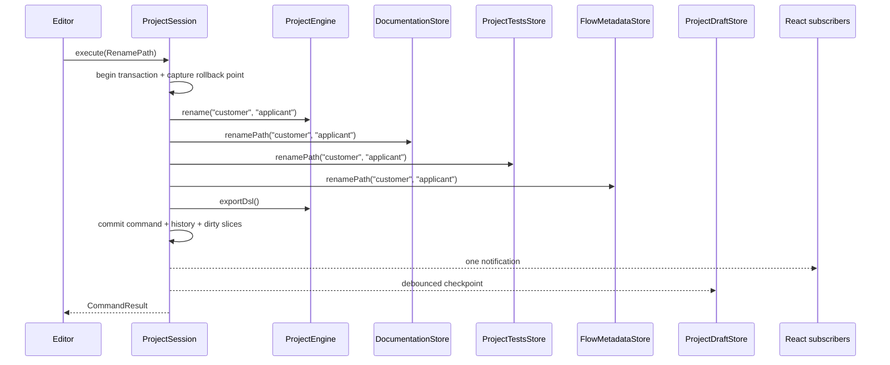

If any step fails, restore the engine and all slice snapshots from the rollback point and publish no partial state.

This command boundary is required because the current independent services cannot make a project-wide rename atomic.

## DSL text and structured editor synchronization

The engine AST is the in-memory semantic authority. The DSL file is its durable representation.

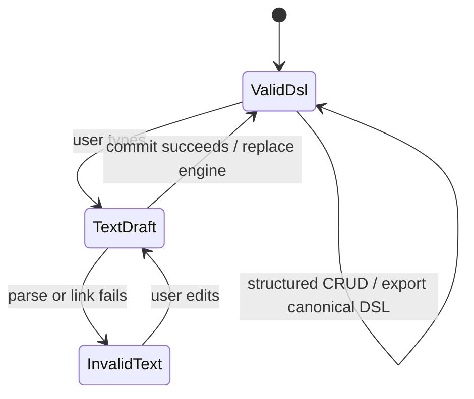

| Event                           | Required behavior                                                                                |
| ------------------------------- | ------------------------------------------------------------------------------------------------ |
| Code editor keystroke           | Update `dslDraft`; run diagnostics; do not mutate the valid engine yet.                          |
| Valid code commit               | Construct/replace engine atomically; increment model version; invalidate test results.           |
| Invalid code                    | Keep text in local draft; keep last valid engine; disable structured mutation and remote save.   |
| Boxed/table/types/flow mutation | Mutate engine through a session command; immediately regenerate canonical DSL.                   |
| Switch editor                   | Both editors observe the same session engine/version; no component-to-component synchronization. |

### Required engine API

The installed `MutableDecisionService` exposes `toPortable()` but does not expose the existing Rust AST stringifier.
Persisting DSL after structured CRUD therefore requires this upstream API:

```ts
interface MutableDecisionService {
  toCode(): string;
}
```

Until `toCode()` exists, either structured edits cannot be saved as DSL or Portable JSON must become the persisted model
format. The latter contradicts this architecture's explicit `model.edge` requirement, so `toCode()` is a prerequisite.

## Persistence and concurrency

### Save sequence

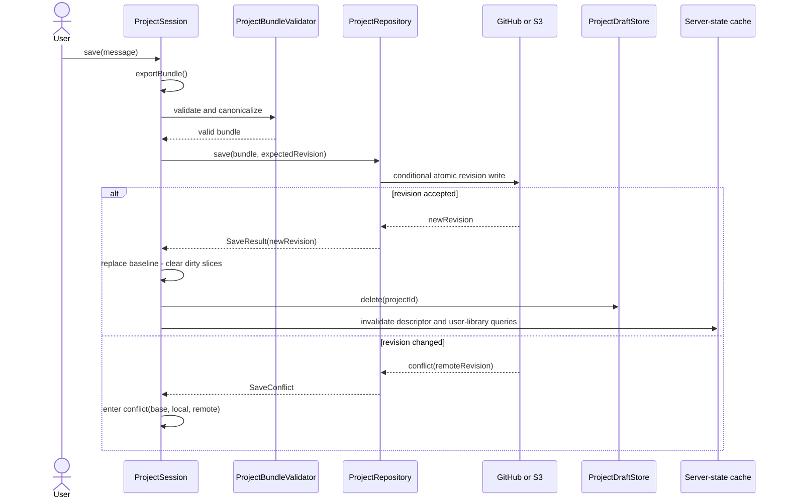

### Provider mapping

| Concern                 | GitHub adapter                                       | S3 adapter                                                 |
| ----------------------- | ---------------------------------------------------- | ---------------------------------------------------------- |
| Revision token          | Commit SHA                                           | `HEAD.json` ETag + revision ID                             |
| Atomic project revision | Create blobs/tree/commit                             | Write files under immutable `revisions/{revision}/` prefix |
| Publish revision        | Update branch ref only if expected SHA still matches | Conditional `PUT HEAD.json` with `If-Match`                |
| Conflict                | Ref no longer equals expected commit                 | ETag precondition fails                                    |
| History                 | Git commits                                          | Immutable revisions + S3 Versioning                        |
| Human-readable files    | Native repository files                              | Files under each immutable revision prefix                 |
| Incomplete write        | Unreferenced Git objects                             | Unreferenced revision prefix; garbage collect later        |

S3 has atomic updates for one key, not across keys. Therefore readers must first resolve `HEAD.json` and then read only
the immutable revision it names. Never update the five current project files in place.

### IndexedDB policy

IndexedDB is useful, but only behind one project-level `ProjectDraftStore`.

| Use IndexedDB for                        | Do not use IndexedDB for                  |
| ---------------------------------------- | ----------------------------------------- |
| Crash recovery checkpoints               | Canonical project revision                |
| Offline copy of the last opened revision | Independent documentation authority       |
| Invalid DSL draft recovery               | Independent test-case authority           |
| Pending command journal                  | Provider credentials or long-lived tokens |
| Optional derived test-result cache       | Silent conflict resolution                |

Draft key: `(userId, projectId)`. Draft payload:

```ts
interface ProjectDraft {
  baseRevision: string;
  localVersion: number;
  savedAt: string;
  workingBundle: ProjectBundle; // last valid aggregate
  dslDraft?: string; // may be invalid
}
```

Encrypt drafts when project sensitivity requires it; clear them on logout according to policy.

## Required service evolution

The current services persist independently. That is acceptable for standalone component demos, but not for an atomic
project aggregate.

| Current limitation                                              | Required change                                                              | Reason                                                                    |
| --------------------------------------------------------------- | ---------------------------------------------------------------------------- | ------------------------------------------------------------------------- |
| `DocumentationService` has no bulk read/import API.             | Add `exportDocument()` and `replaceDocument()`.                              | A project load/save must move all descriptions as one versioned document. |
| `DocumentationService` owns hidden IndexedDB persistence.       | Inject a persistence adapter; use an in-memory/session adapter in the Shell. | Avoid two durable authorities.                                            |
| `TestCasesService` is constructed per `(modelName, subjectId)`. | Add `ProjectTestsStore` owning every subject and returning subject facades.  | `tests.json` must contain the complete project test definition.           |
| `TestCasesService` owns hidden IndexedDB persistence.           | Inject persistence and route authored changes to `ProjectSession`.           | Project save and rename must be atomic across slices.                     |
| `TestsManager` constructs its own `TestCasesService`.           | Accept a session-owned service/factory as a prop.                            | The Shell must supply the loaded project's test state.                    |
| Authored tests and execution results share one service.         | Persist authored tests; move results to `TestRunCache`.                      | Results are derived, staleable and reproducible.                          |
| Engine has `toPortable()` but no public `toCode()`.             | Expose canonical DSL serialization upstream.                                 | Structured edits must update `model.edge`.                                |
| No React Flow store exists.                                     | Add `FlowMetadataStore` with snapshot, replace, rename and subscribe APIs.   | Flow layout must participate in load/save/undo.                           |

Compatibility rule: standalone components may keep their current IndexedDB-backed factories. The application Shell must
use the new injected/session-backed variants.

## Conflict and merge policy

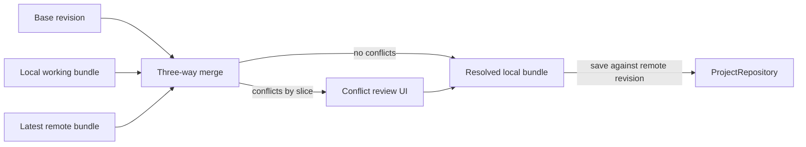

| Slice         | Merge strategy                                                                         |
| ------------- | -------------------------------------------------------------------------------------- |
| DSL           | Three-way text/AST-aware merge; parse and link before accepting.                       |
| Documentation | Merge by path; same-path divergent edits require user choice.                          |
| Tests         | Merge by stable test/row IDs; order conflicts and same-cell edits require user choice. |
| Flow metadata | Merge by stable node/edge IDs; same-property divergent edits require user choice.      |
| Manifest      | Field-level merge; identity and format version are never mergeable.                    |

No last-writer-wins overwrite is allowed for authored project data.

## Security boundary

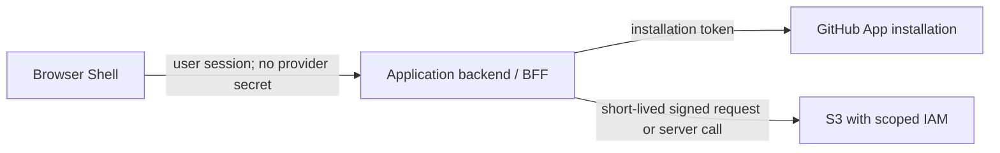

Provider tokens, AWS secrets and long-lived credentials must not enter React state, project bundles or IndexedDB.

## Decision log

| #   | Decision                                                       | Argument                                                                                                     |
| --- | -------------------------------------------------------------- | ------------------------------------------------------------------------------------------------------------ |
| 1   | One `ProjectSession` per open project.                         | Defines one mutation, history, validation and persistence boundary.                                          |
| 2   | No state-owning `ProjectState` React component.                | Project state outlives individual editor renders and integrates mutable non-React services.                  |
| 3   | `ProjectProvider` injects a stable session.                    | Context is used for dependency injection without broad rerenders.                                            |
| 4   | Remote repository is canonical; IndexedDB is recovery/cache.   | Prevents split-brain between devices and between project artifacts.                                          |
| 5   | Catalog/user-library metadata uses a server-state query cache. | It needs caching, deduplication, pagination, staleness and invalidation, not hand-written component effects. |
| 6   | All authored slices save as one revision.                      | DSL, docs, tests and flow metadata must be reproducible together.                                            |
| 7   | All mutations are typed project commands.                      | Cross-slice operations, undo/redo and one-notification transactions become enforceable.                      |
| 8   | Optimistic concurrency is mandatory.                           | GitHub/S3 can change outside the browser; unconditional writes lose work.                                    |
| 9   | Persist valid DSL; locally recover invalid drafts.             | Production revisions remain executable without losing a user's unfinished text.                              |
| 10  | Test results are derived cache data.                           | They can be recreated and are invalidated by model revision.                                                 |
| 11  | React Flow stores presentation, not business semantics.        | Avoids DSL and graph metadata becoming competing rule models.                                                |
| 12  | Explicit `link` versus `fork`.                                 | Preserves provenance and makes editability/ownership visible to users.                                       |

## Recommended implementation order

```mermaid
flowchart LR
  A["1. Project document schemas<br/>validators + migrations"]
  B["2. ProjectRepository ports<br/>in-memory adapter first"]
  C["3. Session-backed slice stores<br/>export + replace"]
  D["4. ProjectSession<br/>commands + state machine"]
  E["5. ProjectProvider + hooks<br/>Shell workspace"]
  F["6. IndexedDB DraftStore<br/>recovery"]
  G["7. GitHub adapter<br/>compare-and-swap"]
  H["8. S3 adapter<br/>immutable revisions + HEAD"]
  I["9. Conflict UI<br/>three-way merge"]

  A --> B --> C --> D --> E --> F --> G --> H --> I
```

Quality gates for each phase:

- schema round-trip and migration tests;
- repository contract tests shared by in-memory, GitHub and S3 adapters;
- transaction rollback and one-notification tests;
- reload/crash recovery tests;
- concurrent-save conflict tests;
- DSL/code/structured-editor synchronization tests; and
- multi-project isolation tests.

## Design references

- [React: choosing state structure](https://react.dev/learn/choosing-the-state-structure)
- [React: sharing state between components](https://react.dev/learn/sharing-state-between-components)
- [React: `useSyncExternalStore`](https://react.dev/reference/react/useSyncExternalStore)
- [TanStack Query: server-state overview](https://tanstack.com/query/latest/docs/framework/react/overview)
- [GitHub: Git trees](https://docs.github.com/en/rest/git/trees)
- [GitHub: Git commits](https://docs.github.com/en/rest/git/commits)
- [GitHub: GraphQL Git reference updates](https://docs.github.com/en/graphql/reference/git)
- [Amazon S3: data consistency model](https://docs.aws.amazon.com/AmazonS3/latest/userguide/Welcome.html#ConsistencyModel)
- [Amazon S3: conditional writes](https://docs.aws.amazon.com/AmazonS3/latest/userguide/conditional-writes.html)
- [Amazon S3: versioning](https://docs.aws.amazon.com/AmazonS3/latest/userguide/Versioning.html)
