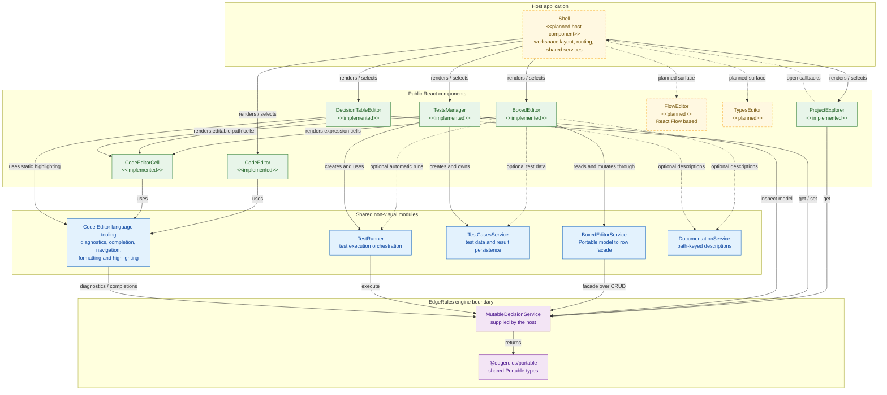

# React Component Architecture

## Scope

`edgerules-react` is a component library, not a complete application. The current checkout contains reusable editing and
navigation surfaces under `src/components/*`; it does not contain the application Shell that arranges those surfaces
into a workspace.

## Component diagram

- Between implemented nodes, **solid arrows** represent runtime composition or calls. 
- The solid arrows leaving the planned Shell show its intended primary composition. 
- Dashed arrows represent optional collaboration, callback flow, or surfaces that are themselves still planned. 
In particular, `CodeEditorCell` reuses the language modules under `code-editor`; it does not render or wrap 
the `CodeEditor` React component.

## Main React components

| Component             | Source and package entry point                                                         | Responsibility                                                                                                                                           | Direct component dependency                                                                                 |
| --------------------- | -------------------------------------------------------------------------------------- | -------------------------------------------------------------------------------------------------------------------------------------------------------- | ----------------------------------------------------------------------------------------------------------- |
| `CodeEditor`          | `src/components/code-editor`; package root and `edgerules-react/code-editor`           | Full-document EdgeRules DSL editing with CodeMirror and engine-backed language features.                                                                 | None. It uses the shared code-editor language modules.                                                      |
| `CodeEditorCell`      | `src/components/code-editor-cell`; package root and `edgerules-react/code-editor-cell` | Compact DSL editor with grid-friendly commit, cancel, blur and focus behavior.                                                                           | None. It uses the shared code-editor language modules rather than `CodeEditor`.                             |
| `BoxedEditor`         | `src/components/boxed-editor`; package root and `edgerules-react/boxed-editor`         | Structured treegrid editor over a `BoxedEditorService`.                                                                                                  | Renders `CodeEditorCell` for active expression cells.                                                       |
| `DecisionTableEditor` | `src/components/decision-table`; package root and `edgerules-react/decision-table`     | DMN-style ruleset table editor backed by `get`/`set` operations.                                                                                         | Renders one `CodeEditorCell` for the active DSL cell and uses shared static highlighting.                   |
| `TestsManager`        | `src/components/tests-manager`; `edgerules-react/tests-manager`                        | Test-case grid, subject selection, persistence and execution orchestration.                                                                              | Renders `CodeEditorCell` for editable path cells.                                                           |
| `ProjectExplorer`     | `src/components/project-explorer`; package root and `edgerules-react/project-explorer` | Lazily loaded tree navigation for contexts, variables, functions, decision tables and types.                                                             | None. It reports navigation intent through callbacks instead of importing editors.                          |
| `FlowEditor`          | Not present and not exported.                                                          | Planned React Flow-based visual editor for input, function, ruleset, terms, chart and output nodes.                                                      | No source dependency can be asserted until it is implemented.                                               |
| `TypesEditor`         | Not present and not exported.                                                          | Planned editor for EdgeRules type definitions.                                                                                                           | No source dependency can be asserted until it is implemented.                                               |
| `Shell`               | Not present and not exported.                                                          | Planned application integration layer that owns workspace layout, active-editor routing, shared engine/service instances and navigation callback wiring. | Composes the public components; it belongs to a host application unless later added as a library component. |

## Dependency rules

### Shell owns cross-editor navigation

Major editors remain independently renderable. `ProjectExplorer` exposes `onOpenVariables`, `onOpenFunction`,
`onOpenDecisionTable` and `onOpenTypes` callbacks. A Shell should translate those callbacks into active-editor state and
resolve the selected model path into the props or source text expected by the corresponding editor. This avoids direct
dependencies such as `ProjectExplorer` importing `DecisionTableEditor`.

### The engine remains the model authority

React components do not implement rule evaluation and should not keep a second persisted copy of the model. The host
supplies a service compatible with the required subset of `MutableDecisionService`:

- `ProjectExplorer` reads with `get`;
- `DecisionTableEditor` reads and commits with `get`/`set`;
- `BoxedEditor` works through `BoxedEditorService`, a facade over engine CRUD;
- `TestsManager` inspects the model and its `TestRunner` executes it; and
- code-editor language tooling asks the service for diagnostics and completions.

Portable model nodes and errors cross this boundary using `@edgerules/portable` types.
