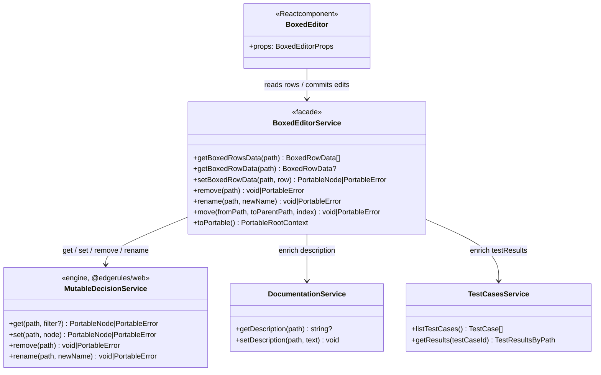
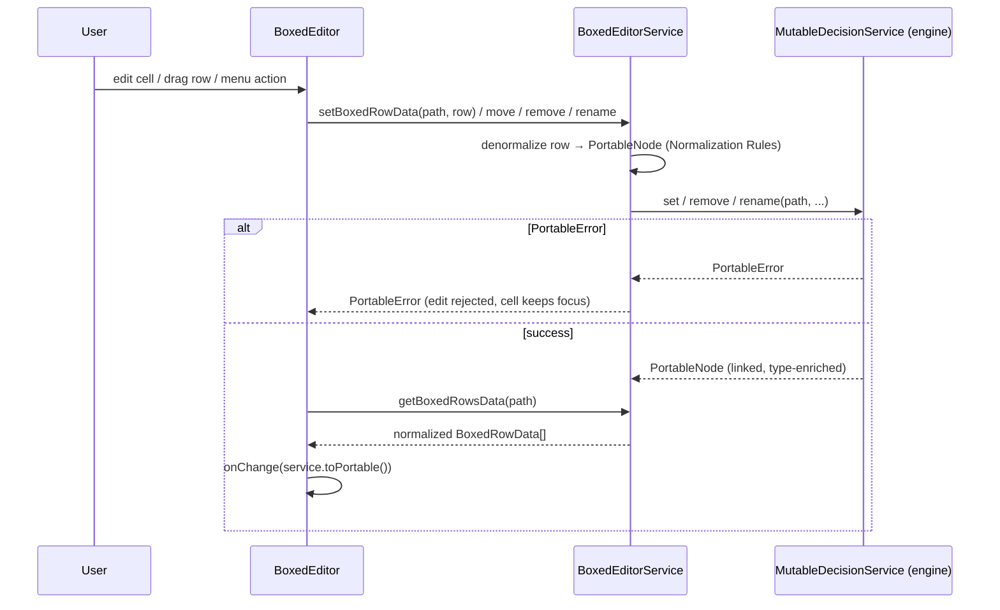

# Boxed Editor Specification

A lot of complexities and poor design patterns where used in the current Boxed Editor
implementation: [BOXED_EDITOR_OLD_SPEC.md](BOXED_EDITOR_OLD_SPEC.md); [boxed-editor](../src/components/boxed-editor)
This document is a specification for the new Boxed Editor implementation that will implement GUI language and
state-of-the-art design patterns.

- GUI Reference Frames `/Users/rimvydasbingelis/Projects/EdgeRules/edgerules-react-frames/src`
- 

## Introduction

`BoxedEditor` is the structured, visual authoring surface for EdgeRules models. The interaction model is influenced by
the boxed-expression and decision-modeling experiences of **Camunda** and **Trisotech**, and by the **Decision Model and
Notation (DMN)** standard. EdgeRules `BoxedEditor` does not strictly follow standard DMN boxed expression GUI
conventions and proposes much more convenient and compact layouts and ergonomics.

`BoxedEditor` allows visualizing:

- `ModelHeaderRow` - model name and description
- `ExpressionRow` - inputs and calculations
- `FunctionRow` - standard functions, loops and optimise functions
- `ListRow` - it is just a name of the function, list does not have a header
- `ListItemRow` - single item of the list
- `RelationsRow` - header of a list of complex objects that share the same fields; those fields are used to display
  the column names in the relation table header
- `RelationsItemRow` - single record (row) of a relation, one cell per relation column
- `ContextRow` - complex object that can contain other rows
- `ComplexTypeRow` - complex object that can contain other rows
- `TypeDefinitionRow` - class field definition row

### Common features

| Row Type          | Description   | Sortable (drag drop)        | Type                                         | Actions | Occupies `NameColumn` and `ValueColumn`                              |
|-------------------|---------------|-----------------------------|----------------------------------------------|---------|----------------------------------------------------------------------|
| ExpressionRow     | yes           | yes                         | derived only                                 | yes     | No                                                                   |
| FunctionRow       | yes           | yes (carries function body) | none or user specified                       | yes     | `NameColumn` for name, `ValueColumn` for args                        |
| ListRow           | yes           | yes (carries list items)    | derived from list or specified if list empty | yes     | Yes                                                                  |
| ListItemRow       | yes           | yes (in list)               | none (no need to repeat) *                   | yes     | `NameColumn` has generated `Item X`, `ValueColumn` is for list value |   
| RelationsRow      | yes           | yes (with all table)        | none                                         | yes     | `NameColumn` for name, `ValueColumn` for table header (column names) |
| RelationsItemRow  | yes           | yes (within table)          | none                                         | yes     | `NameColumn` has generated `Item X`,  `ValueColumn` for columns      |
| ContextRow        | yes           | yes (carries inner items)   | none                                         | yes     | Yes                                                                  |
| ComplexTypeRow    | yes           | yes (carries inner items)   | N/A                                          | yes     | Yes                                                                  |
| TypeDefinitionRow | yes           | yes                         | N/A                                          | yes     | No                                                                   |
| ModelHeaderRow    | no (occupies) | no (occupies)               | no (occupies)                                | yes     | Yes, occupies all with name                                          |

**Clarifications:**

(*) - lists are homogenous, so `ListItemRow` never repeats the element type; the type is carried once by the
parent `ListRow`.

- A `RelationsRow` is normally nested under a `ContextRow` (or the model header), because relations are usually
  assigned to a named field. `RelationsItemRow`s are always children of a `RelationsRow` and share its columns.

**Common Columns for all row types:**

- Description column
- Action column (however, context menu content will be different for each row type)

**Drag and Drop:**

- Function icon, Type icon and 6 dot expression drag handler are all drag handles for the element, and it's childs.

## GUI Language

`BoxedEditor` has a strict spacing policy:

- single smallest `cell` is 40x40 pixels
- if row needs to contain more lines, it can grow vertically by the step of 40 pixels: 80, 120, 160...
- if row cell needs to be longer, it can only grow by the step of 40 pixels: 80, 120, 160...
- all text on the cell is positioned in the middle
- all cells are aligned with each other, no mid-positioning or pixel offsets are allowed. In general, all BoxedEditor
  GUI can be sketched on school maths workbook.

`BoxedEditor` is composed of rows where each row can be expression, function definition, list header, list row, etc.
`BoxedEditor` has following main columns:

- `NameColumn` - is grid based column, can contain many cells that can be skipped to display the different
  depth of JSON-like context tree.
- `ValueColumn` - column is used for expression value, function arguments, list items, relation cells, etc.
- `TypeColumn` - column is used for type chip, can be empty if type is unnamed complex object.
- `DescriptionColumn` - column is used for description, can be empty
- `ActionsColumn` - column is used for context menu button: vertical three dots icon in a single `cell`
- `TestResultsColumn` - column is used for that single expression calculation result. This column has a header with a
  test name and with `previous` and `next` buttons to navigate through all test cases.

## Component API

The package entry point is `edgerules-react/boxed-editor`. Its public API is intentionally small:

```ts
interface BoxedEditorProps {
    service: BoxedEditorService; // The mutable EdgeRules model authority. The editor never maintains a second persisted model.
    path: string; // The authored CRUD path to show. Use `"*"` for the complete model.
    languageService?: CodeEditorService; // Supplies diagnostics and completions to the one active expression cell.
    revision?: string | number; // Host-controlled invalidation token. Change it after model edits made outside this editor.
    readOnly?: boolean; // Disables name/value editing and ordering while retaining navigation and visible ordering handles.
    onChange?: (snapshot: PortableRootContext) => void; // Called once with the refreshed Portable snapshot after a successful committed mutation.
    onOpenNode?: (target: BoxedEditorOpenTarget) => void; // Routes specialized nodes to another host editor; `BoxedEditor` does not implement those editors.
    showHeader?: boolean; // Whether to show the model header row. Defaults to `true`.
    showTestResults?: boolean; // Whether to show the test results column. Defaults to `true`.
    showDescription?: boolean; // Whether to show the description column. Defaults to `true`.
    showType?: boolean; // Whether to show the type column. Defaults to `true`.
    expanded?: boolean; // Whether to expand all rows (types, contexts, function). Defaults to `true`.
    className?: string; // Optional class name for the root element.
    sx?: SxProps<Theme>; // Optional MUI `sx` prop for styling the root element.
}
```

**Notes:**

- `onOpenNode` routes specialized nodes to their host editors.

```ts
type BoxedEditorTargetKind = 'type-definition' | 'ruleset' | 'loop' | 'boxed-editor' | `code-editor`;

interface BoxedEditorOpenTarget {
    path: string;
    kind: BoxedEditorTargetKind;
}
```

- `expanded` sets the **initial** global expand state only. After first render each `FunctionRow` / `ContextRow` /
  `ComplexTypeRow` keeps its own expand/collapse state, toggled from its context menu. Changing `revision` does not
  reset per-row expand state.

## Context Menu

**Common:** (except ModelHeaderRow)

- Delete - deletes the selected node, if it is allowed to delete
- Copy - copies the selected row with all its children to the clipboard
- Paste Below - pastes the copied row with all its children below the selected row

`ExpressionRow`:

- Add Expression Below - adds new expression row to the context

`FunctionRow`

- Add argument - adds new argument to the function

`ModelHeaderRow`

- View types - shows or hides type column
- View description - shows or hides description column
- View test results - shows or hides test results column
- View as code - opens CodeMirror editor with the model code

`ModelHeaderRow`, `ContextRow`:

- Add Context - adds new context row to the context
- Add Function - adds new function row to the context
- Add List - adds new list row to the context
- Add Relation - adds new relation row to the context
- Add Complex Type - adds new complex type row to the context

`ListRow`:

- Add Item - appends a new (empty) `ListItemRow` to the list

`ListItemRow`:

- Add Item Below - inserts a new (empty) `ListItemRow` after the selected item

`RelationsRow`:

- Add Row - appends a new empty `RelationsItemRow` to the relation
- Add Column - appends a new field/column to every record in the relation

`RelationsItemRow`:

- Add Row Below - inserts a new empty `RelationsItemRow` after the selected record

`ComplexTypeRow`:

- Add Field - adds a new `TypeDefinitionRow` to the complex type

`TypeDefinitionRow`:

- Add Field Below - inserts a new `TypeDefinitionRow` after the selected field

`FunctionRow`, `ContextRow`, `ComplexTypeRow`:

- Expand / Collapse toggle - expands or collapses the row to show or hide its children

**Enablement rules:**

- `Delete` is hidden/disabled for rows the engine marks read-only (`BoxedRowData.deletable === false`) — e.g. the
  synthesized `result` field of a function, or a field required by the model.
- `Paste Below` is enabled only when the clipboard row kind is valid in the target context (for example a
  `TypeDefinitionRow` can only be pasted inside a `ComplexTypeRow`, a `ListItemRow` only inside a `ListRow`).
- All add-actions insert at the position implied by their name (a child at the end of the container, or a sibling
  directly below the selected row) and then re-apply the [Normalization Rules](#normalization-rules) sort order.
- In `readOnly` mode every mutating action is hidden; only `Copy` and the view toggles remain.

## Special Actions

- When user removes argument name, then argument is removed from function definition
- When user removes expression name and expression value is empty, then expression is removed from context

## Normalization Rules

### From EdgeRules DSL to BoxedEditor

1. Inline functions will have result field
2. All context elements are re-sorted by type in this order: `Types`, `Functions`, everything else. `result` field to
   the bottom.

### From BoxedEditor to EdgeRules DSL

1. Single `result` field functions are collapsed to inline functions
2. All context elements are re-sorted by type in this order: `Types`, `Functions`, everything else. `result` field to
   the bottom.

## Service composition

`BoxedEditorService` is the single facade the `BoxedEditor` component talks to. It is a **normalizing adapter**: it
owns a reference to the authoritative `MutableDecisionService` (from `@edgerules/web` / `@edgerules/node`) and
enriches its Portable data with descriptions and test results before handing rows to the view. The component itself
holds no second persisted model.



## `BoxedEditorService` API

`BoxedEditorService` returns `BoxedRowData` that contains all normalized data from the EdgeRules Portable.
`BoxedRowData` is also used to convert edited data back to Portable to persist to the underlying
`MutableDecisionService`. The facade is constructed with the mutable service; the two enrichment services are
optional and can be injected up front or via setters.

```typescript
interface BoxedEditorService {
    // --- Enrichment wiring (optional) ---
    setDocumentationService(documentationService: DocumentationService): void;

    setTestCasesService(testCasesService: TestCasesService): void;

    // --- Normalized read ---
    // Children rows of the context/container at `path`, already normalized and sorted
    // (see Normalization Rules). Pass `"*"` for the whole model.
    getBoxedRowsData(path: string): BoxedRowData[];

    // A single row (without materializing its children). Returns `undefined` if the path is absent.
    getBoxedRowData(path: string): BoxedRowData | undefined;

    // --- Mutation (denormalizes the row to Portable, delegates to the mutable service) ---
    setBoxedRowData(path: string, row: BoxedRowData): PortableNode | PortableError;

    remove(path: string): void | PortableError;

    rename(path: string, newName: string): void | PortableError;

    // Drag & drop reorder / reparent. `index` is the target position among the destination's children.
    move(fromPath: string, toParentPath: string, index: number): void | PortableError;

    // --- Escape hatch ---
    toPortable(): PortableRootContext;
}
```

`BoxedRowData` is the normalized, render-ready shape for one row. Optional fields are populated only for the row
kinds that use them (e.g. `parameters` for `FunctionRow`, `columns`/`cells` for relations).

```typescript
type BoxedRowKind =
    | 'model-header'
    | 'expression'
    | 'function'
    | 'list'
    | 'list-item'
    | 'relations'
    | 'relations-item'
    | 'context'
    | 'complex-type'
    | 'type-definition';

interface BoxedRowData {
    kind: BoxedRowKind; // Discriminant that selects the row renderer and its context menu.
    depth: number; // Depth within the context tree (dot count in `path`); drives NameColumn indent cells.
    path: string; // Fully qualified path used for get / set / remove / rename / move.
    name: string; // NameColumn label. Generated `Item N` for list-item and relations-item rows.
    value?: string; // ValueColumn content (expression text, list value, type constraint, ...).
    type?: string; // TypeColumn chip; omitted for unnamed complex objects.
    description?: string; // DescriptionColumn; sourced from the DocumentationService when wired.
    readOnly?: boolean; // Engine-marked read-only (e.g. synthesized `result`, linked type).
    deletable?: boolean; // Whether the Delete action is offered (defaults to true when omitted).
    parameters?: SignatureParameter[]; // FunctionRow argument headers rendered in the ValueColumn.
    columns?: string[]; // RelationsRow column names (relation table header).
    cells?: string[]; // RelationsItemRow per-column values, aligned to the parent `columns`.
    testResults?: TestResult[]; // One entry per test case, aligned to `TestCasesService.listTestCases()` order.
    children?: BoxedRowData[]; // Nested rows (context / function / type / list / relation bodies).
}
```

> Todo: we need to think if we should keep testResults in BoxedRowData - maybe testResults should have their own shallow
> state (not buried inside boxed items) - this is important because we will use previous and next buttons to quickly
> navigate test cases and I do not want to trigger React to re-check deep states of Boxed items. What would you advise?

> Todo: Same with `description` as with `testResults` - descriptions will be stored in IndexedDB by model name and
> path - descriptions will not be in EdgeRules DSL!

### Edit → persist → refresh flow

Every committed edit follows the same path: the view denormalizes the changed row, the facade delegates to the
mutable service, then a fresh normalized snapshot is read back and `onChange` fires once.



## `TestCasesService` API

Supplies the `TestResultsColumn`. The service owns the list of executed test cases and their per-path results; the
`BoxedEditor` is a pure consumer and never runs the engine itself. The header of the column shows the current test
case name and a `1/N` counter with previous/next buttons; each expression/field row shows that case's computed value
on its own line.

> Todo: Test case results are stored in IndexedDB by test execution service (execution is out of scope). The point is
> that `TestCasesService` will find out how many test cases with results are stored in indexed db and allow user to
> check
> them.

The results are keyed by the same fully qualified `path` used by `BoxedRowData`, so the facade can align them per
row. Values are rendered as already-serialized display strings (the engine's wire form: `320000`, `'Ada'`,
`2 items`, `Missing('x')`, ...).

```typescript
interface TestCase {
    id: string; // Stable identifier used to fetch results.
    name: string; // Display name shown in the TestResultsColumn header, e.g. "Standard application".
}

type TestResultStatus = 'ok' | 'error' | 'missing' | 'pending';

interface TestResult {
    testCaseId: string; // The owning test case.
    path: string; // Fully qualified path this result belongs to.
    value?: string; // Serialized display value; omitted when status is 'error'.
    error?: string; // Message when the path failed to evaluate for this case.
    status: TestResultStatus;
}

interface TestCasesService {
    // Ordered list of test cases; index drives the previous/next navigation and the `1/N` counter.
    listTestCases(): TestCase[];

    // All results for one test case, keyed by path. The facade folds these into each BoxedRowData.testResults.
    getResults(testCaseId: string): Record<string, TestResult>;
}
```

> Recomputation is the host's responsibility. When the model changes, the host re-executes its cases and bumps the
> `revision` prop; the editor then re-reads rows (and their folded-in `testResults`). The editor does not trigger
> execution — keeping `BoxedEditor` free of any engine dependency.

## `DocumentationService` API

Provides and persists the free-text description shown in the `DescriptionColumn`, keyed by fully qualified path.
Descriptions live outside the Portable model (they are authoring metadata), so the host decides how they are stored.

```typescript
interface DocumentationService {
    getDescription(path: string): string | undefined; // Description for a path, or undefined when none is set.
    setDescription(path: string, description: string): void; // Persist an edited description (empty string clears it).
}
```

> Todo: all descriptions are stored in IndexedDB by model name and path. The point is that `DocumentationService` will
> find them or not.

When no `documentationService` is supplied (as prop or via the facade setter), the `DescriptionColumn` renders
empty and its cells are read-only.

## Open Questions

2. **`BoxedEditorService` layering — facade vs. the mutable service itself.** The old spec made `BoxedEditorService`
   the `get`/`set`/`remove`/`rename` mutable-service subset; this spec makes it a higher-level normalizing facade
   returning `BoxedRowData`. It must reach a real `MutableDecisionService` to persist.
   Question to address: how does the facade obtain the mutable service?
   Option 1 (recommended): the facade is constructed with a `MutableDecisionService` (`new BoxedEditorService(mutable)`)
   and delegates internally; the component only ever sees `BoxedEditorService`.
   Option 2: `BoxedEditorService extends` the mutable-service subset, so it exposes both the raw CRUD and the
   normalized rows on one object.

> Todo: we missed the point that we probably need `useMutableDecisionService` hook to provide the mutable service to the
> `BoxedEditorService` facade. How should we solve that based on the best React practices? Maybe we also need
`useBoxedEditorService` hook to provide the facade to the `BoxedEditor` component. What do you think? Also, where boxed
> editor rows state will be stored in React?

4. **`readOnly` mode still shows ordering handles.** The `readOnly` prop is described as disabling ordering while
   "retaining ... visible ordering handles". A visible drag handle that does nothing is a misleading affordance.
   Question to address: what should `readOnly` do to drag handles?
   Option 1 (recommended): hide the drag/reorder handles entirely in `readOnly` mode.
   Option 2: render them disabled (greyed, non-interactive) if the handle doubles as a purely visual grouping/indent
   cue — but then say so explicitly.

> This is a tricky part: we cannot hide drag and drop handles, because function and type icons are drag drop handles by
> themselves! Better leave 6 dot handle as well.

5. **Result-column value serialization contract.** `TestResult.value` and `BoxedRowData` cell values are "already
   serialized display strings". The engine's wire form (`Missing('x')`, ISO dates) is precise but not always
   user-friendly, and `2 items` in the reference frame is a UI summary, not an engine value.
   Question to address: does the host pre-format display strings, or does `BoxedEditor` own presentation (e.g. array →
   `"N items"`, truncation, locale/number formatting)?
   Option 1: host supplies raw engine serialization; `BoxedEditor` applies all display formatting (summaries,
   truncation) so formatting is consistent across hosts.
   Option 2: host supplies final display strings; `BoxedEditor` renders them verbatim.

> Answer: `BoxedEditor` applies all display formatting