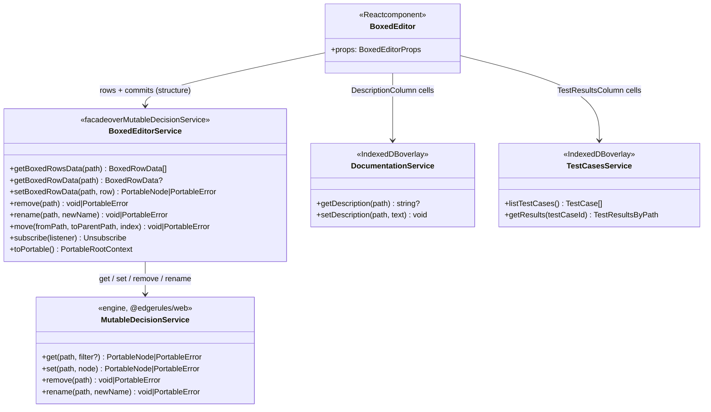
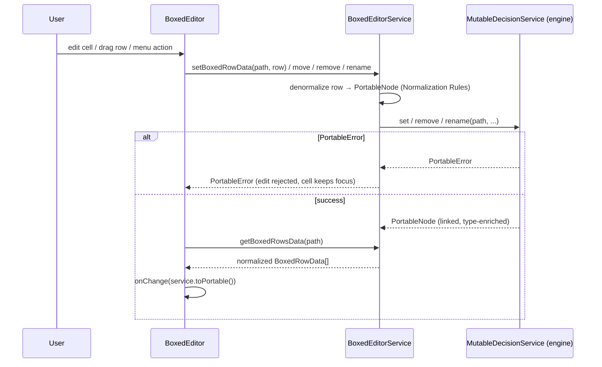
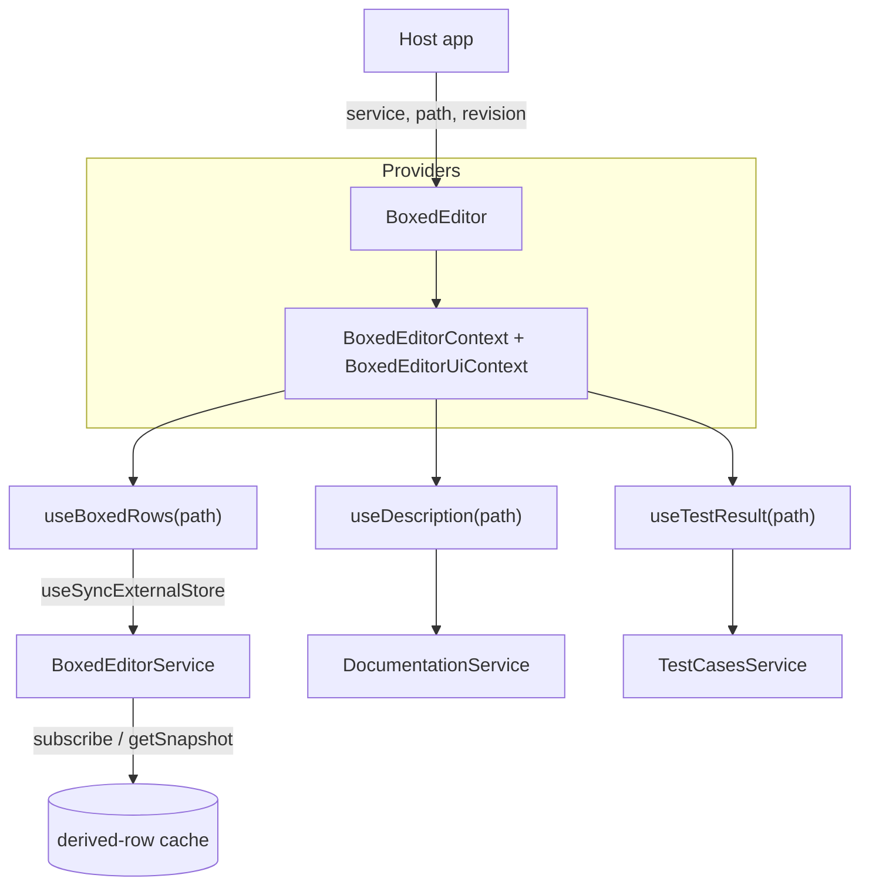

# Boxed Editor Specification

A lot of complexities and poor design patterns where used in the current Boxed Editor
implementation: [BOXED_EDITOR_OLD_SPEC.md](BOXED_EDITOR_OLD_SPEC.md); [boxed-editor](../src/components/boxed-editor)
This document is a specification for the new Boxed Editor implementation that will implement GUI language and
state-of-the-art design patterns.

- GUI Reference Frames `/Users/rimvydasbingelis/Projects/EdgeRules/edgerules-react-frames/src`
- 

## Introduction

`BoxedEditor` is the structured, visual authoring surface for EdgeRules models. The interaction model is influenced by
the boxed-expression and decision-modeling experiences of **Camunda** and **Trisotech**, and by the **Decision Model and
Notation (DMN)** standard. EdgeRules `BoxedEditor` does not strictly follow standard DMN boxed expression GUI
conventions and proposes much more convenient and compact layouts and ergonomics.

`BoxedEditor` allows visualizing:

- `ModelHeaderRow` - model name and description
- `ExpressionRow` - inputs and calculations
- `FunctionRow` - standard functions, loops and optimise functions
- `ListRow` - it is just a name of the function, list does not have a header
- `ListItemRow` - single item of the list
- `RelationsRow` - header of a list of complex objects that share the same fields; those fields are used to display
  the column names in the relation table header
- `RelationsItemRow` - single record (row) of a relation, one cell per relation column
- `ContextRow` - complex object that can contain other rows
- `ComplexTypeRow` - complex object that can contain other rows
- `TypeDefinitionRow` - class field definition row

### Common features

| Row Type          | Description   | Sortable (drag drop)        | Type                                         | Actions | Occupies `NameColumn` and `ValueColumn`                              |
|-------------------|---------------|-----------------------------|----------------------------------------------|---------|----------------------------------------------------------------------|
| ExpressionRow     | yes           | yes                         | derived only                                 | yes     | No                                                                   |
| FunctionRow       | yes           | yes (carries function body) | none or user specified                       | yes     | `NameColumn` for name, `ValueColumn` for args                        |
| ListRow           | yes           | yes (carries list items)    | derived from list or specified if list empty | yes     | Yes                                                                  |
| ListItemRow       | yes           | yes (in list)               | none (no need to repeat) *                   | yes     | `NameColumn` has generated `Item X`, `ValueColumn` is for list value |   
| RelationsRow      | yes           | yes (with all table)        | none                                         | yes     | `NameColumn` for name, `ValueColumn` for table header (column names) |
| RelationsItemRow  | yes           | yes (within table)          | none                                         | yes     | `NameColumn` has generated `Item X`,  `ValueColumn` for columns      |
| ContextRow        | yes           | yes (carries inner items)   | none                                         | yes     | Yes                                                                  |
| ComplexTypeRow    | yes           | yes (carries inner items)   | N/A                                          | yes     | Yes                                                                  |
| TypeDefinitionRow | yes           | yes                         | N/A                                          | yes     | No                                                                   |
| ModelHeaderRow    | no (occupies) | no (occupies)               | no (occupies)                                | yes     | Yes, occupies all with name                                          |

**Clarifications:**

(*) - lists are homogenous, so `ListItemRow` never repeats the element type; the type is carried once by the
parent `ListRow`.

- A `RelationsRow` is normally nested under a `ContextRow` (or the model header), because relations are usually
  assigned to a named field. `RelationsItemRow`s are always children of a `RelationsRow` and share its columns.

**Common Columns for all row types:**

- Description column
- Action column (however, context menu content will be different for each row type)

**Drag and Drop:**

- Function icon, Type icon and 6 dot expression drag handler are all drag handles for the element, and it's childs.

## GUI Language

`BoxedEditor` has a strict spacing policy:

- single smallest `cell` is 40x40 pixels
- if row needs to contain more lines, it can grow vertically by the step of 40 pixels: 80, 120, 160...
- if row cell needs to be longer, it can only grow by the step of 40 pixels: 80, 120, 160...
- all text on the cell is positioned in the middle
- all cells are aligned with each other, no mid-positioning or pixel offsets are allowed. In general, all BoxedEditor
  GUI can be sketched on school maths workbook.

`BoxedEditor` is composed of rows where each row can be expression, function definition, list header, list row, etc.
`BoxedEditor` has following main columns:

- `NameColumn` - is grid based column, can contain many cells that can be skipped to display the different
  depth of JSON-like context tree.
- `ValueColumn` - column is used for expression value, function arguments, list items, relation cells, etc.
- `TypeColumn` - column is used for type chip, can be empty if type is unnamed complex object.
- `DescriptionColumn` - column is used for description, can be empty
- `ActionsColumn` - column is used for context menu button: vertical three dots icon in a single `cell`
- `TestResultsColumn` - column is used for that single expression calculation result. This column has a header with a
  test name and with `previous` and `next` buttons to navigate through all test cases.

## Component API

The package entry point is `edgerules-react/boxed-editor`. Its public API is intentionally small:

```ts
interface BoxedEditorProps {
    service: BoxedEditorService; // The mutable EdgeRules model authority. The editor never maintains a second persisted model.
    path: string; // The authored CRUD path to show. Use `"*"` for the complete model.
    languageService?: CodeEditorService; // Supplies diagnostics and completions to the one active expression cell.
    revision?: string | number; // Host-controlled invalidation token. Change it after model edits made outside this editor.
    readOnly?: boolean; // Disables name/value editing and ordering while retaining navigation and visible ordering handles.
    onChange?: (snapshot: PortableRootContext) => void; // Called once with the refreshed Portable snapshot after a successful committed mutation.
    onOpenNode?: (target: BoxedEditorOpenTarget) => void; // Routes specialized nodes to another host editor; `BoxedEditor` does not implement those editors.
    showHeader?: boolean; // Whether to show the model header row. Defaults to `true`.
    showTestResults?: boolean; // Whether to show the test results column. Defaults to `true`.
    showDescription?: boolean; // Whether to show the description column. Defaults to `true`.
    showType?: boolean; // Whether to show the type column. Defaults to `true`.
    expanded?: boolean; // Whether to expand all rows (types, contexts, function). Defaults to `true`.
    className?: string; // Optional class name for the root element.
    sx?: SxProps<Theme>; // Optional MUI `sx` prop for styling the root element.
}
```

**Notes:**

- `onOpenNode` routes specialized nodes to their host editors.

```ts
type BoxedEditorTargetKind = 'type-definition' | 'ruleset' | 'loop' | 'boxed-editor' | 'code-editor';

interface BoxedEditorOpenTarget {
    path: string;
    kind: BoxedEditorTargetKind;
}
```

`type-definition`, `ruleset`, and `loop` route to their specialized host editors (Types / Decision Table / Loop).
`boxed-editor` asks the host to open the target context in its own nested `BoxedEditor` instance, and `code-editor`
backs the `View as code` action (opens the CodeMirror editor on the model text). The host owns those editor
instances; `BoxedEditor` only emits the routing request.

- `expanded` sets the **initial** global expand state only. After first render each `FunctionRow` / `ContextRow` /
  `ComplexTypeRow` keeps its own expand/collapse state, toggled from its context menu. Changing `revision` does not
  reset per-row expand state.

## Context Menu

**Common:** (except ModelHeaderRow)

- Delete - deletes the selected node, if it is allowed to delete
- Copy - copies the selected row with all its children to the clipboard
- Paste Below - pastes the copied row with all its children below the selected row

`ExpressionRow`:

- Add Expression Below - adds new expression row to the context

`FunctionRow`

- Add argument - adds new argument to the function

`ModelHeaderRow`

- View types - shows or hides type column
- View description - shows or hides description column
- View test results - shows or hides test results column
- View as code - opens CodeMirror editor with the model code

`ModelHeaderRow`, `ContextRow`:

- Add Context - adds new context row to the context
- Add Function - adds new function row to the context
- Add List - adds new list row to the context
- Add Relation - adds new relation row to the context
- Add Complex Type - adds new complex type row to the context

`ListRow`:

- Add Item - appends a new (empty) `ListItemRow` to the list

`ListItemRow`:

- Add Item Below - inserts a new (empty) `ListItemRow` after the selected item

`RelationsRow`:

- Add Row - appends a new empty `RelationsItemRow` to the relation
- Add Column - appends a new field/column to every record in the relation

`RelationsItemRow`:

- Add Row Below - inserts a new empty `RelationsItemRow` after the selected record

`ComplexTypeRow`:

- Add Field - adds a new `TypeDefinitionRow` to the complex type

`TypeDefinitionRow`:

- Add Field Below - inserts a new `TypeDefinitionRow` after the selected field

`FunctionRow`, `ContextRow`, `ComplexTypeRow`:

- Expand / Collapse toggle - expands or collapses the row to show or hide its children

**Enablement rules:**

- `Delete` is hidden/disabled for rows the engine marks read-only (`BoxedRowData.deletable === false`) — e.g. the
  synthesized `result` field of a function, or a field required by the model.
- `Paste Below` is enabled only when the clipboard row kind is valid in the target context (for example a
  `TypeDefinitionRow` can only be pasted inside a `ComplexTypeRow`, a `ListItemRow` only inside a `ListRow`).
- All add-actions insert at the position implied by their name (a child at the end of the container, or a sibling
  directly below the selected row) and then re-apply the [Normalization Rules](#normalization-rules) sort order.
- In `readOnly` mode every mutating action is hidden; only `Copy` and the view toggles remain.

## Special Actions

- When user removes argument name, then argument is removed from function definition
- When user removes expression name and expression value is empty, then expression is removed from context

## Normalization Rules

### From EdgeRules DSL to BoxedEditor

1. Inline functions will have result field
2. All context elements are re-sorted by type in this order: `Types`, `Functions`, everything else. `result` field to
   the bottom.

### From BoxedEditor to EdgeRules DSL

1. Single `result` field functions are collapsed to inline functions
2. All context elements are re-sorted by type in this order: `Types`, `Functions`, everything else. `result` field to
   the bottom.

## Service composition

The editor reads from **three independent, path-keyed data sources**. Keeping them separate is deliberate: only the
first is derived from the authored model, the other two are volatile authoring overlays stored in IndexedDB
(outside the EdgeRules DSL). Separating them also keeps test-case navigation and description edits from invalidating
the structural row tree — see [React integration](#react-integration).

Furthermore, each `BoxedEditorService` boxed editor data change will invoke EdgeRules decision service re-calculation,
but test cases navigation or description update will not trigger re-calculations.

| Source                 | Owns                                        | Keyed by | Storage                          | Feeds                |
|------------------------|---------------------------------------------|----------|----------------------------------|----------------------|
| `BoxedEditorService`   | Portable-derived structure (`BoxedRowData`) | `path`   | the authored model (via engine)  | Name/Value/Type cols |
| `DocumentationService` | free-text descriptions                      | `path`   | IndexedDB (by model name + path) | DescriptionColumn    |
| `TestCasesService`     | executed test cases and their results       | `path`   | IndexedDB (by model + case)      | TestResultsColumn    |

`BoxedEditorService` is the single facade for the model. It is a **normalizing adapter** over the authoritative
`MutableDecisionService` (from `@edgerules/web` / `@edgerules/node`); it holds no second persisted model. It does
**not** fold descriptions or test results into rows — those overlays are read directly by their column cells, so a
`BoxedRowData` stays a pure projection of the Portable model.



## `BoxedEditorService` API

`BoxedEditorService` returns `BoxedRowData` that contains all normalized data from the EdgeRules Portable.
`BoxedRowData` is also used to convert edited data back to Portable to persist to the underlying
`MutableDecisionService`. The facade is constructed with the mutable service and is the model's only surface;
descriptions and test results are separate overlays (above) and are not wired into it.

```typescript
type Unsubscribe = () => void;

interface BoxedEditorService {
    // --- Normalized read ---
    // Children rows of the context/container at `path`, already normalized and sorted
    // (see Normalization Rules). Pass `"*"` for the whole model.
    getBoxedRowsData(path: string): BoxedRowData[];

    // A single row (without materializing its children). Returns `undefined` if the path is absent.
    getBoxedRowData(path: string): BoxedRowData | undefined;

    // --- Mutation (denormalizes the row to Portable, delegates to the mutable service) ---
    setBoxedRowData(path: string, row: BoxedRowData): PortableNode | PortableError;

    remove(path: string): void | PortableError;

    rename(path: string, newName: string): void | PortableError;

    // Drag & drop reorder / reparent. `index` is the target position among the destination's children.
    move(fromPath: string, toParentPath: string, index: number): void | PortableError;

    // --- Reactivity ---
    // Notifies after any internal mutation commits, so the view can re-read via useSyncExternalStore.
    // External edits are signalled instead by changing the `revision` prop.
    subscribe(listener: () => void): Unsubscribe;

    // --- Escape hatch ---
    toPortable(): PortableRootContext;
}
```

`BoxedRowData` is the normalized, render-ready shape for one row. Optional fields are populated only for the row
kinds that use them (e.g. `parameters` for `FunctionRow`, `columns`/`cells` for relations).

```typescript
type BoxedRowKind =
    | 'model-header'
    | 'expression'
    | 'function'
    | 'list'
    | 'list-item'
    | 'relations'
    | 'relations-item'
    | 'context'
    | 'complex-type'
    | 'type-definition';

interface BoxedRowData {
    kind: BoxedRowKind; // Discriminant that selects the row renderer and its context menu.
    depth: number; // Depth within the context tree (dot count in `path`); drives NameColumn indent cells.
    path: string; // Fully qualified path used for get / set / remove / rename / move.
    name: string; // NameColumn label. Generated `Item N` for list-item and relations-item rows.
    value?: string; // ValueColumn content (expression text, list value, type constraint, ...).
    type?: string; // TypeColumn chip; omitted for unnamed complex objects.
    readOnly?: boolean; // Engine-marked read-only (e.g. synthesized `result`, linked type).
    deletable?: boolean; // Whether the Delete action is offered (defaults to true when omitted).
    parameters?: SignatureParameter[]; // FunctionRow argument headers rendered in the ValueColumn.
    columns?: string[]; // RelationsRow column names (relation table header).
    cells?: string[]; // RelationsItemRow per-column values, aligned to the parent `columns`.
    children?: BoxedRowData[]; // Nested rows (context / function / type / list / relation bodies).
}
```

**Why `description` and `testResults` are not on `BoxedRowData`**: baking them into the row tree
would (a) force the tree to re-derive whenever a description is edited or the user clicks previous/next on test
cases, defeating memoization, and (b) blur the boundary between authored model and authoring metadata. Instead the
`DescriptionColumn` and `TestResultsColumn` cells read their own value by `path` from the respective service:

- `useDescription(path)` → `DocumentationService.getDescription(path)`
- `useTestResult(path)` → the current test case's result for `path`

The structural row tree keyed by `path` stays stable; navigating test cases only re-renders the small result cells,
never the boxes. See [React integration](#react-integration).

### Edit → persist → refresh flow

Every committed edit follows the same path: the view denormalizes the changed row, the facade delegates to the
mutable service, then a fresh normalized snapshot is read back and `onChange` fires once.



## React integration

This answers the Todo about `useMutableDecisionService` / `useBoxedEditorService` hooks and where row state lives.

**Single source of truth — do not duplicate the model in React state.** The authored model lives behind the
`MutableDecisionService`; `BoxedEditorService` is a stateless-derivation facade over it. React stores **no copy of
the row tree**. Rows are *derived* on demand and cached inside the facade, and components subscribe to that external
store with React 18's `useSyncExternalStore`. This keeps the spec's promise that "the editor never maintains a second
persisted model", and it is the idiomatic way to bind React to a mutable non-React store.

Two kinds of state, kept apart:

| State                                                                             | Owner                                                   | Lifetime            |
|-----------------------------------------------------------------------------------|---------------------------------------------------------|---------------------|
| Model structure (rows)                                                            | `MutableDecisionService` (external, via facade cache)   | persisted           |
| Descriptions / test results                                                       | `DocumentationService` / `TestCasesService` (IndexedDB) | persisted (overlay) |
| UI state: per-row expand, active editing cell, clipboard, current test-case index | React context (`BoxedEditorUiContext`)                  | ephemeral           |

**Providers and hooks** (the library's internal contract; only `BoxedEditor` is exported):

- The host constructs the services and passes the facade as the `service` prop — the mutable service is **host-owned**,
  so no `useMutableDecisionService` hook is needed inside the library. A `createBoxedEditorService(mutable)` factory is
  offered as a convenience; hosts that want a memoized instance wrap it in their own `useMemo`.
- `BoxedEditor` seeds a context from its props; the subtree reads through hooks:
    - `useBoxedEditorService()` → the facade.
    - `useBoxedRows(path)` → `useSyncExternalStore(service.subscribe, () => service.getBoxedRowsData(path))`.
    - `useDescription(path)` → subscribes to `DocumentationService` for that path.
    - `useTestCases()` → the ordered cases + current index + `next()`/`prev()` from `BoxedEditorUiContext`.
    - `useTestResult(path)` → the current case's result for `path` from `TestCasesService`.



**Reactivity requirements** the implementation must honor:

- `getBoxedRowsData(path)` must return a **referentially stable** value when nothing under `path` changed (memoize
  per path), otherwise `useSyncExternalStore` re-renders on every tick or loops. A committed mutation produces a new
  reference only for the affected subtree.
- Internal edits call `subscribe` listeners after commit; **external** edits are signalled by changing the `revision`
  prop, on which the provider clears the facade cache and forces a re-read.
- Because descriptions and test results are separate stores, editing a description or pressing previous/next re-renders
  only the `DescriptionColumn` / `TestResultsColumn` cells for the affected paths — never the box rows.

> Open item for the architect: this recommends a `useSyncExternalStore` + facade-cache model. The alternative is an
> immutable-snapshot reducer (the facade returns a fresh full `BoxedRowData[]` snapshot into React state on each edit).
> The external-store approach avoids copying the whole tree per keystroke and is preferred; confirm before
> implementation.

## `TestCasesService` API

Supplies the `TestResultsColumn`. The service is a **read-only reader over IndexedDB**: a separate test-execution
service (out of scope for this spec) runs cases and writes their results there; `TestCasesService` only discovers how
many result sets exist and exposes them. `BoxedEditor` never runs the engine. The column header shows the current
test case name and a `1/N` counter with previous/next buttons; each expression/field row shows that case's computed
value on its own line, read per-path via `useTestResult(path)`.

Results are keyed by the same fully qualified `path` used by `BoxedRowData`, so each `TestResultsColumn` cell can look
up its own value. **`TestResult.value` carries the raw engine serialization** (`320000`, `'Ada'`, `Missing('x')`,
ISO dates, ...); `BoxedEditor` owns all display formatting on top of it — arrays render as `N items`, long values are
truncated, numbers/dates are locale-formatted. See the resolved decision in [Open Questions](#open-questions).

```typescript
type TestResultsByPath = Record<string, TestResult>; // keyed by fully qualified path

interface TestCase {
    id: string; // Stable identifier used to fetch results.
    name: string; // Display name shown in the TestResultsColumn header, e.g. "Standard application".
}

type TestResultStatus = 'ok' | 'error' | 'missing' | 'pending';

interface TestResult {
    testCaseId: string; // The owning test case.
    path: string; // Fully qualified path this result belongs to.
    value?: string; // Raw engine serialization; BoxedEditor formats it. Omitted when status is 'error'.
    error?: string; // Message when the path failed to evaluate for this case.
    status: TestResultStatus;
}

interface TestCasesService {
    // Ordered list of test cases discovered in IndexedDB; index drives previous/next and the `1/N` counter.
    listTestCases(): TestCase[];

    // All results for one test case, keyed by path. Read directly by TestResultsColumn cells.
    getResults(testCaseId: string): TestResultsByPath;
}
```

> Recomputation is the host's responsibility. When the model changes, the host's execution service re-runs its cases
> and rewrites IndexedDB, then bumps the `revision` prop; the editor re-reads. `BoxedEditor` never triggers execution,
> keeping it free of any engine dependency.

## `DocumentationService` API

Provides and persists the free-text description shown in the `DescriptionColumn`, keyed by fully qualified path.
Descriptions are authoring metadata that live **outside** the Portable model: they are stored in **IndexedDB keyed by
model name + path**. `DocumentationService` is the adapter that looks them up (or returns `undefined` when none exist)
and writes edits back.

```typescript
interface DocumentationService {
    getDescription(path: string): string | undefined; // Description for a path, or undefined when none is set.
    setDescription(path: string, description: string): void; // Persist an edited description (empty string clears it).
}
```

> Because descriptions are keyed only by `path`, a `rename`/`move` that changes a node's path must migrate its
> IndexedDB description entry to the new path, or the description is orphaned. The `BoxedEditorService` mutation that
> changes a path should notify the `DocumentationService` (and the execution service) so overlays follow the node.

When no `documentationService` is provided, the `DescriptionColumn` renders empty and its cells are read-only.

## Resolved Decisions

These were open in earlier iterations and are now settled; kept for traceability.

| # | Decision                      | Resolution                                                                                                                                                                                                                    |
|---|-------------------------------|-------------------------------------------------------------------------------------------------------------------------------------------------------------------------------------------------------------------------------|
| 1 | Enrichment-service wiring     | Removed `testCasesService` / `documentationService` from `BoxedEditorProps`. Descriptions and test results are separate path-keyed overlays consumed via hooks, not folded into the facade or rows.                           |
| 2 | `BoxedEditorService` layering | The facade is **constructed with** a `MutableDecisionService` (`createBoxedEditorService(mutable)`) and delegates internally. The component only ever sees `BoxedEditorService`. (Was Open Q "Option 1".)                     |
| 3 | `BoxedRowData` flat vs. union | Keep the **flat optional-field** interface; renderers read only the fields their `kind` uses.                                                                                                                                 |
| 4 | `readOnly` and drag handles   | Handles stay **visible** — the function/type icons *are* the drag handles and the 6-dot handle is a grouping cue — but drag is **suppressed** in `readOnly` (no drag cursor, `dragstart` blocked). Neither hidden nor greyed. |
| 5 | Result / value formatting     | Services supply **raw engine serialization**; `BoxedEditor` owns all display formatting (array → `N items`, truncation, locale number/date formatting).                                                                       |

## Open Questions

1. **React binding model — external store vs. immutable snapshot.** [React integration](#react-integration)
   recommends `useSyncExternalStore` over a facade-maintained derived-row cache (rows re-derive lazily; only changed
   subtrees get new references). The alternative is a reducer that pushes a fresh full `BoxedRowData[]` snapshot into
   React state on every commit.
   Question to address: confirm the external-store approach before implementation.
   Option 1 (recommended): `useSyncExternalStore` + facade cache — avoids copying the whole tree per keystroke, but
   requires the facade to guarantee referential stability of unchanged subtrees.
   Option 2: immutable-snapshot reducer — simpler to reason about, but re-materializes and diffs the whole row tree on
   each edit.

> Architect notes: Option 1 (recommended)

2. **Overlay migration on rename/move.** Descriptions and test results are keyed by `path`; a `rename`/`move` changes
   the path and would orphan them (noted under `DocumentationService`).
   Question to address: who re-keys the IndexedDB overlays when a path changes?
   Option 1: `BoxedEditorService` emits a path-change event (`{ from, to }`) on `rename`/`move` that the overlay
   services subscribe to and migrate their entries.
   Option 2: overlays are keyed by a stable node id instead of `path`, so moves don't affect them — larger change,
   requires the engine to expose stable ids.

> Architect notes: `DocumentationService` and `TestCasesService` should
> expose a method `renamePath(from: string, to: string)` that the `BoxedEditorService` calls after a successful `rename`
> or `move`. Then `DocumentationService` and `TestCasesService` can then migrate their IndexedDB entries.