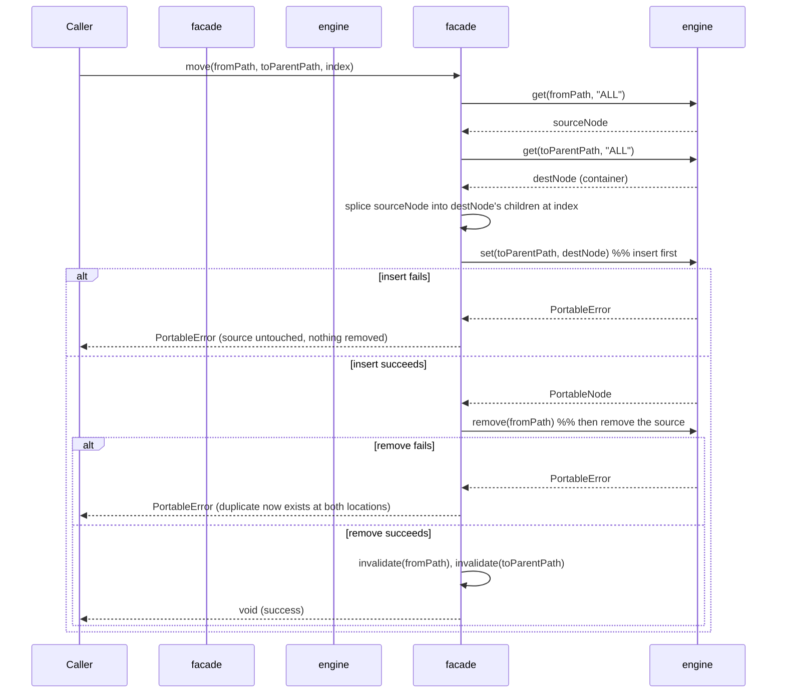
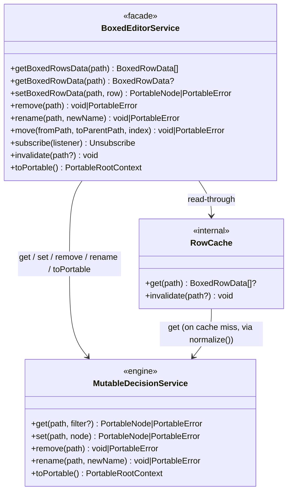
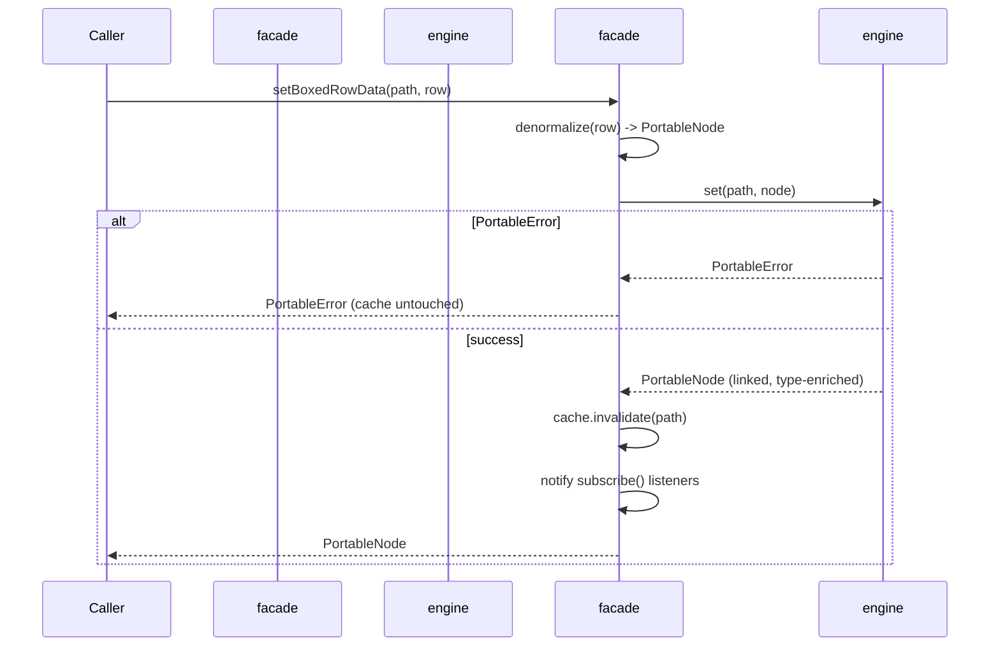

# Boxed Editor Service

## Summary

Implement `BoxedEditorService` — the normalizing facade over `MutableDecisionService` described in
[`BOXED_EDITOR_SPEC.md`](BOXED_EDITOR_SPEC.md)'s ["Service composition"](BOXED_EDITOR_SPEC.md#service-composition) and
[`BoxedEditorService` API](BOXED_EDITOR_SPEC.md#boxededitorservice-api) sections: the
`createBoxedEditorService(mutable)`
factory, Portable ⇄ `BoxedRowData` normalization/denormalization, a per-path row cache, and CRUD delegation
(`get`/`set`/`remove`/`rename`/`move`/`subscribe`/`invalidate`/`toPortable`).

This is the data/service layer only — **no React**. It is the load-bearing dependency every later `BoxedEditor` UI
story (rows, cells, hooks, drag-and-drop, menus) is built against, and completing it is also what makes the package
build: `package.json`'s `./boxed-editor` export and `tsup.config.ts`'s `components/boxed-editor/index` entry already
exist and point at `src/components/boxed-editor/index.ts`, which does not exist yet (the directory currently holds
only a stray `.DS_Store`) — `npm run build` cannot succeed for this package until that file exists.

**No repository-wide `ARCHITECTURE.md` exists in this checkout** (checked `docs/` and the repo root). Per the
`/new-story` process this document would normally update it; since there is nothing to update, this note stands in
for that step. If a cross-component architecture document is wanted, run the `new-architecture` skill separately —
that is a repo-wide concern, not something one component's service story should originate.

**Out of scope** (left to a follow-up story): `BoxedEditor.tsx`, all `rows/`, `cells/`, `primitives/`, `menu/`, `dnd/`,
context providers, hooks, `DocumentationService`, `TestCasesService`. Those consume this service; none of them are
touched here.

## Technical Breakdown

### Files

```
src/components/boxed-editor/
├─ index.ts                          — public exports (see Component API note below)
├─ boxed-editor-types.ts             — BoxedEditorService, BoxedRowData, BoxedRowKind, BoxedTableRowData,
│                                       SignatureParameter (all public, per BOXED_EDITOR_SPEC.md)
├─ service/
│  ├─ createBoxedEditorService.ts    — factory: MutableDecisionService -> BoxedEditorService
│  ├─ normalize.ts                   — Portable -> BoxedRowData[] / BoxedRowData (Normalization Rules)
│  ├─ denormalize.ts                 — BoxedRowData -> PortableNode (inverse of normalize.ts)
│  └─ rowCache.ts                    — per-path memoized row cache; explicit invalidate(path?)
└─ __tests__/
   ├─ normalization.test.ts          — Portable -> BoxedRowData: sort order, relation-vs-list classification,
   │                                    metadata stripping, function-result synthesis
   ├─ mutation.test.ts               — setBoxedRowData / remove / rename round trips, PortableError passthrough,
   │                                    subscribe notifications, cache referential-stability
   └─ move.test.ts                   — reorder and reparent, insert-then-remove ordering, partial-failure behavior
```

`rows/`, `cells/`, `primitives/`, `menu/`, `dnd/`, `hooks/`, `context/`, and `BoxedEditor.tsx` from the full spec's
component tree are **not** created in this story.

### Normalization (`normalize.ts`)

Reads via `mutable.get(path, 'ALL')` and maps the returned `PortableNode` tree to `BoxedRowData[]`, applying
[Normalization Rules](BOXED_EDITOR_SPEC.md#normalization-rules) exactly:

| Rule                   | Behavior                                                                                                                                                                                                                                              |
|------------------------|-------------------------------------------------------------------------------------------------------------------------------------------------------------------------------------------------------------------------------------------------------|
| Sort order             | `complexType` → `function` → `ruleset` → `optimisation` → everything else (`context`/`list`/`relation`/`field`), each group in source order; a function body's synthesized `result` field sorts last within that function                             |
| Relation vs. list      | scalar array items → `list`/`list-item`; complex-object array items → `relation`/`relation-item` with `columns` as the ordered union of every field seen across records                                                                               |
| Metadata               | `@kind`, `@description`, `@node`, `@node-name`, `@model-name`, `@model-version` never become a child row; whether `@node`/`@node-name` should instead be surfaced as fields on `BoxedRowData` is undecided — see [Open Questions](#open-questions) #1 |
| Row-kind consolidation | class field / typed input / plain expression / invocation Portable nodes all collapse to the single `field` `BoxedRowKind`                                                                                                                            |
| Inline functions       | a function whose `@body` is a bare `PortableExpression` (not a `PortableContext`) is normalized with a synthesized `function-result` child row so the shape matches a multi-statement function body                                                   |

`getBoxedRowsData(path)` and `getBoxedRowData(path)` are pure reads of the cache (below); they never call `mutable.get`
directly — the cache does, on miss.

#### Table-shaped row fields

`BOXED_EDITOR_SPEC.md` declares `BoxedTableRowData`'s fields (`parameters`, `columns`, `cells`, `conditionColumns`,
`actionColumns`, `conditions`, `conditionsExpression`, `actions`, `priority`) but not how `normalize()` derives each
from Portable. Resolved by reading `PortableFunctionDefinition`/`PortableRulesetDefinition`/`PortableRule` directly
(`@edgerules/portable`) and `../edgerules-v2/doc/reference/RULESETS_REFERENCE.md`:

| `BoxedTableRowData` field                               | Row kind(s)                           | Derived from                                                                                                                                                                                                                                                                                                                                                                                  |
|---------------------------------------------------------|---------------------------------------|-----------------------------------------------------------------------------------------------------------------------------------------------------------------------------------------------------------------------------------------------------------------------------------------------------------------------------------------------------------------------------------------------|
| `parameters: SignatureParameter[]`                      | `function`, `optimisation`, `ruleset` | `@parameters`' own key-insertion order; a `null` value → `{ name }` (untyped), a bare type-reference string → `{ name, type }`, a `PortableTypedValue` → `{ name, type: value.type, required: value.required }`                                                                                                                                                                               |
| `columns: string[]`                                     | `relation`                            | ordered union of every field name seen across all `relation-item` records, in first-authored-appearance order (the relation-vs-list rule above)                                                                                                                                                                                                                                               |
| `cells: string[]`                                       | `relation-item`                       | one entry per `columns[i]`, read from that record's field; empty string when the record doesn't have that field                                                                                                                                                                                                                                                                               |
| `conditionColumns: string[]`                            | `ruleset`                             | the ruleset's own `@parameters` keys, in order (conditions are tests over the ruleset's inputs, not its outputs)                                                                                                                                                                                                                                                                              |
| `actionColumns: string[]`                               | `ruleset`                             | ordered union of field names across every `@rules[].then` and `@default` (if present) — same first-appearance algorithm as `columns`                                                                                                                                                                                                                                                          |
| `conditions: string[]` / `conditionsExpression: string` | `rule`                                | `when` decodes to exactly one of these two, distinguished by shape (`RULESETS_REFERENCE.md` §"when as a boolean expression"): a plain `{ [param]: unaryTest }` object → `conditions[i]` aligned to `conditionColumns[i]`, empty string for an omitted key ("any"); a `{ '@kind': 'expression', expression }` node → `conditionsExpression` set to `expression`, `conditions` omitted entirely |
| `actions: string[]`                                     | `rule`, `ruleset-default`             | one entry per `actionColumns[i]`, read from `then`/`@default`'s field; empty string when that record doesn't carry the field                                                                                                                                                                                                                                                                  |
| `priority: number`                                      | `rule`                                | `PortableRule.priority` verbatim; present only under `hitPolicy: "best-match"`                                                                                                                                                                                                                                                                                                                |

`denormalize.ts` reverses each of these. The one non-obvious direction: writing `conditions` back into `when` must
**omit** any column whose cell is `''`, not write `{ [param]: '' }` — an empty cell means "any" (omitted key), per
[Cell value mapping](BOXED_EDITOR_SPEC.md#cell-value-mapping); the same empty-means-omitted rule applies when
writing `actions` back into a heterogeneous `then`/`@default` record for a column that record doesn't carry.

### Row cache (`rowCache.ts`)

- One cache keyed by `path`, populated lazily on first read via `normalize()`.
- `getBoxedRowsData`/`getBoxedRowData` must return a **referentially stable** array/object when nothing under `path`
  changed, so a future `useSyncExternalStore` consumer doesn't re-render or loop (spec's
  ["Reactivity requirements"](BOXED_EDITOR_SPEC.md#react-integration)).
- Every mutation (`setBoxedRowData`/`remove`/`rename`/`move`) invalidates exactly the entries whose subtree changed
  (the mutated path, every ancestor path up to root since a child changed, and — for `rename`/`move` — every path
  ever cached at or under the old location).
- The cache's `invalidate(path?)` applies that same ancestor-clearing rule and backs the **public**
  `BoxedEditorService.invalidate(path?)` method (per `BOXED_EDITOR_SPEC.md`'s `BoxedEditorService` API — see
  [Resolved Decisions](#resolved-decisions) #2). `createBoxedEditorService` calls it internally after every
  successful commit, and a host can call it directly after mutating the shared `MutableDecisionService` through
  another surface.
- **Ordering matters**: both the internal after-commit path and the public `invalidate()` call must clear the cache
  *before* notifying `subscribe` listeners, so a listener that re-reads via `getBoxedRowsData` inside its own
  callback (as `useSyncExternalStore` does) never observes stale data.

### Denormalization (`denormalize.ts`) and the whole-node `set` strategy

`setBoxedRowData(path, row)` denormalizes the **entire row, including its `children`,** into one `PortableNode` and
issues exactly one `mutable.set(path, node)`. This is deliberate, not incidental, and follows the same strategy
already validated for `ruleset` in `DECISION_TABLE_STORY.md` ("structural edits → whole-ruleset `set`"), for two
engine reasons confirmed against `../edgerules-v2/doc/architecture/CRUD_SPEC.md`:

1. **Arrays are append-only; gaps are rejected** (`ResolvedLocation::NewListElement` — "New tail slot (gaps rejected
   → `WrongFieldPath`)"). There is no engine primitive to insert or reorder at an arbitrary array index, so
   `list`/`relation`/`rule`/`optimisation-variable`/`optimisation-constraint` container edits (add/remove/reorder a
   child) must rewrite the whole parent array in one `set`, not touch one element at an index.
2. **Cell text is expression-wrapped, never DSL-parsed client-side.** Per
   [Cell value mapping](BOXED_EDITOR_SPEC.md#cell-value-mapping), a `field`'s `value` can denote a plain expression, a
   type constraint (`<number, required: true>`), or an invocation call — three different Portable node kinds — but
   the view "never parses DSL itself." `denormalize.ts` always wraps such text as
   `{ '@kind': 'expression', expression: text }` and lets the engine's own parser resolve it to the concrete node kind
   on `set`; a subsequent `get` (feeding the next `normalize()`) reports back whichever kind the engine actually
   linked. **This is an inference from the spec's wording, not something confirmed against the live engine yet** —
   Phase 2 includes a task to verify it against `@edgerules/node` and, if it doesn't round-trip, file the gap in
   `docs/BUG_REPORTS.md` rather than working around it silently.

`remove(path)` and `rename(path, newName)` delegate straight to `mutable.remove`/`mutable.rename` — no denormalization
needed, since neither takes a node body.

### `move(fromPath, toParentPath, index)`

The engine has no native move/reparent/reorder primitive (confirmed: `CRUD_SPEC.md` lists only
`get`/`set`/`remove`/`rename`). `move` is composed from those four, in an order chosen to fail safe:



**Insert-then-remove, not remove-then-insert.** If the insert fails, the source is still exactly where it was — the
caller sees an ordinary `PortableError` and nothing is lost. If the (unlikely) remove fails after a successful
insert, the model now has the row in both places; the facade returns that `PortableError` verbatim rather than
attempting a compensating rollback, following the same no-silent-rollback philosophy the engine itself uses for CRUD
writes ([Resolved Decision #12](BOXED_EDITOR_SPEC.md#resolved-decisions): partial failure surfaces as an ordinary
path-scoped error, it does not reverse prior steps). A duplicate-on-partial-failure is strictly safer than a
lost-on-partial-failure row, which is why the order is insert-first.

Reordering within the *same* parent (`fromPath` and `toParentPath` share a parent) is the same algorithm with
`toParentPath == ` the shared parent — splice-out-then-splice-in inside one already-read `destNode`, still one
`set`.

**`index` is only fully meaningful for array-shaped destinations.** For `list`/`relation`/`ruleset`'s `@rules`/
`optimisation-variable-group`/`optimisation-constraint-group` parents, physical array position *is* render order, so
splicing `sourceNode` into `destNode`'s array at `index` directly determines where the row appears. For
context-shaped destinations (`context`/`complexType`/the model root), `destNode` is a plain object — "insert at
index" means rebuilding its key order (delete and re-insert every key from `index` onward, since JS/JSON object key
order is insertion order, not indexable), but [Normalization Rules](BOXED_EDITOR_SPEC.md#normalization-rules)' fixed
group sort (`complexType` → `function` → `ruleset` → `optimisation` → everything else) already determines a
`complexType`/`function`/`ruleset`/`optimisation` child's rendered position regardless of key order. Honoring `index`
there therefore only ever affects tie-breaking among siblings in the "everything else" group — implement the
key-rebuild for correctness and future-proofing, but don't expect it to visibly reorder a moved `function`/`ruleset`/
`optimisation`/`complexType` row.

**Scope boundary:** `move` performs the mechanical splice only. It does not enforce the DMN-shape validity rules
listed in the spec's [Drag and Drop](BOXED_EDITOR_SPEC.md#drag-and-drop) section (e.g. "`rule` → only its own
`ruleset`, and only as a reorder"). That semantic gate is `dropRules.ts`, owned by the future drag-and-drop story, so
the same pure function can gate both the drag preview and the actual `move()` call without the two ever disagreeing.
Calling `move()` directly with a structurally invalid target is expected to surface as an engine `PortableError`
(e.g. `WrongFieldPath`/`Linking`) in most cases, but is **not** guaranteed to be rejected by this service alone.

### Error handling

Mirrors the spec's [Error handling](BOXED_EDITOR_SPEC.md#error-handling) split, at the level this service can act on:

- A bad `path` passed to `getBoxedRowsData`/`getBoxedRowData` (does not resolve) returns `undefined`/`[]` — fatal
  handling (replacing UI with an alert) is the future `BoxedEditor` component's job, not this facade's.
- `setBoxedRowData`/`remove`/`rename`/`move` return the engine's `PortableError` verbatim on failure and leave the
  cache untouched for that path (no invalidation on failure, so the last-good cached row stays visible).
- Per [Resolved Decision #12](BOXED_EDITOR_SPEC.md#resolved-decisions), a structurally-successful write that breaks a
  reference elsewhere is **not** rolled back — this facade does not re-validate the whole model after every write.
  `rename` in particular is documented to return success while leaving a dangling reference in place
  (`docs/BUG_REPORTS.md`'s "Referenced value-field rename leaves the model invalid" — rejected/won't-fix upstream);
  `rename` here does not special-case it, so the broken reference surfaces the same way, as an ordinary path-scoped
  error on whichever path is next read.

### Structural Diagram



### Behavioral Diagram



## Testing Strategy

- `BoxedEditorService` must be tested with fully working `MutableDecisionService` - no mocking of the EdgeRules engine
  is allowed.
- `BoxedEditorService` must be unit tested.

## Out of Scope

- `BoxedEditor.tsx` and everything under `rows/`, `cells/`, `primitives/`, `menu/`, `dnd/`, `hooks/`, `context/`.
- `DocumentationService`, `TestCasesService`, and any IndexedDB overlay.
- `dropRules.ts` DnD-validity gating (see move()'s scope boundary above).
- Repo-wide `ARCHITECTURE.md` (none exists; see Summary).

## Tasks

**Phase 1: Types + normalized read path**

- [ ] Ensure project compiles and existing tests are passing
- [ ] Add `boxed-editor-types.ts`: `BoxedRowKind`, `BoxedRowData`, `BoxedTableRowData`, `SignatureParameter`
- [ ] Add `service/normalize.ts`: Portable → `BoxedRowData[]` / `BoxedRowData`, applying sort order, relation-vs-list
  classification, metadata stripping, row-kind consolidation, and function-result synthesis
- [ ] Add `service/rowCache.ts`: per-path memoized cache with `get`/`invalidate`
- [ ] Add `service/createBoxedEditorService.ts` implementing `getBoxedRowsData`, `getBoxedRowData`, `toPortable`,
  `subscribe`, and the public `invalidate(path?)` (wired straight to the cache — no engine round trip needed) against
  the cache; `setBoxedRowData`/`remove`/`rename`/`move` throw a plain `Error('not implemented')` in this phase (not a
  fabricated `PortableError` — `PortableErrorType` is a closed union with no "not implemented" member, so a stub
  return value would violate the real type), replaced in Phases 2–3
- [ ] Add `index.ts` exporting the Phase 1 public surface (fixes the `./boxed-editor` package export / tsup entry)
- [ ] Add `__tests__/normalization.test.ts` against a real `@edgerules/node` `MutableDecisionService.fromCode(...)` —
  cover every `BoxedRowKind` including `ruleset`/`optimisation` families, sort order, relation vs. list, and
  metadata stripping
- [ ] `npm run build` succeeds with the `boxed-editor` entry now resolvable
- [ ] Mark all checkboxes as done in this document once verified

**Phase 2: Mutations (set / remove / rename) and reactivity**

- [ ] Ensure project compiles and existing tests are passing
- [ ] Add `service/denormalize.ts`: `BoxedRowData` (recursively, including `children`) → `PortableNode`, per row kind
- [ ] Verify against `@edgerules/node` that expression-wrapped type-constraint and invocation text round-trips
  through `set` → `get` to the correct concrete Portable `@kind`; file a `docs/BUG_REPORTS.md` entry if it
  doesn't and adjust `denormalize.ts` accordingly
- [ ] Implement `setBoxedRowData`, `remove`, `rename` on the facade: denormalize → delegate to `mutable` →
  cache-invalidate the affected path(s) on success only → notify `subscribe` listeners once per successful commit
- [ ] Add `__tests__/mutation.test.ts`: real-engine round trips for `field`/`context`/`complexType`/`list`/
  `relation`/`function`/`ruleset`/`optimisation` rows; `PortableError` passthrough with cache left untouched;
  exactly one `subscribe` notification per successful commit; referential stability of unaffected cached paths
- [ ] Mark all checkboxes as done in this document once verified

**Phase 3: `move`**

- [ ] Ensure project compiles and existing tests are passing
- [ ] Implement `move(fromPath, toParentPath, index)`: insert-then-remove ordering, whole-parent-node rewrite,
  same-parent reorder as a special case of the same algorithm
- [ ] Add `__tests__/move.test.ts`: reorder within an array-shaped parent (`list-item`/`relation-item`/`rule`/
  `optimisation-variable`/`optimisation-constraint`); reparent a `field`/`context`/`function` into another
  `context`; insert-failure leaves the source untouched; remove-failure-after-insert surfaces the `PortableError`
  with the duplicate documented as expected
- [ ] Mark all checkboxes as done in this document once verified

**Phase 4: Quality gate**

- [ ] Ensure project compiles and existing tests are passing
- [ ] Resolve [Open Questions](#open-questions) below (or record the architect's decision inline in this document,
  matching the style already used for BOXED_EDITOR_SPEC.md's own open questions)
- [ ] Update `docs/BUG_REPORTS.md` with any engine gaps found during Phases 1–3
- [ ] Update required documentation after the implementation is complete (this story's checkboxes, and
  `BOXED_EDITOR_SPEC.md` itself if implementation revealed a spec inaccuracy)
- [ ] Ensure new tests are added for the new feature and all tests are passing
- [ ] Perform linting and formatting to maintain code quality and consistency (`npm run format`, `npm run typecheck`)
- [ ] Review the implementation to ensure it meets the requirements and follows best practices
- [ ] Mark all checkboxes as done in this document once verified

## Resolved Decisions

| # | Decision                          | Resolution                                                                                                                                                                                                                                                                                                                                                                                                                                                                                             |
|---|-----------------------------------|--------------------------------------------------------------------------------------------------------------------------------------------------------------------------------------------------------------------------------------------------------------------------------------------------------------------------------------------------------------------------------------------------------------------------------------------------------------------------------------------------------|
| 1 | Export surface for row types      | `BoxedRowData`, `BoxedRowKind`, `BoxedTableRowData`, `SignatureParameter`, and `createBoxedEditorService` are exported from `index.ts` alongside `BoxedEditorService` — required for the interface to be usable outside this package at all. `BOXED_EDITOR_SPEC.md`'s "Export surface" note is updated to match.                                                                                                                                                                                       |
| 2 | Host-triggered cache revalidation | `invalidate(path?: string): void` is added to the **public** `BoxedEditorService` interface (`BOXED_EDITOR_SPEC.md` updated), not kept internal-only. Motivated by the planned ReactFlow-based Flow Editor: a second GUI editing the same `MutableDecisionService` outside this facade's own mutation methods needs a way to tell this facade its cache is stale. The future `BoxedEditorContext` calls it when the host's `revision` prop changes; `invalidate()` itself has no notion of `revision`. |

## Open Questions

1. **`@node`/`@node-name` GUI annotations aren't on `BoxedRowData`.** Per `@edgerules/portable`, `@node`/`@node-name`
   are the same annotation the Flow Editor's node kinds (`InputNode`, `FunctionNode`, `RulesetNode`, `ChartNode`, ...)
   read — now directly relevant given the confirmed ReactFlow integration. Two sub-problems: (a) should
   `BoxedRowData` expose them (e.g. `nodeAnnotation?: PortableNodeAnnotation`, `nodeName?: string`) so `BoxedEditor`
   can read/show them, and (b) `denormalize.ts`'s whole-node `set` must explicitly re-attach a row's existing
   `@node`/`@node-name` on every write, or risk silently dropping them the same way `docs/BUG_REPORTS.md` already
   documents for `@description` (a confirmed, won't-fix-upstream engine behavior: `set` only preserves annotation
   keys present in the same write).
   Question to address: does `BoxedEditorService` need to read/write `@node`/`@node-name`, or is that entirely the
   future Flow Editor's own facade's concern (a separate normalized view over the same `MutableDecisionService`)?
   Option 1: add `nodeAnnotation`/`nodeName` to `BoxedRowData` now, and have `denormalize.ts` always round-trip them,
   so `BoxedEditor` and the future Flow Editor stay consistent no matter which one last wrote a node.
   Option 2: leave `BoxedRowData` as-is; the Flow Editor gets its own facade/normalization and reads `@node`/
   `@node-name` directly from `MutableDecisionService`, never through `BoxedEditorService`.

> All annotations are ignored by `BoxedEditorService` for now.

2. **Cache coherence across two facade instances sharing one `MutableDecisionService`.** `invalidate()` (Resolved
   Decision #2) solves cache staleness *if* the Flow Editor calls it on the same `BoxedEditorService` instance the
   `BoxedEditor` component uses. If instead the Flow Editor story creates its own, independent
   `createBoxedEditorService(sameMutable)` (or its own differently-shaped facade) over the same underlying engine
   instance, there is no automatic notification between the two — each has its own cache and its own `subscribe`
   listener set, and nothing here keeps them in sync.
   Question to address: should `createBoxedEditorService` deduplicate by `MutableDecisionService` identity (returning
   the same facade instance, and thus the same cache/subscribe bus, for a given engine instance), or is manual
   cross-instance `invalidate()` calls from whichever host code owns both editors an acceptable contract?
   Option 1: leave this story's `createBoxedEditorService` as a plain, non-deduplicating factory (current design) and
   revisit when the Flow Editor story exists and the real integration shape is known.
   Option 2: add identity-keyed memoization to `createBoxedEditorService` now, so any two calls with the same
   `MutableDecisionService` share one facade/cache/subscribe bus, closing the gap pre-emptively.
   This story proceeds with **Option 1** — the Flow Editor doesn't exist yet, and designing the sharing contract
   without a second concrete consumer risks guessing wrong.