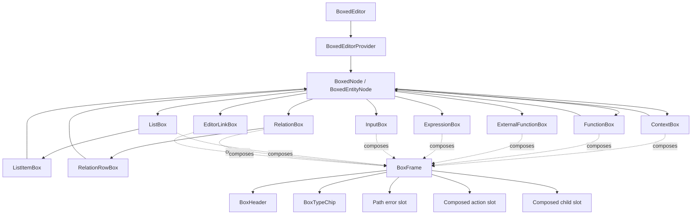
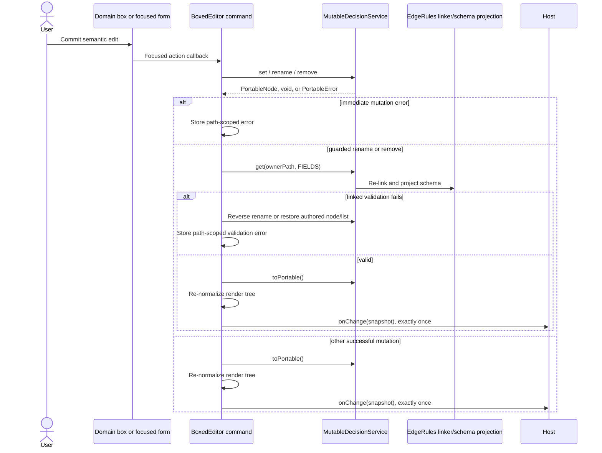

# Boxed Editor Specification

## 1. Purpose and product context

`BoxedEditor` is the structured, visual authoring surface for EdgeRules models. It presents Portable model entities as
recognizable boxes—contexts, expressions, inputs, functions, lists, and relations—rather than requiring
the user to edit the complete EdgeRules DSL document as plain text.

The interaction model is influenced by the boxed-expression and decision-modeling experiences of **Camunda** and
**Trisotech**, and by the **Decision Model and Notation (DMN)** standard. In particular, the editor borrows the ideas
that decision logic should be navigable as domain-shaped artifacts and that expressions should be editable in their
surrounding decision context.

This influence does **not** make `BoxedEditor` a DMN renderer, FEEL editor, or DMN interchange implementation.
EdgeRules DSL, EdgeRules Portable JSON, and the EdgeRules CRUD API remain the authoritative language, storage, and
mutation contracts. Specialized artifacts are routed to their appropriate host editors:

- type definitions → Types Editor;
- rulesets → Decision Table Editor; and
- loops → Loop Editor.

`BoxedEditor` contains no rule-evaluation engine. Browser applications normally supply a mutable decision service from
`@edgerules/web`; tests may supply the equivalent service from `@edgerules/node`. The service owns the authored model
and all parsing, linking, type inference, validation, and execution semantics.

## 2. Public boundary

The package entry point is `edgerules-react/boxed-editor`. Its public API is intentionally small:

```ts
interface BoxedEditorProps {
  service: BoxedEditorService;
  path: string;
  languageService?: CodeEditorService;
  revision?: string | number;
  readOnly?: boolean;
  onChange?: (snapshot: PortableRootContext) => void;
  onOpenNode?: (target: BoxedEditorOpenTarget) => void;
  className?: string;
  sx?: SxProps<Theme>;
}
```

The entry point also exports `BoxedEditorService`, `BoxedEditorOpenTarget`, and `BoxedEditorTargetKind`. Everything else
described below is internal and must not be re-exported without an explicit public-API decision.

Important prop semantics:

| Prop              | Meaning                                                                                          |
| ----------------- | ------------------------------------------------------------------------------------------------ |
| `service`         | The mutable EdgeRules model authority. The editor never maintains a second persisted model.      |
| `path`            | The authored CRUD path to show. Use `"*"` for the complete model.                                |
| `languageService` | Supplies diagnostics and completions to the one active expression cell.                          |
| `revision`        | Host-controlled invalidation token. Change it after model edits made outside this editor.        |
| `readOnly`        | Suppresses mutation controls and expression activation while retaining navigation links.         |
| `onChange`        | Called once with the refreshed Portable snapshot after a successful committed mutation.          |
| `onOpenNode`      | Routes specialized nodes to another host editor; `BoxedEditor` does not implement those editors. |

## 3. Component tree

This is the quickest map from a visible feature to its implementation:

All paths in the tree are relative to `src/components/boxed-editor/`.

```text
BoxedEditor                                      BoxedEditor.tsx
├── BoxedEditorProvider                         BoxedEditorProvider.tsx
│   └── BoxedNode                               BoxedNode.tsx
│       ├── ContextBox                          boxes/ContextBox.tsx
│       │   └── BoxedNode[]
│       ├── FunctionBox                         boxes/FunctionBox.tsx
│       │   └── BoxedNode[] body
│       ├── ExternalFunctionBox                 boxes/ExternalFunctionBox.tsx
│       ├── ExpressionBox                       boxes/ExpressionBox.tsx
│       │   └── StaticExpression | CodeEditorCell
│       ├── InputBox                            boxes/InputBox.tsx
│       │   └── Static DSL input | CodeEditorCell
│       ├── ListBox                             boxes/ListBox.tsx
│       │   └── ListItemBox[]                   boxes/ListItemBox.tsx
│       │       └── entity box selected by BoxedEntityNode
│       ├── RelationBox                         boxes/RelationBox.tsx
│       │   └── RelationRowBox[]                boxes/RelationRowBox.tsx
│       │       └── entity box selected by BoxedEntityNode
│       └── EditorLinkBox                       boxes/EditorLinkBox.tsx
└── focused forms                               forms/EditorForms.tsx
    ├── AddFieldForm
    ├── FunctionSignatureForm
    ├── ListItemForm
    ├── RelationColumnForm
```

### 3.1 Composition diagram



`BoxedNode` is only an exhaustive dispatcher over the `BoxedRenderNode` discriminated union. Entity semantics stay in
the domain boxes. `BoxFrame` provides row mechanics through slots and children; it must never receive an entity kind or
entity-specific boolean flags.

### 3.2 Directory navigation

| Location                                                                                  | Responsibility                                                                                    | Start here when…                                                |
| ----------------------------------------------------------------------------------------- | ------------------------------------------------------------------------------------------------- | --------------------------------------------------------------- |
| [`BoxedEditor.tsx`](../src/components/boxed-editor/BoxedEditor.tsx)                       | Loading, editor-wide state, mutation commands, rollback, refresh, callbacks, and form composition | Changing mutation lifecycle, error behavior, or host callbacks  |
| [`BoxedEditorProvider.tsx`](../src/components/boxed-editor/BoxedEditorProvider.tsx)       | Separate focused contexts and hooks for state and entity capabilities                             | Adding or narrowing an entity capability                        |
| [`BoxedNode.tsx`](../src/components/boxed-editor/BoxedNode.tsx)                           | Exhaustive normalized-kind dispatch                                                               | Adding a new normalized entity kind                             |
| [`boxed-model.ts`](../src/components/boxed-editor/boxed-model.ts)                         | Portable-to-render normalization, path resolution, discriminated render-node types                | Changing classification or render-tree shape                    |
| [`cell-code.ts`](../src/components/boxed-editor/cell-code.ts)                             | Portable-to-Cell-Code mapping for inline DSL values                                               | Changing how a Portable value is shown or initialized in a cell |
| [`boxed-editor-utils.ts`](../src/components/boxed-editor/boxed-editor-utils.ts)           | Portable construction, path helpers, paging reads, and formatting                                 | Constructing a node for `set` or reading indexed collections    |
| [`boxed-embed.ts`](../src/components/boxed-editor/boxed-embed.ts)                         | Synthetic surrounding DSL for expression diagnostics and completions                              | Changing expression language-service context                    |
| [`boxes/`](../src/components/boxed-editor/boxes)                                          | Entity-specific presentation and composition                                                      | Changing one visible entity                                     |
| [`actions/`](../src/components/boxed-editor/actions)                                      | Capability-specific reusable button groups                                                        | Reusing a semantic action set                                   |
| [`forms/EditorForms.tsx`](../src/components/boxed-editor/forms/EditorForms.tsx)           | Focused draft forms                                                                               | Changing entity input fields or form presentation               |
| [`primitives/`](../src/components/boxed-editor/primitives)                                | Entity-neutral row, header, type, expression, collection, and dialog mechanics                    | Changing shared visual/accessibility mechanics                  |
| [`boxed-editor-types.ts`](../src/components/boxed-editor/boxed-editor-types.ts)           | Public types plus internal form drafts                                                            | Changing public props or a form draft                           |
| [`domain-boxes.test.tsx`](../src/components/boxed-editor/__tests__/domain-boxes.test.tsx) | Focused box ownership and dispatcher characterization                                             | Adding or changing a domain box                                 |
| [`BoxedEditor.test.tsx`](../src/components/boxed-editor/__tests__/BoxedEditor.test.tsx)   | Real-engine integration and mutation behavior                                                     | Changing API interaction or user behavior                       |
| [`BoxedEditor.stories.tsx`](../stories/components/boxed-editor/BoxedEditor.stories.tsx)   | Browser scenarios and host integration examples                                                   | Adding a visual scenario                                        |
| [`e2e/boxed-editor.spec.ts`](../e2e/boxed-editor.spec.ts)                                 | Story rendering, editing, completion, and routing checks                                          | Changing browser-visible behavior                               |

## 4. Render model and normalization

React components do not render raw Portable nodes directly. `BoxedEditor` obtains:

1. an authored snapshot from `service.toPortable()`;
2. a linked schema from `service.get(path, "FIELDS")`;
3. indexed collection pages from repeated `service.get("path[index]", "FIELDS")` calls; and
4. a normalized `BoxedRenderNode` tree from `renderNode(...)`.

The normalized union currently contains:

| `kind`              | Dedicated component   | Important normalized data                                |
| ------------------- | --------------------- | -------------------------------------------------------- |
| `context`           | `ContextBox`          | Named children in authored order                         |
| `expression`        | `ExpressionBox`       | Authored value/expression plus linked schema             |
| `input`             | `InputBox`            | Portable `@kind: "type"` input                           |
| `function`          | `FunctionBox`         | Signature and normalized function-body children          |
| `external-function` | `ExternalFunctionBox` | External signature; no body                              |
| `list`              | `ListBox`             | Indexed items plus required paging state                 |
| `relation`          | `RelationBox`         | Indexed context rows, columns, and required paging state |
| `editor-link`       | `EditorLinkBox`       | Type-definition, ruleset, or loop route target           |

Three render-only annotations preserve write semantics:

- `listItem: { path, index }` marks an indexed collection item. Item duplication, deletion, and movement operate on
  the owning collection.
- `functionBody: { path }` maps the displayed scalar `fn.result` cell back to its owning Portable function definition.
- `sortable: { groupId, ownerPath, ownerKind, index }` marks authored siblings that can be reordered together. Context
  fields, context function-body fields, and terminal literal collection items receive this annotation.

Do not add a second persisted boxed-editor model. If a new UI shape is needed, add render-only normalized data and keep
`PortableRootContext` as the authored snapshot.

Portable metadata keys such as `@kind`, `@description`, `@node`, `@node-name`, `@model-name`, and `@model-version` are
not normalized as child fields. `BoxHeader` presents the applicable modeler metadata, and mutation conversion helpers
must preserve metadata that is unrelated to the edit.

### 4.1 Portable → Cell Code mapping

Portable is the engine-owned authored representation. Cell Code is the intermediate UI representation: the complete
EdgeRules DSL text owned by one editable cell. `cellCode(...)` is the single mapping boundary from Portable to this
text; committing Cell Code sends the complete DSL string to `service.set(path, code)`, allowing the engine to parse it
back into Portable.

| Portable value                             | Render kind  | Cell Code                  |
| ------------------------------------------ | ------------ | -------------------------- |
| expression or scalar                       | `expression` | its authored DSL text      |
| `@kind: "type"`                            | `input`      | `<number, required: true>` |
| `@kind: "invocation"` with method and args | `expression` | `myFunc(a)`                |

An invocation is therefore one non-expandable expression cell. It has no invocation-specific render node, child
argument paths, form, action context, or box. Editing the call—including its method and arguments—edits its complete
Cell Code.

## 5. EdgeRules API interaction

The editor consumes the following service contract:

```ts
interface BoxedEditorService {
  toPortable(): PortableRootContext;

  get(path: string, filter?: GetFilter): PortableNode | PortableError;

  set(path: string, node: PortableNode): PortableNode | PortableError;

  remove(path: string): void | PortableError;

  rename(path: string, newName: string): void | PortableError;
}
```

`execute` is intentionally absent: editing and model execution are separate responsibilities.

### 5.1 API usage by operation

| API                                        | How `BoxedEditor` uses it                                                                                                                |
| ------------------------------------------ | ---------------------------------------------------------------------------------------------------------------------------------------- |
| `toPortable()`                             | Reads the complete authored model for normalization, refresh, rollback source data, expression embedding, and `onChange`.                |
| `get(path, "FIELDS")`                      | Gets the linked/schema-enriched view used for classification, type chips, validation, and collection shape.                              |
| `get(path + ".*", "FUNCTION_DEFINITIONS")` | Validates that a focused function definition can be resolved.                                                                            |
| `get(path + "[index]", "FIELDS")`          | Pages literal list/relation items until the requested page size or `EntryNotFound`.                                                      |
| `set(path, node)`                          | Commits expressions, inputs, signatures, invocations, metadata, fields, list items, reordered collections, and relation-column rewrites. |
| `rename(path, newName)`                    | Renames a field, followed by linked validation and possible reverse rename.                                                              |
| `remove(path)`                             | Removes a field or list item, followed by linked validation and possible restoration.                                                    |

Portable contracts come from `@edgerules/portable`. Do not parse DSL in React or redefine `PortableNode`,
`PortableError`, path syntax, `@kind` shapes, filters, or CRUD rules. The authoritative engine documents live in the
sibling repository:

- `../edgerules-v2/doc/architecture/EDGERULES_API_SPEC.md`;
- `../edgerules-v2/doc/architecture/EDGERULES_CRUD_SPEC.md`;
- `../edgerules-v2/doc/architecture/EDGERULES_DSL_SPEC.md`; and
- `../edgerules-v2/tests/wasm/` for concrete, CI-run TypeScript examples.

### 5.2 Mutation lifecycle



The editor must not duplicate this lifecycle inside a domain box. Components issue semantic commands; centralized
controller code handles service calls, Portable errors, rollback, refresh, and notification.

### 5.3 Path conventions

- `"*"` addresses the model root.
- Context fields use dot paths: `application.amount`.
- Collection items use indexes: `people[0]`.
- Function bodies are exposed through CRUD paths such as `monthly.result` or `summary.tax`, even though Portable stores
  them beneath `@body`; `resolveAuthoredPath` bridges this authored/CRUD difference.

Always use the shared `childPath`, `parentPath`, and engine path conventions. Do not invent UI-only persisted paths.

## 6. State and capability boundaries

`BoxedEditor` coordinates state that must be global to one editor instance:

- authored snapshot and normalized render tree;
- expanded node IDs;
- exactly one active expression path;
- current name edit;
- path-scoped and fatal errors;
- focused form drafts; and
- per-collection requested page sizes.

Failure to load the selected path or its schema is fatal and replaces the treegrid with an alert. Mutation and linked
validation failures are normally path-scoped and render in that entity's `BoxFrame`; collection paging errors render
in the owning collection footer.

`BoxedEditorProvider` exposes this through separate contexts:

| Hook                   | Consumers and purpose                                                         |
| ---------------------- | ----------------------------------------------------------------------------- |
| `useBoxedEditorState`  | Shared read-only mode, snapshot, language service, expansion, and path errors |
| `useExpressionActions` | `ExpressionBox` and `InputBox`; activate, commit, cancel                      |
| `useFieldActions`      | Context/field-capable boxes and `BoxHeader`; add, rename, duplicate, remove   |
| `useMetadataActions`   | Boxes that display editable Portable metadata                                 |
| `useFunctionActions`   | Function and external-function boxes only                                     |
| `useListActions`       | List/relation collections and item/row wrappers                               |
| `useRelationActions`   | `RelationBox` and relation-column actions only                                |
| `useEditorNavigation`  | `EditorLinkBox` only                                                          |
| `useBoxedNodeRenderer` | Recursive structural boxes without a module cycle                             |

Do not replace these contexts with a single controller context. A component must not gain access to operations its
entity cannot perform.

## 7. Shared composition rules

### 7.1 `BoxFrame`

`BoxFrame` owns only mechanics common to every visible row:

- treegrid row/cell roles and `aria-level`;
- indentation and grid columns;
- expand/collapse placement;
- path-error display;
- read-only suppression of the action cell; and
- optional child rendering.

In editable mode, sortable rows receive a leading `DragIndicator` handle. Sorting is pointer/touch driven through
`dnd-kit`; drops are restricted to the active row's sibling group. Read-only rows do not render the handle gutter.

Headers, values, types, actions, and children are composed into slots. Never add `kind`, `isFunction`, `isList`, or
similar dispatch flags to `BoxFrame`.

### 7.2 Expression editing

Only the active `ExpressionBox` or `InputBox` mounts `CodeEditorCell`. This preserves the one-active-editor invariant
across the complete tree. Both initialize the editor through the Portable → Cell Code mapping.

`expressionEmbedContext(snapshot, activePath)` serializes the surrounding Portable model into a synthetic EdgeRules DSL
prefix/suffix around the active cell. This gives diagnostics and completions the correct lexical model context without
persisting the synthetic document. The marker used to split the document must never reach the language service.

### 7.3 Collections

- CRUD-addressable literal arrays are expanded through indexed reads, not by parsing expression text. Computed arrays
  remain expressions and are not expanded into editable items.
- The initial/request increment is `LIST_PAGE_SIZE` (currently 50).
- `EntryNotFound` marks the collection terminal; other Portable errors are shown as collection errors.
- Add, duplicate, and reorder affordances appear only when the complete collection has been loaded.
- Reordering a terminal collection rewrites the complete collection once. Context and context-function siblings
  rewrite their owning Portable node while preserving metadata. Root fields use paired `remove`/`set` operations in
  final order because the engine does not support `set("*", ...)`.
- `CollectionChildren` virtualizes only when more than 100 children are loaded; virtualization is shared, but list and
  relation semantics remain in separate boxes.
- Relation columns are derived from the first loaded row. Once paging is terminal, column changes rewrite the complete
  loaded relation atomically.

Changing these rules requires integration tests with the real engine, especially around partial pages and rollback.

## 8. Architectural principles for extensions

1. **The service is the authority.** React state is a view and draft layer, never a second model.
2. **Normalize before rendering.** Portable classification and transformation belong in `boxed-model.ts`, outside
   React components.
3. **One entity, one domain component.** New entity semantics get an obvious box name and focused test.
4. **Dispatch once.** Add a discriminated union member and one exhaustive `BoxedNode` branch; do not spread kind checks
   across shared primitives.
5. **Compose mechanics, do not generalize semantics.** Share row chrome, dialog chrome, and virtualization; keep list,
   relation and function behavior distinct.
6. **Use focused capabilities.** Extend the narrowest existing context or add a focused one. Never pass the complete
   controller through props or context.
7. **Keep engine mechanics centralized.** Domain boxes request semantic actions; controller code owns CRUD, linked
   validation, rollback, refresh, and `onChange`.
8. **Preserve authored data.** When rebuilding a Portable object, retain unrelated fields and metadata. Remove only
   engine-projected fields that are invalid as authored input.
9. **Read-only is structural.** Mutation controls and expression activation disappear; static rendering, expansion,
   errors, and host navigation continue to work.
10. **Internal architecture stays internal.** Keep new boxes, hooks, actions, drafts, and render types out of the npm
    exports unless a future public-API story explicitly requires them.
11. **Prefer engine evidence.** For DSL and Portable behavior, consult `../edgerules-v2/tests/wasm/` before prose. If
    the UI exposes an engine/WASM bug, append a reproducible entry to `docs/BUG_REPORTS.md` rather than compensating by
    redefining the contract in React.
12. **Use React composition.** Components are React function components built with MUI and accessible treegrid
    semantics. Do not introduce component inheritance or a boolean-heavy universal renderer.

## 9. Adding a new boxed entity

Use this sequence:

1. Confirm the entity and Portable shape in `edgerules-v2` specifications and WASM tests.
2. Add or refine a discriminated render-node type in `boxed-model.ts`.
3. Normalize the Portable node and any render-only annotations in `renderNode`.
4. Add a dedicated `boxes/<Entity>Box.tsx` with narrow props and capability hooks.
5. Add the exhaustive branch to `BoxedEntityNode`.
6. Add a focused capability context/action group/form only if the entity needs one; reuse primitives through slots.
7. Add focused RTL coverage for static/read-only rendering, valid actions only, path errors, and command interaction.
8. Add real-engine integration coverage for CRUD paths, Portable conversion, errors, refresh, rollback, and `onChange`
   as applicable.
9. Add or retain a Storybook scenario and browser coverage for user-visible behavior.
10. Verify public declarations and package exports remain unchanged unless the story explicitly changes them.

Do not implement an unsupported entity as a collection of booleans on an existing box. If adding the entity would
require unrelated boxes or primitives to inspect its kind, the boundary is wrong.

## 10. Required verification

Changes to `BoxedEditor` should normally pass:

```sh
npm run typecheck
npm test
npm run build
npm run storybook:build
npm run e2e -- e2e/boxed-editor.spec.ts
```

The required coverage areas are:

- root and focused-path rendering;
- all normalized dispatcher kinds;
- exactly one active expression editor and Portable embed completions;
- one `onChange` call per successful commit;
- context, function, external-function, invocation, list, and relation mutations;
- guarded rename/remove rollback;
- paging and virtualization;
- type/ruleset/loop navigation;
- read-only behavior;
- fatal and path-scoped errors; and
- every Boxed Editor Storybook story rendering without the error boundary.

The current focused component suite is `src/components/boxed-editor/__tests__/domain-boxes.test.tsx`; the real-engine
integration suite is `src/components/boxed-editor/__tests__/BoxedEditor.test.tsx`; browser coverage is
`e2e/boxed-editor.spec.ts`.

## 11. Related documentation

- [`BOXED_EDITOR_REFACTORING_STORY.md`](BOXED_EDITOR_REFACTORING_STORY.md) — history and acceptance criteria for the
  domain-component architecture.
- [`BOXED_EXPRESSIONS_EDITOR_STORY.md`](BOXED_EXPRESSIONS_EDITOR_STORY.md) — original feature behavior and user stories.
- [`README.md`](../README.md) — package-level usage and component exports.
- `../edgerules-v2/doc/architecture/ARCHITECTURE.md` — engine layering and model authority.
- `../edgerules-v2/doc/architecture/EDGERULES_API_SPEC.md` — Portable and service API contract.
- `../edgerules-v2/doc/architecture/EDGERULES_CRUD_SPEC.md` — mutation, validation, and cache lifecycle.
