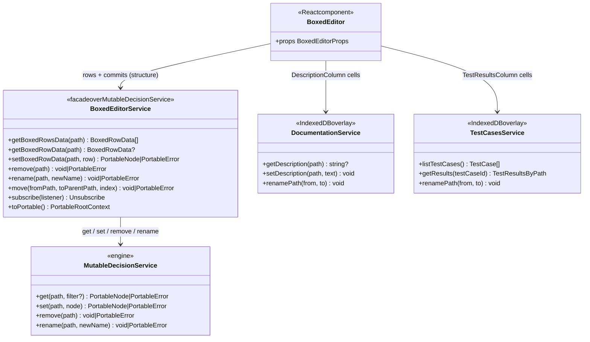
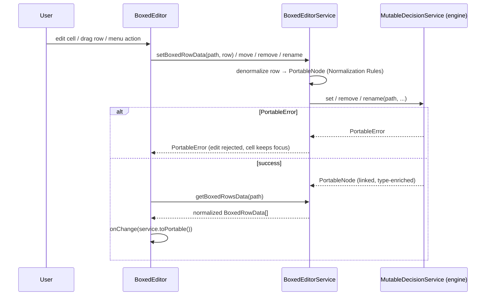
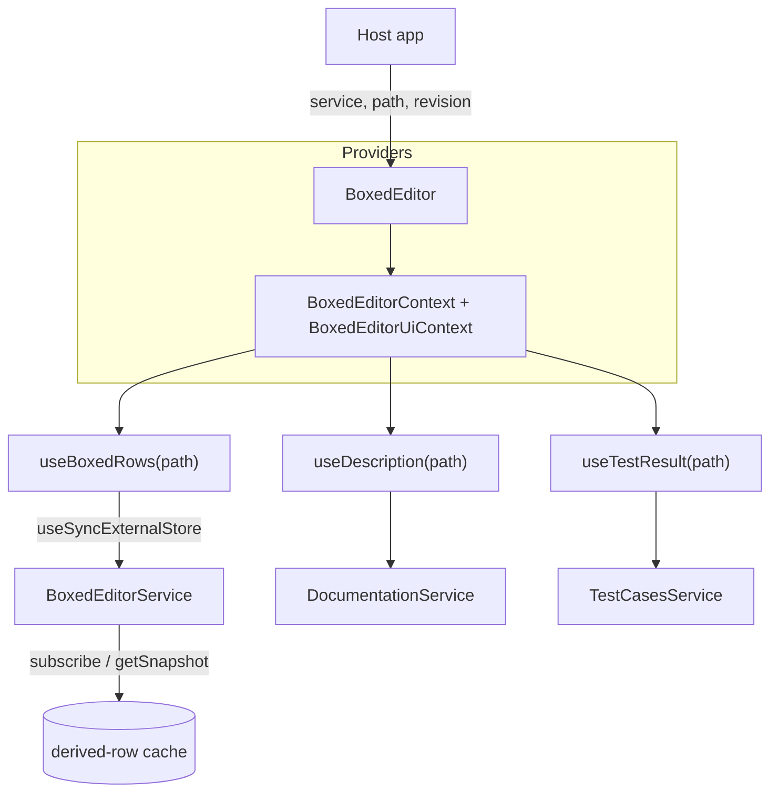

# Boxed Editor Specification

This document is the authoritative specification for the `BoxedEditor` implementation at
[`src/components/boxed-editor`](../src/components/boxed-editor): a single flat treegrid GUI language, fully described
below. [`BOXED_EDITOR_OLD_SPEC.md`](BOXED_EDITOR_OLD_SPEC.md) is not authoritative for this component — everything
needed to implement `BoxedEditor` is in this document.

- GUI Reference Frames `/Users/rimvydasbingelis/Projects/EdgeRules/edgerules-react-frames/src` — this is the
  authoritative wireframe. Every row layout, column, action list, and interaction described below is a direct read of
  that code (`App.tsx` for composition/occupancy, `boxed/actions.ts` for row kinds and their context menus,
  `boxed/*.tsx` for per-construct rendering, `hooks/useAltHeld.ts` for the type-reveal interaction).
- 

## Introduction

`BoxedEditor` is the structured, visual authoring surface for EdgeRules models. The interaction model is influenced by
the boxed-expression and decision-modeling experiences of **Camunda** and **Trisotech**, and by the **Decision Model and
Notation (DMN)** standard. EdgeRules `BoxedEditor` does not strictly follow standard DMN boxed expression GUI
conventions and proposes much more convenient and compact layouts and ergonomics.

`BoxedEditor` renders a single flat treegrid of rows. Every row is one of the `BoxedRowKind`s below (this is the
complete list — derived from, and cross-checked against, the reference wireframe's `RowKind` union in
[`boxed/actions.ts`](/Users/rimvydasbingelis/Projects/EdgeRules/edgerules-react-frames/src/boxed/actions.ts)):

- `model` - the model header: name, occupies the whole top row, fixed position
- `field` - **the one generic leaf row.** Depending on its parent it is a class field definition, a typed input, or a
  plain computed/literal expression — all three render identically and share the same actions. See
  [Row kind consolidation](#row-kind-consolidation).
- `context` - named nested object that can contain other rows
- `complexType` - named, reusable type definition that can contain other `field` rows
- `list` - header of a homogeneous scalar list; no header cells of its own beyond name/value
- `list-item` - single scalar item of a list
- `relation` - header of a homogeneous complex-object collection; carries the column names (one per shared field)
- `relation-item` - single record of a relation, one cell per relation column
- `function` - a named callable (`func`); tall row, argument headers under the value column
- `function-result` - the synthesized `result` line of a function body
- `ruleset` - a named rule matrix (DMN-style decision table, EdgeRules `ruleset`); tall row, condition/action column
  headers under the value column. See [Ruleset and optimisation row composition](#ruleset-and-optimisation-row-composition).
- `rule` - one row of a `ruleset`'s rule matrix
- `ruleset-default` - the singleton fallback-result row of a `ruleset` (shown when no rule matches)
- `optimisation` - a named linear optimisation problem (EdgeRules `optimise`); tall row, argument headers under the
  value column. See [Ruleset and optimisation row composition](#ruleset-and-optimisation-row-composition).
- `optimisation-variable-group` - the fixed `variables:` section header inside an `optimisation`
- `optimisation-variable` - one decision variable (a Typed Input Wrapper)
- `optimisation-objective` - the fixed `maximise`/`minimise` row (exactly one, required)
- `optimisation-constraint-group` - the fixed `constraints:` section header inside an `optimisation`
- `optimisation-constraint` - one named linear constraint

Two more kinds are **recommended additions**, not present in the wireframe's `RowKind` union today — see
[Row kind review](#row-kind-review-of-actionsts) item R6:

- `ruleset-hit-policy` - the fixed `hitPolicy` setting row of a `ruleset`
- `optimisation-setting` - the fixed `using` / `bottlenecks` / `timeLimit` setting rows of an `optimisation`

### Row kind consolidation

A class field (`name: <string, required: true>` under a `complexType`), a typed input
(`applicationDate: <date, required: true>` under a `context`), and a plain computed expression
(`payment: monthly(application.amount)` at the model root) all render through the exact same `Row` component with the
exact same action list (`convert-to-context` / `convert-to-relation` / `convert-to-list`, `duplicate`, `delete`) — only
the parent container differs. `BoxedRowKind` therefore has a single `field` kind for all of them, rather than a
separate kind per parent context.

### Row Types

Full-height ("tall", 80px) rows carry their own argument/column headers in the `ValueColumn`: `function`, `ruleset`,
`optimisation`, and `model`. Everything else is single-height (40px) and grows only in 40px steps if it needs to wrap.
Exact column occupancy (which rows span `NameColumn`+`ValueColumn` as one cell vs. keep them separate) is not repeated
here — read it straight from `App.tsx`, which is the living reference for every row's layout.

| Row Type                  | Row Type Key                    | Actions                                                                                            | Short Description                                                                 |
|----------------------------|----------------------------------|------------------------------------------------------------------------------------------------------|-------------------------------------------------------------------------------------|
| Model Header               | `model`                          | Add Field, Add Function, Add Optimisation, Add Decision Table, Add Relation, Add List, Model Settings | Root row: model name; fixed position, not sortable, not deletable                  |
| Type Field                 | `field`                          | Convert to Context, Convert to Relation, Convert to List, Duplicate, Delete                          | Generic leaf: a class field, a typed input, or a computed expression               |
| Context                    | `context`                        | Add Field, Add Function, Add Decision Table, Add Relation, Add List, Duplicate, Delete                | Named nested object                                                              |
| Complex Type               | `complexType`                    | Add Field, Duplicate, Delete                                                                          | Reusable named type definition                                                     |
| List                       | `list`                           | Duplicate, Delete                                                                                     | Header of a homogeneous scalar list; items appended via the trailing placeholder row |
| List Item                  | `list-item`                      | Duplicate, Delete                                                                                     | One scalar list element; Duplicate inserts a copy directly below it                |
| Relation                   | `relation`                       | Add Column, Delete "‹column›" Column (per column), Delete                                            | Header of a homogeneous complex-object collection                                 |
| Relation Item              | `relation-item`                  | Duplicate, Delete                                                                                     | One record of a relation, one cell per column                                     |
| Function                   | `function`                       | Add Argument, Duplicate, Delete "‹arg›" Argument (per arg), Delete                                    | A named callable (`func`)                                                          |
| Function Result            | `function-result`                | Duplicate, Delete                                                                                     | The synthesized `result` line of a function body; not draggable                    |
| Decision Table             | `ruleset`                        | Add Rule, Add Condition Column, Add Action Column, Delete "‹column›" Column (per column), Delete      | A named rule matrix (DMN-style decision table)                                     |
| Rule                       | `rule`                           | Duplicate, Delete                                                                                     | One row of a decision table's rule matrix                                          |
| Ruleset Default            | `ruleset-default`                | Delete                                                                                                | Singleton fallback row shown when no rule matches; not duplicable                  |
| Ruleset Hit Policy *(rec.)*| `ruleset-hit-policy`             | *(none — edited via its own picker chip)*                                                            | Fixed `hitPolicy` setting                                                          |
| Optimisation                | `optimisation`                   | Add Argument, Add Variable, Add Constraint, Duplicate, Delete "‹arg›" Argument (per arg), Delete      | A named linear optimisation problem (`optimise`)                                  |
| Optimisation Variable Group | `optimisation-variable-group`   | Add Variable                                                                                          | Fixed `variables:` section header; not draggable                                  |
| Optimisation Variable       | `optimisation-variable`         | Duplicate, Delete                                                                                     | One decision variable (a Typed Input Wrapper)                                     |
| Optimisation Objective      | `optimisation-objective`        | Switch to Minimise/Maximise                                                                           | Fixed `maximise`/`minimise` row; exactly one, required; not draggable              |
| Optimisation Constraint Group | `optimisation-constraint-group`| Add Constraint                                                                                        | Fixed `constraints:` section header; not draggable                                |
| Optimisation Constraint     | `optimisation-constraint`       | Duplicate, Delete                                                                                     | One named linear constraint                                                       |
| Optimisation Setting *(rec.)*| `optimisation-setting`          | *(none — edited via its own control)*                                                                | Fixed `using` / `bottlenecks` / `timeLimit` settings                              |

**Common to every row:**

- Description column
- Test-results column
- Action column (context menu content differs per row kind — see [Context Menu](#context-menu))

**Not draggable / not sortable:** `model` (fixed root), `function-result` (synthesized), `ruleset-default` (singleton),
`ruleset-hit-policy`, `optimisation-variable-group`, `optimisation-objective`, `optimisation-constraint-group`,
`optimisation-setting` (all fixed, single-value or section-header settings rendered via the `SettingRow` primitive with
a gear icon instead of a drag handle — see `primitives.tsx`'s `SettingRow` doc comment in the wireframe).

**Drag and Drop:** the function icon, the ruleset icon, the optimisation icon, the type icon, and the 6-dot expression
drag handle are all drag handles for the row and its children.

### Ruleset and optimisation row composition

`ruleset` and `optimisation` are the two row kinds whose children are a fixed shape rather than a freely-ordered
container — the diagram below is the structural reference for both (row order, and which children are fixed vs.
repeatable, matches this exactly):


```mermaid
flowchart TD
    subgraph Ruleset["ruleset — tall row: parameters + condition/action column headers"]
        direction TB
        Rule1["rule (repeatable, sortable)"]
        Rule2["rule (repeatable, sortable)"]
        RuleNew["(new rule) placeholder"]
        Default["ruleset-default — absent when hitPolicy is collect-matches"]
        HitPolicy["ruleset-hit-policy — fixed, not draggable"]
    end

    subgraph Optimisation["optimisation — tall row: parameters"]
        direction TB
        Using["optimisation-setting: using — fixed"]
        Bottlenecks["optimisation-setting: bottlenecks — fixed"]
        VarGroup["optimisation-variable-group — fixed section header"]
        Var1["optimisation-variable (repeatable, sortable)"]
        Var2["optimisation-variable (repeatable, sortable)"]
        VarNew["(new variable) placeholder"]
        Objective["optimisation-objective — fixed, exactly one"]
        ConGroup["optimisation-constraint-group — fixed section header"]
        Con1["optimisation-constraint (repeatable, sortable)"]
        Con2["optimisation-constraint (repeatable, sortable)"]
        ConNew["(new constraint) placeholder"]
        TimeLimit["optimisation-setting: timeLimit — fixed"]

        VarGroup --> Var1 & Var2 & VarNew
        ConGroup --> Con1 & Con2 & ConNew
    end
```

**Ruleset relationship to the standalone Decision Table Editor:** `../edgerules-react/src/components/decision-table`
already ships a dedicated `DecisionTableEditor` (full MUI table, dialogs, column management). This spec's inline
`ruleset` rendering above is a **compact, fully-editable-in-place view**, not a preview — it has real add-rule /
add-column / delete-column actions, matching how `relation`/`list` are already edited in place without needing to
"open" anything. The existing `onOpenNode({kind: 'ruleset'})` routing to `DecisionTableEditor` is kept as an escape
hatch for the dedicated full-screen ergonomics (bulk column resize, keyboard cell navigation, large rule counts) —
symmetric with how `code-editor` stays available via "View as code" even though expression cells are already editable
inline. **This coexistence is inferred, not confirmed — see [Open Questions](#open-questions).**

**Optimisation has no standalone editor at all.** Unlike `ruleset`, there is no dedicated host editor for `optimise`
anywhere in the library's component list (Code Editor, Boxed Editor, Decision Table Editor, Flow Editor, Test Runner,
Types Editor, Project Explorer) — `BoxedEditor` is its only GUI, so the inline row tree above must be complete on its
own, not a preview.

## Row kind review of `actions.ts`

Cross-checking the wireframe's `rowActionRegistry` / `rowActions` against every `RowKind` it declares surfaced six
things worth deciding before the real implementation copies this design verbatim:

1. **`insert-above` / `insert-below` are dead.** Both ids are declared in `rowActionRegistry` but never appear in any
   `rowActions[kind]` list. Either wire them to a real use (a mid-sequence "insert blank sibling" distinct from
   Duplicate-with-content) or drop them — right now they're reserved-but-unused surface area.
2. **The append affordance is inconsistent.** Some containers get an explicit "Add X" in their own three-dot menu
   (`complexType`, `context`/`model`, `ruleset`, `relation`'s "Add Column", `optimisation`'s groups) while others rely
   solely on the trailing "(new …)" placeholder row with no menu equivalent (`list` has no "Add Item"; `relation` has
   no "Add Row"). Recommend picking one policy — either every appendable container gets a menu entry mirroring its
   placeholder, or the placeholder is the sole affordance everywhere and the menu entries are dropped for consistency.
3. **`optimisation`'s add-variable/add-constraint is triple-redundant.** The top-level `optimisation` row's own menu
   offers `add-variable`/`add-constraint`, the nested `optimisation-variable-group`/`optimisation-constraint-group`
   rows offer the same action again, and a trailing placeholder row exists too. Recommend dropping the top-level
   copies — the group row is where the insertion actually happens and is never more than one row away.
4. **`change-hit-policy` is orphaned.** It's declared in the registry but no `rowActions[kind]` list references it —
   `hitPolicy` is rendered as a bare `DropdownChip` with no `kind`/menu at all in the wireframe. Confirm the intent is
   "click the chip to open the picker" rather than a three-dot menu entry, and either wire the id to that chip or
   remove it from the registry.
5. **Duplicating a *named* row needs an auto-rename rule that isn't specified anywhere.** `optimisation-variable`,
   `optimisation-constraint`, `field`, `function`, `context`, `complexType`, `ruleset` are all named children of a
   record — cloning one verbatim collides with its own name immediately. `list-item`/`relation-item`/`rule` are
   positional and don't have this problem. The real implementation needs a stated rule (e.g. `chairs` → `chairs2`)
   for Duplicate on named kinds — a one-click action has no point at which the user chooses the new name before the
   copy is inserted, so the rename has to be automatic and then left in place for the user to edit.
6. **No row kind exists for the fixed setting rows.** `hitPolicy`, `using`, `bottlenecks`, and `timeLimit` render via
   the `SettingRow` primitive with no `kind` prop at all (no menu, and no discriminant for a renderer dispatch table
   either). Recommend adding `ruleset-hit-policy` and `optimisation-setting` as real `BoxedRowKind` values with an
   empty action list, purely so `BoxedRowData.kind` stays a complete discriminated union for every rendered row —
   these are the two kinds listed as "(recommended)" throughout this document.

**Not a gap, by design:** the registry has no `copy`/`paste` ids at all — `duplicate` covers copy-and-insert-below in
one action (see [Resolved Decisions](#resolved-decisions) #8).

## GUI Language

`BoxedEditor` has a strict spacing policy:

- single smallest `cell` is 40x40 pixels
- if row needs to contain more lines, it can grow vertically by the step of 40 pixels: 80, 120, 160...
- if row cell needs to be longer, it can only grow by the step of 40 pixels: 80, 120, 160...
- all text on the cell is positioned in the middle
- all cells are aligned with each other, no mid-positioning or pixel offsets are allowed. In general, all BoxedEditor
  GUI can be sketched on school maths workbook.

`BoxedEditor` is composed of rows where each row can be an expression, function definition, decision table, list
header, list row, etc. `BoxedEditor` has the following main columns:

- `NameColumn` - grid-based column, can contain many cells that can be skipped to display the different depth of
  JSON-like context tree.
- `ValueColumn` - column is used for expression value, function/ruleset/optimisation argument headers, list items,
  relation cells, rule cells, etc.
- `DescriptionColumn` - column is used for description, can be empty
- `ActionsColumn` - column is used for context menu button: vertical three dots icon in a single `cell`
- `TestResultsColumn` - column is used for that single expression calculation result. This column has a header with a
  test name and with `previous` and `next` buttons to navigate through all test cases.

There is **no `TypeColumn`.** Types are not a rendered column at all — they are attached as a tooltip on the relevant
name/header cell (`NameColumn` for a `field`/`context`/`complexType`, argument/column headers for
`function`/`ruleset`/`optimisation`/`relation`), and revealed two ways:

- **Hover** a name/header cell → its tooltip opens, showing that one type.
- **Hold Alt** anywhere on the page → every type tooltip in the tree opens at once, so the whole model's types can be
  scanned without hovering row by row. Releasing Alt (or the window losing focus) closes them all again.

This is implemented in the wireframe by a page-level `AltHeldContext` (`useAltHeldState` listens for `keydown`/`keyup`
on `"Alt"` and `blur`) that every `TypeName`-wrapped cell reads alongside its own local hover state — see
`hooks/useAltHeld.ts` and `boxed/primitives.tsx`'s `TypeName`.

## Component Tree

Root: `src/components/boxed-editor`. This is a tree, not a flat file list — indentation is ownership/nesting, and
each line is that file's one job. Naming continues this repo's existing conventions (the current implementation
already has `boxes/`, `primitives/`, `actions/`; this spec renames the row-construct folder to `rows/` since the
wireframe's GUI is treegrid rows, not nested DMN boxes, and drops the type-chip primitive since there is no type
column to render a chip for).

```
src/components/boxed-editor/
├─ index.ts                          — public exports only (see Component API's export-surface note)
├─ BoxedEditor.tsx                   — root component: validates `path`, renders BoxedEditorContext/UiContext
│                                       providers, the header row (if showHeader), and the root row list
├─ BoxedEditorProps.ts               — BoxedEditorProps, BoxedEditorOpenTarget, BoxedEditorTargetKind (public)
├─ boxed-editor-types.ts             — BoxedEditorService, BoxedRowData, BoxedRowKind, SignatureParameter (public)
├─ service/
│  ├─ createBoxedEditorService.ts    — factory: MutableDecisionService -> BoxedEditorService
│  ├─ normalize.ts                   — Portable -> BoxedRowData[] (Normalization Rules: sort order, relation
│  │                                    vs. list classification, metadata stripping)
│  ├─ denormalize.ts                 — BoxedRowData -> PortableNode (inverse of normalize.ts)
│  └─ rowCache.ts                    — per-path memoized row arrays backing useSyncExternalStore (Resolved
│                                       Decision #6); invalidated wholesale when `revision` changes
├─ context/
│  ├─ BoxedEditorContext.tsx         — seeds service/languageService/readOnly/column-visibility from props
│  └─ BoxedEditorUiContext.tsx       — ephemeral UI state: per-row expand/collapse, active editing cell path,
│                                       Alt-held (type-reveal), current test-case index
├─ hooks/
│  ├─ useBoxedEditorService.ts       — reads BoxedEditorContext
│  ├─ useBoxedRows.ts                — useSyncExternalStore(service.subscribe, () => service.getBoxedRowsData(path))
│  ├─ useDescription.ts              — subscribes to DocumentationService for one path
│  ├─ useTestCases.ts                — ordered cases + current index + next()/prev() from UiContext
│  ├─ useTestResult.ts               — current test case's TestCasesService result for one path
│  ├─ useAltHeld.ts                  — global Alt-key listener feeding BoxedEditorUiContext
│  └─ useRowActions.ts               — resolves a BoxedRowKind's menu items (mirrors the wireframe's
│                                       rowActionRegistry/rowActions) into dispatchable commands
├─ rows/                             — one component per BoxedRowKind, each a thin wrapper over primitives/RowLine
│  ├─ ModelHeaderRow.tsx             — kind: model
│  ├─ FieldRow.tsx                  — kind: field
│  ├─ ContextRow.tsx                — kind: context
│  ├─ ComplexTypeRow.tsx            — kind: complexType
│  ├─ ListRow.tsx                   — kind: list
│  ├─ ListItemRow.tsx               — kind: list-item
│  ├─ RelationRow.tsx               — kind: relation (renders its own column-header sub-grid)
│  ├─ RelationItemRow.tsx           — kind: relation-item
│  ├─ FunctionRow.tsx               — kind: function (renders ArgumentHeaders); + FunctionResultRow child
│  ├─ FunctionResultRow.tsx         — kind: function-result
│  ├─ RulesetRow.tsx                — kind: ruleset (renders ArgumentHeaders + two-group column headers)
│  ├─ RuleRow.tsx                   — kind: rule
│  ├─ RulesetDefaultRow.tsx         — kind: ruleset-default
│  ├─ RulesetHitPolicyRow.tsx       — kind: ruleset-hit-policy (recommended addition, see review item R6)
│  ├─ OptimisationRow.tsx           — kind: optimisation (renders ArgumentHeaders)
│  ├─ OptimisationSettingRow.tsx    — kind: optimisation-setting (using / bottlenecks / timeLimit)
│  ├─ OptimisationVariableGroupRow.tsx — kind: optimisation-variable-group
│  ├─ OptimisationVariableRow.tsx   — kind: optimisation-variable
│  ├─ OptimisationObjectiveRow.tsx  — kind: optimisation-objective
│  ├─ OptimisationConstraintGroupRow.tsx — kind: optimisation-constraint-group
│  ├─ OptimisationConstraintRow.tsx — kind: optimisation-constraint
│  ├─ NewRow.tsx                    — the trailing "(new …)" placeholder row shared by every appendable container
│  └─ RowSwitch.tsx                 — BoxedRowData.kind -> the matching row component (the one big dispatch point)
├─ cells/
│  ├─ ExpressionCell.tsx            — the ValueColumn cell; enforces the one-active-editor invariant, swaps
│  │                                    between static text and CodeEditorCell for the active path
│  ├─ DescriptionCell.tsx           — reads useDescription(path); no-op read-only when no service is provided
│  └─ TestResultCell.tsx            — reads useTestResult(path); owns array/number/date display formatting
├─ primitives/
│  ├─ RowLine.tsx, Cell.tsx         — shared row chrome (ported ~1:1 from the wireframe's primitives.tsx)
│  ├─ TypeName.tsx                 — hover tooltip + Alt-held-reveal wrapper (reads useAltHeld)
│  ├─ Drag.tsx, ColumnDragHandle.tsx, TallIconHandle.tsx — drag-handle affordances
│  ├─ SettingRow.tsx               — fixed, non-reorderable construct-level row (gear icon, optional kind/menu)
│  ├─ DropdownChip.tsx             — the picker-style chip for hitPolicy / using / bottlenecks
│  └─ ArgumentHeaders.tsx          — the two-row (label + cells) argument/column header block shared by
│                                     function / ruleset / optimisation / relation headers
├─ menu/
│  ├─ actions.ts                   — RowKind, RowAction, rowActionRegistry, rowActions (internal; not exported —
│  │                                  see the review above before treating this 1:1 as final)
│  ├─ RowActionsMenu.tsx           — the MUI Menu, shared by the normal-height and tall-row three-dot buttons
│  └─ useRowMenu.ts                — anchorEl open/close state
├─ dnd/
│  ├─ useRowDrag.ts                — drag source wiring for the function/ruleset/optimisation/type icons and
│  │                                  the 6-dot handle; suppressed under readOnly (Resolved Decision #4)
│  ├─ useRowDrop.ts                — drop-target wiring; delegates validity to dropRules.ts
│  └─ dropRules.ts                 — pure function encoding Valid drop targets (below); shared by drag preview
│                                     and the actual move() call so they can never disagree
└─ __tests__/
   ├─ BoxedEditor.test.tsx         — root rendering, fatal vs. path-scoped errors, readOnly
   ├─ row-kinds.test.tsx           — one case per BoxedRowKind (including ruleset/optimisation families)
   ├─ alt-reveal.test.tsx          — hover vs. Alt-held type tooltip behavior
   ├─ dnd.test.tsx                 — reorder + reparent, including the ruleset/optimisation exceptions
   ├─ duplicate-rename.test.tsx    — auto-rename on Duplicate for every named kind (review item R5)
   └─ normalization.test.ts        — sort order, relation-vs-list classification, metadata stripping
```

## Component API

The package entry point is `edgerules-react/boxed-editor`. Its public API is intentionally small:

```ts
interface BoxedEditorProps {
    service: BoxedEditorService; // The mutable EdgeRules model authority. The editor never maintains a second persisted model.
    path: string; // The authored CRUD path to show. Use `"*"` for the complete model.
    languageService?: CodeEditorService; // Supplies diagnostics and completions to the one active expression cell.
    revision?: string | number; // Host-controlled invalidation token. Change it after model edits made outside this editor.
    readOnly?: boolean; // Disables name/value editing and ordering while retaining navigation and visible ordering handles.
    onChange?: (snapshot: PortableRootContext) => void; // Called once with the refreshed Portable snapshot after a successful committed mutation.
    onOpenNode?: (target: BoxedEditorOpenTarget) => void; // Routes specialized nodes to another host editor; `BoxedEditor` does not implement those editors.
    showHeader?: boolean; // Whether to show the model header row. Defaults to `true`.
    showTestResults?: boolean; // Whether to show the test results column. Defaults to `true`.
    showDescription?: boolean; // Whether to show the description column. Defaults to `true`.
    showType?: boolean; // Whether type tooltips (hover + Alt-reveal) are available at all. There is no type
                        // column to hide/show — this only gates the tooltip interaction. Defaults to `true`.
    expanded?: boolean; // Whether to expand all rows (types, contexts, functions, rulesets, optimisations). Defaults to `true`.
    className?: string; // Optional class name for the root element.
    sx?: SxProps<Theme>; // Optional MUI `sx` prop for styling the root element.
}
```

**Notes:**

- `onOpenNode` routes specialized nodes to their host editors.

```ts
type BoxedEditorTargetKind = 'type-definition' | 'ruleset' | 'loop' | 'boxed-editor' | 'code-editor';

interface BoxedEditorOpenTarget {
    path: string;
    kind: BoxedEditorTargetKind;
}
```

`type-definition`, `ruleset`, and `loop` route to their specialized host editors (Types / Decision Table / Loop).
`boxed-editor` asks the host to open the target context in its own nested `BoxedEditor` instance, and `code-editor`
backs the `View as code` action (opens the CodeMirror editor on the model text). The host owns those editor
instances; `BoxedEditor` only emits the routing request. `ruleset` is the one target kind whose node is *also* fully
editable inline (see [Ruleset and optimisation row composition](#ruleset-and-optimisation-row-composition)) — opening it is for the dedicated full-screen
ergonomics, not because the inline view is read-only. There is no `optimise` target kind: `optimise` has no
standalone host editor, so its inline `BoxedEditor` rendering must be complete on its own.

- `expanded` sets the **initial** global expand state only. After first render each `FunctionRow` / `ContextRow` /
  `ComplexTypeRow` / `RulesetRow` / `OptimisationRow` keeps its own expand/collapse state. Changing `revision` does not
  reset per-row expand state. **Whether this toggle lives in the three-dot menu or as a direct disclosure control on
  the row is unresolved** — see [Open Questions](#open-questions) #5.
- **Export surface.** The `boxed-editor` entry point exports only `BoxedEditor`, `BoxedEditorProps`,
  `BoxedEditorService`, `BoxedEditorOpenTarget`, `BoxedEditorTargetKind`, and the service contracts
  (`DocumentationService`, `TestCasesService`, and their data types). Rows, cells, primitives, hooks, contexts, and
  normalization internals are **not** re-exported — they are not public API.

## Context Menu

**Common:** (except `model`)

- Delete - deletes the selected row, if it is allowed to delete
- Duplicate - copies the row (and, for a container, all its children) and inserts the copy directly below the
  original. On a **named** row kind (`field`, `context`, `complexType`, `function`, `ruleset`, `optimisation`,
  `optimisation-variable`, `optimisation-constraint`) the copy is auto-renamed to avoid an immediate name collision
  with its source (see [Row kind review](#row-kind-review-of-actionsts) #5); on a positional kind (`list-item`,
  `relation-item`, `rule`) it needs no rename and doubles as "insert a new one right after this one".

`model`:

- Model Settings - opens a form for model-level metadata (name, version, description). **Whether "View as code" also
  lives here, given it has no home in the wireframe's registry, is unresolved** — see
  [Open Questions](#open-questions) #6.

`model`:

- Add Field - adds a new `field` row to the model root
- Add Function - adds a new `function` row to the model root
- Add Decision Table - adds a new `ruleset` row to the model root
- Add Optimisation - adds a new `optimisation` row to the model root. **Root-only**: `optimise` may only be
  declared at the model root (a nested declaration is a link-time error, see
  `../edgerules-v2/doc/architecture/dsl/OPTIMISATION_METAPHOR_SPEC.md` §3, "Root-only. Like `external func`") — this
  action does not appear on `context`.
- Add Relation - adds a new `relation` row to the model root
- Add List - adds a new `list` row to the model root

`context`:

- Add Field - adds a new `field` row to the context
- Add Function - adds a new `function` row to the context
- Add Decision Table - adds a new `ruleset` row to the context
- Add Relation - adds a new `relation` row to the context
- Add List - adds a new `list` row to the context

`field`:

- Convert to Context - converts the field into an empty `context`
- Convert to Relation - converts the field into an empty `relation`
- Convert to List - converts the field into an empty `list`

`complexType`:

- Add Field - adds a new `field` row to the complex type

`function`:

- Add Argument - adds a new argument to the function's signature
- Delete "‹argument›" Argument (per argument) - removes that argument from the signature

`relation`:

- Add Column - appends a new field/column to every record in the relation
- Delete "‹column›" Column (per column) - removes that field/column from every record

`ruleset`:

- Add Rule - appends a new empty `rule` row to the rule matrix
- Add Condition Column - appends a new condition column, extending every `rule`/`ruleset-default` row
- Add Action Column - appends a new action column, extending every `rule`/`ruleset-default` row
- Delete "‹column›" Column (per condition/action column) - removes that column from every row

`optimisation`:

- Add Argument - adds a new argument to the problem's signature
- Delete "‹argument›" Argument (per argument) - removes that argument from the signature

`optimisation-variable-group`:

- Add Variable - appends a new `optimisation-variable` row

`optimisation-constraint-group`:

- Add Constraint - appends a new `optimisation-constraint` row

`optimisation-objective`:

- Switch to Minimise / Switch to Maximise - flips the section keyword, keeping the expression

**Enablement rules:**

- `Delete` is hidden/disabled for rows the engine marks read-only (`BoxedRowData.deletable === false`) — e.g. the
  synthesized `result` field of a function, `ruleset-default`, or a field required by the model.
- All add-actions insert at the position implied by their name (a child at the end of the container, or a sibling
  directly below the selected row) and then re-apply the [Normalization Rules](#normalization-rules) sort order.
- In `readOnly` mode every mutating action is hidden; only `Duplicate` and the view toggles remain — and `Duplicate`
  itself is a copy, so it does not mutate the source.

## Special Actions

- When user removes argument name, then argument is removed from function/ruleset/optimisation definition
- When user removes expression name and expression value is empty, then expression is removed from context
- There is a placeholder `(new …)` row at the end of every appendable container (complex type, context, function
  body, list, relation, ruleset's rule matrix, optimisation's variable/constraint groups) — interacting with it
  appends a new empty row of that container's child kind, without needing the context menu. See
  [Row kind review](#row-kind-review-of-actionsts) #2 for the inconsistency between which containers also expose an
  equivalent menu action.

## Drag and Drop

Handles: the function icon, the ruleset icon, the optimisation icon, the type icon, and the 6-dot handle each drag
their whole row **and its children** (a `function`/`ruleset`/`optimisation` carries its body, a `context`/`complexType`
its inner rows, a `list`/`relation` its items).
Dragging maps to `move(fromPath, toParentPath, index)`.

Valid drop targets (a drop outside these is rejected, the row snaps back):

- **Reorder within the same parent** is always allowed for sortable rows.
- **Reparent** is allowed only into a container that accepts the dragged `kind`: `field` (as a `complexType` child) →
  only a `complexType`; `list-item` → only a `list` (matching element type); `relation-item` → only a `relation` with
  matching columns; `rule` → only its own `ruleset`, and only as a reorder (rules never move between rulesets);
  `optimisation-variable` → only its own `optimisation`'s `optimisation-variable-group`; `optimisation-constraint` →
  only its own `optimisation`'s `optimisation-constraint-group`; `field` (as a context child) / `context` /
  `complexType` / `list` / `relation` / `function` / `ruleset` / `optimisation` → any `context` or the model root.
- The synthesized `result` row of a function, and every fixed setting row (`ruleset-default`, `ruleset-hit-policy`,
  `optimisation-variable-group`, `optimisation-objective`, `optimisation-constraint-group`, `optimisation-setting`),
  is not draggable.
- After the drop the destination re-applies the [Normalization Rules](#normalization-rules) sort order, and the
  editor calls `renamePath(from, to)` on the overlay services for every path that changed.

## Normalization Rules

### From EdgeRules DSL to BoxedEditor

1. Inline functions will have a `result` field.
2. All context elements are re-sorted in this order: `Types` (`complexType`), `Functions` (`function`), `Decision
   Tables` (`ruleset`), `Optimisations` (`optimisation`), everything else (`context`/`list`/`relation`/`field`), with
   the synthesized `result` field of a function body sorted to the bottom. This order is read directly off the
   wireframe's `App.tsx` composition (Applicant type → monthly/creditScore functions → risk ruleset →
   factoryProduction optimisation → application context → reviewStages list → relations → plain expressions).

### From BoxedEditor to EdgeRules DSL

1. Single `result` field functions are collapsed to inline functions.
2. All context elements are re-sorted using the same order as above.

### Relation vs. list classification

- A CRUD-addressable array whose items are complex objects (contexts) normalizes to a **relation** (`relation` +
  `relation-item` rows); an array of scalars stays a **list** (`list` + `list-item` rows).
- Relation `columns` are the ordered union of every field discovered across the records, using first authored
  appearance as the initial order. Portable metadata keys (`@kind`, `@node`, ...) are never columns.
- Every record is one `relation-item` row; every column is one `cells[i]`. A field missing from a heterogeneous record
  renders as an empty cell — it does **not** create a nested field row.
- Only computed/literal arrays that are CRUD-addressable expand into item rows. A computed array expression (e.g. a
  `for … return …` loop) stays a single `field` row showing its result summary, not expanded records — loops are not
  a distinct `BoxedRowKind`; they are opaque expression text like any other scalar expression (see
  [Cell value mapping](#cell-value-mapping)).

### Metadata handling

Portable metadata (`@kind`, `@description`, `@node`, `@node-name`, `@model-name`, `@model-version`) is never rendered
as a child row. The `model` row presents the applicable model metadata; on any mutation the facade must preserve
metadata unrelated to the edit. (Note the `@description` interaction called out in [Open Questions](#open-questions).)

## Service composition

The editor reads from **three independent, path-keyed data sources**. Keeping them separate is deliberate: only the
first is derived from the authored model, the other two are volatile authoring overlays stored in IndexedDB
(outside the EdgeRules DSL). Separating them also keeps test-case navigation and description edits from invalidating
the structural row tree — see [React integration](#react-integration).

Furthermore, each `BoxedEditorService` boxed editor data change will invoke EdgeRules decision service re-calculation,
but test cases navigation or description update will not trigger re-calculations.

| Source                 | Owns                                        | Keyed by | Storage                          | Feeds                |
|------------------------|---------------------------------------------|----------|-----------------------------------|----------------------|
| `BoxedEditorService`   | Portable-derived structure (`BoxedRowData`) | `path`   | the authored model (via engine)  | Name/Value/description cols |
| `DocumentationService` | free-text descriptions                      | `path`   | IndexedDB (by model name + path) | DescriptionColumn    |
| `TestCasesService`     | executed test cases and their results       | `path`   | IndexedDB (by model + case)      | TestResultsColumn    |

`BoxedEditorService` is the single facade for the model. It is a **normalizing adapter** over the authoritative
`MutableDecisionService` (from `@edgerules/web` / `@edgerules/node`); it holds no second persisted model. It does
**not** fold descriptions or test results into rows — those overlays are read directly by their column cells, so a
`BoxedRowData` stays a pure projection of the Portable model.


```mermaid
classDiagram
    class BoxedEditor {
<<Reactcomponent>>
+props BoxedEditorProps
}
class BoxedEditorService {
<<facadeoverMutableDecisionService>>
+getBoxedRowsData(path) BoxedRowData[]
+getBoxedRowData(path) BoxedRowData?
+setBoxedRowData(path, row) PortableNode|PortableError
+remove(path) void|PortableError
+rename(path, newName) void|PortableError
+move(fromPath, toParentPath, index) void|PortableError
+subscribe(listener) Unsubscribe
+toPortable() PortableRootContext
}
class MutableDecisionService {
<<engine>>
+get(path, filter?) PortableNode|PortableError
+set(path, node) PortableNode|PortableError
+remove(path) void|PortableError
+rename(path, newName) void|PortableError
}
class DocumentationService {
<<IndexedDBoverlay>>
+getDescription(path) string?
+setDescription(path, text) void
+renamePath(from, to) void
 }
class TestCasesService {
<<IndexedDBoverlay>>
+listTestCases() TestCase[]
+getResults(testCaseId) TestResultsByPath
+renamePath(from, to) void
}

BoxedEditor --> BoxedEditorService: rows + commits (structure)
BoxedEditor --> DocumentationService: DescriptionColumn cells
BoxedEditor --> TestCasesService: TestResultsColumn cells
BoxedEditorService --> MutableDecisionService: get / set / remove / rename
```

## `BoxedEditorService` API

`BoxedEditorService` returns `BoxedRowData` that contains all normalized data from the EdgeRules Portable.
`BoxedRowData` is also used to convert edited data back to Portable to persist to the underlying
`MutableDecisionService`. The facade is constructed with the mutable service and is the model's only surface;
descriptions and test results are separate overlays (above) and are not wired into it.

```typescript
type Unsubscribe = () => void;

interface BoxedEditorService {
    // --- Normalized read ---
    // Children rows of the context/container at `path`, already normalized and sorted
    // (see Normalization Rules). Pass `"*"` for the whole model.
    getBoxedRowsData(path: string): BoxedRowData[];

    // A single row (without materializing its children). Returns `undefined` if the path is absent.
    getBoxedRowData(path: string): BoxedRowData | undefined;

    // --- Mutation (denormalizes the row to Portable, delegates to the mutable service) ---
    setBoxedRowData(path: string, row: BoxedRowData): PortableNode | PortableError;

    remove(path: string): void | PortableError;

    rename(path: string, newName: string): void | PortableError;

    // Drag & drop reorder / reparent. `index` is the target position among the destination's children.
    move(fromPath: string, toParentPath: string, index: number): void | PortableError;

    // --- Reactivity ---
    // Notifies after any internal mutation commits, so the view can re-read via useSyncExternalStore.
    // External edits are signalled instead by changing the `revision` prop.
    subscribe(listener: () => void): Unsubscribe;

    // --- Escape hatch ---
    toPortable(): PortableRootContext;
}
```

`BoxedRowData` is the normalized, render-ready shape for one row. Optional fields are populated only for the row
kinds that use them.

```typescript
type BoxedRowKind =
    | 'model'
    | 'field'
    | 'context'
    | 'complexType'
    | 'list'
    | 'list-item'
    | 'relation'
    | 'relation-item'
    | 'function'
    | 'function-result'
    | 'ruleset'
    | 'rule'
    | 'ruleset-default'
    | 'ruleset-hit-policy'   // recommended addition — see Row kind review #6
    | 'optimisation'
    | 'optimisation-setting' // recommended addition — see Row kind review #6
    | 'optimisation-variable-group'
    | 'optimisation-variable'
    | 'optimisation-objective'
    | 'optimisation-constraint-group'
    | 'optimisation-constraint';

interface BoxedRowData {
    kind: BoxedRowKind; // Discriminant that selects the row renderer and its context menu.
    depth: number; // Depth within the context tree (dot count in `path`); drives NameColumn indent cells.
    path: string; // Fully qualified path used for get / set / remove / rename / move.
    name: string; // NameColumn label. Generated `Item N` for list-item/relation-item rows, `Rule N` for rule rows
                  // unless the rule carries an authored `name` (rules are the one row kind whose generated name is
                  // just a fallback — RULESET_METAPHOR_SPEC's `name?` field on a rule row is user-settable).
    value?: string; // ValueColumn content (expression text, list value, type constraint, objective/constraint expression, ...).
    type?: string; // The tooltip shown on hover / Alt-held; omitted for unnamed complex objects. There is no rendered type column — see GUI Language.
    readOnly?: boolean; // Engine-marked read-only (e.g. synthesized `result`, linked type).
    deletable?: boolean; // Whether the Delete action is offered (defaults to true when omitted).
    parameters?: SignatureParameter[]; // Argument headers for function / ruleset / optimisation rows.
    columns?: string[]; // RelationRow column names (relation table header).
    cells?: string[]; // RelationItemRow per-column values, aligned to the parent `columns`.
    conditionColumns?: string[]; // RulesetRow condition-column names.
    actionColumns?: string[]; // RulesetRow action-column names.
    conditions?: string[]; // RuleRow per-condition-column unary-test cells (the cell-map `when` form), aligned to
                           // `conditionColumns`. Empty string means "any". Mutually exclusive with `conditionsExpression`.
    conditionsExpression?: string; // RuleRow's `when` authored as a single boolean expression over the ruleset's
                                    // parameters (RULESETS_REFERENCE.md § "when as a boolean expression") instead of
                                    // per-column cells. When set, the row renders one cell spanning every condition
                                    // column instead of one cell per column; mutually exclusive with `conditions`.
    actions?: string[]; // RuleRow / RulesetDefaultRow per-action-column cells, aligned to `actionColumns`.
    priority?: number; // RuleRow's explicit rank, shown and editable only while the parent ruleset's hit policy is
                       // `"best-match"` (required there, absent/rejected under every other hit policy).
    children?: BoxedRowData[]; // Nested rows (context / function / ruleset / optimisation / type / list / relation bodies).
}
```

**Why `description` and `testResults` are not on `BoxedRowData`**: baking them into the row tree
would (a) force the tree to re-derive whenever a description is edited or the user clicks previous/next on test
cases, defeating memoization, and (b) blur the boundary between authored model and authoring metadata. Instead the
`DescriptionColumn` and `TestResultsColumn` cells read their own value by `path` from the respective service:

- `useDescription(path)` → `DocumentationService.getDescription(path)`
- `useTestResult(path)` → the current test case's result for `path`

The structural row tree keyed by `path` stays stable; navigating test cases only re-renders the small result cells,
never the boxes. See [React integration](#react-integration).

### Cell value mapping

`value`/`conditions`/`actions`/`cells` are the editable DSL text of one cell, produced by the facade from the
Portable node and sent back verbatim on commit (the engine re-parses it). This is the only Portable↔text boundary;
the view never parses DSL itself.

| Portable node                                | `kind`                        | Cell text                                                    |
|-----------------------------------------------|-------------------------------|----------------------------------------------------------------|
| expression / scalar                           | `field`                       | its authored DSL text (`amount / 12`)                          |
| typed input (`@kind: "type"`)                | `field`                       | a type constraint, e.g. `<number, required: true>`             |
| invocation (`@kind: "invocation"`)            | `field`                       | the call text, e.g. `monthly(application.amount)`               |
| computed array / loop (`for … return …`)      | `field`                       | the raw loop text; never expands into item rows                |
| list item                                     | `list-item` (`value`)         | the item's DSL literal (`'Underwriting'`)                       |
| relation cell                                 | `relation-item` (in `cells`)  | the field's DSL literal, per column                             |
| ruleset condition cell (`when`, cell-map form)| `rule` (in `conditions`)      | the unary test literal, e.g. `18..25`, `< 30000`; empty = "any" |
| ruleset condition, boolean-expression form    | `rule` (`conditionsExpression`) | one spanning cell holding the whole `when` expression, e.g. `age >= 18 and income < 30000` |
| ruleset action cell (`then`)                  | `rule` (in `actions`)         | the output field's DSL literal, e.g. `"high"`, `1000`           |
| ruleset rule priority                         | `rule` (`priority`)           | an integer, editable only under `hitPolicy: "best-match"`        |
| ruleset default cell                          | `ruleset-default` (`actions`) | the fallback output field's DSL literal; the row itself is absent when `hitPolicy` is `"collect-matches"` (`default` is rejected there) |
| ruleset `hitPolicy`                           | `ruleset-hit-policy`          | `"first-match"` \| `"unique-match"` \| `"collect-matches"` \| `"best-match"` |
| optimise decision variable                    | `optimisation-variable`       | a Typed Input Wrapper, e.g. `<number, integer: true, min: 0>`   |
| optimise objective                            | `optimisation-objective`      | the linear expression, e.g. `15 * chairs + 40 * tables`         |
| optimise constraint                           | `optimisation-constraint`     | the named linear comparison, e.g. `1 * chairs + 3 * tables <= workers` |
| optimise `using` / `bottlenecks` / `timeLimit`| `optimisation-setting`        | the literal enum/boolean/number, e.g. `"highs"`, `true`, `1000` |

A `RelationItemRow` cell whose value is itself a complex object is a drill-down, not a scalar cell: it renders nested
rows rather than JSON text. An invocation is a single, non-expandable expression cell — editing the call (method or
arguments) edits its `value` text.

### Path conventions

Paths are the engine's CRUD paths — do not invent UI-only paths. `"*"` is the model root; context fields use dot
paths (`application.amount`); collection items use indexes (`applicants[0]`); function/ruleset/optimisation bodies
are addressed through their authored field path (`monthly.result`, `risk.rules[2].then.limit`,
`factoryProduction.variables.chairs`) even though Portable stores function bodies under `@body`. Authoritative
syntax and filters live in `../edgerules-v2/doc/architecture/CRUD_SPEC.md`.

### Edit → persist → refresh flow

Every committed edit follows the same path: the view denormalizes the changed row, the facade delegates to the
mutable service, then a fresh normalized snapshot is read back and `onChange` fires once.


```mermaid
sequenceDiagram
    participant User
    participant BoxedEditor
    participant BoxedEditorService
    participant MutableDecisionService as MutableDecisionService (engine)
    User ->> BoxedEditor: edit cell / drag row / menu action
    BoxedEditor ->> BoxedEditorService: setBoxedRowData(path, row) / move / remove / rename
    BoxedEditorService ->> BoxedEditorService: denormalize row → PortableNode (Normalization Rules)
    BoxedEditorService ->> MutableDecisionService: set / remove / rename(path, ...)
    alt PortableError
        MutableDecisionService -->> BoxedEditorService: PortableError
        BoxedEditorService -->> BoxedEditor: PortableError (edit rejected, cell keeps focus)
    else success
        MutableDecisionService -->> BoxedEditorService: PortableNode (linked, type-enriched)
        BoxedEditor ->> BoxedEditorService: getBoxedRowsData(path)
        BoxedEditorService -->> BoxedEditor: normalized BoxedRowData[]
        BoxedEditor ->> BoxedEditor: onChange(service.toPortable())
    end
```

## React integration

How the services are provided as hooks and where row state lives.

**Single source of truth — do not duplicate the model in React state.** The authored model lives behind the
`MutableDecisionService`; `BoxedEditorService` is a stateless-derivation facade over it. React stores **no copy of
the row tree**. Rows are *derived* on demand and cached inside the facade, and components subscribe to that external
store with React 18's `useSyncExternalStore`. This keeps the spec's promise that "the editor never maintains a second
persisted model", and it is the idiomatic way to bind React to a mutable non-React store.

Two kinds of state, kept apart:

| State                                                                             | Owner                                                   | Lifetime            |
|-----------------------------------------------------------------------------------|-----------------------------------------------------------|---------------------|
| Model structure (rows)                                                            | `MutableDecisionService` (external, via facade cache)   | persisted           |
| Descriptions / test results                                                       | `DocumentationService` / `TestCasesService` (IndexedDB) | persisted (overlay) |
| UI state: per-row expand, active editing cell, Alt-held, current test-case index  | React context (`BoxedEditorUiContext`)                  | ephemeral           |

**Providers and hooks** (the library's internal contract; only `BoxedEditor` is exported):

- The host constructs the services and passes the facade as the `service` prop — the mutable service is **host-owned**,
  so no `useMutableDecisionService` hook is needed inside the library. A `createBoxedEditorService(mutable)` factory is
  offered as a convenience; hosts that want a memoized instance wrap it in their own `useMemo`.
- `BoxedEditor` seeds a context from its props; the subtree reads through hooks:
    - `useBoxedEditorService()` → the facade.
    - `useBoxedRows(path)` → `useSyncExternalStore(service.subscribe, () => service.getBoxedRowsData(path))`.
    - `useDescription(path)` → subscribes to `DocumentationService` for that path.
    - `useTestCases()` → the ordered cases + current index + `next()`/`prev()` from `BoxedEditorUiContext`.
    - `useTestResult(path)` → the current case's result for `path` from `TestCasesService`.
    - `useAltHeld()` → whether Alt is currently held, from `BoxedEditorUiContext`.


```mermaid
flowchart TD
    Host[Host app] -->|service, path, revision| BoxedEditor
    subgraph Providers
        BoxedEditor --> Ctx[BoxedEditorContext + BoxedEditorUiContext]
    end
    Ctx --> Rows["useBoxedRows(path)"]
    Ctx --> Desc["useDescription(path)"]
    Ctx --> Res["useTestResult(path)"]
    Rows -->|useSyncExternalStore| Facade[BoxedEditorService]
    Desc --> DocSvc[DocumentationService]
    Res --> TestSvc[TestCasesService]
    Facade -->|subscribe / getSnapshot| Store[(derived-row cache)]
```

**Reactivity requirements** the implementation must honor:

- `getBoxedRowsData(path)` must return a **referentially stable** value when nothing under `path` changed (memoize
  per path), otherwise `useSyncExternalStore` re-renders on every tick or loops. A committed mutation produces a new
  reference only for the affected subtree.
- Internal edits call `subscribe` listeners after commit; **external** edits are signalled by changing the `revision`
  prop, on which the provider clears the facade cache and forces a re-read.
- Because descriptions and test results are separate stores, editing a description or pressing previous/next re-renders
  only the `DescriptionColumn` / `TestResultsColumn` cells for the affected paths — never the box rows.

> **Decided** (Resolved Decision #6): the `useSyncExternalStore` + facade-cache model is adopted over an
> immutable-snapshot reducer.

## Expression editing & language service

- **One active editor invariant.** At most one cell across the whole tree mounts the CodeMirror `CodeEditorCell` at a
  time; every other cell renders static text. `languageService` (a `CodeEditorService`) feeds diagnostics and
  completions to that single active cell only. The active cell path is UI state in `BoxedEditorUiContext`.
- **Model-scoped analysis (embedding).** A cell holds one expression, but it must be analyzed in the scope of the
  surrounding model so completions resolve sibling fields and types. The active cell wraps its text in a synthetic
  DSL prefix/suffix built from the current model and calls the language service on the whole document, then maps
  positions back into the cell. The existing `embedService` / `CodeEditorEmbedContext` (from
  `code-editor/language/service`) already implements this and is reused — the synthetic wrapper is never persisted.

## Error handling

Two error scopes, mirroring the reference behavior:

- **Fatal** — the selected `path` or its schema fails to load. The treegrid is replaced by an alert; nothing is
  editable. Typically a bad `path` prop or a corrupt model.
- **Path-scoped** — a `set`/`rename`/`remove`/`move` returns a `PortableError`, or a cell value fails to parse/link.
  The edit is rejected, the offending cell keeps focus and shows the message inline in its row; the rest of the tree
  stays interactive. A mutation can also succeed structurally while breaking a reference elsewhere in the model
  (`CRUD_SPEC.md`: "a type incompatibility or broken reference only surfaces as a `LinkerError`... on the _next_
  evaluation/get") — that broken reference is **not** rolled back (Resolved Decision #12); it surfaces later as its
  own path-scoped error, inline on whichever row is next read/evaluated at that path.

## `TestCasesService` API

Supplies the `TestResultsColumn`. The service is a **read-only reader over IndexedDB**: a separate test-execution
service (out of scope for this spec) runs cases and writes their results there; `TestCasesService` only discovers how
many result sets exist and exposes them. `BoxedEditor` never runs the engine. The column header shows the current
test case name and a `1/N` counter with previous/next buttons; each row shows that case's computed value on its own
line, read per-path via `useTestResult(path)`.

Results are keyed by the same fully qualified `path` used by `BoxedRowData`, so each `TestResultsColumn` cell can look
up its own value. **`TestResult.value` carries the raw engine serialization** (`320000`, `'Ada'`, `Missing('x')`,
ISO dates, ...); `BoxedEditor` owns all display formatting on top of it — arrays render as `N items`, long values are
truncated, numbers/dates are locale-formatted. See [Resolved Decisions](#resolved-decisions) #5.

```typescript
type TestResultsByPath = Record<string, TestResult>; // keyed by fully qualified path

interface TestCase {
    id: string; // Stable identifier used to fetch results.
    name: string; // Display name shown in the TestResultsColumn header, e.g. "Standard application".
}

type TestResultStatus = 'ok' | 'error' | 'missing' | 'pending';

interface TestResult {
    testCaseId: string; // The owning test case.
    path: string; // Fully qualified path this result belongs to.
    value?: string; // Raw engine serialization; BoxedEditor formats it. Omitted when status is 'error'.
    error?: string; // Message when the path failed to evaluate for this case.
    status: TestResultStatus;
}

interface TestCasesService {
    // Ordered list of test cases discovered in IndexedDB; index drives previous/next and the `1/N` counter.
    listTestCases(): TestCase[];

    // All results for one test case, keyed by path. Read directly by TestResultsColumn cells.
    getResults(testCaseId: string): TestResultsByPath;

    // Migrate result entries when a node's path changes (called after a successful rename/move).
    renamePath(from: string, to: string): void;
}
```

> Recomputation is the host's responsibility. When the model changes, the host's execution service re-runs its cases
> and rewrites IndexedDB, then bumps the `revision` prop; the editor re-reads. `BoxedEditor` never triggers execution,
> keeping it free of any engine dependency.

## `DocumentationService` API

Provides and persists the free-text description shown in the `DescriptionColumn`, keyed by fully qualified path.
Descriptions are authoring metadata that live **outside** the Portable model: they are stored in **IndexedDB keyed by
model name + path**. `DocumentationService` is the adapter that looks them up (or returns `undefined` when none exist)
and writes edits back.

```typescript
interface DocumentationService {
    getDescription(path: string): string | undefined; // Description for a path, or undefined when none is set.
    setDescription(path: string, description: string): void; // Persist an edited description (empty string clears it).
    renamePath(from: string, to: string): void; // Migrate the description entry when a node's path changes.
}
```

> Because descriptions are keyed only by `path`, a `rename`/`move` that changes a node's path would orphan its
> IndexedDB entry. After a successful `rename`/`move`, the editor's command layer calls `renamePath(from, to)` on both
> overlay services so descriptions and results follow the node. The `BoxedEditorService` facade stays decoupled from
> the overlays (Resolved Decision #1): it exposes the `{ from, to }` change (via the mutation result / `subscribe`
> notification) and the `BoxedEditor` component — which holds all three services — performs the migration.

When no `documentationService` is provided, the `DescriptionColumn` renders empty and its cells are read-only.

## Verification

Per project standards (`CLAUDE.md`), new components ship with RTL tests and a Storybook story, and tests run against
the **real** engine — never a mock.

- **RTL** (`__tests__/`) with a real `MutableDecisionService` from `@edgerules/node`: rendering at root and focused
  paths, every `BoxedRowKind` including the `ruleset`/`optimisation` families, the one-active-editor invariant, one
  `onChange` per successful commit, context / function / list / relation / type / ruleset / optimisation mutations,
  drag-drop reorder and reparent (including the ruleset/optimisation non-draggable exceptions), auto-rename on
  Duplicate for named kinds, hover vs. Alt-held type reveal, `renamePath` overlay migration, fatal vs. path-scoped
  errors, and `readOnly` behavior.
- **Storybook** stories covering the reference layout and host wiring (including `DocumentationService` /
  `TestCasesService` overlays, test-case navigation, a `ruleset`-bearing model, and an `optimisation`-bearing model).
- If a mutation or normalization exposes a WASM/DSL bug, append a reproducible entry to `docs/BUG_REPORTS.md` rather
  than compensating in React.

## Resolved Decisions

These were open in earlier iterations and are now settled; kept for traceability.

| # | Decision                      | Resolution                                                                                                                                                                                                                    |
|---|-------------------------------|-------------------------------------------------------------------------------------------------------------------------------------------------------------------------------------------------------------------------------|
| 1 | Enrichment-service wiring     | Removed `testCasesService` / `documentationService` from `BoxedEditorProps`. Descriptions and test results are separate path-keyed overlays consumed via hooks, not folded into the facade or rows.                           |
| 2 | `BoxedEditorService` layering | The facade is **constructed with** a `MutableDecisionService` (`createBoxedEditorService(mutable)`) and delegates internally. The component only ever sees `BoxedEditorService`. (Was Open Q "Option 1".)                     |
| 3 | `BoxedRowData` flat vs. union | Keep the **flat optional-field** interface; renderers read only the fields their `kind` uses.                                                                                                                                 |
| 4 | `readOnly` and drag handles   | Handles stay **visible** — the function/ruleset/optimisation/type icons *are* the drag handles and the 6-dot handle is a grouping cue — but drag is **suppressed** in `readOnly` (no drag cursor, `dragstart` blocked). Neither hidden nor greyed. |
| 5 | Result / value formatting     | Services supply **raw engine serialization**; `BoxedEditor` owns all display formatting (array → `N items`, truncation, locale number/date formatting).                                                                       |
| 6 | React binding model           | **`useSyncExternalStore` + facade cache** (rows re-derive lazily; only changed subtrees get new references) over an immutable-snapshot reducer.                                                                               |
| 7 | Overlay migration on move     | `DocumentationService` and `TestCasesService` expose `renamePath(from, to)`. The editor command layer calls it after a successful `rename`/`move`; the facade stays overlay-agnostic and just surfaces the `{ from, to }`.    |
| 8 | Copy/Paste vs. Duplicate      | Dropped the two-step clipboard `Copy` + `Paste Below` in favor of a single one-click `Duplicate` action (matches the wireframe's `rowActionRegistry`, which has no copy/paste ids at all). Named rows auto-rename on Duplicate — see [Row kind review](#row-kind-review-of-actionsts) #5. |
| 9 | Type column removal           | There is no `TypeColumn`. Types are a tooltip on the owning name/header cell, opened on hover or, for the whole tree at once, while **Alt** is held (`showType` now gates that interaction, not a column). |
| 10 | Descriptions storage         | **Option 1**: descriptions stay an IndexedDB overlay via `DocumentationService`; `@description` metadata is left untouched for now. Folding descriptions into `@description` (portable export/import) is out of scope for this iteration. |
| 11 | Large-collection strategy    | **Option 1**: eager load for `getBoxedRowsData` — no paging/virtualization in this iteration. Windowed reads and a virtualized `RelationItemRow`/`RuleRow` are tracked as a [follow-up story](#follow-up-stories), not built now. |
| 12 | Linked-validation failures    | **Option 1, with no rollback.** Per `CRUD_SPEC.md` ("CRUD writes can succeed structurally but fail to link... a broken reference only surfaces as a `LinkerError` on the _next_ evaluation/get"), `set`/`rename`/`remove` already return success even when they break a reference elsewhere — the facade does not re-validate or reverse the mutation. The broken reference then surfaces as an ordinary path-scoped error (see [Error handling](#error-handling)) wherever the affected path is next read/evaluated. A rollback-on-write policy was rejected deliberately: it would make renaming a field that's referenced elsewhere impossible, since the reference update always lands in a separate, later commit. |

## Follow-up Stories

Work items this spec deliberately defers rather than blocks on. Each needs its own story before being built.

- [ ] Paging / virtualization for large `list` / `relation` / `ruleset` bodies (`getBoxedRowsData(path, {offset,
      limit})` plus virtualized `RelationItemRow` and `RuleRow` renderers) — see Resolved Decision #11.

## Open Questions

1. **Is inline `ruleset` editing meant to fully coexist with the standalone `DecisionTableEditor`, or replace it for
   simple cases?** This spec assumes coexistence — inline for quick, in-place edits; `onOpenNode({kind: 'ruleset'})`
   still routes to `DecisionTableEditor` for the dedicated full-screen experience — because that's the only reading
   consistent with both the wireframe (which gives `ruleset` full inline CRUD, not a read-only preview) and
   CLAUDE.md's existing "Decision Table Editor" as a separate top-level component. But this is inferred, not stated
   anywhere. If the intent is different (e.g. the standalone editor is being retired, or the inline view really is
   meant to be a lighter read-mostly preview with editing reserved for the dedicated editor), the
   [Row Types](#row-types) table's `ruleset`/`rule`/`ruleset-default` action lists need to shrink accordingly.
   Question to address: does the dedicated `DecisionTableEditor` stay as an optional escape hatch alongside full
   inline editing, or does one of the two views give way to the other?
   Option 1: coexist as designed above (inline is fully editable; the standalone editor is an alternate, more
   spacious ergonomics for the same node).
   Option 2: inline is a read-mostly compact preview; all mutation of a `ruleset`'s rules/columns routes to
   `DecisionTableEditor` (shrinks the `ruleset`/`rule`/`ruleset-default` action lists to `Delete` only).
   Option 3: `DecisionTableEditor` is retired; `BoxedEditor`'s inline rendering becomes the only ruleset GUI (matches
   how `optimise` already has no standalone editor).

> Architect notes: implement ruleset as decision table UI for now. We will come back later to this separation.

2. **Where does Expand/Collapse live?** `FunctionRow`/`ContextRow`/`ComplexTypeRow`/`RulesetRow`/`OptimisationRow`
   each need a way to collapse their children, but the wireframe's `rowActionRegistry` has no expand/collapse id at
   all, and none of its static demo rows show a collapsed state, so there's no direct evidence either way.
   Question to address: does collapsing move to a direct disclosure control on the row (a chevron, like
   `DropdownChip`'s arrow) instead of the three-dot menu, and does it now also apply to `RulesetRow`/`OptimisationRow`
   given they can also hold many children?
   Option 1: keep it as a context-menu entry, extended to `RulesetRow`/`OptimisationRow`.
   Option 2: replace it with a disclosure chevron rendered directly on every collapsible row's `NameColumn` cell.

> Architect notes: for now, context menu should have a toggle expand/collapse with Material UI expand ot collapse icon where it makes sense.

3. **Where does "View as code" live?** `BoxedEditorTargetKind` still includes `'code-editor'` for it, but the
   wireframe's `model` action list has no action for it (column-visibility toggling is fully covered by
   `BoxedEditorProps` — `showType`/`showDescription`/`showTestResults` — with no in-editor menu equivalent, which this
   spec treats as resolved).
   Question to address: "View as code" has nowhere obvious to live — where does it go?
   Option 1: fold it into the new `Model Settings` action's dialog.
   Option 2: promote it to a toolbar-level control outside any row's context menu, alongside the host chrome that
   already surrounds `BoxedEditor`.
   Option 3: drop it from this iteration; hosts that want a code view route through `onOpenNode({kind: 'code-editor'})`
   from elsewhere in their own chrome instead of from within `BoxedEditor`.

> 'code-editor' just accepts path of the code - do not worry how to get it, this is not Boxed Editor responsibility.