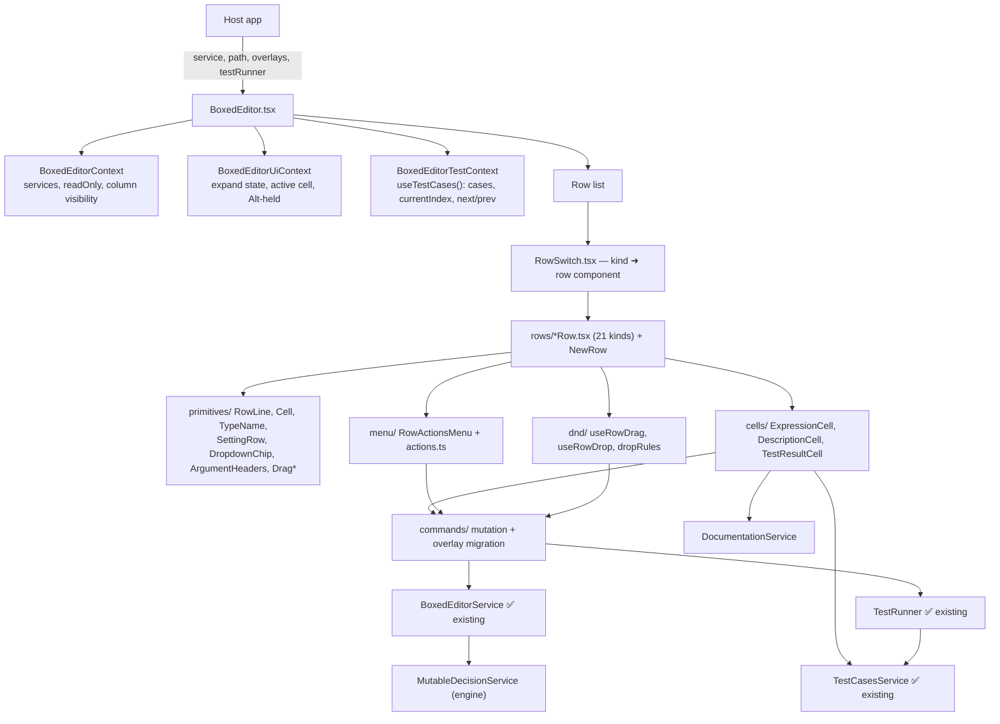
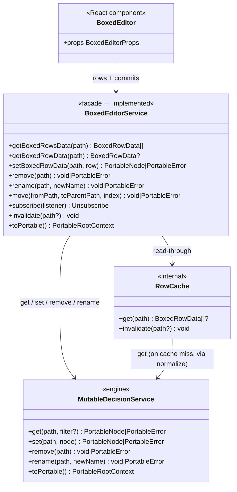
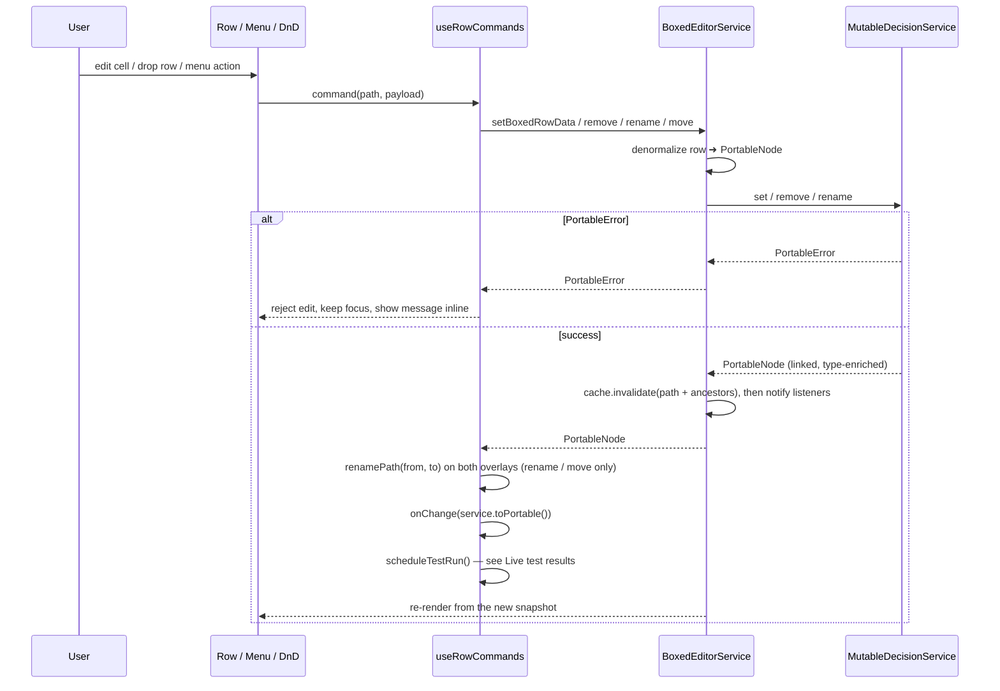
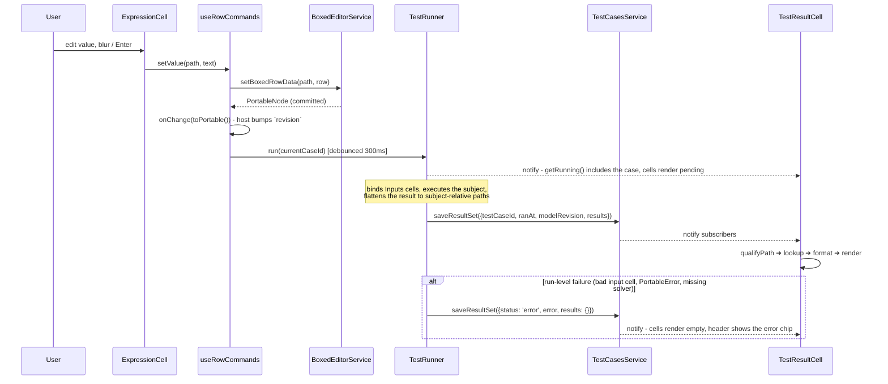
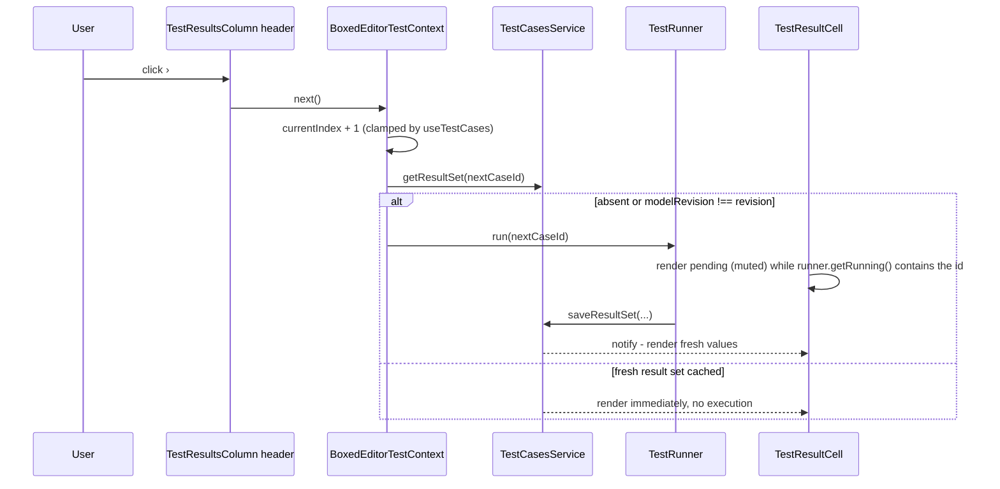

# Boxed Editor

This document is the authoritative specification **and** the implementation story for
[`src/components/boxed-editor`](../src/components/boxed-editor): a single flat treegrid GUI language, fully described
below.

Its **service layer is already built and tested** (previously `BOXED_EDITOR_SERVICE_STORY.md`, now folded into
[Using the existing `BoxedEditorService`](#using-the-existing-boxededitorservice)). This story is therefore the
**React UI story only**: rows, cells, primitives, menus, drag-and-drop, and the description / live test-result
columns.

### References

| What                          | Where                                                                                                                   |
| ----------------------------- | ----------------------------------------------------------------------------------------------------------------------- |
| GUI wireframe (authoritative) | `/Users/rimvydasbingelis/Projects/EdgeRules/edgerules-react-frames/src` — `App.tsx` (composition/occupancy), `boxed/actions.ts` (row kinds + menus), `boxed/*.tsx` (per-construct rendering), `hooks/useAltHeld.ts` (type reveal) |
| Reference screenshot          |                                                                               |
| Actions with icons            | `edgerules-react-frames/src/boxed/actions.ts`                                                                           |
| Test data contract            | [`specs/TESTS_MANAGER_SPEC.md`](specs/TESTS_MANAGER_SPEC.md) — owns `TestCasesService`, `TestRunner`, `TestCase`, `TestResultSet` |
| Descriptions overlay          | [`DOCUMENTATION_SERVICE_STORY.md`](DOCUMENTATION_SERVICE_STORY.md)                                                       |
| Engine CRUD / DSL             | `../edgerules-v2/doc/architecture/CRUD_SPEC.md`, `.../dsl/RULESET_METAPHOR_SPEC.md`, `.../dsl/OPTIMISATION_METAPHOR_SPEC.md`, `../edgerules-v2/doc/reference/RULESETS_REFERENCE.md`, `.../OPTIMISE_REFERENCE.md` |

## Implementation Status

| Layer                                                          | Location                                   | Status                                                                 |
| -------------------------------------------------------------- | ------------------------------------------ | ---------------------------------------------------------------------- |
| `BoxedEditorService` facade, normalize/denormalize, row cache   | `src/components/boxed-editor/service/`     | ✅ **Done** — real-engine tests in `boxed-editor/__tests__/`            |
| `BoxedRowData` / `BoxedTableRowData` / `SignatureParameter`     | `boxed-editor/boxed-editor-types.ts`       | ✅ **Done**                                                            |
| `TestCasesService`, `useTestCases`, `useTestResult`             | `src/components/test-cases-service/`       | ✅ **Done**                                                            |
| `TestRunner` (`createTestRunner`), `TestsManager`               | `src/components/tests-manager/`            | ✅ **Done** — `createTestRunner` / `qualifyPath` need exporting (Task 0) |
| `DocumentationService`                                          | `src/components/documentation-service/`     | ⬜ Not built — consumed here through its interface only                 |
| **`BoxedEditor` React UI** (rows, cells, menus, DnD, columns)   | `src/components/boxed-editor/`             | ⬜ **This story**                                                      |

**Do not re-implement anything marked ✅.** The service is the model's only surface; the UI is a pure renderer plus a
command layer over it.

## Introduction

`BoxedEditor` is the structured, visual authoring surface for EdgeRules models. The interaction model is influenced by
the boxed-expression and decision-modeling experiences of **Camunda** and **Trisotech**, and by the **Decision Model and
Notation (DMN)** standard. EdgeRules `BoxedEditor` does not strictly follow standard DMN boxed expression GUI
conventions and proposes much more convenient and compact layouts and ergonomics.

`BoxedEditor` renders a single flat treegrid of rows. Every row is one of these `BoxedRowKind`s (the complete list,
cross-checked against the wireframe's `RowKind` union in `boxed/actions.ts`):

| Kind                            | What it is                                                                                    |
| ------------------------------- | --------------------------------------------------------------------------------------------- |
| `model`                         | Model header: name; occupies the whole top row, fixed position                                |
| `field`                         | **The one generic leaf row** — class field, typed input, or plain expression (see below)       |
| `context`                       | Named nested object that can contain other rows                                               |
| `complexType`                   | Named, reusable type definition containing `field` rows                                        |
| `list`                          | Header of a homogeneous scalar list                                                           |
| `list-item`                     | One scalar item of a list                                                                     |
| `relation`                      | Header of a homogeneous complex-object collection; carries the column names                   |
| `relation-item`                 | One record of a relation, one cell per relation column                                        |
| `function`                      | A named callable (`func`); tall row, argument headers under the value column                  |
| `function-result`               | The synthesized `result` line of a function body                                              |
| `ruleset`                       | A named rule matrix (DMN-style decision table); tall row, condition/action column headers     |
| `rule`                          | One row of a ruleset's rule matrix                                                            |
| `ruleset-default`               | Singleton fallback-result row (shown when no rule matches)                                    |
| `ruleset-hit-policy`            | Fixed `hitPolicy` setting row                                                                 |
| `optimisation`                  | A named linear optimisation problem (`optimise`); tall row, argument headers                   |
| `optimisation-variable-group`   | Fixed `variables:` section header                                                             |
| `optimisation-variable`         | One decision variable (a Typed Input Wrapper)                                                 |
| `optimisation-objective`        | Fixed `maximise`/`minimise` row (exactly one, required)                                       |
| `optimisation-constraint-group` | Fixed `constraints:` section header                                                           |
| `optimisation-constraint`       | One named linear constraint                                                                   |
| `optimisation-setting`          | Fixed `using` / `bottlenecks` / `timeLimit` setting rows                                      |

### Row kind consolidation

A class field (`name: <string, required: true>` under a `complexType`), a typed input
(`applicationDate: <date, required: true>` under a `context`), and a plain computed expression
(`payment: monthly(application.amount)` at the model root) all render through the exact same `Row` component with the
exact same action list — only the parent container differs. `BoxedRowKind` therefore has a single `field` kind for all
of them, rather than a separate kind per parent context.

### Row Types

Full-height ("tall", 80px) rows carry their own argument/column headers in the `ValueColumn`: `function`, `ruleset`,
`optimisation`, `model`. Everything else is single-height (40px) and grows only in 40px steps if it needs to wrap.
Exact column occupancy (which rows span `NameColumn`+`ValueColumn` as one cell vs. keep them separate) is read
straight from `App.tsx`, the living reference for every row's layout.

| Row Type                      | Key                             | Actions                                                                                                                          | Short Description                                                                    |
| ----------------------------- | ------------------------------- | -------------------------------------------------------------------------------------------------------------------------------- | ------------------------------------------------------------------------------------ |
| Model Header                  | `model`                         | Add Field, Add Function, Add Optimisation, Add Decision Table, Add Relation, Add List, Model Settings, View as code              | Root row: model name; fixed position, not sortable, not deletable                    |
| Type Field                    | `field`                         | Convert to Context, Convert to Relation, Convert to List, Duplicate, Delete                                                      | Generic leaf: a class field, a typed input, or a computed expression                 |
| Context                       | `context`                       | Add Field, Add Function, Add Decision Table, Add Relation, Add List, Duplicate, Delete, Expand/Collapse                          | Named nested object                                                                  |
| Complex Type                  | `complexType`                   | Add Field, Duplicate, Delete, Expand/Collapse                                                                                    | Reusable named type definition                                                       |
| List                          | `list`                          | Duplicate, Delete                                                                                                                | Header of a homogeneous scalar list; items appended via the trailing placeholder row |
| List Item                     | `list-item`                     | Duplicate, Delete                                                                                                                | One scalar list element; Duplicate inserts a copy directly below it                  |
| Relation                      | `relation`                      | Add Column, Delete "‹column›" Column (per column), Delete                                                                        | Header of a homogeneous complex-object collection                                    |
| Relation Item                 | `relation-item`                 | Duplicate, Delete                                                                                                                | One record of a relation, one cell per column                                        |
| Function                      | `function`                      | Add Argument, Duplicate, Delete "‹arg›" Argument (per arg), Delete, Expand/Collapse, View as code                                | A named callable (`func`)                                                            |
| Function Result               | `function-result`               | Duplicate, Delete                                                                                                                | The synthesized `result` line of a function body; not draggable                      |
| Decision Table                | `ruleset`                       | Add Rule, Add Condition Column, Add Action Column, Delete "‹column›" Column (per column), Duplicate, Delete, Expand/Collapse, View as code | A named rule matrix (DMN-style decision table)                              |
| Rule                          | `rule`                          | Duplicate, Delete                                                                                                                | One row of a decision table's rule matrix                                            |
| Ruleset Default               | `ruleset-default`               | Delete                                                                                                                           | Singleton fallback row shown when no rule matches; not duplicable                    |
| Ruleset Hit Policy            | `ruleset-hit-policy`            | _(none — edited via its own picker chip)_                                                                                        | Fixed `hitPolicy` setting                                                            |
| Optimisation                  | `optimisation`                  | Add Argument, Delete "‹arg›" Argument (per arg), Duplicate, Delete, Expand/Collapse, View as code                                | A named linear optimisation problem (`optimise`)                                     |
| Optimisation Variable Group   | `optimisation-variable-group`   | Add Variable                                                                                                                     | Fixed `variables:` section header; not draggable                                     |
| Optimisation Variable         | `optimisation-variable`         | Duplicate, Delete                                                                                                                | One decision variable (a Typed Input Wrapper)                                        |
| Optimisation Objective        | `optimisation-objective`        | Switch to Minimise/Maximise                                                                                                      | Fixed `maximise`/`minimise` row; exactly one, required; not draggable                |
| Optimisation Constraint Group | `optimisation-constraint-group` | Add Constraint                                                                                                                   | Fixed `constraints:` section header; not draggable                                   |
| Optimisation Constraint       | `optimisation-constraint`       | Duplicate, Delete                                                                                                                | One named linear constraint                                                          |
| Optimisation Setting          | `optimisation-setting`          | _(none — edited via its own control)_                                                                                            | Fixed `using` / `bottlenecks` / `timeLimit` settings                                 |

**Common to every row:** Description column, Test-results column, Actions column (three-dot context menu, content per
row kind — see [Context Menu](#context-menu)).

**Not draggable / not sortable:** `model`, `function-result`, `ruleset-default`, `ruleset-hit-policy`,
`optimisation-variable-group`, `optimisation-objective`, `optimisation-constraint-group`, `optimisation-setting` — all
fixed, single-value or section-header settings rendered via the `SettingRow` primitive with a gear icon instead of a
drag handle (see `primitives.tsx`'s `SettingRow` doc comment in the wireframe).

**Drag handles:** the function icon, the ruleset icon, the optimisation icon, the type icon, and the 6-dot expression
handle each drag the row **and its children**.

### Ruleset and optimisation row composition

`ruleset` and `optimisation` are the two kinds whose children are a fixed shape rather than a freely-ordered
container. This is the structural reference for both — row order and which children are fixed vs. repeatable match it
exactly:

```mermaid
flowchart TD
    subgraph Ruleset["ruleset — tall row: parameters + condition/action column headers"]
        direction TB
        Rule1["rule (repeatable, sortable)"]
        Rule2["rule (repeatable, sortable)"]
        RuleNew["(new rule) placeholder"]
        Default["ruleset-default — absent when hitPolicy is collect-matches"]
        HitPolicy["ruleset-hit-policy — fixed, not draggable"]
    end

    subgraph Optimisation["optimisation — tall row: parameters"]
        direction TB
        Using["optimisation-setting: using — fixed"]
        Bottlenecks["optimisation-setting: bottlenecks — fixed"]
        VarGroup["optimisation-variable-group — fixed section header"]
        Var1["optimisation-variable (repeatable, sortable)"]
        Var2["optimisation-variable (repeatable, sortable)"]
        VarNew["(new variable) placeholder"]
        Objective["optimisation-objective — fixed, exactly one"]
        ConGroup["optimisation-constraint-group — fixed section header"]
        Con1["optimisation-constraint (repeatable, sortable)"]
        Con2["optimisation-constraint (repeatable, sortable)"]
        ConNew["(new constraint) placeholder"]
        TimeLimit["optimisation-setting: timeLimit — fixed"]
        VarGroup --> Var1 & Var2 & VarNew
        ConGroup --> Con1 & Con2 & ConNew
    end
```



- **Ruleset vs. the standalone Decision Table Editor:** `src/components/decision-table` already ships
  `DecisionTableEditor`. The inline `ruleset` rendering here is a **compact, fully-editable-in-place view**, not a
  preview — real add-rule / add-column / delete-column actions, matching how `relation`/`list` are edited in place.
  `onOpenNode({kind: 'ruleset'})` stays as an escape hatch for full-screen ergonomics (bulk column resize, keyboard
  cell navigation, large rule counts) — symmetric with `View as code` (Resolved Decision #13).
- **Optimisation has no standalone editor at all.** `BoxedEditor` is its only GUI, so the inline row tree above must
  be complete on its own.

## GUI Language

Strict spacing policy:

- The smallest `cell` is 40×40 px.
- A row grows vertically only in 40 px steps: 80, 120, 160…
- A cell grows horizontally only in 40 px steps: 80, 120, 160…
- All cell text is vertically centred; all cells align with each other — no mid-positioning or pixel offsets. The
  whole GUI can be sketched on a school maths workbook.

Columns:

| Column               | Purpose                                                                                                             |
| -------------------- | ------------------------------------------------------------------------------------------------------------------- |
| `NameColumn`         | Grid-based; leading cells are skipped to render context-tree depth                                                   |
| `ValueColumn`        | Expression value, function/ruleset/optimisation argument headers, list items, relation cells, rule cells             |
| `DescriptionColumn`  | Free-text description; may be empty                                                                                 |
| `TestResultsColumn`  | That row's computed value for the **selected** test case; header carries the case name, `1/N`, and previous/next     |
| `ActionsColumn`      | Vertical three-dot context-menu button, one `cell`                                                                   |

**Type disclosure.** Every type is a tooltip on its owning name/header cell (`NameColumn` for
`field`/`context`/`complexType`; argument/column headers for `function`/`ruleset`/`optimisation`/`relation`), revealed
two ways:

- **Hover** a name/header cell → its tooltip opens, showing that one type.
- **Hold Alt** anywhere on the page → every type tooltip in the tree opens at once, so the whole model's types can be
  scanned without hovering row by row. Releasing Alt (or the window losing focus) closes them all.

The wireframe implements this with a page-level `AltHeldContext` (`useAltHeldState` listens for `keydown`/`keyup` on
`"Alt"` and `blur`) read by every `TypeName`-wrapped cell alongside its own hover state — see `hooks/useAltHeld.ts`
and `boxed/primitives.tsx`'s `TypeName`.

## Component Composition



### Files to create

`service/`, `boxed-editor-types.ts`, and `index.ts` already exist — extend, don't recreate.

```
src/components/boxed-editor/
├─ index.ts                            — (exists) add BoxedEditor + props exports
├─ BoxedEditor.tsx                     — root: validates `path`, mounts providers, header row, root row list
├─ BoxedEditorProps.ts                 — BoxedEditorProps, BoxedEditorOpenTarget, BoxedEditorTargetKind (public)
├─ boxed-editor-types.ts               — (exists) service + row data types
├─ service/                            — (exists, done) createBoxedEditorService, normalize, denormalize,
│                                         rowCache, portable-utils
├─ context/
│  ├─ BoxedEditorContext.tsx           — services, readOnly, column visibility, revision
│  ├─ BoxedEditorUiContext.tsx         — per-row expand/collapse, active editing cell path, Alt-held
│  └─ BoxedEditorTestContext.tsx       — hoists useTestCases(testCasesService) once; selected case + next/prev
├─ hooks/
│  ├─ useBoxedEditorService.ts         — reads BoxedEditorContext
│  ├─ useBoxedRows.ts                  — useSyncExternalStore(service.subscribe, () => getBoxedRowsData(path))
│  ├─ useDescription.ts                — one path's description from DocumentationService
│  ├─ useRowTestResult.ts              — qualified ➜ subject-relative lookup + display formatting
│  ├─ useAltHeld.ts                    — global Alt-key listener feeding BoxedEditorUiContext
│  └─ useRowActions.ts                 — BoxedRowKind ➜ menu items ➜ dispatchable commands
├─ commands/
│  ├─ useRowCommands.ts                — every mutating action: service call, overlay renamePath, auto-run
│  └─ rowFactories.ts                  — default BoxedRowData for each Add… / Convert to… action
├─ rows/                               — one component per BoxedRowKind (21) + NewRow.tsx + RowSwitch.tsx
├─ cells/                              — ExpressionCell.tsx, DescriptionCell.tsx, TestResultCell.tsx
├─ primitives/                         — RowLine, Cell, TypeName, Drag, ColumnDragHandle, TallIconHandle,
│                                         SettingRow, DropdownChip, ArgumentHeaders
├─ menu/                               — actions.ts, RowActionsMenu.tsx, useRowMenu.ts
├─ dnd/                                — useRowDrag.ts, useRowDrop.ts, dropRules.ts
└─ __tests__/                          — (existing service tests stay) + BoxedEditor.test.tsx,
                                          row-kinds.test.tsx, alt-reveal.test.tsx, dnd.test.tsx,
                                          duplicate-rename.test.tsx, commands.test.tsx, test-results.test.tsx
```

## Component API

The package entry point is `edgerules-react/boxed-editor`.

```ts
interface BoxedEditorProps {
  // --- model ---
  service: BoxedEditorService;        // The mutable model authority (createBoxedEditorService(mutable)). Never a second persisted model.
  path: string;                       // The authored CRUD path to show. `"*"` for the whole model.
  revision?: string | number;         // Host-controlled invalidation token; on change the editor calls service.invalidate().
  readOnly?: boolean;                 // Disables name/value editing and ordering; navigation and visible handles remain.
  onChange?: (snapshot: PortableRootContext) => void;  // Once per successful committed mutation.
  onOpenNode?: (target: BoxedEditorOpenTarget) => void; // Routes specialized nodes to another host editor.

  // --- editing ---
  languageService?: CodeEditorService; // Diagnostics + completions for the one active expression cell.

  // --- overlays (host-constructed, passed in — same convention as TestsManager) ---
  documentationService?: DocumentationService; // DescriptionColumn. Empty + read-only when omitted.
  testCasesService?: TestCasesService;         // TestResultsColumn. Column hidden when omitted.
  testRunner?: TestRunner;                     // Recomputes the selected case after each commit. See Live test results.
  testSubjectId?: TestSubjectId;               // Subject whose results are shown; defaults to `'*'`.
  autoRunTests?: boolean;                      // Whether a commit / case switch re-runs automatically. Defaults to true.

  // --- chrome ---
  showHeader?: boolean;        // Model header row. Default true.
  showTestResults?: boolean;   // TestResultsColumn. Default true.
  showDescription?: boolean;   // DescriptionColumn. Default true.
  showType?: boolean;          // Type tooltip (hover + Alt-reveal). Default true.
  expanded?: boolean;          // Initial global expand state. Default true.
  className?: string;
  sx?: SxProps<Theme>;
}
```

```ts
type BoxedEditorTargetKind =
  | 'type-definition'
  | 'ruleset'
  | 'loop'
  | 'boxed-editor'
  | 'code-editor';

interface BoxedEditorOpenTarget {
  path: string;
  kind: BoxedEditorTargetKind;
}
```

**Notes:**

- `type-definition`, `ruleset`, `loop` route to their specialized host editors (Types / Decision Table / Loop).
  `boxed-editor` asks the host to open the target context in its own nested `BoxedEditor`. `code-editor` backs
  `View as code` — offered on `model`, `function`, `ruleset`, and `optimisation` rows (Resolved Decision #15); the
  target carries just the `path`, and resolving it into code text or a rendered editor is entirely the host's job.
  `ruleset` is the one target kind whose node is _also_ fully editable inline. `optimise` is edited exclusively
  inline and carries no `BoxedEditorTargetKind` entry.
- `expanded` sets the **initial** global expand state only. After first render each collapsible row keeps its own
  state, toggled by its own Expand/Collapse action. Changing `revision` does not reset per-row expand state.
- **Export surface.** `edgerules-react/boxed-editor` exports `BoxedEditor`, `BoxedEditorProps`,
  `BoxedEditorOpenTarget`, `BoxedEditorTargetKind`, plus the already-exported `createBoxedEditorService`,
  `BoxedEditorService`, `BoxedRowData`, `BoxedRowKind`, `BoxedTableRowData`, `SignatureParameter`.
  `DocumentationService`, `TestCasesService`, and `TestRunner` are **not** re-exported: a host imports them from
  `edgerules-react/documentation-service`, `edgerules-react/test-cases-service`, and `edgerules-react/tests-manager`
  and passes instances in as props, exactly as `TestsManager` does. Rows, cells, primitives, hooks, contexts, and
  normalization internals are not public API.

## Using the existing `BoxedEditorService`

Already implemented in `src/components/boxed-editor/service/` and covered by real-engine tests
(`__tests__/normalization.test.ts`, `mutation.test.ts`, `move.test.ts`). This section is the UI's contract with it.



### What the UI calls, and for what

| Method                                  | UI caller                                                                          |
| --------------------------------------- | ---------------------------------------------------------------------------------- |
| `getBoxedRowsData(path)`                | `useBoxedRows(path)` snapshot — the whole row tree under a container                |
| `getBoxedRowData(path)`                 | One row, e.g. the model header or a parent's table metadata                        |
| `setBoxedRowData(path, row)`            | Every value/name/cell/column/parameter/setting edit and every `Add…` / `Convert to…` |
| `remove(path)`                          | `Delete`, cleared-name special actions, `Delete "‹column›" Column`                 |
| `rename(path, newName)`                 | Name-cell commit on a named kind                                                    |
| `move(from, toParent, index)`           | A completed, `dropRules`-approved drop                                             |
| `subscribe(listener)`                   | `useSyncExternalStore` in `useBoxedRows`                                           |
| `invalidate(path?)`                     | The `revision` prop changing (edits made outside this editor)                      |
| `toPortable()`                          | The `onChange` payload                                                              |

### Contract the UI relies on (and must not duplicate)

| Guarantee                    | Detail                                                                                                                                                                                                                       |
| ---------------------------- | ---------------------------------------------------------------------------------------------------------------------------------------------------------------------------------------------------------------------------- |
| Normalization is done        | Sort order, relation-vs-list classification, metadata stripping, row-kind consolidation, and `function-result` synthesis all happen in `normalize.ts`. Render rows in the order returned — never re-sort in React.            |
| Cell text is opaque          | `value`/`conditions`/`actions`/`cells` are DSL text produced from Portable and sent back **verbatim**; the engine re-parses. The view never parses DSL.                                                                       |
| Writes are whole-node        | `setBoxedRowData` denormalizes the row **including its `children`** into one `PortableNode`. Container edits (add/remove/reorder a `list`/`relation`/`rule`/optimisation child) rewrite the whole parent — engine arrays are append-only and reject gaps. |
| Optimisation is whole-definition | `optimise` is a root-only whole-node CRUD surface. Optimisation child paths (`factoryProduction.variables.chairs`) are **row identities, not engine CRUD locations** — the facade merges a child edit into the owning declaration and writes it once. Address optimisation children by these paths anyway; the facade translates. |
| `move` is mechanical         | Insert-then-remove (a failed insert leaves the source untouched; a failed remove after a successful insert leaves a duplicate and returns the error verbatim — no rollback). `index` is fully meaningful only for array-shaped parents; for context-shaped parents the fixed group sort dominates. |
| DnD validity is the UI's job | `move` performs the splice only. Structural validity (`rule` → only its own `ruleset`, etc.) is `dnd/dropRules.ts`, built in this story, and must gate both the drag preview and the `move()` call so the two can never disagree. |
| Errors come back verbatim    | Mutations return the engine's `PortableError` and leave the cache untouched for that path, so the last-good row stays visible. Bad `path` reads return `undefined`/`[]`.                                                       |
| No rollback on link breakage | A structurally-successful write that breaks a reference elsewhere is not reversed (Resolved Decision #12); it surfaces later as a path-scoped error wherever that path is next read.                                          |
| Referential stability        | `getBoxedRowsData(path)` returns the same array identity while nothing under `path` changed, and the cache is cleared **before** `subscribe` listeners fire — safe for `useSyncExternalStore`.                                |
| Annotations are ignored      | `@node` / `@node-name` are neither read nor written by the facade (Resolved Decision #16). Do not build UI on them.                                                                                                            |
| Factory is not deduplicating | `createBoxedEditorService(mutable)` returns a fresh facade (fresh cache, fresh bus) per call. The host constructs **one** instance and passes it down; a second GUI over the same engine must be told to `invalidate()`.       |

### Edit ➜ persist ➜ refresh



## Context Menu

Which actions a row kind offers is in the [Row Types](#row-types) table. This defines what each does; a "per instance"
action (e.g. one Delete-column entry per column) appears once here and once per instance in the menu.

| Action                                      | Description                                                                                                                                                                                                                                                                                            |
| ------------------------------------------- | ------------------------------------------------------------------------------------------------------------------------------------------------------------------------------------------------------------------------------------------------------------------------------------------------------ |
| Delete                                      | Deletes the row. Hidden/disabled when `BoxedRowData.deletable` is `false`.                                                                                                                                                                                                                              |
| Duplicate                                   | Copies the row — and, for a container, all its children — and inserts the copy directly below. Auto-renames on a **named** kind (`field`, `context`, `complexType`, `function`, `ruleset`, `optimisation`, `optimisation-variable`, `optimisation-constraint`) to avoid colliding with the source; a **positional** kind (`list-item`, `relation-item`, `rule`) needs no rename, so Duplicate doubles as "insert a new one right after this one". |
| Model Settings                              | Form for model-level metadata (name, version, description).                                                                                                                                                                                                                                            |
| View as code                                | Emits `onOpenNode({path, kind: 'code-editor'})` for that knowledge element (`model`, `function`, `ruleset`, `optimisation`). Where the code text comes from is the host's concern.                                                                                                                       |
| Add Field                                   | Appends a `field` row to `model` / `context` / `complexType`.                                                                                                                                                                                                                                           |
| Add Function                                | Appends a `function` row to `model` / `context`.                                                                                                                                                                                                                                                        |
| Add Decision Table                          | Appends a `ruleset` row to `model` / `context`.                                                                                                                                                                                                                                                         |
| Add Optimisation                            | Appends an `optimisation` row. **`model` only** — `optimise` may only be declared at the model root; nested is a link-time error (`OPTIMISATION_METAPHOR_SPEC.md` §3).                                                                                                                                   |
| Add Relation / Add List                     | Appends a `relation` / `list` row to `model` / `context`.                                                                                                                                                                                                                                               |
| Add Item / Add Row                          | Appends a `list-item` to a `list` / a `relation-item` to a `relation`.                                                                                                                                                                                                                                  |
| Add Argument                                | Appends an argument to a `function`'s or `optimisation`'s signature.                                                                                                                                                                                                                                    |
| Delete "‹argument›" Argument (per argument)  | Removes that argument from a `function`'s or `optimisation`'s signature.                                                                                                                                                                                                                                |
| Add Rule                                    | Appends a `rule` row to a `ruleset`'s matrix.                                                                                                                                                                                                                                                           |
| Add Condition / Action Column               | Appends a condition / action column to a `ruleset`, extending every `rule` and `ruleset-default`.                                                                                                                                                                                                       |
| Add Column                                  | Appends a field/column to every record of a `relation`.                                                                                                                                                                                                                                                |
| Delete "‹column›" Column (per column)        | Removes that column from every row (a `relation`'s records, or a `ruleset`'s `rule`/`ruleset-default` rows).                                                                                                                                                                                            |
| Add Variable / Add Constraint               | Appends an `optimisation-variable` / `optimisation-constraint` to its group.                                                                                                                                                                                                                            |
| Convert to Context / Relation / List        | Converts a `field` into an empty `context` / `relation` / `list`.                                                                                                                                                                                                                                       |
| Switch to Minimise / Maximise               | Flips an `optimisation-objective`'s keyword, keeping the expression unchanged.                                                                                                                                                                                                                          |
| Expand / Collapse                           | Toggles children on `function`, `context`, `complexType`, `ruleset`, `optimisation` (a MUI expand/collapse icon marks state).                                                                                                                                                                           |

**Enablement rules:**

- Add-actions insert at the position implied by their name (a child at the end of the container, or a sibling directly
  below the selected row); the facade's sort order then applies on read-back.
- In `readOnly` every mutating action is hidden; only `Duplicate` and the view toggles remain — `Duplicate` is a copy,
  so it does not mutate the source.

## Special Actions

- Clearing an argument's name removes that argument from the `function`/`ruleset`/`optimisation` signature.
- Clearing an expression's name while its value is also empty removes the `field` from its context.

### Append placeholders

Every appendable container renders a trailing placeholder row; interacting with it appends without opening the menu:

| Container Kind                               | Placeholder Row Kind      | Label              |
| -------------------------------------------- | ------------------------- | ------------------ |
| `model` (root), `context`, `function` (body) | `field`                   | "(new item)"       |
| `complexType`                                | `field`                   | "(new field)"      |
| `list`                                       | `list-item`               | "(new item)"       |
| `relation`                                   | `relation-item`           | "(new row)"        |
| `ruleset`                                    | `rule`                    | "(new rule)"       |
| `optimisation-variable-group`                | `optimisation-variable`   | "(new variable)"   |
| `optimisation-constraint-group`              | `optimisation-constraint` | "(new constraint)" |

## Drag and Drop

Handles (function icon, ruleset icon, optimisation icon, type icon, 6-dot handle) each drag their whole row **and its
children**. A drop maps to `move(fromPath, toParentPath, index)`.

`dnd/dropRules.ts` is the single pure predicate shared by the drag preview and the `move()` call. Valid targets (a
drop outside these is rejected and the row snaps back):

| Dragged kind                                                                        | Allowed destination                                    |
| ----------------------------------------------------------------------------------- | ------------------------------------------------------ |
| Any sortable kind                                                                    | Reorder within its own parent — always allowed          |
| `field` (as a `complexType` child)                                                   | Only a `complexType`                                   |
| `field` (as a context child), `context`, `complexType`, `list`, `relation`, `function`, `ruleset` | Any `context` or the model root            |
| `optimisation`                                                                       | Model root only                                        |
| `list-item`                                                                          | Only a `list` with a matching element type             |
| `relation-item`                                                                      | Only a `relation` with matching columns                |
| `rule`                                                                               | Only its own `ruleset`, reorder only                   |
| `optimisation-variable` / `optimisation-constraint`                                  | Only its own optimisation's matching group             |
| `function-result`, `ruleset-default`, `ruleset-hit-policy`, `optimisation-variable-group`, `optimisation-objective`, `optimisation-constraint-group`, `optimisation-setting` | Not draggable |

After a drop the destination re-applies the facade's sort order on read-back, and the command layer calls
`renamePath(from, to)` on both overlay services for every path that changed.

## Normalization Rules

Implemented in `service/normalize.ts` / `denormalize.ts` — listed here as the contract, not as work to do.

### DSL ➜ BoxedEditor

1. Inline functions gain a synthesized `result` field.
2. Context elements are re-sorted: `complexType` → `function` → `ruleset` → `optimisation` → everything else
   (`context`/`list`/`relation`/`field`), each group in source order, with a function body's synthesized `result`
   sorted last within that function. This order is read off the wireframe's `App.tsx` composition (Applicant type →
   monthly/creditScore functions → risk ruleset → factoryProduction optimisation → application context → reviewStages
   list → relations → plain expressions).

### BoxedEditor ➜ DSL

1. Single-`result` functions collapse back to inline functions.
2. The same sort order is re-applied.

### Relation vs. list classification

| Dimension           | List                                    | Relation                                                                                                     |
| ------------------- | --------------------------------------- | ------------------------------------------------------------------------------------------------------------ |
| Item shape          | scalar                                  | complex object (context)                                                                                     |
| Header row kind     | `list`                                  | `relation`                                                                                                   |
| Item row kind       | `list-item`                             | `relation-item`                                                                                              |
| Header's `columns`  | n/a                                     | ordered union of every field seen across all records, first-authored-appearance order; metadata keys are never columns |
| Item's cell mapping | one `value` per item                    | one `cells[i]` per column, aligned to the header's `columns`                                                 |
| Heterogeneous items | n/a — one scalar type throughout        | a record missing a field renders an **empty cell**, never a nested field row                                 |

A computed, non-CRUD-addressable array (e.g. `for … return …`) is neither: it renders as a single `field` row showing
its result summary. Loops have no `BoxedRowKind` — loop text is opaque expression content.

### Metadata handling

Portable metadata (`@kind`, `@description`, `@node`, `@node-name`, `@model-name`, `@model-version`) is never rendered
as a child row. The `model` row presents applicable model metadata. `set` only preserves annotation keys present in
the same write (a confirmed engine behavior, see [`BUG_REPORTS.md`](BUG_REPORTS.md)) — which is why descriptions live
in an IndexedDB overlay, not in `@description` (Resolved Decision #10).

### Cell value mapping

| Portable node                                  | `kind`                          | Cell text                                                                                                      |
| ---------------------------------------------- | ------------------------------- | -------------------------------------------------------------------------------------------------------------- |
| expression / scalar                            | `field`                         | its authored DSL text (`amount / 12`)                                                                          |
| typed input (`@kind: "type"`)                  | `field`                         | a type constraint, e.g. `<number, required: true>`                                                              |
| invocation (`@kind: "invocation"`)             | `field`                         | the call text, e.g. `monthly(application.amount)`                                                               |
| computed array / loop                          | `field`                         | the raw loop text; never expands into item rows                                                                 |
| list item                                      | `list-item` (`value`)           | the item's DSL literal (`'Underwriting'`)                                                                       |
| relation cell                                  | `relation-item` (in `cells`)    | the field's DSL literal, per column                                                                             |
| ruleset condition cell (`when`, cell-map form) | `rule` (in `conditions`)        | the unary test literal, e.g. `18..25`, `< 30000`; **empty = "any"** (the key is omitted on write, not written as `''`) |
| ruleset condition, boolean-expression form     | `rule` (`conditionsExpression`) | one spanning cell holding the whole `when` expression, e.g. `age >= 18 and income < 30000`                       |
| ruleset action cell (`then`)                   | `rule` (in `actions`)           | the output field's DSL literal, e.g. `"high"`, `1000`                                                           |
| ruleset rule priority                          | `rule` (`priority`)             | an integer, editable only under `hitPolicy: "best-match"`                                                       |
| ruleset default cell                           | `ruleset-default` (`actions`)   | the fallback output's DSL literal; the row is absent when `hitPolicy` is `"collect-matches"`                     |
| ruleset `hitPolicy`                            | `ruleset-hit-policy`            | `"first-match"` \| `"unique-match"` \| `"collect-matches"` \| `"best-match"`                                     |
| optimise decision variable                     | `optimisation-variable`         | a Typed Input Wrapper, e.g. `<number, integer: true, min: 0>`                                                    |
| optimise objective                             | `optimisation-objective`        | the linear expression, e.g. `15 * chairs + 40 * tables`                                                         |
| optimise constraint                            | `optimisation-constraint`       | the named linear comparison, e.g. `1 * chairs + 3 * tables <= workers`                                          |
| optimise `using` / `bottlenecks` / `timeLimit` | `optimisation-setting`          | the literal enum/boolean/number, e.g. `"highs"`, `true`, `1000`                                                  |

A `relation-item` cell whose value is itself a complex object is a drill-down: it renders nested rows, not JSON text.
An invocation is a single, non-expandable expression cell — editing the call edits its `value` text.

### Path conventions

Paths are the engine's CRUD paths — do not invent UI-only paths. `"*"` is the model root; context fields use dot
paths (`application.amount`); collection items use indexes (`applicants[0]`); function/ruleset/optimisation bodies are
addressed through their authored field path (`monthly.result`, `risk.rules[2].then.limit`,
`factoryProduction.variables.chairs`). Authoritative syntax and filters:
`../edgerules-v2/doc/architecture/CRUD_SPEC.md`.

## Service composition

Three independent, path-keyed sources. Only the first derives from the authored model; the other two are volatile
authoring overlays in IndexedDB (outside the DSL). Keeping them apart is what stops a description edit or a test-case
switch from invalidating the structural row tree.

| Source                 | Owns                                        | Keyed by                                       | Storage                          | Feeds               |
| ---------------------- | ------------------------------------------- | ---------------------------------------------- | -------------------------------- | ------------------- |
| `BoxedEditorService`   | Portable-derived structure (`BoxedRowData`) | fully qualified `path`                          | the authored model (via engine)  | Name / Value cols   |
| `DocumentationService` | free-text descriptions                      | fully qualified `path`                          | IndexedDB (model name + path)    | DescriptionColumn   |
| `TestCasesService`     | test cases, cells, and result sets           | **subject-relative** path (`qualifyPath` bridges) | IndexedDB (model + subject)      | TestResultsColumn   |

`BoxedEditorService` does **not** fold descriptions or test results into rows — those overlays are read directly by
their column cells, so a `BoxedRowData` stays a pure projection of the Portable model.

## Overlay APIs

Both overlays are **owned elsewhere**; `BoxedEditor` only consumes them and declares no local copy of either contract.

### `DocumentationService` API

Defined by [`DOCUMENTATION_SERVICE_STORY.md`](DOCUMENTATION_SERVICE_STORY.md) (package
`edgerules-react/documentation-service`, not yet built). The methods `BoxedEditor` uses:

```typescript
getDescription(path: string): string | undefined;      // DescriptionColumn value, or undefined when unset
setDescription(path: string, description: string): void; // Commit an edit; empty string clears
renamePath(from: string, to: string): void;             // Called after a successful rename/move
subscribe(listener: () => void): Unsubscribe;           // Backs useDescription's useSyncExternalStore
```

When no `documentationService` is provided the `DescriptionColumn` renders empty and read-only.

### `TestCasesService` API

Defined and implemented by [`specs/TESTS_MANAGER_SPEC.md`](specs/TESTS_MANAGER_SPEC.md) (package
`edgerules-react/test-cases-service`), together with `TestCase`, `TestResultSet`, `TestResult`, `useTestCases`, and
`useTestResult`. From `BoxedEditor`'s point of view it is a **read-only reader plus a run target**: `TestRunner`
writes results, `BoxedEditor` reads them and asks for a re-run — it never imports the engine or `TestsManager`.

| Used for                                      | Call                                                       |
| --------------------------------------------- | ---------------------------------------------------------- |
| Header case list, `i/N`, previous/next         | `useTestCases(testCasesService)`                            |
| One row's value for the selected case          | `useTestResult(service, testCaseId, qualifyPath(subjectId, path))` |
| Freshness check before a navigation-driven run | `getResultSet(testCaseId)` → compare `modelRevision`        |
| Path migration after a rename/move             | `renamePath(from, to)`                                      |

`TestResultSet.results` is keyed by **subject-relative** path — see [Result formatting](#result-formatting) and
Resolved Decision #17.

## Live test results

`TESTS_MANAGER_SPEC.md` is implemented, so `BoxedEditor` gets **live** results rather than whatever a host happened to
have run: after every committed model change the selected test case is re-run immediately, and paging through cases
runs whichever case the user lands on if its results are missing or stale.

`BoxedEditor` still never imports the engine. The host constructs `TestRunner`
(`createTestRunner(mutable, testCasesService, subject, { modelRevision })`) and passes it in; `BoxedEditor` only calls
`run(testCaseId)` and reads results back through `TestCasesService`.

### Column layout

| Part          | Content                                                                                                                     |
| ------------- | --------------------------------------------------------------------------------------------------------------------------- |
| Header        | selected case name · `i/N` counter · `‹` previous / `›` next buttons · running spinner · run-level error chip                |
| Per-row cell  | that row's value for the selected case, formatted per [Result formatting](#result-formatting)                                |

### Triggers

| Trigger                                        | Action                                                                            |
| ---------------------------------------------- | --------------------------------------------------------------------------------- |
| Successful commit (`set`/`remove`/`rename`/`move`) | `run(currentCaseId)` — coalesced, trailing 300 ms debounce                     |
| `‹` / `›` / case selection change               | `run(newCaseId)` **only if** its result set is absent or stale                    |
| Mount, and `revision` change                    | Same freshness check for the selected case                                        |
| Description edit, expand/collapse, Alt-reveal, hover | Nothing — overlays and UI state never trigger execution                      |
| `autoRunTests: false`, or no `testRunner` / no cases | Nothing runs; cells render whatever is already persisted                     |

A result set is **stale** when its `modelRevision` differs from the revision in force. Only the selected case is
re-run on a commit; the others go stale and are refreshed lazily when navigated to — which is exactly what makes
previous/next a run trigger. Overlapping runs are safe: `TestRunner` generation-guards each case and discards an older
run's result on arrival.

Because a debounced auto-run fires after the model already changed, keep the runner's `modelRevision` current: the
host memoizes `createTestRunner(...)` on `[mutable, testCasesService, subject, revision]` (exactly as `TestsManager`
does) and bumps `revision` from `onChange`. Without that, results are never marked stale and navigation stops
re-running.

### Commit ➜ re-run ➜ display



### Previous / next navigation



### Result formatting

`TestResult.value` is `unknown` — the engine's real JS value, not a pre-formatted string (Resolved Decision #5).
`BoxedEditor` owns all display formatting:

| Value                          | Rendered as                                    |
| ------------------------------ | ---------------------------------------------- |
| number / boolean               | locale-formatted                               |
| string                         | as-is, truncated with a tooltip past one cell  |
| date / duration / special      | the engine's string form                       |
| array                          | `N items`                                      |
| nested object                  | `{…}`, full value in the tooltip                |
| `status: 'error'` for the path | the message, muted                             |
| no result / not yet run        | empty cell                                     |
| stale result set               | last known value, muted and italic             |
| run in flight                  | muted placeholder while `getRunning()` has the case |

`TestResultSet.results` is keyed by **subject-relative** path while rows carry fully qualified paths, so a cell derives
its key with `qualifyPath(subjectId, path)` before reading — see Task 0 (Resolved Decision #17).

## React integration

**Single source of truth — do not duplicate the model in React state.** The authored model lives behind
`MutableDecisionService`; `BoxedEditorService` is a stateless-derivation facade over it. React stores **no copy of the
row tree**: rows are derived on demand, cached inside the facade, and bound with `useSyncExternalStore`.

| State                                                     | Owner                                                   | Lifetime            |
| --------------------------------------------------------- | ------------------------------------------------------- | ------------------- |
| Model structure (rows)                                    | `MutableDecisionService`, via the facade's cache         | persisted           |
| Descriptions / test cases / results                       | `DocumentationService` / `TestCasesService` (IndexedDB)  | persisted (overlay) |
| Selected test-case index, running set                     | `useTestCases` / `TestRunner`, hoisted into `BoxedEditorTestContext` | ephemeral |
| Per-row expand, active editing cell path, Alt-held        | `BoxedEditorUiContext`                                   | ephemeral           |

Hooks (internal contract; only `BoxedEditor` is exported):

| Hook                        | Reads                                                                            |
| --------------------------- | -------------------------------------------------------------------------------- |
| `useBoxedEditorService()`   | the facade from `BoxedEditorContext`                                              |
| `useBoxedRows(path)`        | `useSyncExternalStore(service.subscribe, () => service.getBoxedRowsData(path))`   |
| `useDescription(path)`      | `DocumentationService` for one path                                              |
| `useRowTestResult(path)`    | the package's `useTestResult(testCasesService, currentCaseId, qualifyPath(...))`  |
| `useAltHeld()`              | whether Alt is held, from `BoxedEditorUiContext`                                  |
| `useRowActions(row)`        | the row kind's menu items as dispatchable commands                               |
| `useRowCommands()`          | mutations + overlay `renamePath` + debounced auto-run                            |

**Reactivity requirements:**

- `getBoxedRowsData(path)` is referentially stable while nothing under `path` changed (already guaranteed by the
  facade) — a committed mutation produces a new reference only for the affected subtree.
- External edits are signalled by changing `revision`; the provider calls `service.invalidate()` on change.
- Descriptions, test cases, and results are separate stores, so editing a description or pressing previous/next
  re-renders only the affected `DescriptionColumn` / `TestResultsColumn` cells — never the box rows.

## Expression editing & language service

- **One active editor invariant.** At most one cell across the whole tree mounts the CodeMirror `CodeEditorCell` at a
  time; every other cell renders static text. `languageService` feeds diagnostics and completions to that single
  active cell only. The active cell path is UI state in `BoxedEditorUiContext`.
- **Model-scoped analysis (embedding).** A cell holds one expression but must be analyzed in the scope of the
  surrounding model so completions resolve sibling fields and types. The active cell wraps its text in a synthetic DSL
  prefix/suffix built from the current model, calls the language service on the whole document, and maps positions
  back into the cell. The existing `embedService` / `CodeEditorEmbedContext` (`code-editor/language/service`) already
  implements this and is reused; the synthetic wrapper is never persisted.

## Error handling

| Scope           | Trigger                                                                         | Behavior                                                                                   |
| --------------- | ------------------------------------------------------------------------------- | ------------------------------------------------------------------------------------------ |
| **Fatal**       | the `path` prop or its schema fails to load (bad `path`, corrupt model)          | the treegrid is replaced by an alert; nothing is editable                                   |
| **Path-scoped** | `set`/`rename`/`remove`/`move` returns a `PortableError`, or a cell fails to parse/link | the edit is rejected, the cell keeps focus and shows the message inline; the rest of the tree stays interactive |
| **Deferred**    | a write succeeds structurally but breaks a reference elsewhere                    | not rolled back (Resolved Decision #12); surfaces later as a path-scoped error on whichever row is next read/evaluated |
| **Run-level**   | `TestRunner` records `status: 'error'` (unparseable input, `PortableError`, missing solver) | the TestResultsColumn header shows the message; that case's cells render empty       |

## Verification

Per `CLAUDE.md`: RTL tests + a Storybook story per component, and tests run against the **real** engine — never a
mock. Only environment is substituted: `fake-indexeddb` for `indexedDB`, and a `registerSolver` stub for the LP solver
EdgeRules does not ship.

| Test file                    | Covers                                                                                                     |
| ---------------------------- | ---------------------------------------------------------------------------------------------------------- |
| `BoxedEditor.test.tsx`       | rendering at root and focused paths, fatal vs. path-scoped errors, `readOnly`, column visibility props      |
| `row-kinds.test.tsx`         | one case per `BoxedRowKind`, including the full `ruleset` and `optimisation` families                       |
| `commands.test.tsx`          | every menu action, placeholders, special actions, auto-rename on Duplicate, one `onChange` per commit       |
| `alt-reveal.test.tsx`        | hover vs. Alt-held type tooltip behavior                                                                    |
| `dnd.test.tsx`              | `dropRules` matrix, reorder + reparent, non-draggable kinds, overlay `renamePath` migration                 |
| `test-results.test.tsx`      | auto-run after commit (debounced/coalesced), previous/next re-run only when absent or stale, pending and stale rendering, run-level error, subject-relative `qualifyPath` lookup, formatting table |
| existing service `__tests__` | unchanged — normalization, mutation, move                                                                   |

If a mutation or normalization exposes a WASM/DSL bug, append a reproducible entry to
[`BUG_REPORTS.md`](BUG_REPORTS.md) rather than compensating in React.

### Storybook stories

1. Full model (every row kind) with a `DocumentationService` overlay.
2. `TestCasesService` + `TestRunner` wired: live re-run on edit, previous/next navigation, stale and error states.
3. A `ruleset`-bearing model: inline rule CRUD, `ruleset-hit-policy`, `ruleset-default`.
4. An `optimisation`-bearing model: inline variable/objective/constraint CRUD, `optimisation-setting`,
   `optimisation-variable-group`.
5. A `func`-bearing model: inline and multi-statement function bodies, a no-argument function, nested functions.

## Out of Scope

- `BoxedEditorService`, `normalize`/`denormalize`, `rowCache` — **already implemented**; touch only if a UI need
  exposes a real gap, and record the change here.
- `DocumentationService`'s own implementation — [`DOCUMENTATION_SERVICE_STORY.md`](DOCUMENTATION_SERVICE_STORY.md).
- `TestCasesService`, `TestRunner`, `TestsManager` — [`specs/TESTS_MANAGER_SPEC.md`](specs/TESTS_MANAGER_SPEC.md).
- Flow Editor, Types Editor, Loop Editor — reached only via `onOpenNode`.
- Paging / virtualization for large bodies (Resolved Decision #11 → [Follow-up Stories](#follow-up-stories)).
- Repo-wide `ARCHITECTURE.md` (none exists in this checkout).

## Tasks

**Phase 0: Prerequisites**

- [ ] Ensure project compiles and existing tests are passing
- [ ] Export `createTestRunner` from `src/components/tests-manager/index.ts` so a host can construct the runner
      `BoxedEditor` needs
- [ ] Move `qualifyPath` into `src/components/test-cases-service/` (it owns subject-relative paths), re-export it from
      `tests-manager` for compatibility, and update `specs/TESTS_MANAGER_SPEC.md` Open Question #1 as resolved
      (Resolved Decision #17)
- [ ] Add `BoxedEditorProps.ts` with the [Component API](#component-api) props and the `BoxedEditorOpenTarget` /
      `BoxedEditorTargetKind` types; export them from `boxed-editor/index.ts`
- [ ] Mark all checkboxes as done in this document once verified

**Phase 1: Grid chrome, contexts, and the simple row kinds**

- [ ] Ensure project compiles and existing tests are passing
- [ ] Add `primitives/`: `RowLine`, `Cell`, `TypeName`, `Drag`, `ColumnDragHandle`, `TallIconHandle`, `SettingRow`,
      `DropdownChip`, `ArgumentHeaders` — ported ~1:1 from the wireframe's `primitives.tsx`, honouring the 40 px grid
- [ ] Add `context/BoxedEditorContext.tsx` (services, `readOnly`, column visibility, `revision` → `invalidate()`) and
      `context/BoxedEditorUiContext.tsx` (expand state, active cell path, Alt-held)
- [ ] Add `hooks/useBoxedEditorService.ts`, `hooks/useBoxedRows.ts`, `hooks/useAltHeld.ts`
- [ ] Add `rows/RowSwitch.tsx` plus `ModelHeaderRow`, `FieldRow`, `ContextRow`, `ComplexTypeRow`
- [ ] Add `BoxedEditor.tsx`: `path` validation (fatal alert on failure), providers, optional header row, root row list
- [ ] Add `__tests__/BoxedEditor.test.tsx` and `__tests__/alt-reveal.test.tsx` against a real
      `MutableDecisionService` from `@edgerules/node`
- [ ] Mark all checkboxes as done in this document once verified

**Phase 2: Expression cell and the language service**

- [ ] Ensure project compiles and existing tests are passing
- [ ] Add `cells/ExpressionCell.tsx`: static text ⇄ `CodeEditorCell` swap, enforcing the one-active-editor invariant
- [ ] Reuse `embedService` / `CodeEditorEmbedContext` for model-scoped completions; never persist the synthetic wrapper
- [ ] Add `commands/useRowCommands.ts` + `commands/rowFactories.ts`: mutation dispatch, `PortableError` → inline
      path-scoped error, `onChange` once per successful commit
- [ ] Add `__tests__/commands.test.tsx` for value/name commits, rejection handling, and `onChange` count
- [ ] Mark all checkboxes as done in this document once verified

**Phase 3: Collections — `list` and `relation`**

- [ ] Ensure project compiles and existing tests are passing
- [ ] Add `rows/ListRow`, `ListItemRow`, `RelationRow` (own column-header sub-grid), `RelationItemRow` (nested
      drill-down when a cell value is a complex object)
- [ ] Add `rows/NewRow.tsx` and wire the [Append placeholders](#append-placeholders) table
- [ ] Add Add/Delete Column handling for `relation` (whole-parent rewrite via `setBoxedRowData`)
- [ ] Extend `__tests__/row-kinds.test.tsx` with list/relation cases, including a heterogeneous relation
- [ ] Mark all checkboxes as done in this document once verified

**Phase 4: `function`, `ruleset`, `optimisation` families**

- [ ] Ensure project compiles and existing tests are passing
- [ ] Add `FunctionRow` + `FunctionResultRow` with `ArgumentHeaders`; Add/Delete Argument
- [ ] Add `RulesetRow` (parameters + condition/action header groups), `RuleRow` (cell-map **and**
      `conditionsExpression` forms, `priority` under `best-match` only), `RulesetDefaultRow`, `RulesetHitPolicyRow`
      (`DropdownChip`)
- [ ] Add `OptimisationRow`, `OptimisationSettingRow`, `OptimisationVariableGroupRow`, `OptimisationVariableRow`,
      `OptimisationObjectiveRow`, `OptimisationConstraintGroupRow`, `OptimisationConstraintRow`, honouring the
      [row composition](#ruleset-and-optimisation-row-composition) order and non-draggable set
- [ ] Extend `__tests__/row-kinds.test.tsx` to cover every remaining kind
- [ ] Mark all checkboxes as done in this document once verified

**Phase 5: Context menus and actions**

- [ ] Ensure project compiles and existing tests are passing
- [ ] Add `menu/actions.ts`, `menu/RowActionsMenu.tsx`, `menu/useRowMenu.ts`, `hooks/useRowActions.ts` — the per-kind
      action lists from [Row Types](#row-types), with icons from the wireframe's `actions.ts`
- [ ] Implement every [Context Menu](#context-menu) action, including `Duplicate` auto-rename for named kinds,
      `Convert to …`, `Switch to Minimise/Maximise`, Expand/Collapse, `Model Settings`, and `View as code`
- [ ] Implement the [Special Actions](#special-actions) (cleared argument name, cleared empty field) and the
      `readOnly` enablement rules
- [ ] Add `__tests__/duplicate-rename.test.tsx`; extend `commands.test.tsx` to every action
- [ ] Mark all checkboxes as done in this document once verified

**Phase 6: Drag and drop**

- [ ] Ensure project compiles and existing tests are passing
- [ ] Add `dnd/dropRules.ts` as a pure predicate over the [Drag and Drop](#drag-and-drop) matrix
- [ ] Add `dnd/useRowDrag.ts` / `dnd/useRowDrop.ts`; handles stay visible but drag is suppressed under `readOnly`
      (Resolved Decision #4); the same `dropRules` gates both preview and the `move()` call
- [ ] Call `renamePath(from, to)` on `DocumentationService` and `TestCasesService` after every successful
      `rename`/`move`
- [ ] Add `__tests__/dnd.test.tsx`: reorder, reparent, rejected drops, non-draggable kinds, overlay migration
- [ ] Mark all checkboxes as done in this document once verified

**Phase 7: Description and live test-result columns**

- [ ] Ensure project compiles and existing tests are passing
- [ ] Add `cells/DescriptionCell.tsx` + `hooks/useDescription.ts`; empty and read-only when no `documentationService`
- [ ] Add `context/BoxedEditorTestContext.tsx` hoisting `useTestCases(testCasesService)` once, exposing the selected
      case, `next`/`prev`, and the runner's `getRunning()` snapshot
- [ ] Add the `TestResultsColumn` header: case name, `i/N`, previous/next, running spinner, run-level error chip
- [ ] Add `cells/TestResultCell.tsx` + `hooks/useRowTestResult.ts`: `qualifyPath` lookup and the
      [Result formatting](#result-formatting) table
- [ ] Implement the [Triggers](#triggers) table: debounced `run(currentCaseId)` after every successful commit, and a
      freshness-checked run on mount / `revision` change / case selection change
- [ ] Add `__tests__/test-results.test.tsx` (real engine + `fake-indexeddb` + solver stub) covering every trigger,
      staleness, pending, and run-level error rendering
- [ ] Mark all checkboxes as done in this document once verified

**Phase 8: Quality gate**

- [ ] Ensure project compiles and existing tests are passing
- [ ] Add the five [Storybook stories](#storybook-stories)
- [ ] Resolve or record architect decisions for the remaining [Open Questions](#open-questions)
- [ ] Update `docs/BUG_REPORTS.md` with any engine gaps found during Phases 1–7
- [ ] Update `README.md`'s component list and this document's checkboxes
- [ ] Perform linting and formatting (`npm run format`, `npm run typecheck`)
- [ ] Review the implementation against this document and the wireframe
- [ ] Mark all checkboxes as done in this document once verified

## Resolved Decisions

| #   | Decision                                         | Resolution                                                                                                                                                                                                                                                                                                              |
| --- | ------------------------------------------------ | ------------------------------------------------------------------------------------------------------------------------------------------------------------------------------------------------------------------------------------------------------------------------------------------------------------------------ |
| 1   | Enrichment-service wiring                        | Descriptions and test results are separate path-keyed overlays consumed via hooks, never folded into the facade or into `BoxedRowData`. Instances are passed as props (`documentationService`, `testCasesService`), matching `TestsManager`.                                                                              |
| 2   | `BoxedEditorService` layering                    | The facade is **constructed with** a `MutableDecisionService` (`createBoxedEditorService(mutable)`) and delegates internally. The component only ever sees `BoxedEditorService`. **Implemented.**                                                                                                                         |
| 3   | `BoxedRowData` flat vs. union                    | Keep the flat optional-field interface (`BoxedTableRowData` for tabular kinds); renderers read only the fields their `kind` uses. **Implemented.**                                                                                                                                                                       |
| 4   | `readOnly` and drag handles                      | Handles stay **visible** (the icons are the handles, the 6-dot handle is a grouping cue) but drag is **suppressed**: no drag cursor, `dragstart` blocked. Neither hidden nor greyed.                                                                                                                                     |
| 5   | Result / value formatting                        | Services supply raw engine values (`TestResult.value: unknown`); `BoxedEditor` owns all display formatting — see [Result formatting](#result-formatting).                                                                                                                                                                |
| 6   | React binding model                              | `useSyncExternalStore` + facade cache (rows re-derive lazily; only changed subtrees get new references) over an immutable-snapshot reducer. **Cache implemented.**                                                                                                                                                       |
| 7   | Overlay migration on move                        | Both overlays expose `renamePath(from, to)`; the editor command layer calls it after a successful `rename`/`move`. The facade stays overlay-agnostic.                                                                                                                                                                     |
| 8   | Copy/Paste vs. Duplicate                         | One-click `Duplicate` only, no clipboard pair (the wireframe's `rowActionRegistry` has no copy/paste ids). Named rows auto-rename on Duplicate.                                                                                                                                                                          |
| 9   | Type disclosure                                  | Types render as tooltips on their owning name/header cell, opened on hover or — for the whole tree at once — while **Alt** is held; `showType` gates the interaction.                                                                                                                                                     |
| 10  | Descriptions storage                             | Descriptions stay an IndexedDB overlay via `DocumentationService`; `@description` metadata is left untouched. Folding them into Portable export/import is out of scope.                                                                                                                                                   |
| 11  | Large-collection strategy                        | Eager load for `getBoxedRowsData` — no paging/virtualization this iteration; tracked as a [follow-up story](#follow-up-stories).                                                                                                                                                                                          |
| 12  | Linked-validation failures                       | No rollback. Per `CRUD_SPEC.md`, `set`/`rename`/`remove` succeed even when they break a reference elsewhere; the facade does not re-validate or reverse. The broken reference surfaces as an ordinary path-scoped error wherever that path is next read. Rollback-on-write was rejected: it would make renaming a referenced field impossible, since the reference update always lands in a later commit. |
| 13  | Ruleset inline editing vs. `DecisionTableEditor` | Both coexist: full inline decision-table CRUD here, and the standalone editor reachable via `onOpenNode({kind: 'ruleset'})`. The division of responsibility may be revisited later.                                                                                                                                      |
| 14  | Expand/Collapse                                  | A context-menu toggle (MUI expand/collapse icon) on `function`, `context`, `complexType`, `ruleset`, `optimisation`.                                                                                                                                                                                                     |
| 15  | `View as code`                                   | A per-knowledge-element context-menu action on `model`, `function`, `ruleset`, `optimisation`, emitting `onOpenNode({kind: 'code-editor'})`. Where the code text comes from is the host's concern. (Architect decision, replacing Open Question "Where does View as code live?".)                                        |
| 16  | `@node` / `@node-name` annotations               | Ignored by `BoxedEditorService` — neither read nor written. A future Flow Editor gets its own normalized view over the same `MutableDecisionService`; `BoxedEditor` builds no UI on annotations. (Was the service story's Open Question #1.)                                                                              |
| 17  | `qualifyPath` ownership                          | Moves into `edgerules-react/test-cases-service` (which owns subject-relative paths) and is re-exported from `tests-manager`. Resolves `specs/TESTS_MANAGER_SPEC.md` Open Question #1, needed now that `TestResultsColumn` is being built.                                                                                |
| 18  | Non-deduplicating facade factory                 | `createBoxedEditorService(mutable)` returns a fresh facade per call — no identity-keyed memoization. A host wanting two editors to share one cache/subscribe bus constructs the facade once and passes it down; a second GUI editing the same engine calls `invalidate()`. Revisit when the Flow Editor exists. (Was the service story's Open Question #2.) |
| 19  | Who triggers test execution                      | `BoxedEditor` triggers runs but never executes: the **host** constructs `TestRunner` and passes it in, and `BoxedEditor` calls `run(testCaseId)` per the [Triggers](#triggers) table. This keeps the component free of any engine dependency while still showing live results, and reuses `TestRunner`'s generation guard for overlapping runs. (Supersedes the earlier "recomputation is entirely the host's responsibility" stance, now that `TESTS_MANAGER_SPEC.md` is implemented.) |
| 20  | `ruleset` gets `Duplicate`; `optimisation` gets argument actions | `Duplicate` is offered on `ruleset` with the same auto-rename rule as every other named kind, and `optimisation` gets `Add Argument` / `Delete "‹argument›" Argument` matching `function`. (Architect decisions on the previous Open Questions #2 and #3.) |

## Follow-up Stories

- [ ] Paging / virtualization for large `list` / `relation` / `ruleset` bodies (`getBoxedRowsData(path, {offset,
      limit})` plus virtualized `RelationItemRow` / `RuleRow`) — Resolved Decision #11.
- [ ] Flow Editor cache coherence: if a ReactFlow editor gets its own facade over the same `MutableDecisionService`,
      decide whether `createBoxedEditorService` should deduplicate by engine identity — Resolved Decision #18.

## Open Questions

1. **Debounce window for auto-run.** [Triggers](#triggers) specifies a trailing 300 ms debounce on commit-driven runs,
   chosen so a burst of cell edits or a drag produces one execution rather than several. Whether 300 ms is right for
   large models — or whether it should be a prop (`autoRunDelayMs`) — is unverified until a real model is measured.
   Option 1: keep 300 ms fixed and internal.
   Option 2: expose it as a prop with a 300 ms default.

2. **Non-selected cases after a model change.** Only the selected case is re-run on commit; the rest go stale until
   navigated to. For a small case count, running them all (`runner.runAll()`) would keep every column fresh at the
   cost of N executions per edit.
   Option 1: current design — selected case only, others refreshed lazily on navigation.
   Option 2: `runAll()` on commit when the case count is below a threshold.
