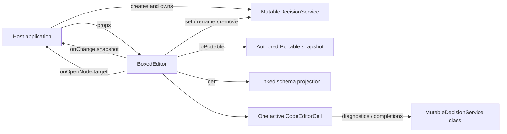
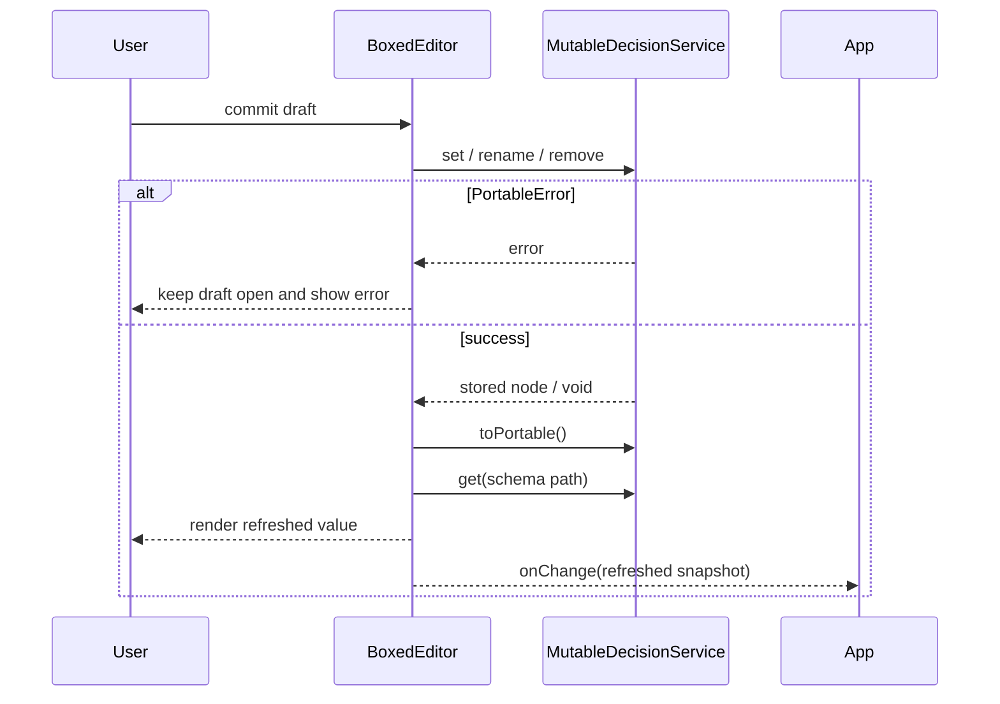

# EdgeRules Boxed Expressions Editor Specification

| Field                    | Value                                   |
|--------------------------|-----------------------------------------|
| Status                   | Proposed                                |
| Component                | `BoxedEditor`                           |
| Package export           | `edgerules-react/boxed-editor`          |
| Engine packages          | `@edgerules/web`, `@edgerules/portable` |
| Validated engine version | `0.0.0-alpha.202607152015`              |
| Last validation date     | 2026-07-16                              |

## 1. Purpose

`BoxedEditor` is a React editor for the following EdgeRules model entities:

- contexts and context fields;
- expressions and scalar literals;
- typed inputs;
- literal lists and uniform-record relations;
- function definitions;
- external-function declarations; and
- structured invocations.

The component presents these entities as nested boxes. It reads and mutates the model through a caller-owned
`MutableDecisionService`. The EdgeRules model remains the only persisted model; the component does not define a boxed
serialization format.

## 2. Normative language

The terms **MUST**, **MUST NOT**, **SHOULD**, and **MAY** define implementation requirements in this document.

### 2.1 Normative dependencies

| Contract                                | Source                                                           |
|-----------------------------------------|------------------------------------------------------------------|
| EdgeRules grammar                       | `../edgerules-v2/doc/architecture/EBNF.md`                       |
| EdgeRules context and scope rules       | `../edgerules-v2/doc/architecture/EDGERULES_DSL_CONTEXT_SPEC.md` |
| `get` / `set` / `remove` / `rename` API | `../edgerules-v2/doc/architecture/EDGERULES_API_SPEC.md`         |
| Portable TypeScript nodes               | `@edgerules/portable`                                            |
| Executable DSL/API examples             | `../edgerules-v2/tests/wasm/`                                    |
| Cell editor behavior                    | `src/components/code-editor-cell/CodeEditorCell.tsx`             |

When prose documentation and the installed package behavior differ, the installed package and sibling WASM tests are
authoritative for this component version. Any confirmed engine defect MUST be recorded in `docs/BUG_REPORTS.md`.

## 3. Scope

### 3.1 In scope

| Capability                 | Requirement                                                  |
|----------------------------|--------------------------------------------------------------|
| Read authored model        | Read canonical authored nodes from `service.toPortable()`    |
| Read linked schema         | Read inferred types and direction flags from `service.get()` |
| Edit expressions           | Use one active `CodeEditorCell`                              |
| Edit model structure       | Use `service.set`, `service.rename`, and `service.remove`    |
| Navigate nested data       | Render contexts and literal collections recursively          |
| Route specialized entities | Notify the host through `onOpenNode`                         |
| Notify persistence layer   | Emit the refreshed `PortableRootContext` through `onChange`  |
| External refresh           | Reload when `service`, `path`, or `revision` changes         |
| Read-only rendering        | Render the complete structure without mutation controls      |

### 3.2 Out of scope

| Entity or capability                       | Owner or reason                                                  |
|--------------------------------------------|------------------------------------------------------------------|
| `PortableTypeDefinition` editing           | Types Editor                                                     |
| `PortableRulesetDefinition` editing        | `DecisionTableEditor`                                            |
| `PortableLoopDefinition` editing           | Loop Editor                                                      |
| Model execution                            | Host application                                                 |
| Execution trace                            | Host application / Test Runner                                   |
| DSL evaluation or type inference           | EdgeRules WASM engine                                            |
| Source whitespace and comment preservation | Not represented by the canonical Portable snapshot               |
| Context reordering                         | Current CRUD API has no atomic context move operation            |
| Cross-context drag/drop                    | `rename` cannot change a node's parent                           |
| Symbol-aware parameter refactoring         | Current engine API has no parameter-rename refactoring operation |

## 4. Component ownership

| Portable node                        | Boxed Editor presentation | Editing owner         |
|--------------------------------------|---------------------------|-----------------------|
| `PortableContext`                    | `ContextBox`              | Boxed Editor          |
| `PortableExpression` or scalar       | `ExpressionCell`          | Boxed Editor          |
| `PortableTypedValue`                 | `InputBox`                | Boxed Editor          |
| CRUD-addressable literal list        | `ListBox`                 | Boxed Editor          |
| Uniform list of contexts             | `RelationBox`             | Boxed Editor          |
| Computed list                        | `ExpressionCell`          | Boxed Editor          |
| `PortableFunctionDefinition`         | `FunctionBox`             | Boxed Editor          |
| `PortableExternalFunctionDefinition` | `ExternalFunctionBox`     | Boxed Editor          |
| `PortableInvocationDefinition`       | `InvocationBox`           | Boxed Editor          |
| `PortableTypeDefinition`             | `EditorLinkBox`           | Types Editor          |
| `PortableRulesetDefinition`          | `EditorLinkBox`           | Decision Table Editor |
| `PortableLoopDefinition`             | `EditorLinkBox`           | Loop Editor           |

## 5. Design decisions

| ID  | Decision                                                                 | Consequence                                                                     |
|-----|--------------------------------------------------------------------------|---------------------------------------------------------------------------------|
| D1  | `MutableDecisionService` is the model authority                          | No independently persisted `BoxedExpressionData` model                          |
| D2  | `toPortable()` supplies authored structure                               | Expression source and source order come from one canonical snapshot             |
| D3  | `get()` supplies linked schema                                           | Inferred types and `readOnly` / `writeOnly` are treated as projections          |
| D4  | Only one `CodeEditorCell` may be mounted                                 | Display cells use static highlighting; editor cost is constant                  |
| D5  | Specialized definitions are routed, not flattened                        | Ruleset, loop, and type semantics remain owned by their editors                 |
| D6  | Mutations use the narrowest valid engine operation                       | Cell edits do not replace an enclosing context without necessity                |
| D7  | Multi-field invariants use one whole-node `set`                          | Function signatures, invocations, relation shapes, and list reorders are atomic |
| D8  | Literal lists are expanded only when their children are CRUD-addressable | Computed arrays remain expressions; no DSL list parser is introduced            |
| D9  | Boxed/Code equivalence is semantic                                       | Formatting and comments are not round-tripped through Portable                  |
| D10 | Context move/reorder controls are absent in v1                           | The UI does not promise a mutation unsupported by the engine API                |
| D11 | Rename and remove require post-mutation linked validation                | Current lazy-link failures are rolled back before change notification           |

## 6. System context



### 6.1 Host responsibilities

The host application MUST:

- initialize `@edgerules/web/mutable` before rendering the component;
- create and retain the `MutableDecisionService` instance;
- pass the `MutableDecisionService` class as `languageService` when language tooling is required;
- persist `onChange` snapshots when persistence is required;
- route `onOpenNode` targets to the appropriate editor; and
- change `revision` after mutating the same service instance outside `BoxedEditor`.

### 6.2 Component responsibilities

`BoxedEditor` MUST:

- load authored and linked views from the supplied service;
- resolve `path` to one authored entity;
- render that entity and any visible descendants;
- commit edits through the service;
- reload after each successful mutation;
- surface `PortableError` values without throwing them through React; and
- avoid disposing the caller-owned service.

## 7. Public application API

### 7.1 Exported types

```ts
import type {SxProps, Theme} from '@mui/material/styles';
import type {
    PortableError,
    PortableNode,
    PortableRootContext,
} from '@edgerules/portable';
import type {GetFilter} from '@edgerules/web';
import type {CodeEditorService} from '../code-editor-cell';

export interface BoxedEditorService {
    toPortable(): PortableRootContext;

    get(path: string, filter?: GetFilter): PortableNode | PortableError;

    set(path: string, node: PortableNode): PortableNode | PortableError;

    remove(path: string): void | PortableError;

    rename(path: string, newName: string): void | PortableError;
}

export type BoxedEditorTargetKind = 'type-definition' | 'ruleset' | 'loop';

export interface BoxedEditorOpenTarget {
    path: string;
    kind: BoxedEditorTargetKind;
}

export interface BoxedEditorProps {
    service: BoxedEditorService;
    path: string;
    languageService?: CodeEditorService;
    revision?: string | number;
    readOnly?: boolean;
    onChange?: (snapshot: PortableRootContext) => void;
    onOpenNode?: (target: BoxedEditorOpenTarget) => void;
    className?: string;
    sx?: SxProps<Theme>;
}
```

### 7.2 Prop contract

| Prop              | Required | Default              | Contract                                                      |
|-------------------|---------:|----------------------|---------------------------------------------------------------|
| `service`         |      Yes | —                    | Stable caller-owned mutable service instance                  |
| `path`            |      Yes | —                    | Engine path to render; `"*"` selects the root                 |
| `languageService` |       No | diagnostics disabled | Usually the `MutableDecisionService` class                    |
| `revision`        |       No | `undefined`          | Changing it forces a reload from the same service instance    |
| `readOnly`        |       No | `false`              | Removes all mutation controls and editor activation           |
| `onChange`        |       No | —                    | Called once after a successful committed mutation and refresh |
| `onOpenNode`      |       No | —                    | Called when a type, ruleset, or loop link is activated        |
| `className`       |       No | —                    | Applied to the root element                                   |
| `sx`              |       No | —                    | MUI root styles                                               |

### 7.3 Path contract

| `path` value            | Result                                        |
|-------------------------|-----------------------------------------------|
| `"*"`                   | Root model overview                           |
| `"application"`         | Focused context or value                      |
| `"application.address"` | Focused nested context or value               |
| `"applicants[0]"`       | Focused literal list element when addressable |
| `"creditScore"`         | Focused function definition                   |
| `"fetchData"`           | Focused external-function declaration         |

The component input MUST NOT use definition-query syntax such as `creditScore.*`. The component derives definition
queries internally. Function-body paths use the engine CRUD form (`creditScore.result`), not Portable property syntax
(`creditScore.@body.result`).

### 7.4 Application usage

```tsx
import {useEffect, useState, type ReactElement} from 'react';
import {init, MutableDecisionService} from '@edgerules/web/mutable';
import type {PortableRootContext} from '@edgerules/portable';
import {BoxedEditor, type BoxedEditorOpenTarget} from 'edgerules-react/boxed-editor';

const model = `{
  application: {
    amount: <number, required: true>
    termMonths: <number, 12>
  }
  func monthlyAmount(amount: number, termMonths: number) -> number:
    amount / termMonths
  payment: monthlyAmount(application.amount, application.termMonths)
}`;

declare function savePortableModel(snapshot: PortableRootContext): void;

declare function openEditor(target: BoxedEditorOpenTarget): void;

export function ModelPage(): ReactElement {
    const [service, setService] = useState<MutableDecisionService | null>(null);

    useEffect(() => {
        let active = true;
        let instance: MutableDecisionService | undefined;

        void init().then(() => {
            instance = MutableDecisionService.fromCode(model);
            if (active) {
                setService(instance);
            } else {
                instance[Symbol.dispose]();
            }
        });

        return () => {
            active = false;
            instance?.[Symbol.dispose]();
        };
    }, []);

    if (!service) {
        return <div>Loading model…</div>;
    }

    return (
        <BoxedEditor
            service={service}
            languageService={MutableDecisionService}
            path="*"
            onChange={(snapshot) => savePortableModel(snapshot)}
            onOpenNode={(target) => openEditor(target)}
        />
    );
}
```

`savePortableModel` and routing are application functions. They are not exported by `edgerules-react`.

## 8. EdgeRules API integration

### 8.1 Initial load and refresh

The component MUST run the following algorithm on mount and whenever `service`, `path`, or `revision` changes:

1. Call `service.toPortable()` once and store the result as `authoredSnapshot`.
2. Resolve `path` against `authoredSnapshot` using the path rules in section 8.3.
3. Load linked schema according to the resolved node kind.
4. Join authored nodes and linked schema into an in-memory render model.
5. Render the selected box.

Linked schema calls:

| Selected authored node                | Schema calls                                                         |
|---------------------------------------|----------------------------------------------------------------------|
| Root                                  | `get("*", "FIELDS")`                                                 |
| Context                               | `get(path, "FIELDS")`                                                |
| Expression / typed input / invocation | `get(path, "FIELDS")`                                                |
| Function                              | `get(path, "FIELDS")` and `get(path + ".*", "FUNCTION_DEFINITIONS")` |
| External function                     | No inferred body schema; declared signature is authoritative         |
| Ruleset                               | `get(path, "FIELDS")` for summary only                               |
| Loop                                  | `get(path, "FIELDS")` for summary only                               |
| Type definition                       | No Boxed schema load; route summary only                             |

`service.get()` results MUST NOT replace authored expression nodes. In the current API, `get()` primarily returns
linked types and schemas; `toPortable()` retains authored expressions.

Function bodies in a root/context overview MUST be collapsed initially. Expanding a function lazily loads
`get(path + ".*", "FUNCTION_DEFINITIONS")`. A directly selected function loads and expands its body immediately.

### 8.2 Mutation lifecycle



The success branch completes only after the post-mutation linked read succeeds. A linked-read failure after `rename`
or `remove` enters the rollback procedure in section 8.5.

`onChange` MUST NOT fire for cancelled or rejected mutations.

### 8.3 Authored path resolution

The Portable snapshot uses wrapper fields that do not appear in CRUD paths. The resolver MUST apply these mappings:

| Authored node location                         | Engine path              |
|------------------------------------------------|--------------------------|
| Root context field `application`               | `application`            |
| Nested field `application.amount`              | `application.amount`     |
| Function body field `creditScore.@body.result` | `creditScore.result`     |
| Literal list element                           | `<listPath>[index]`      |
| Loop state field `amortize.@state.balance`     | `amortize.state.balance` |
| Loop step field `amortize.@do.balance`         | `amortize.do.balance`    |
| Ruleset row                                    | `risk.rules[index]`      |

Loop and ruleset descendants are mapped for routing and diagnostics only; their editing remains delegated.

### 8.4 Write operation matrix

| User operation                  | Engine call                                         | Success refresh scope      |
|---------------------------------|-----------------------------------------------------|----------------------------|
| Edit expression                 | `set(fieldPath, expressionText)`                    | Selected root              |
| Edit typed input                | `set(fieldPath, PortableTypedValue)`                | Selected root              |
| Add context field               | `set(newFieldPath, stagedNode)`                     | Parent context             |
| Rename context field            | Guarded `rename(fieldPath, newName)`                | Parent context             |
| Duplicate context field         | `set(copyPath, authoredNode)`                       | Parent context             |
| Delete context field            | Guarded `remove(fieldPath)`                         | Parent context             |
| Edit function name              | Guarded `rename(functionPath, newName)`             | Selected root              |
| Edit function signature         | `set(functionPath, completeFunctionDefinition)`     | Function and call sites    |
| Edit external signature         | `set(functionPath, completeExternalDefinition)`     | Declaration and call sites |
| Edit invocation method/argument | `set(invocationPath, completeInvocationDefinition)` | Invocation field           |
| Edit literal list item          | `set(listItemPath, node)`                           | List                       |
| Append literal list item        | `set(listTailPath, stagedNode)`                     | List                       |
| Delete literal list item        | Guarded `remove(listItemPath)`                      | List                       |
| Reorder literal list            | `set(listPath, completeList)`                       | List                       |
| Change relation columns         | `set(listPath, completeList)`                       | Relation                   |
| Set/update node annotation      | `set(path, { "@node": kind, "@node-name": label })` | Annotated node             |
| Remove node annotation          | `remove(annotationPath)`                            | Annotated node             |

Every successful write MUST call `toPortable()` once. The refresh scope column identifies the linked schema subtree
that MUST be reloaded after that snapshot is obtained. `Selected root` means the node selected by `BoxedEditor.path`.

The second argument of `rename` is a name, not a full path. For example, renaming `application.amount` to
`principal` MUST call `rename("application.amount", "principal")`.

For list operations, `listItemPath` is `${listPath}[${index}]` and `listTailPath` is
`${listPath}[${length}]`. For annotation removal, `annotationPath` is `${path}.@${kind}`.

### 8.5 Guarded rename and remove

The engine version named in this specification does not reliably rewrite references when a value field is renamed.
The component MUST guard every rename:

1. Retain the old path and old name.
2. Call `rename(oldPath, newName)`.
3. Force a linked read of the owning context.
4. If the read succeeds, refresh and emit `onChange`.
5. If the read returns `PortableError`, call the inverse rename on the new path and show the error.
6. If the inverse rename fails, render a fatal editor alert and do not emit `onChange`.

For `application.amount → principal`, the inverse call is `rename("application.principal", "amount")`. For a root
rename `creditScore → score`, the inverse call is `rename("score", "creditScore")`.

See the open value-field rename entry in `BUG_REPORTS.md`. This guard also applies to function names even though the
current engine rewrites function invocation methods successfully.

`remove` may expose a linking error only on the next linked read. The component MUST guard a removal as follows:

1. Retain the removed authored node and its original path.
2. Call `remove(path)`.
3. Force a linked read of the owning context.
4. If the read succeeds, refresh and emit `onChange`.
5. If the read returns `PortableError`, restore the retained node with `set(path, node)` and show the error.
6. If restoration fails, render a fatal editor alert and do not emit `onChange`.

Restoration appends a context field under the current API. The restored field may therefore move to the end of its
context while retaining its semantics.

## 9. Render model

The internal render model MUST be derived for each refresh and MUST NOT be exported or persisted.

```ts
interface BoxedRenderNode {
    id: string;
    path: string;
    kind:
        | 'context'
        | 'expression'
        | 'input'
        | 'list'
        | 'relation'
        | 'function'
        | 'external-function'
        | 'invocation'
        | 'editor-link';
    name?: string;
    authored: PortableNode;
    schema?: PortableNode;
    children?: BoxedRenderNode[];
}
```

`id` MUST be stable for a stable model path. Collapse, focus, draft, and pagination state MUST be keyed by `id` and
kept outside the render model.

### 9.1 Node classification order

Classification MUST use the following first-match order:

| Priority | Condition                                                    | Render kind          |
|---------:|--------------------------------------------------------------|----------------------|
|        1 | `@kind === "type-definition"`                                | `editor-link`        |
|        2 | `@kind === "ruleset"`                                        | `editor-link`        |
|        3 | `@kind === "loop"`                                           | `editor-link`        |
|        4 | `@kind === "function"`                                       | `function`           |
|        5 | `@kind === "external-function"`                              | `external-function`  |
|        6 | `@kind === "invocation"`                                     | `invocation`         |
|        7 | `@kind === "type"`                                           | `input`              |
|        8 | `@kind === "context"` or plain Portable context              | `context`            |
|        9 | Linked type is array and child index `0` is CRUD-addressable | `list` or `relation` |
|       10 | Scalar or `@kind === "expression"`                           | `expression`         |

An empty literal list and a computed list are not distinguishable through child paths in the current API. Both render
as `ExpressionCell` until the engine exposes child enumeration.

### 9.2 Root layout

The root uses one bordered grid. It MUST NOT render independent floating cards for sibling fields.

```text
┌─ kind/name or function signature ───────── value/body ───── type ─ actions ┐
│  context field                           expression          number    ⋮     │
│  nested context                          ┌ nested rows ┐      object    ⋮     │
│  function signature                      │ body        │      number    ⋮     │
│  specialized definition                 Open editor       ruleset      →     │
└──────────────────────────────────────────────────────────────────────────────┘
```

Columns:

| Column  | Content                                                    |
|---------|------------------------------------------------------------|
| Gutter  | depth, expand/collapse control, row index where applicable |
| Name    | field name, function signature, or specialized entity name |
| Value   | expression, nested box, input descriptor, or editor link   |
| Type    | linked type and input/computed direction                   |
| Actions | context menu; hidden in read-only mode                     |

### 9.3 ContextBox

| Aspect              | Specification                                                   |
|---------------------|-----------------------------------------------------------------|
| Children            | All non-metadata authored entries in source order               |
| Nested values       | Render recursively in the value column                          |
| Footer              | `Add field` action when writable                                |
| Name edit           | Plain text control; commit with guarded `rename(path, newName)` |
| Row actions         | Rename, duplicate, delete, edit metadata                        |
| Unsupported actions | Reorder, move to another context                                |
| Empty state         | One `Empty context` row plus `Add field` when writable          |

Adding a field MUST use a staging dialog with `name` and one initial node kind: expression, input, context, or literal
list. The engine MUST receive one valid `set` call; partially constructed fields MUST NOT be written.

### 9.4 ExpressionCell

| State            | Rendering                                                         |
|------------------|-------------------------------------------------------------------|
| Display          | Static `highlightEdgeRules` output; no CodeMirror instance        |
| Editing          | One `CodeEditorCell` mounted in the active cell                   |
| Expanded editing | The same draft in multiline `CodeEditorCell` mode                 |
| Type             | Linked schema label; never persisted with the expression          |
| Error            | Inline `PortableError.message` and source location when available |

Text conversion:

| Authored value       | Cell text                                 |
|----------------------|-------------------------------------------|
| `PortableExpression` | `expression` field                        |
| Number               | Decimal text                              |
| Boolean              | `true` or `false`                         |
| Portable string      | The string as EdgeRules expression source |

### 9.5 InputBox

`InputBox` edits a complete `PortableTypedValue`.

| Field          | Control                  | Write rule                       |
|----------------|--------------------------|----------------------------------|
| `type`         | Type selector            | Required                         |
| `items`        | Item type selector       | Visible only for `type: "array"` |
| `required`     | Checkbox                 | Omit when false                  |
| `default`      | Scalar/list editor       | Omit when unset                  |
| `enum`         | Repeatable scalar editor | Omit when empty                  |
| `@description` | Text field               | Preserve when present            |

`readOnly` and `writeOnly` are get-only linked projections. They MUST be removed from every `set` payload.

### 9.6 ListBox

| Aspect         | Specification                                                          |
|----------------|------------------------------------------------------------------------|
| Eligibility    | Linked type is array and indexed CRUD reads succeed                    |
| Page size      | 50 items                                                               |
| Loading        | Sequential indexed `get` calls until page end or first `EntryNotFound` |
| Item display   | Row index, expression/nested box, type, actions                        |
| Append         | Available only after the terminal page is known                        |
| Reorder        | Available only after all items are loaded                              |
| Virtualization | Required after 100 loaded rows                                         |

Any error other than terminal `EntryNotFound` MUST stop list expansion and display the error. The editor MUST NOT parse
the `toPortable()` list expression to discover elements.

### 9.7 RelationBox

`RelationBox` is selected when the linked array item schema is a record and indexed elements resolve to contexts.

| Aspect            | Specification                                |
|-------------------|----------------------------------------------|
| Columns           | First row authored field order               |
| Column types      | Linked item schema                           |
| Rows              | Literal list elements                        |
| Cell editing      | `CodeEditorCell` at `${listPath}[row].field` |
| Row operations    | Add, duplicate, delete, reorder              |
| Column operations | Add, rename, delete                          |

Column operations MUST stage and write the complete list once. The engine enforces homogeneous record shape and type.
Mixed item types are linking errors; there is no heterogeneous-list fallback.

### 9.8 FunctionBox

| Area     | Content                                                                       |
|----------|-------------------------------------------------------------------------------|
| Header   | Function name, ordered parameters, declared return type, inferred return type |
| Body     | One `ExpressionCell` or nested `ContextBox`                                   |
| Metadata | `@node`, `@node-name`, and `@description` when present                        |
| Collapse | Header remains visible; body is hidden                                        |

Function bodies are closed scopes. Cell embedding MUST expose function parameters and callable definitions and MUST
NOT expose enclosing value fields.

Function bodies MUST be collapsed initially in a root/context overview and expanded initially when the function is
the selected `path`. Opening a collapsed function MUST load its linked body schema lazily.

Signature editing MUST stage and `set` the complete `PortableFunctionDefinition`. Function-name editing MUST use the
guarded rename lifecycle. A parameter rename that leaves body references invalid MUST be rejected by the engine and
shown as an inline signature error; the component MUST NOT perform textual replacement in body expressions.

### 9.9 ExternalFunctionBox

| Area      | Content                               |
|-----------|---------------------------------------|
| Header    | `external` badge and declaration name |
| Signature | Ordered, typed parameters             |
| Return    | Mandatory declared return type        |
| Body      | None                                  |

Any signature edit MUST write one complete `PortableExternalFunctionDefinition`.

### 9.10 InvocationBox

| Invocation form      | Rendering                          |
|----------------------|------------------------------------|
| Named arguments      | Parameter name and expression rows |
| Positional arguments | Numbered expression rows           |
| Collapsed            | Canonical call expression          |

Changing the method or any argument MUST stage and set the complete `PortableInvocationDefinition`. The engine remains
responsible for rejecting named arguments to built-ins and for normalizing named arguments to declaration order.

### 9.11 EditorLinkBox

| Kind            | Label                        | Callback target                     |
|-----------------|------------------------------|-------------------------------------|
| Type definition | `Open Types Editor`          | `{ path, kind: "type-definition" }` |
| Ruleset         | `Open Decision Table Editor` | `{ path, kind: "ruleset" }`         |
| Loop            | `Open Loop Editor`           | `{ path, kind: "loop" }`            |

If `onOpenNode` is absent, the box MUST render a non-interactive summary.

### 9.12 Modeler metadata

| Metadata         | Presentation                                              | Mutation                      |
|------------------|-----------------------------------------------------------|-------------------------------|
| `@node`          | Kind badge                                                | Annotation-only `set`         |
| `@node-name`     | Human label beside key                                    | Annotation-only `set`         |
| `@description`   | Secondary text / edit field where the whole node is owned | Preserve in whole-node writes |
| `@model-name`    | Root header                                               | Read-only in Boxed Editor     |
| `@model-version` | Root header                                               | Read-only in Boxed Editor     |

## 10. CodeEditorCell integration

### 10.1 Mounting rule

At most one `.cm-editor` instance may exist inside one `BoxedEditor`. Activating another cell MUST unmount the previous
instance after committing or cancelling its draft.

When `languageService` is omitted, the component MUST pass an internal no-op diagnostics service to `CodeEditorCell`.
Editing remains available; diagnostics and completions are empty.

### 10.2 Embed-context construction

`CodeEditorCell` diagnostics and completions require valid surrounding DSL. The component MUST build
`CodeEditorEmbedContext` as follows:

1. Serialize the current authored Portable snapshot to canonical EdgeRules DSL.
2. Replace the active expression with a unique marker during serialization.
3. Split the serialized text around the marker into `prefix` and `suffix`.
4. Pass `{ prefix, suffix }` to `CodeEditorCell`.
5. Reuse the serialization while the authored snapshot and active path are unchanged.

The serializer MUST support every canonical Portable kind listed in section 4. It MUST NOT parse user-authored DSL.
Serializer fixtures MUST pass `MutableDecisionService.diagnostics()` with an empty result before they are used for
cell embedding. Presentation-only metadata MAY be omitted from the synthesized DSL when it cannot affect scope or
types.

## 11. Interaction contract

### 11.1 Cell state transitions

| Current state | Event                      | Next state    | Effect                                  |
|---------------|----------------------------|---------------|-----------------------------------------|
| Display       | Double-click, Enter, or F2 | Editing       | Mount cell editor and focus end of text |
| Display       | Arrow key                  | Display       | Focus adjacent display cell             |
| Editing       | Enter, single-line         | Committing    | Call mutation                           |
| Editing       | Mod-Enter, multiline       | Committing    | Call mutation                           |
| Editing       | Blur                       | Committing    | Call mutation                           |
| Editing       | Escape                     | Display       | Discard draft and restore authored text |
| Committing    | Success                    | Display       | Refresh model, emit `onChange`          |
| Committing    | `PortableError`            | Editing error | Retain draft, show error, restore focus |

Autocomplete popup key handling takes precedence over grid navigation.

### 11.2 Grid navigation

| Key                | Behavior                                            |
|--------------------|-----------------------------------------------------|
| Arrow Left / Right | Previous / next cell in the row                     |
| Arrow Up / Down    | Same or nearest column in adjacent row              |
| Home / End         | First / last cell in the row                        |
| Enter / F2         | Start editing                                       |
| Escape             | Cancel editing or close menu/dialog                 |
| Tab / Shift-Tab    | Browser-order traversal across interactive controls |

## 12. Error handling

| Error source                                   | Presentation                                     | Model state                              |
|------------------------------------------------|--------------------------------------------------|------------------------------------------|
| Initial snapshot, path, or schema load failure | Full-width `Alert`                               | No editable model rendered               |
| Cell `set` failure                             | Inline cell error                                | Transactional engine keeps previous node |
| Guarded `rename` failure                       | Inline name/signature error after inverse rename | Original name restored                   |
| Guarded remove failure                         | Inline row error after restoration               | Node restored; order may change          |
| Restoration failure                            | Fatal full-width `Alert`                         | Editing disabled until external reload   |
| List page load failure                         | Error row at page boundary                       | Loaded rows remain readable              |

The component MUST display `PortableError.message`. It SHOULD display `type`, `path`, and `location` when present.

## 13. Read-only mode

When `readOnly` is `true`:

- editor activation MUST be disabled;
- add, rename, duplicate, delete, reorder, metadata, and signature controls MUST be hidden;
- copy, text selection, and collapse/expand MUST remain available; and
- `onOpenNode` routing MUST remain available.

## 14. Accessibility requirements

- Every row MUST have an accessible name containing its model path.
- Nested ownership MUST use `aria-level` or equivalent structural semantics.
- Expand/collapse buttons MUST expose `aria-expanded`.
- Action buttons MUST include the affected path in their accessible name.
- Type and input/computed state MUST be expressed in text, not color alone.
- Inline errors MUST be connected to their active control with `aria-describedby`.
- The active error cell MUST receive focus after a rejected commit.

## 15. Performance requirements

| Metric                     | Requirement                                                                    |
|----------------------------|--------------------------------------------------------------------------------|
| CodeMirror instances       | Maximum 1 per `BoxedEditor`                                                    |
| Static highlighting        | Memoized by expression text                                                    |
| Initial list reads         | Maximum 50 indexed elements                                                    |
| Loaded list rows above 100 | Virtualized                                                                    |
| Authored snapshot reads    | One `toPortable()` per refresh cycle                                           |
| Schema reads               | One base context/schema read; expanded functions and list pages add lazy reads |
| Collapse state             | UI-only; no engine mutation                                                    |

## 16. Implementation modules

| File                                                        | Responsibility                                                  |
|-------------------------------------------------------------|-----------------------------------------------------------------|
| `src/components/boxed-editor/BoxedEditor.tsx`               | Public component, refresh, mutation orchestration, fatal errors |
| `src/components/boxed-editor/boxed-model.ts`                | Path resolution, node classification, authored/schema join      |
| `src/components/boxed-editor/boxed-embed.ts`                | Portable-to-DSL serialization and embed contexts                |
| `src/components/boxed-editor/boxes/ContextBox.tsx`          | Context layout and field operations                             |
| `src/components/boxed-editor/boxes/ExpressionCell.tsx`      | Static/active expression rendering                              |
| `src/components/boxed-editor/boxes/InputBox.tsx`            | Typed input controls                                            |
| `src/components/boxed-editor/boxes/ListBox.tsx`             | Literal list paging and operations                              |
| `src/components/boxed-editor/boxes/RelationBox.tsx`         | Uniform-record table                                            |
| `src/components/boxed-editor/boxes/FunctionBox.tsx`         | Function signature and body                                     |
| `src/components/boxed-editor/boxes/ExternalFunctionBox.tsx` | External declaration                                            |
| `src/components/boxed-editor/boxes/InvocationBox.tsx`       | Structured invocation                                           |
| `src/components/boxed-editor/boxes/EditorLinkBox.tsx`       | Specialized editor routing                                      |
| `src/components/boxed-editor/__tests__/`                    | RTL and real-engine unit/integration tests                      |
| `stories/components/boxed-editor/BoxedEditor.stories.tsx`   | Storybook scenarios                                             |
| `e2e/boxed-editor.spec.ts`                                  | Keyboard, tooling, visual, and large-list tests                 |

Public exports:

- `BoxedEditor`;
- `BoxedEditorProps`;
- `BoxedEditorService`;
- `BoxedEditorOpenTarget`; and
- `BoxedEditorTargetKind`.

Internal boxes and `BoxedRenderNode` MUST NOT be exported.

## 17. Delivery plan

### Phase 1 — Read-only rendering

- [x] Add the `boxed-editor` package entry point and public exports.
- [x] Implement authored path resolution and schema loading.
- [x] Implement node classification and `BoxedRenderNode`.
- [x] Render root, context, expression, input, function, external-function, and editor-link boxes.
- [x] Add static EdgeRules highlighting and inferred type labels.
- [x] Add collapse/expand and focused-path behavior.
- [x] Add read-only Storybook stories and RTL tests.

### Phase 2 — Expression and context editing

- [x] Implement Portable-to-DSL serialization for embed contexts.
- [x] Mount one active `CodeEditorCell`.
- [x] Implement expression and typed-input `set` operations.
- [x] Implement context field add, guarded rename, duplicate, and guarded delete.
- [x] Implement inline errors and fatal restore errors.
- [x] Implement `onChange`, `revision`, and read-only behavior.
- [x] Add keyboard and language-tooling Playwright tests.

### Phase 3 — Functions and invocations

- [x] Implement atomic function signature editing.
- [x] Implement external-function signature editing.
- [x] Implement invocation expansion and whole-invocation writes.
- [x] Implement modeler metadata display and writes.
- [x] Add inline-function, context-function, external-function, and invocation stories.

The editor submits `@description` with complete metadata writes. Engine version
`0.0.0-alpha.202607152015` currently discards that field; see `BUG_REPORTS.md`.

### Phase 4 — Lists and relations

- [x] Implement indexed literal-list detection and paging.
- [x] Implement item add, edit, duplicate, delete, and reorder.
- [x] Implement uniform-record relation rendering.
- [x] Implement atomic relation row and column operations.
- [x] Add row virtualization and large-list tests.

### Phase 5 — Integration

- [x] Integrate Project Explorer paths.
- [x] Integrate Types, Decision Table, and Loop Editor routing.
- [x] Add a loan-origination root overview story.
- [x] Add error, read-only, nested-function, and large-model visual tests.
- [x] Verify package build, types, RTL, Storybook build, and Playwright suites.

## 18. Acceptance criteria

| ID    | Given                                           | When                                                | Then                                                                      |
|-------|-------------------------------------------------|-----------------------------------------------------|---------------------------------------------------------------------------|
| AC-01 | A valid model and `path="*"`                    | The component mounts                                | Root entities render in authored order                                    |
| AC-02 | A context/function/value path                   | The component mounts                                | The matching authored node is focused                                     |
| AC-03 | A type, ruleset, or loop                        | The route box is activated                          | `onOpenNode` receives the exact path and kind                             |
| AC-04 | 200 visible expression cells                    | No cell is being edited                             | Zero CodeMirror instances are mounted                                     |
| AC-05 | Any editable expression cell                    | Editing begins                                      | Exactly one `CodeEditorCell` is mounted                                   |
| AC-06 | A function-body cell                            | Completion is requested                             | Parameters/callables are visible; enclosing values are not                |
| AC-07 | A valid draft                                   | The user commits                                    | The narrowest engine write runs, views refresh, and `onChange` fires once |
| AC-08 | An invalid draft                                | The user commits                                    | Draft remains active, error is shown, and `onChange` does not fire        |
| AC-09 | A referenced value field                        | Rename validation fails                             | The inverse rename restores the original name and no change is emitted    |
| AC-10 | A referenced entity                             | Delete causes a link failure                        | Entity is restored and the failure is shown                               |
| AC-11 | A computed array                                | The model renders                                   | It remains one `ExpressionCell`                                           |
| AC-12 | A CRUD-addressable scalar list                  | The model renders                                   | It becomes a paged `ListBox`                                              |
| AC-13 | A uniform literal record list                   | The model renders                                   | It becomes a `RelationBox` with linked column types                       |
| AC-14 | A typed input                                   | The user edits constraints                          | Write payload omits `readOnly` and `writeOnly`                            |
| AC-15 | `readOnly=true`                                 | The model renders                                   | Mutation controls and editor activation are absent                        |
| AC-16 | The same service instance is changed externally | `revision` changes                                  | The component reloads authored and linked views                           |
| AC-17 | A successful edit                               | The returned snapshot is passed to `fromPortable()` | The reconstructed model links successfully                                |
| AC-18 | Keyboard-only interaction                       | The user navigates and edits                        | All specified actions are reachable without a pointer                     |

## Appendix A. Design background (non-normative)

### A.1 Legacy editor review


| Legacy characteristic                 | Decision                                      |
|---------------------------------------|-----------------------------------------------|
| One full-width bordered surface       | Adopt                                         |
| Stable name and value columns         | Adopt                                         |
| Nested rows showing ownership         | Adopt                                         |
| Function signatures as headers        | Adopt                                         |
| Compact type labels                   | Adopt using linked schema                     |
| Collapse controls                     | Adopt                                         |
| `Σ` symbols as generic entity markers | Replace with explicit node-kind labels        |
| Separate `BoxedExpressionData` AST    | Reject                                        |
| JavaScript-type guessing              | Reject                                        |
| Heterogeneous-list fallback           | Reject; engine lists are homogeneous          |
| Context drag/drop                     | Defer until an atomic engine operation exists |

### A.2 Boxed-expression tooling reference

DMN boxed-expression tooling demonstrates the following presentation patterns:

- context entries rendered as name/value rows;
- nested expressions inside context values;
- functions rendered as signatures plus bodies;
- invocations rendered as parameter bindings;
- scalar lists rendered as rows; and
- uniform records rendered as relations.

These patterns inform presentation only. EdgeRules DSL, Portable nodes, scoping, typing, and execution semantics remain
authoritative. Reference:
[Apache KIE DMN boxed expressions](https://kie.apache.org/docs/10.1.x/drools/drools/DMN/index.html#dmn-decision-logic-con_dmn-models).

### A.3 Reference model

The implementation stories SHOULD use this valid model for the root overview:

```edgerules
{
    type Applicant: {
        name: <string, required: true>
        age: <number, required: true>
        income: <number, 0>
        expense: <number, 0>
    }

    application: {
        applicationDate: <date, required: true>
        applicants: <Applicant[], required: true>
        propertyValue: <number, required: true>
        loanAmount: <number, required: true>
    }

    func creditScore(age: number, income: number) -> number:
        300 + age * 2 + income / 1000

    func applicantDecision(applicant: Applicant): {
        netIncome: applicant.income - applicant.expense
        score: creditScore(applicant.age, applicant.income)
        eligible: score >= 700 and netIncome > 2000
        return: { score: score, eligible: eligible }
    }

    decisions:
        for applicant in application.applicants return applicantDecision(applicant)
    finalDecision:
        if count(decisions[eligible = false]) > 0 then "DECLINE" else "APPROVE"
}
```
