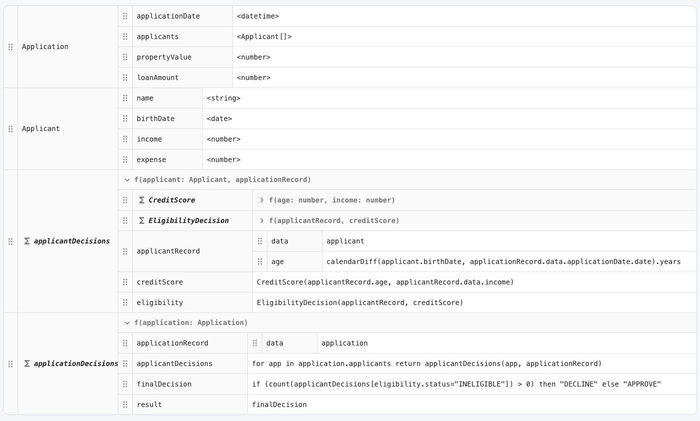

# EdgeRules Boxed Expressions Editor

The Boxed Expressions Editor is the structured editor for EdgeRules contexts, values, functions,
external-function declarations, and invocations. It presents the same model as a recursively nested,
spreadsheet-like set of boxes while preserving EdgeRules as the language and the WASM model as the source of truth.

It is inspired by DMN boxed expressions, but it is not a DMN/FEEL serializer. The visual metaphors are mapped to the
current EdgeRules DSL and canonical `@edgerules/portable` nodes. Rulesets, loops, and type definitions keep their own
specialized editors.

This story was validated on 2026-07-16 against the installed
`@edgerules/web` / `@edgerules/node` / `@edgerules/portable`
`0.0.0-alpha.202607152015` packages and the sibling `edgerules-v2/tests/wasm/` suite.

> ARCHITECT NOTES: Certain topics are background for the design and implementation of the Boxed Editor and some topics
> are design decisions. Have a clear separation of them.

> ARCHITECT NOTES: be precise, avoid belletrists and narrations. Use structural way to define new component. Utilize
> structures such as Markdown lists and tables, use Mermaid diagrams where needed. The point is that structures are much
> better readable.

## Product goals

- Make a large decision model readable as named, nested business calculations instead of one source file.
- Keep Boxed and Code views semantically interchangeable through the engine's Portable format.
- Give every expression cell the same diagnostics, completion, navigation, and formatting support as `CodeEditor`.
- Make inferred types, typed inputs, function boundaries, and errors visible without pretending the UI owns a second
  type system.
- Remain usable in a full-page modeler, a Project Explorer route, or a constrained Flow Editor node.
- Scale to deep contexts and large literal collections without mounting an editor for every visible cell.

## Non-goals

- The component does not parse, evaluate, or type-check EdgeRules itself.
- It does not preserve source whitespace or comments. `@description`, when present in Portable, remains structured
  metadata, but the editor does not promise that it survives an external DSL-text-only round trip.
- It does not edit `PortableTypeDefinition`s; those open in the Types Editor.
- It does not reimplement `PortableRulesetDefinition`; those open in `DecisionTableEditor`.
- It does not reimplement `PortableLoopDefinition`; the engine's loop design calls for a dedicated Loop Editor.
- It does not run models or own execution traces. The host composes execution and result panels around it.
- It does not automatically refactor arbitrary expression text when a function parameter is renamed.

## What the legacy editor taught us



The old editor established a useful visual language:

- one full-width bordered surface rather than disconnected cards;
- stable name and value columns;
- nested rows that clearly show context ownership;
- function signatures as section headers;
- compact inferred type labels; and
- collapse controls for large definitions.

The next generation keeps those ideas, but removes several legacy assumptions:

- `Σ` and handwritten box types are replaced by explicit EdgeRules node-kind badges;
- the editor does not build a separate `BoxedExpressionData` AST;
- values are not guessed to be literals from JavaScript types — Portable strings are EdgeRules source;
- lists are homogeneous because the EdgeRules linker enforces one item type;
- types, rulesets, and loops route to their specialized editors; and
- drag handles are not shown where the current CRUD API has no atomic move operation.

## Practices adopted from boxed-expression tooling

DMN tooling consistently uses a small recursive vocabulary: literal expressions, contexts, functions, invocations,
lists, relations, and decision tables. Context values may themselves contain another boxed expression, while relation
expressions present uniform records as columns and rows. The EdgeRules editor adopts that visual composition without
copying DMN execution semantics. See the
[Apache KIE boxed-expression reference](https://kie.apache.org/docs/10.1.x/drools/drools/DMN/index.html#dmn-decision-logic-con_dmn-models).

The following interaction practices also carry over:

- structure is visible before editing starts;
- nested boxes may be collapsed without changing the model;
- row actions live in a consistent trailing menu;
- a focused cell can be edited entirely from the keyboard; and
- specialized expressions open in their purpose-built editor instead of being flattened into generic cells.

## EdgeRules ownership and routing

| EdgeRules / Portable node                               | Boxed rendering                                 | Owner                 |
|---------------------------------------------------------|-------------------------------------------------|-----------------------|
| Context / record                                        | `ContextBox` with recursively nested entries    | Boxed Editor          |
| Scalar or `PortableExpression`                          | highlighted `ExpressionCell`                    | Boxed Editor          |
| `PortableTypedValue`                                    | `InputBox` with type and constraint controls    | Boxed Editor          |
| Literal list                                            | `ListBox`, or `RelationBox` for uniform records | Boxed Editor          |
| Computed list (`for`, filter, function call, and so on) | one `ExpressionCell`                            | Boxed Editor          |
| `PortableFunctionDefinition`                            | `FunctionBox`                                   | Boxed Editor          |
| `PortableExternalFunctionDefinition`                    | signature-only `ExternalFunctionBox`            | Boxed Editor          |
| `PortableInvocationDefinition`                          | `InvocationBox` with argument bindings          | Boxed Editor          |
| `PortableRulesetDefinition`                             | compact link/summary                            | Decision Table Editor |
| `PortableLoopDefinition`                                | compact link/summary                            | Loop Editor           |
| `PortableTypeDefinition`                                | compact link/summary                            | Types Editor          |

`path="*"` renders a root overview. A context path renders that context, and a function/external-function/value path
focuses the corresponding box. A nested specialized definition remains visible as a summary row and calls
`onOpenNode` when activated.

## Example model

```edgerules
{
    type Applicant: {
        name: <string, required: true>
        age: <number, required: true>
        income: <number, 0>
        expense: <number, 0>
    }

    application: {
        applicationDate: <date, required: true>
        applicants: <Applicant[], required: true>
        propertyValue: <number, required: true>
        loanAmount: <number, required: true>
    }

    func creditScore(age: number, income: number) -> number:
        300 + age * 2 + income / 1000

    func applicantDecision(applicant: Applicant): {
        netIncome: applicant.income - applicant.expense
        score: creditScore(applicant.age, applicant.income)
        eligible: score >= 700 and netIncome > 2000
        return: { score: score, eligible: eligible }
    }

    decisions:
        for applicant in application.applicants return applicantDecision(applicant)
    finalDecision:
        if count(decisions[eligible = false]) > 0 then "DECLINE" else "APPROVE"
}
```

The root overview is conceptually:

```text
┌─ [types] Applicant ───────────────────────────── Open Types Editor ─┐
├─ [context] application ─────────────────────────────────────────────┤
│  applicationDate   [input] <date, required>                         │
│  applicants        [input] <Applicant[], required>                  │
│  propertyValue     [input] <number, required>                       │
│  loanAmount        [input] <number, required>                       │
├─ [func] creditScore(age: number, income: number) -> number ─────────┤
│  300 + age * 2 + income / 1000                                     │
├─ [func] applicantDecision(applicant: Applicant) ────────────────────┤
│  netIncome          applicant.income - applicant.expense   number   │
│  score              creditScore(...)                      number   │
│  eligible           score >= 700 and netIncome > 2000     boolean  │
│  return             { score: score, eligible: eligible }  object   │
├─────────────────────────────────────────────────────────────────────┤
│  decisions          for applicant in ...                  object[] │
│  finalDecision      if count(...) ...                     string   │
└─────────────────────────────────────────────────────────────────────┘
```

The type labels are linked schema, not authored annotations. The `Applicant` definition is shown only as a route to
the Types Editor.

## Box mappings

### ContextBox

A context is an ordered visual list of named entries. Each row has:

1. a depth/expand gutter;
2. an editable field name;
3. a value box;
4. a linked type label and input/computed badge; and
5. a trailing actions menu.

Nested contexts recurse in the value column. The UI displays author/source order, although EdgeRules evaluation is
order-independent. Context rows may be added, renamed, removed, duplicated, and collapsed.

Context reordering and cross-context drag/drop are not in v1. The current API appends new context entities and
`rename` cannot change a node's parent; exposing a visual move that is not one atomic engine operation would make Code
and Boxed views disagree. A future engine move API can add this without changing the rendering model.

### ExpressionCell

Numbers, booleans, string literals, temporal constructors, ranges, records, conditionals, comprehensions written with
`for ... return`, function calls, and all other expressions use the same leaf cell. There is no separate public
`LiteralBox` type because the distinction is an editing presentation, not an EdgeRules semantic node.

- Display mode uses `highlightEdgeRules` and mounts no CodeMirror instance.
- Double-click, Enter, or F2 replaces the display with the only active `CodeEditorCell`.
- Enter or blur commits; Escape cancels; Tab returns navigation to the host grid.
- An expand button opens the same active cell in multiline mode; Mod-Enter commits there.
- The inferred type is read from the engine schema and is never written back as an expression annotation.

### InputBox

A `PortableTypedValue` is an input slot, not an expression. Its compact row shows `<type>`, `input`, and constraint
badges. An inline popover edits the canonical fields:

- `type` and array `items`;
- `required`;
- `default`;
- `enum`; and
- `@description`.

Changing these controls sets a complete `PortableTypedValue`. `readOnly` and `writeOnly` are engine projections and
must never be copied from `get()` into a write payload.

### ListBox and RelationBox

Only a literal, CRUD-addressable list becomes a structural list box. An array computed by `for`, filtering, or a call
remains one `ExpressionCell`, even if its inferred result is an array.

Literal array elements are discovered through official paths (`items[0]`, `items[1]`, ...), loaded one page at a time.
This avoids writing a second EdgeRules parser merely to split the canonical expression string returned by
`toPortable()`. An empty or non-addressable array falls back to one expression cell until the engine exposes child
enumeration.

- Scalar items render as numbered expression rows.
- Uniform context items render as a relation grid: record fields are columns, items are rows.
- Nested list/context values recurse.
- The engine's linked `items` schema supplies the item/column types.
- Lists are homogeneous. A mixed-type or inconsistent-record list is a linker error, not a generic UI fallback.
- Add is staged locally and appended with `set("path[index]", value)` only after it is valid.
- Remove uses `remove("path[index]")`; later indices shift according to the engine contract.
- Reordering a literal list writes the whole list once, making the semantic order change atomic.
- Relation column add/remove/rename writes the complete literal list once so every row keeps the same record shape.
- Pages are lazy and display cells are virtualizable. There is no initial scan of an unbounded number of indices.

Operations requiring the complete array, including append, reorder, and relation-column changes, become available
after the final page is known. Editing or removing already loaded elements remains available immediately.

### FunctionBox

A function header shows its name, ordered parameters, optional declared return type, inferred return type, description,
and collapse control. Its body is either one expression cell or a nested context box.

Functions are closed EdgeRules scopes. The embedded language context must include parameters and callable definitions,
but must not make enclosing value fields visible inside the function.

Signature edits write the complete `PortableFunctionDefinition` once because parameters are not independent CRUD
entities. Adding/removing/changing a parameter or declared return type is therefore atomic. Renaming the function
itself uses `service.rename`, which lets the engine rewrite call sites. Parameter renames that leave body references
invalid are rejected; automatic expression refactoring is deferred until the engine exposes a symbol-aware rename.

### ExternalFunctionBox

An external function is a signature-only function box with an `external` badge, typed parameters, and mandatory return
type. It has no body and does not expose execution/resolution controls. Signature edits set one complete
`PortableExternalFunctionDefinition`.

### InvocationBox

A direct `PortableInvocationDefinition` may expand from the compact call expression into:

- a callable selector;
- named argument rows for user functions/rulesets/loops; or
- numbered positional argument rows (also used for built-ins).

Every argument value is an `ExpressionCell`. The callable's schema supplies parameter names and types. Editing a
method or argument sets the complete invocation once; this keeps named/positional form and declaration-order
normalization under engine control. A call nested inside a larger expression remains part of that expression cell.

### Modeler metadata

`@node` and `@node-name` render as a node-kind badge and human label without changing the expression's key. The editor
updates them with the engine's annotation-only `set` form, so the value is not replaced or re-linked. `@description`
is displayed when a Portable node carries it; controls that own a complete node (typed inputs, functions, and
external functions) preserve it on every write. Root `@model-name` / `@model-version` are context, not editable cells
in this component.

## Data and language-service architecture

The authored and linked views solve different problems and must not be confused:

| Source                                            | Purpose                                  | Important behavior                                    |
|---------------------------------------------------|------------------------------------------|-------------------------------------------------------|
| `service.toPortable()`                            | authored structure and expression source | preserves canonical nodes and source order            |
| `service.get(path, "FIELDS")`                     | linked schema sidecar                    | returns types/direction, not all authored expressions |
| `service.get(path, definition filter)` / `path.*` | specialized linked definitions           | useful for schemas, but not the Boxed source of truth |
| `set` / `remove` / `rename`                       | all mutations                            | engine parses, links, normalizes, and returns errors  |

The editor takes one authored snapshot, obtains the smallest linked schema tree needed for the selected path, and joins
them into internal render rows. Those rows contain references to Portable nodes and engine CRUD paths; they are a view
model, not a serializable boxed format.

Portable property paths and CRUD paths are not always identical. The adapter owns these tested translations:

- function `@body.result` renders with engine path `functionName.result`;
- loop `@state` / `@do` slots use `loopName.state.*` / `loopName.do.*`; and
- ruleset `@rules` slots use `rulesetName.rules[index].*`.

### Embedded CodeEditorCell context

`CodeEditorCell` validates `prefix + value + suffix`. The Boxed Editor builds those fragments from a canonical
Portable-to-DSL view serializer:

1. serialize the current `toPortable()` snapshot to valid EdgeRules DSL;
2. replace the active expression with a unique marker;
3. split the result around the marker into `CodeEditorEmbedContext.prefix` and `.suffix`; and
4. memoize the unchanged serialization while the cell is active.

The serializer is an editor adapter, not a new grammar implementation. It supports only canonical Portable kinds and
every emitted fixture is checked by `MutableDecisionService.diagnostics`. This gives a cell the true surrounding
scope, including types, callable signatures, nested contexts, and function membranes.

## Write lifecycle and error handling

1. Keep the last good `toPortable()` snapshot.
2. Let the user edit a local cell draft.
3. Convert only that UI control to the canonical `PortableNode` payload.
4. Call the narrowest engine mutation.
5. On success, refresh authored and linked views, close the editor, and call `onChange`.
6. On `PortableError`, keep the previous rendered snapshot and show `message`, `type`, and `location` next to the cell.

Current `set` and `rename` operations are transactional. `remove` is defensively verified by forcing a linked read; if
removal leaves dangling references, the editor restores the removed node, refreshes, and surfaces the linking error.
Because a restored context field is appended by the current API, its visual order may change; its semantics and
references are restored. Multi-field changes such as a function signature, invocation, relation row, or list reorder
use one whole-node `set` rather than a sequence of temporarily invalid mutations.

Load failures render an `Alert` for the selected path. A cell error does not blank the rest of the editor. The first
invalid cell receives focus, and an error summary links back to every visible failure.

## Interaction, accessibility, and performance

- Exactly one `CodeEditorCell` is mounted per Boxed Editor, only while a cell is active.
- Arrow keys move between display cells; Enter/F2 edits; Escape cancels; Home/End move to row edges.
- Row menus and expand buttons are ordinary focusable controls with path-specific accessible names.
- Indentation is supplemented by borders, labels, and `aria-level`; ownership is not communicated by color alone.
- Inferred-type and input/computed states use text labels as well as color.
- Collapse state, active path, and loaded collection pages are UI state and never written into Portable metadata.
- Static highlighting is memoized by expression text. Long lists/relations virtualize display rows.
- A context initially expands to a practical depth; focused paths and their ancestors always open automatically.
- Read-only mode removes mutation actions but retains selection, copy, collapse, diagnostics, and go-to-definition.

## Public component contract

> ARCHITECT NOTES: after reading all of this I have no idea how you're going to use EdgeRules API.
> Also, you missed the point specifying teh actual <BoxedEditor ... > component usage in the story. You must do this as
> well as mention app API.

Keep the npm surface structural and small:

> ARCHITECT NOTES: `Keep the npm surface structural and small:` - you do not need to tell these adjectives! This is
> story that must be specific, exact and specification content answers all questions!

```ts
export interface BoxedEditorService {
    toPortable(): PortableRootContext;

    get(path: string, filter?: GetFilter): PortableNode | PortableError;

    set(path: string, node: PortableNode): PortableNode | PortableError;

    remove(path: string): void | PortableError;

    rename(path: string, newName: string): void | PortableError;
}

export interface BoxedEditorProps {
    service: BoxedEditorService;
    path: string;
    languageService?: CodeEditorService;
    readOnly?: boolean;
    onChange?: (snapshot: PortableRootContext) => void;
    onOpenNode?: (
        path: string,
        kind: 'type-definition' | 'ruleset' | 'loop',
    ) => void;
    className?: string;
    sx?: SxProps<Theme>;
}
```

Consumers pass the dev `MutableDecisionService` instance as `service` and its class as `languageService`, exactly as
with `DecisionTableEditor` and `CodeEditorCell`.

## Implementation structure

- `src/components/boxed-editor/BoxedEditor.tsx` — orchestration, loading, writes, focus, and public props.
- `src/components/boxed-editor/boxed-model.ts` — pure Portable/schema-to-row mapping and CRUD path translation.
- `src/components/boxed-editor/boxed-embed.ts` — canonical Portable-to-DSL cell embedding.
- `src/components/boxed-editor/boxes/` — internal context, expression, input, list/relation, function, external, and
  invocation renderers.
- `src/components/boxed-editor/__tests__/` — RTL tests and real-engine mapping/write tests.
- `stories/components/boxed-editor/BoxedEditor.stories.tsx` — interactive Storybook coverage.
- `e2e/boxed-editor.spec.ts` — keyboard, language tooling, mutation, error, and visual coverage.

Only `BoxedEditor`, `BoxedEditorProps`, and the structural service type are public. Internal box components and the row
view model are implementation details.

## Delivery phases

> ARCHITECT NOTES: Tasks must have Markdown checkboxes [ ] or [x]

### Phase 1 — faithful read-only model

- Render contexts, expression cells, typed inputs, inline/context functions, and specialized-editor links.
- Join `toPortable()` authored nodes with `get()` linked schema.
- Add static syntax highlighting, inferred type labels, collapse state, and focused-path routing.
- Prove Portable-to-DSL embedding fixtures against engine diagnostics.

### Phase 2 — cell editing

- Mount one active `CodeEditorCell` with real surrounding scope.
- Implement `set`, `rename`, guarded `remove`, refresh, `onChange`, and inline `PortableError` handling.
- Add input controls, field creation, duplication, and deletion.
- Complete keyboard and read-only behavior.

### Phase 3 — structural expressions

- Add lazy literal `ListBox` and uniform-record `RelationBox` editing.
- Add invocation expansion and atomic invocation edits.
- Add atomic function/external-function signature editing.
- Add multiline expansion, row virtualization, and copy/paste of canonical DSL text.

### Phase 4 — integration and polish

- Integrate Project Explorer routing and specialized-editor callbacks.
- Add the loan-origination overview, nested-function, typed-input, literal-list/relation, invocation, error, and
  read-only Storybook stories.
- Add RTL, Playwright keyboard/visual tests, and large-model performance coverage.

## Acceptance criteria

- A valid current EdgeRules model renders without a handwritten boxed AST or DSL parser.
- Root, nested-context, field, function, and external-function paths focus the correct box.
- Types, rulesets, and loops route to their dedicated editors and are never silently flattened.
- Display cells mount no CodeMirror; editing mounts exactly one `CodeEditorCell`.
- Cell diagnostics/completions see the correct surrounding scope, including closed function boundaries.
- Successful edits round-trip through `toPortable()` and remain valid when reconstructed with
  `MutableDecisionService.fromPortable()`.
- Invalid `set`/`rename` edits return a visible structured error and leave the last good model/rendering intact;
  rejected removals restore model semantics and report the possible source-order change.
- Literal lists and record relations edit through indexed CRUD paths; computed arrays stay expression cells.
- Engine-inferred types and input constraints are visible, but get-only `readOnly`/`writeOnly` fields are never
  persisted in write payloads.
- All operations work by keyboard, have accessible names, and preserve functionality in read-only mode.
- RTL tests are component-local, a Storybook story covers every major box, and Playwright covers keyboard editing,
  completions, errors, nested layout, and large-list behavior.
