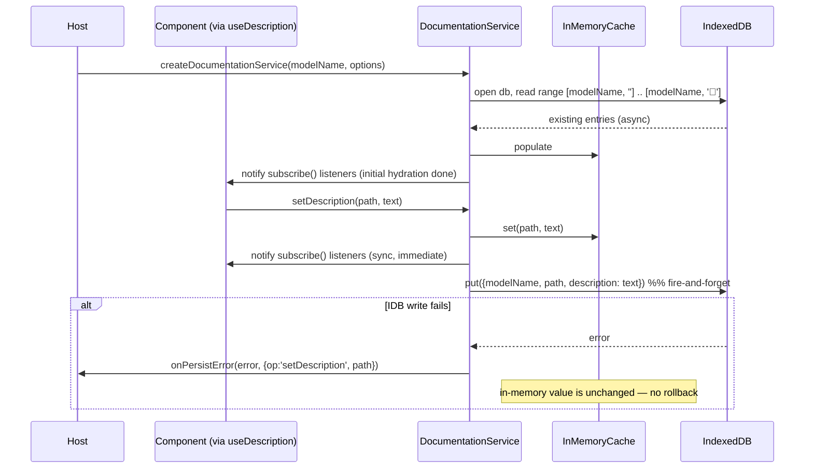

# Documentation Service

## Summary

Implement `DocumentationService` as a **standalone, framework-agnostic package** —
`src/components/documentation-service/`,
published under its own subpath export `edgerules-react/documentation-service` — rather than as an internal detail of
`BoxedEditor`. [`BOXED_EDITOR_STORY.md`](BOXED_EDITOR_STORY.md) currently defines `DocumentationService` inline (see its
["Service composition"](BOXED_EDITOR_STORY.md#service-composition) and
["`DocumentationService` API"](BOXED_EDITOR_STORY.md#documentationservice-api) sections) as a path-keyed,
IndexedDB-backed
free-text description overlay consumed by `BoxedEditor`'s `DescriptionColumn`. That contract is generic already — it
only ever deals in `(modelName, path) -> description` — so this story extracts it into its own package so
**Decision Table, Types Editor, Test Runner, Project Explorer, and the future Flow Editor** can all attach free-text
descriptions to their own paths/nodes through the same service, the same IndexedDB store, and the same React hook,
instead of each component reinventing an overlay.

This is a **data/service layer only** — no row/column UI. `BoxedEditor`'s own `DescriptionColumn` /
`hooks/useDescription.ts` / context wiring (per `BOXED_EDITOR_STORY.md`'s component tree) are a separate, later story
that *consumes* this package; they are not built here.

**No repository-wide `ARCHITECTURE.md` exists in this checkout** (checked `docs/` and the repo root — confirmed
consistent with [`BOXED_EDITOR_STORY.md`](BOXED_EDITOR_STORY.md)'s note when it hit the same state).
Per the `/new-story` process this document would normally update it; since there is nothing to update, this note
stands in for that step. If a cross-component architecture document is wanted, run the `new-architecture` skill
separately — that is a repo-wide concern, not something one service's story should originate.

## Technical Breakdown

`DocumentationService` lives at `src/components/documentation-service/`, its own npm subpath
(`edgerules-react/documentation-service`), matching every other component's packaging convention (see
[README's Project Structure](../README.md#project-structure)) — this is what makes it reusable by any component with
a path/node-keyed description need: Boxed Editor, Decision Table, Types Editor, Test Runner, Project Explorer, the
future Flow Editor. Its interface (below) is a superset of `BOXED_EDITOR_STORY.md`'s original, Boxed-Editor-only
`DocumentationService` — the additions (`subscribe`, `dispose`, `DocumentationServiceOptions`) and why each is needed
are recorded in [Resolved Decisions](#resolved-decisions) #1–#6.

`BOXED_EDITOR_STORY.md` itself is **not** edited by this story (out of scope — see below); the exact edits it needs once
this package exists are called out as an explicit Phase 3 task, to be made when this service is actually wired into
`BoxedEditor`.

### Files

```
src/components/documentation-service/
├─ index.ts                              — public exports (see Component API)
├─ documentation-service-types.ts        — DocumentationService, DocumentationServiceOptions, Unsubscribe (public)
├─ createDocumentationService.ts         — factory: modelName -> DocumentationService (in-memory cache + IndexedDB persistence)
├─ indexedDbStore.ts                     — low-level IndexedDB adapter: open/upgrade the db, hydrate-all-for-model,
│                                           put, delete; isolated here so createDocumentationService.ts stays
│                                           persistence-agnostic and testable
├─ useDescription.ts                     — React hook: useSyncExternalStore(service.subscribe, () => service.getDescription(path))
└─ __tests__/
   ├─ createDocumentationService.test.ts — hydration, get/set, renamePath, subscribe notifications, persistence
   │                                       round-trip across two independent service instances sharing one IndexedDB
   │                                       database, dispose()
   ├─ no-indexeddb-fallback.test.ts      — indexedDB unavailable at construction time -> in-memory-only, no throw
   └─ useDescription.test.tsx            — RTL: hook reflects service writes, unsubscribes on unmount
```

### `DocumentationService` API

```typescript
type Unsubscribe = () => void;

interface DocumentationServiceOptions {
    // IndexedDB database name. Defaults to 'edgerules-documentation'. Override so two independently embedded
    // instances of this library in the same browser origin (e.g. two unrelated host apps) don't share one database.
    dbName?: string;

    // Called when a background IndexedDB operation fails: a write (quota exceeded, IndexedDB disabled in private
    // browsing, etc) or the initial hydration read. The in-memory state is unaffected either way — see Error
    // handling. `path` is omitted for a `'hydrate'` failure, since it affects the whole model, not one path. Omit
    // this callback to ignore persistence failures silently.
    onPersistError?: (
        error: unknown,
        context: { op: 'hydrate' | 'setDescription' | 'renamePath'; path?: string },
    ) => void;
}

interface DocumentationService {
    // Description for a path, or undefined when none is set (including: not yet hydrated from IndexedDB).
    getDescription(path: string): string | undefined;

    // Persist an edited description; empty string clears it. Updates the in-memory value and notifies subscribers
    // synchronously; the IndexedDB write happens in the background (see Error handling).
    setDescription(path: string, description: string): void;

    // Migrate a description entry when a node's path changes (called by a host's command layer after a successful
    // rename/move on whichever CRUD-addressable service owns that path). No-op if `from` has no description.
    renamePath(from: string, to: string): void;

    // Notifies after any of the above changes the in-memory state, and once after initial IndexedDB hydration
    // completes. Lets useSyncExternalStore-based consumers (see useDescription below) stay in sync across every
    // mounted component reading this same service instance.
    subscribe(listener: () => void): Unsubscribe;

    // Closes the underlying IndexedDB connection and drops all listeners. Call on teardown (tests, or a host
    // unmounting every editor for a model). If hydration is still in flight when this is called, its result is
    // discarded on arrival — it does not touch the cache or notify listeners after disposal.
    dispose(): void;
}

// One instance owns one model's descriptions, keyed by `modelName` (any stable string identifier for the model —
// callers typically use the Portable model's own `@model-name`, but the service treats it as an opaque namespace).
// Not deduplicating: two calls with the same modelName return two independent instances with two independent
// in-memory caches, both backed by the same IndexedDB rows (see Resolved Decisions #6). A host that wants several
// components to share one cache/subscribe bus must construct the service once and pass that instance to all of them.
function createDocumentationService(
    modelName: string,
    options?: DocumentationServiceOptions,
): DocumentationService;
```

### React hook

```typescript
// Generic, service-agnostic subscription — any component wires it to whichever DocumentationService instance its
// host constructed. Boxed Editor's own `hooks/useDescription.ts` (a later story) becomes a thin wrapper that pulls
// the service out of BoxedEditorContext and delegates here; Decision Table / Types Editor / etc. can call this
// directly with no wrapper at all.
function useDescription(service: DocumentationService, path: string): string | undefined;
```

### IndexedDB schema

| Item            | Value                                                                                                                                                                                                                                                                                         |
|-----------------|-----------------------------------------------------------------------------------------------------------------------------------------------------------------------------------------------------------------------------------------------------------------------------------------------|
| Database name   | `options.dbName ?? 'edgerules-documentation'`                                                                                                                                                                                                                                                 |
| Version         | `1`                                                                                                                                                                                                                                                                                           |
| Object store    | `descriptions`                                                                                                                                                                                                                                                                                |
| Key path        | `['modelName', 'path']` — a compound array key, not a manually delimited string, so there is no need to pick (and escape) a separator character that can't appear in a path                                                                                                                   |
| Record shape    | `{ modelName: string; path: string; description: string }`                                                                                                                                                                                                                                    |
| Hydration query | On construction: one `IDBKeyRange.bound([modelName, ''], [modelName, '￿'])` cursor read over `descriptions`, populating the in-memory `Map<path, description>`; `subscribe` listeners are notified once when this completes                                                                   |
| Write           | `setDescription` → in-memory update + notify (sync) → `store.put({ modelName, path, description })` (async, best-effort)                                                                                                                                                                      |
| Delete on empty | `setDescription(path, '')` removes the IndexedDB row entirely (not a stored empty string) — keeps the store free of clutter and matches "empty string clears it" from the original spec wording; if `path` already had no stored description, this is a pure no-op (no IndexedDB call at all) |
| Rename          | `renamePath(from, to)` → in-memory delete `from` / set `to` + notify (sync) → async `store.delete([modelName, from])` then `store.put({ modelName, path: to, description })`, only if `from` had a description                                                                                |

### Error handling

- **Synchronous API, asynchronous persistence.** Per the original spec, `getDescription`/`setDescription`/`renamePath`
  are synchronous — this story keeps that contract rather than turning it into a `Promise`-based API, because the
  consumer-facing shape (a description column cell in a treegrid) needs to read/write on every keystroke/blur without
  the caller managing a promise per cell. The in-memory cache is therefore the source of truth for reads; IndexedDB is
  a best-effort backing store written to after the fact.
- **Persistence failure does not roll back the in-memory value.** If the background `put`/`delete` rejects, the
  edit the user made is still reflected in `getDescription`/`subscribe` for the rest of the session — reverting it
  silently out from under the user mid-edit would be worse than an unpersisted description. `onPersistError` (if
  provided) is called so a host can surface a toast/warning; the service itself does not retry.
- **No IndexedDB available** (`typeof indexedDB === 'undefined'` — SSR, a Node test environment without a polyfill,
  or a browser with IndexedDB disabled): `createDocumentationService` does not throw. It falls back to in-memory-only
  operation — reads/writes/`subscribe` all work for the lifetime of the instance, nothing persists across reloads.
  This keeps hosts that server-render (Next.js, etc.) from crashing just because this service was constructed.
- **Hydration failure** (IndexedDB is available but the initial read errors — a corrupted database, a blocked
  version upgrade, etc.): treated the same as "no IndexedDB available" from that point on — the cache starts empty
  and the instance continues operating in-memory-only for the rest of its lifetime (no retry). Reported via
  `onPersistError(error, { op: 'hydrate' })` if the host provided one. `subscribe` listeners are still notified once
  hydration settles (successfully or not), so a `useSyncExternalStore` consumer doesn't wait forever for a first
  paint.
- **`dispose()` during in-flight hydration**: the pending hydration promise's eventual result (success or failure)
  is discarded when it arrives — no cache update, no `onPersistError` call, no listener notification. `dispose()`
  itself already dropped every listener, so this is mostly a safety net against acting on a closed IndexedDB
  connection.

### Structural Diagram

```mermaid
classDiagram
    class DocumentationService {
        <<interface>>
        +getDescription(path) string?
        +setDescription(path, description) void
        +renamePath(from, to) void
        +subscribe(listener) Unsubscribe
        +dispose() void
    }
    class InMemoryCache {
        <<internal>>
        Map~path, description~
        +get(path) string?
        +set(path, description) void
        +rename(from, to) void
    }
    class IndexedDbStore {
<<internal, optional>>
+hydrateAll(modelName) Promise~Entry[]~
+put(modelName, path, description) Promise~void~
+delete(modelName, path) Promise~void~
}
class useDescription {
<<hook>>
+useDescription(service, path) string?
}
DocumentationService <|.. createDocumentationService: implements
createDocumentationService --> InMemoryCache: reads/writes (sync)
createDocumentationService --> IndexedDbStore : hydrate on construct; put/delete on write (async, best-effort)
useDescription --> DocumentationService: useSyncExternalStore(subscribe, getDescription)

BoxedEditor ..> useDescription: future story
DecisionTableEditor ..> useDescription: future story
TypesEditor ..> useDescription: future story
ProjectExplorer ..> useDescription: future story
```

### Behavioral Diagram



## Testing Strategy

- `DocumentationService` is unit tested against **`fake-indexeddb`**, a spec-compliant, in-memory reimplementation
  of the browser `indexedDB` global (transactions, key ranges, compound keys all behave the same as a real
  browser's IndexedDB — it just isn't backed by disk). This is a substitute for a missing **browser API** — this
  project's `vitest` environment (`jsdom`) does not implement IndexedDB at all — not a mock of application logic,
  so it is not an exception to [`CLAUDE.md`](../CLAUDE.md)'s "test against the real engine, never mock" rule:
  `DocumentationService` has no EdgeRules engine dependency whatsoever (no `@edgerules/web`/`@edgerules/node`
  import anywhere in this package), so that rule does not apply here in the first place.
- `fake-indexeddb/auto` is imported **locally**, inside the test files that need it, not globally in
  `vitest.setup.ts` — this keeps `no-indexeddb-fallback.test.ts` able to exercise the true no-`indexedDB`-global
  case without every other test file's `indexedDB` being polyfilled out from under it.
- No Playwright/e2e coverage is added by this story — there is no UI to click through yet (see
  [Out of Scope](#out-of-scope)); e2e coverage belongs to whichever later story wires `useDescription` into a
  visible component.

## Out of Scope

- `BoxedEditor`'s `DescriptionColumn`, its `hooks/useDescription.ts` wrapper, and `BoxedEditorContext` wiring — a
  later Boxed Editor UI story consumes this package; nothing under `src/components/boxed-editor/` is touched here.
- Any other component's UI wiring (Decision Table, Types Editor, Test Runner, Project Explorer, Flow Editor).
- `TestCasesService` — the sibling overlay from `BOXED_EDITOR_STORY.md`. Not addressed by this story; a future story
  can decide whether it follows the same standalone-package pattern (see Resolved Decision #8).
- Folding descriptions into the Portable `@description` metadata (export/import) — `BOXED_EDITOR_STORY.md`'s Resolved
  Decision #10 already settled this as out of scope for the overlay approach generally.
- Bulk operations (`listDescriptions()`, export/import across a model rename) — see Resolved Decision #7 and
  [Follow-up Stories](#follow-up-stories).
- Editing `BOXED_EDITOR_STORY.md` itself — the exact edits it needs are listed as a Phase 3 task, done when this
  service is actually wired into `BoxedEditor`, not now.

## Tasks

**Phase 1: Package scaffold + core service (framework-agnostic)**

- [x] Ensure project compiles and existing tests are passing
- [x] Add `documentation-service-types.ts`: `DocumentationService`, `DocumentationServiceOptions`, `Unsubscribe`
- [x] Add `indexedDbStore.ts`: open/upgrade the `descriptions` object store (compound `['modelName','path']` key),
  `hydrateAll(modelName)`, `put`, `delete`
- [x] Add `createDocumentationService.ts`: in-memory `Map` cache, synchronous `getDescription`/`setDescription`/
  `renamePath`/`subscribe`/`dispose`, async hydration-on-construct, best-effort async persistence with
  `onPersistError`, and the no-`indexedDB` in-memory-only fallback
- [x] Add `index.ts` exporting `DocumentationService`, `DocumentationServiceOptions`, `Unsubscribe`,
  `createDocumentationService`
- [x] Add `package.json` `./documentation-service` export entry and `tsup.config.ts` entry, mirroring the existing
  `boxed-editor`/`decision-table`/etc. entries
- [x] Add `fake-indexeddb` as a devDependency (spec-compliant in-memory IndexedDB for tests — not a mock of this
  package's own logic, only of the browser API it depends on)
- [x] Add `__tests__/createDocumentationService.test.ts` (importing `fake-indexeddb/auto` locally, not globally in
  `vitest.setup.ts`): hydration from pre-seeded entries, get/set round trip, empty-string clears the IndexedDB row,
  `renamePath` migrates an existing entry and no-ops for a path with no description, `subscribe` fires on write and
  once after hydration, two independent `createDocumentationService` instances over the same `dbName`/`modelName`
  observe each other's persisted writes after re-hydration, `dispose()` stops further notifications
- [x] Add `__tests__/no-indexeddb-fallback.test.ts`: with `indexedDB` deleted from `globalThis` for the test, service
  still supports get/set/subscribe in-memory and does not throw at construction or on write
- [x] `npm run build` succeeds with the `documentation-service` entry now resolvable
- [x] Mark all checkboxes as done in this document once verified

**Phase 2: React hook**

- [x] Ensure project compiles and existing tests are passing
- [x] Add `useDescription.ts`: `useSyncExternalStore(service.subscribe, () => service.getDescription(path))`
- [x] Export `useDescription` from `index.ts`
- [x] Add `__tests__/useDescription.test.tsx` (RTL, real `createDocumentationService` with `fake-indexeddb/auto`):
  initial read, re-renders on `setDescription` from outside the hook, re-renders on `renamePath`, no update after
  unmount (subscription cleaned up)
- [x] Add a Storybook story under `stories/documentation-service/` demonstrating two components sharing one
  `DocumentationService` instance and staying in sync
- [x] Mark all checkboxes as done in this document once verified

**Phase 3: Quality gate**

- [x] Ensure project compiles and existing tests are passing
- [x] Update `docs/BOXED_EDITOR_STORY.md`: replace the inline `DocumentationService` interface in
  ["`DocumentationService` API"](BOXED_EDITOR_STORY.md#documentationservice-api) with a reference to this package and
  story; update the ["Service composition"](BOXED_EDITOR_STORY.md#service-composition) table's `DocumentationService`
  row; update the ["Component API" export-surface note](BOXED_EDITOR_STORY.md#component-api) so `DocumentationService`
  and its data types are described as re-exported/imported from `edgerules-react/documentation-service` rather than
  defined locally; update the ["React integration"](BOXED_EDITOR_STORY.md#react-integration) section's mention of
  `DocumentationService`/`useDescription` accordingly
- [x] Update `README.md`'s Project Structure section to mention `documentation-service` as a shared, non-visual
  service package (distinct from the GUI-component checklist at the top of the file)
- [x] Update `docs/BUG_REPORTS.md` with any engine/browser gaps found during Phases 1–2 — none: this package has no
  `@edgerules/web`/`@edgerules/node` dependency, so no engine/browser gap was in scope to find
- [x] Ensure new tests are added for the new feature and all tests are passing
- [x] Perform linting and formatting to maintain code quality and consistency (`npm run format`, `npm run typecheck`)
- [x] Review the implementation to ensure it meets the requirements and follows best practices
- [x] Mark all checkboxes as done in this document once verified

## Resolved Decisions

| # | Decision                                                       | Resolution                                                                                                                                                                                                                                                                                                                                                                                                                                                                                                                                                                            |
|---|----------------------------------------------------------------|---------------------------------------------------------------------------------------------------------------------------------------------------------------------------------------------------------------------------------------------------------------------------------------------------------------------------------------------------------------------------------------------------------------------------------------------------------------------------------------------------------------------------------------------------------------------------------------|
| 1 | Package location & export surface                              | `src/components/documentation-service/`, its own `edgerules-react/documentation-service` subpath — matching every other component's packaging convention rather than living inside `boxed-editor`. Generalizes `BOXED_EDITOR_STORY.md`'s original (Boxed-Editor-only) placement.                                                                                                                                                                                                                                                                                                       |
| 2 | `subscribe` added to the interface                             | Not in the original spec's `DocumentationService`. Required once more than one mounted component can read/write the same instance (the whole point of making this reusable) — without it, a description edited in one consumer would not be reflected in another reading the same path.                                                                                                                                                                                                                                                                                               |
| 3 | `dispose` added to the interface                               | Needed to close the IndexedDB connection deterministically in tests (avoids leaking open connections across test files) and for hosts that fully unmount a model's editors.                                                                                                                                                                                                                                                                                                                                                                                                           |
| 4 | Synchronous API over an async-persisted store                  | Kept `getDescription`/`setDescription`/`renamePath` synchronous (matches the original spec) by treating the in-memory cache as the source of truth and IndexedDB as a best-effort background store, rather than switching to a `Promise`-based API. See [Error handling](#error-handling).                                                                                                                                                                                                                                                                                            |
| 5 | Compound array IndexedDB key over a delimited string           | `['modelName', 'path']` as the object store's key path, instead of e.g. `` `${modelName}::${path}` ``. Avoids picking (and escaping) a delimiter that's guaranteed never to appear in an EdgeRules path.                                                                                                                                                                                                                                                                                                                                                                              |
| 6 | Non-deduplicating factory                                      | `createDocumentationService(modelName)` returns a fresh instance (fresh cache, fresh subscribe bus) on every call, even for the same `modelName` — consistent with the same choice already made for `createBoxedEditorService` in [`BOXED_EDITOR_STORY.md`'s Open Question #2](BOXED_EDITOR_STORY.md#open-questions) ("Option 1... revisit when a second concrete consumer exists"). A host that wants several components to share state constructs the service once and passes that instance down; this story does not add identity-keyed memoization pre-emptively. |
| 7 | Bulk read / export-import deferred                             | No `listDescriptions()` (or similar bulk-read/export API) in this story — the single-path interface is sufficient for every known consumer today, and the in-memory cache already holds everything needed to add bulk access later without an IndexedDB schema change. Tracked as a [follow-up story](#follow-up-stories), not a task here.                                                                                                                                                                                                                                           |
| 8 | `DocumentationService` stays decoupled from `TestCasesService` | `DocumentationService`'s public API has no knowledge of `TestCasesService`, test cases, or test-case ids — the two overlays are consumed independently by whichever host component needs them (per `BOXED_EDITOR_STORY.md`'s "Service composition"), never through each other. A future `TestCasesService` story is expected to mirror this package's standalone structure (its own `edgerules-react/test-cases-service` subpath, its own `useTestResult` hook) for consistency, but that is that story's decision to make, not a dependency of this one.                              |

## Follow-up Stories

Work items this story deliberately defers rather than blocks on. Each needs its own story before being built.

- Bulk read / export-import (`listDescriptions()` or similar) — see Resolved Decision #7.