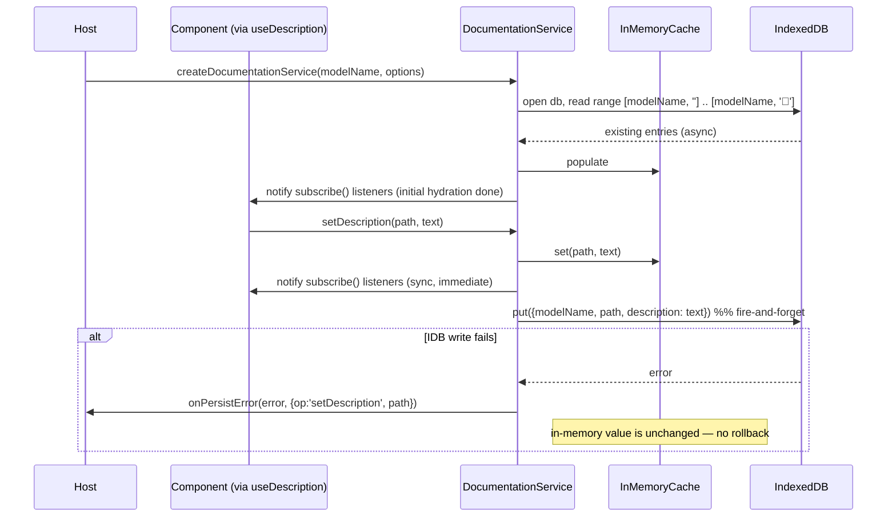

# Documentation Service

## Summary

Implement `DocumentationService` as a **standalone, framework-agnostic package** — `src/components/documentation-service/`,
published under its own subpath export `edgerules-react/documentation-service` — rather than as an internal detail of
`BoxedEditor`. [`BOXED_EDITOR_SPEC.md`](BOXED_EDITOR_SPEC.md) currently defines `DocumentationService` inline (see its
["Service composition"](BOXED_EDITOR_SPEC.md#service-composition) and
["`DocumentationService` API"](BOXED_EDITOR_SPEC.md#documentationservice-api) sections) as a path-keyed, IndexedDB-backed
free-text description overlay consumed by `BoxedEditor`'s `DescriptionColumn`. That contract is generic already — it
only ever deals in `(modelName, path) -> description` — so this story extracts it into its own package so
**Decision Table, Types Editor, Test Runner, Project Explorer, and the future Flow Editor** can all attach free-text
descriptions to their own paths/nodes through the same service, the same IndexedDB store, and the same React hook,
instead of each component reinventing an overlay.

This is a **data/service layer only** — no row/column UI. `BoxedEditor`'s own `DescriptionColumn` /
`hooks/useDescription.ts` / context wiring (per `BOXED_EDITOR_SPEC.md`'s component tree) are a separate, later story
that *consumes* this package; they are not built here.

**No repository-wide `ARCHITECTURE.md` exists in this checkout** (checked `docs/` and the repo root — confirmed
consistent with [`BOXED_EDITOR_SERVICE_STORY.md`](BOXED_EDITOR_SERVICE_STORY.md)'s note when it hit the same state).
Per the `/new-story` process this document would normally update it; since there is nothing to update, this note
stands in for that step. If a cross-component architecture document is wanted, run the `new-architecture` skill
separately — that is a repo-wide concern, not something one service's story should originate.

## Technical Breakdown

### Why standalone, and what changes vs. the current spec

| Aspect                    | `BOXED_EDITOR_SPEC.md` today                                                          | This story                                                                                                                                              |
|---------------------------|-----------------------------------------------------------------------------------------|------------------------------------------------------------------------------------------------------------------------------------------------------|
| Location                  | Defined inline in the Boxed Editor spec; implied to live under `boxed-editor`           | `src/components/documentation-service/`, its own npm subpath (`edgerules-react/documentation-service`), matching every other component's packaging convention (see [README's Project Structure](../README.md#project-structure)) |
| Consumers                 | `BoxedEditor`'s `DescriptionColumn` only                                                | Any component with a path/node-keyed description need — Boxed Editor, Decision Table, Types Editor, Test Runner, Project Explorer, Flow Editor         |
| Reactivity                | Not specified (no `subscribe` in the original interface)                                | Adds `subscribe(listener)` — required once more than one mounted consumer (e.g. Boxed Editor and Decision Table open on the same model) can read/write the same underlying store |
| Cleanup                   | Not specified                                                                            | Adds `dispose()` — closes the IndexedDB connection and drops listeners; needed for tests and for hosts that unmount a model's editors                  |
| Persistence failure       | Not specified                                                                            | `setDescription`/`renamePath` stay synchronous per the original spec, but a background IndexedDB write can fail; surfaced via an optional `onPersistError` factory callback rather than thrown (see [Error handling](#error-handling)) |
| Environment without IndexedDB | Not specified                                                                        | Falls back to in-memory-only (no persistence, no throw) — keeps SSR/Node hosts working (see [Error handling](#error-handling))                          |

`BOXED_EDITOR_SPEC.md` itself is **not** edited by this story (out of scope — see below); the exact edits it needs once
this package exists are called out as an explicit Phase 3 task, to be made when this service is actually wired into
`BoxedEditor`.

### Files

```
src/components/documentation-service/
├─ index.ts                              — public exports (see Component API)
├─ documentation-service-types.ts        — DocumentationService, DocumentationServiceOptions, Unsubscribe (public)
├─ createDocumentationService.ts         — factory: modelName -> DocumentationService (in-memory cache + IndexedDB persistence)
├─ indexedDbStore.ts                     — low-level IndexedDB adapter: open/upgrade the db, hydrate-all-for-model,
│                                           put, delete; isolated here so createDocumentationService.ts stays
│                                           persistence-agnostic and testable
├─ useDescription.ts                     — React hook: useSyncExternalStore(service.subscribe, () => service.getDescription(path))
└─ __tests__/
   ├─ createDocumentationService.test.ts — hydration, get/set, renamePath, subscribe notifications, persistence
   │                                       round-trip across two independent service instances sharing one IndexedDB
   │                                       database, dispose()
   ├─ no-indexeddb-fallback.test.ts      — indexedDB unavailable at construction time -> in-memory-only, no throw
   └─ useDescription.test.tsx            — RTL: hook reflects service writes, unsubscribes on unmount
```

### `DocumentationService` API

```typescript
type Unsubscribe = () => void;

interface DocumentationServiceOptions {
  // IndexedDB database name. Defaults to 'edgerules-documentation'. Override so two independently embedded
  // instances of this library in the same browser origin (e.g. two unrelated host apps) don't share one database.
  dbName?: string;

  // Called when a background IndexedDB write fails (quota exceeded, IndexedDB disabled in private browsing, etc).
  // The in-memory value is unaffected either way — see Error handling. Omit to ignore persistence failures silently.
  onPersistError?: (
    error: unknown,
    context: { op: 'setDescription' | 'renamePath'; path: string },
  ) => void;
}

interface DocumentationService {
  // Description for a path, or undefined when none is set (including: not yet hydrated from IndexedDB).
  getDescription(path: string): string | undefined;

  // Persist an edited description; empty string clears it. Updates the in-memory value and notifies subscribers
  // synchronously; the IndexedDB write happens in the background (see Error handling).
  setDescription(path: string, description: string): void;

  // Migrate a description entry when a node's path changes (called by a host's command layer after a successful
  // rename/move on whichever CRUD-addressable service owns that path). No-op if `from` has no description.
  renamePath(from: string, to: string): void;

  // Notifies after any of the above changes the in-memory state, and once after initial IndexedDB hydration
  // completes. Lets useSyncExternalStore-based consumers (see useDescription below) stay in sync across every
  // mounted component reading this same service instance.
  subscribe(listener: () => void): Unsubscribe;

  // Closes the underlying IndexedDB connection and drops all listeners. Call on teardown (tests, or a host
  // unmounting every editor for a model).
  dispose(): void;
}

// One instance owns one model's descriptions, keyed by `modelName` (any stable string identifier for the model —
// callers typically use the Portable model's own `@model-name`, but the service treats it as an opaque namespace).
// Not deduplicating: two calls with the same modelName return two independent instances with two independent
// in-memory caches, both backed by the same IndexedDB rows (see Resolved Decisions #6). A host that wants several
// components to share one cache/subscribe bus must construct the service once and pass that instance to all of them.
function createDocumentationService(
  modelName: string,
  options?: DocumentationServiceOptions,
): DocumentationService;
```

### React hook

```typescript
// Generic, service-agnostic subscription — any component wires it to whichever DocumentationService instance its
// host constructed. Boxed Editor's own `hooks/useDescription.ts` (a later story) becomes a thin wrapper that pulls
// the service out of BoxedEditorContext and delegates here; Decision Table / Types Editor / etc. can call this
// directly with no wrapper at all.
function useDescription(service: DocumentationService, path: string): string | undefined;
```

### IndexedDB schema

| Item             | Value                                                                                         |
|-------------------|-----------------------------------------------------------------------------------------------|
| Database name      | `options.dbName ?? 'edgerules-documentation'`                                                 |
| Version             | `1`                                                                                            |
| Object store        | `descriptions`                                                                                 |
| Key path            | `['modelName', 'path']` — a compound array key, not a manually delimited string, so there is no need to pick (and escape) a separator character that can't appear in a path |
| Record shape        | `{ modelName: string; path: string; description: string }`                                     |
| Hydration query      | On construction: one `IDBKeyRange.bound([modelName, ''], [modelName, '￿'])` cursor read over `descriptions`, populating the in-memory `Map<path, description>`; `subscribe` listeners are notified once when this completes |
| Write                | `setDescription` → in-memory update + notify (sync) → `store.put({ modelName, path, description })` (async, best-effort) |
| Delete on empty      | `setDescription(path, '')` removes the IndexedDB row entirely (not a stored empty string) — keeps the store free of clutter and matches "empty string clears it" from the original spec wording |
| Rename                | `renamePath(from, to)` → in-memory delete `from` / set `to` + notify (sync) → async `store.delete([modelName, from])` then `store.put({ modelName, path: to, description })`, only if `from` had a description |

### Error handling

- **Synchronous API, asynchronous persistence.** Per the original spec, `getDescription`/`setDescription`/`renamePath`
  are synchronous — this story keeps that contract rather than turning it into a `Promise`-based API, because the
  consumer-facing shape (a description column cell in a treegrid) needs to read/write on every keystroke/blur without
  the caller managing a promise per cell. The in-memory cache is therefore the source of truth for reads; IndexedDB is
  a best-effort backing store written to after the fact.
- **Persistence failure does not roll back the in-memory value.** If the background `put`/`delete` rejects, the
  edit the user made is still reflected in `getDescription`/`subscribe` for the rest of the session — reverting it
  silently out from under the user mid-edit would be worse than an unpersisted description. `onPersistError` (if
  provided) is called so a host can surface a toast/warning; the service itself does not retry.
- **No IndexedDB available** (`typeof indexedDB === 'undefined'` — SSR, a Node test environment without a polyfill,
  or a browser with IndexedDB disabled): `createDocumentationService` does not throw. It falls back to in-memory-only
  operation — reads/writes/`subscribe` all work for the lifetime of the instance, nothing persists across reloads.
  This keeps hosts that server-render (Next.js, etc.) from crashing just because this service was constructed.

### Structural Diagram

```mermaid
classDiagram
    class DocumentationService {
        <<interface>>
        +getDescription(path) string?
        +setDescription(path, description) void
        +renamePath(from, to) void
        +subscribe(listener) Unsubscribe
        +dispose() void
    }
    class InMemoryCache {
        <<internal>>
        Map~path, description~
        +get(path) string?
        +set(path, description) void
        +rename(from, to) void
    }
    class IndexedDbStore {
        <<internal, optional>>
        +hydrateAll(modelName) Promise~Entry[]~
        +put(modelName, path, description) Promise~void~
        +delete(modelName, path) Promise~void~
    }
    class useDescription {
        <<hook>>
        +useDescription(service, path) string?
    }
    DocumentationService <|.. createDocumentationService : implements
    createDocumentationService --> InMemoryCache : reads/writes (sync)
    createDocumentationService --> IndexedDbStore : hydrate on construct; put/delete on write (async, best-effort)
    useDescription --> DocumentationService : useSyncExternalStore(subscribe, getDescription)

    BoxedEditor ..> useDescription : future story
    DecisionTableEditor ..> useDescription : future story
    TypesEditor ..> useDescription : future story
    ProjectExplorer ..> useDescription : future story
```

### Behavioral Diagram



## Out of Scope

- `BoxedEditor`'s `DescriptionColumn`, its `hooks/useDescription.ts` wrapper, and `BoxedEditorContext` wiring — a
  later Boxed Editor UI story consumes this package; nothing under `src/components/boxed-editor/` is touched here.
- Any other component's UI wiring (Decision Table, Types Editor, Test Runner, Project Explorer, Flow Editor).
- `TestCasesService` — the sibling overlay from `BOXED_EDITOR_SPEC.md`. Not addressed by this story; a future story
  can decide whether it follows the same standalone-package pattern (see Open Questions).
- Folding descriptions into the Portable `@description` metadata (export/import) — `BOXED_EDITOR_SPEC.md`'s Resolved
  Decision #10 already settled this as out of scope for the overlay approach generally.
- Bulk operations (`listDescriptions()`, export/import across a model rename) — see Open Questions #1.
- Editing `BOXED_EDITOR_SPEC.md` itself — the exact edits it needs are listed as a Phase 3 task, done when this
  service is actually wired into `BoxedEditor`, not now.

## Tasks

**Phase 1: Package scaffold + core service (framework-agnostic)**

- [ ] Ensure project compiles and existing tests are passing
- [ ] Add `documentation-service-types.ts`: `DocumentationService`, `DocumentationServiceOptions`, `Unsubscribe`
- [ ] Add `indexedDbStore.ts`: open/upgrade the `descriptions` object store (compound `['modelName','path']` key),
  `hydrateAll(modelName)`, `put`, `delete`
- [ ] Add `createDocumentationService.ts`: in-memory `Map` cache, synchronous `getDescription`/`setDescription`/
  `renamePath`/`subscribe`/`dispose`, async hydration-on-construct, best-effort async persistence with
  `onPersistError`, and the no-`indexedDB` in-memory-only fallback
- [ ] Add `index.ts` exporting `DocumentationService`, `DocumentationServiceOptions`, `Unsubscribe`,
  `createDocumentationService`
- [ ] Add `package.json` `./documentation-service` export entry and `tsup.config.ts` entry, mirroring the existing
  `boxed-editor`/`decision-table`/etc. entries
- [ ] Add `fake-indexeddb` as a devDependency (spec-compliant in-memory IndexedDB for tests — not a mock of this
  package's own logic, only of the browser API it depends on)
- [ ] Add `__tests__/createDocumentationService.test.ts` (importing `fake-indexeddb/auto` locally, not globally in
  `vitest.setup.ts`): hydration from pre-seeded entries, get/set round trip, empty-string clears the IndexedDB row,
  `renamePath` migrates an existing entry and no-ops for a path with no description, `subscribe` fires on write and
  once after hydration, two independent `createDocumentationService` instances over the same `dbName`/`modelName`
  observe each other's persisted writes after re-hydration, `dispose()` stops further notifications
- [ ] Add `__tests__/no-indexeddb-fallback.test.ts`: with `indexedDB` deleted from `globalThis` for the test, service
  still supports get/set/subscribe in-memory and does not throw at construction or on write
- [ ] `npm run build` succeeds with the `documentation-service` entry now resolvable
- [ ] Mark all checkboxes as done in this document once verified

**Phase 2: React hook**

- [ ] Ensure project compiles and existing tests are passing
- [ ] Add `useDescription.ts`: `useSyncExternalStore(service.subscribe, () => service.getDescription(path))`
- [ ] Export `useDescription` from `index.ts`
- [ ] Add `__tests__/useDescription.test.tsx` (RTL, real `createDocumentationService` with `fake-indexeddb/auto`):
  initial read, re-renders on `setDescription` from outside the hook, re-renders on `renamePath`, no update after
  unmount (subscription cleaned up)
- [ ] Add a Storybook story under `stories/documentation-service/` demonstrating two components sharing one
  `DocumentationService` instance and staying in sync
- [ ] Mark all checkboxes as done in this document once verified

**Phase 3: Quality gate**

- [ ] Ensure project compiles and existing tests are passing
- [ ] Resolve [Open Questions](#open-questions) below (or record the architect's decision inline in this document,
  matching the style already used for `BOXED_EDITOR_SPEC.md`'s own open questions)
- [ ] Update `docs/BOXED_EDITOR_SPEC.md`: replace the inline `DocumentationService` interface in
  ["`DocumentationService` API"](BOXED_EDITOR_SPEC.md#documentationservice-api) with a reference to this package and
  story; update the ["Service composition"](BOXED_EDITOR_SPEC.md#service-composition) table's `DocumentationService`
  row; update the ["Component API" export-surface note](BOXED_EDITOR_SPEC.md#component-api) so `DocumentationService`
  and its data types are described as re-exported/imported from `edgerules-react/documentation-service` rather than
  defined locally; update the ["React integration"](BOXED_EDITOR_SPEC.md#react-integration) section's mention of
  `DocumentationService`/`useDescription` accordingly
- [ ] Update `README.md`'s Project Structure section to mention `documentation-service` as a shared, non-visual
  service package (distinct from the GUI-component checklist at the top of the file)
- [ ] Update `docs/BUG_REPORTS.md` with any engine/browser gaps found during Phases 1–2
- [ ] Ensure new tests are added for the new feature and all tests are passing
- [ ] Perform linting and formatting to maintain code quality and consistency (`npm run format`, `npm run typecheck`)
- [ ] Review the implementation to ensure it meets the requirements and follows best practices
- [ ] Mark all checkboxes as done in this document once verified

## Resolved Decisions

| # | Decision                                             | Resolution                                                                                                                                                                                                                                                                                                                     |
|---|-------------------------------------------------------|----------------------------------------------------------------------------------------------------------------------------------------------------------------------------------------------------------------------------------------------------------------------------------------------------------------------------|
| 1 | Package location & export surface                     | `src/components/documentation-service/`, its own `edgerules-react/documentation-service` subpath — matching every other component's packaging convention rather than living inside `boxed-editor`. Generalizes `BOXED_EDITOR_SPEC.md`'s original (Boxed-Editor-only) placement. |
| 2 | `subscribe` added to the interface                     | Not in the original spec's `DocumentationService`. Required once more than one mounted component can read/write the same instance (the whole point of making this reusable) — without it, a description edited in one consumer would not be reflected in another reading the same path. |
| 3 | `dispose` added to the interface                       | Needed to close the IndexedDB connection deterministically in tests (avoids leaking open connections across test files) and for hosts that fully unmount a model's editors. |
| 4 | Synchronous API over an async-persisted store          | Kept `getDescription`/`setDescription`/`renamePath` synchronous (matches the original spec) by treating the in-memory cache as the source of truth and IndexedDB as a best-effort background store, rather than switching to a `Promise`-based API. See [Error handling](#error-handling). |
| 5 | Compound array IndexedDB key over a delimited string   | `['modelName', 'path']` as the object store's key path, instead of e.g. `` `${modelName}::${path}` ``. Avoids picking (and escaping) a delimiter that's guaranteed never to appear in an EdgeRules path. |
| 6 | Non-deduplicating factory                              | `createDocumentationService(modelName)` returns a fresh instance (fresh cache, fresh subscribe bus) on every call, even for the same `modelName` — consistent with the same choice already made for `createBoxedEditorService` in [`BOXED_EDITOR_SERVICE_STORY.md`'s Open Question #2](BOXED_EDITOR_SERVICE_STORY.md#open-questions) ("Option 1... revisit when a second concrete consumer exists"). A host that wants several components to share state constructs the service once and passes that instance down; this story does not add identity-keyed memoization pre-emptively. |

## Open Questions

1. **Bulk read / export-import.** The interface is single-path (`getDescription`/`setDescription`/`renamePath`). If
   a host later needs to export a model (with its descriptions) under a new `modelName`, or bulk-list every
   description for a model (e.g. a "find all documented fields" search), there is no API for that today.
   Question to address: is a `listDescriptions(): Record<string, string>` (or similar) needed now, or should it wait
   until a concrete consumer needs it?
   Option 1 (recommended): leave it out of this story — no current consumer needs bulk access, and the in-memory
   cache already holds everything needed to add it later without an IndexedDB schema change.
   Option 2: add `listDescriptions()` now, since it's a small addition on top of the already-hydrated in-memory cache.

> Architect notes: Option 1 (recommended): leave it out of this story. Add followup section, but no tasks with checkboxes to it. It will be done later by architect.

2. **Should `TestCasesService` follow the same pattern?** `BOXED_EDITOR_SPEC.md`'s other overlay,
   `TestCasesService`, has the same shape problem (currently defined inline, Boxed-Editor-only) but is read-only and
   keyed by `(testCaseId, path)` rather than just `path`, and is out of scope for this story.
   Question to address: should a future `TestCasesService` story mirror this package's structure (standalone,
   `edgerules-react/test-cases-service` subpath, `useTestResult` hook), for consistency across the two overlays?
   Option 1 (recommended): yes, once that story is written — no action needed here, just a note so that story's
   author is aware of the precedent.
   Option 2: leave `TestCasesService` embedded in `boxed-editor` since, unlike descriptions, no other component has
   voiced a concrete need for test results yet.

> Architect notes: TestCasesService will not interact with DocumentationService via Boxed Editor, so DocumentationService will not even know anything about TestCasesService.

> Architect notes: add to this spec: for unit tests mocked IndexedDB will be used.