# EdgeRules Global Project Management Architecture

> Status: target architecture for the EdgeRules Modeler, project format, cloud persistence, repository connectors,
> public examples catalog, and agentic maintenance.
>
> This document is intentionally broader than the React component architecture in
> [`docs/ARCHITECTURE.md`](docs/ARCHITECTURE.md). It defines the authored project, the services around it, and the
> boundaries between source, interchange, runtime, cloud, Git, and deployment artifacts.

## 1. Executive decisions

| Area                  | Decision                                                                                                        |
| --------------------- | --------------------------------------------------------------------------------------------------------------- |
| Authored model source | EdgeRules DSL (`model/main.edge`) is the only human/agent-authored semantic source.                             |
| Machine interchange   | EdgeRules Portable JSON is the canonical machine serialization and API contract.                                |
| Runtime authority     | The loaded engine AST/TAST is authoritative only for the lifetime of a `ProjectSession`.                        |
| Structured edits      | Structured editors mutate the engine AST; `toCode()` immediately regenerates canonical DSL.                     |
| Portable persistence  | Portable is generated and validated from DSL. It is not independently edited in a Git project.                  |
| Project format        | A project is a versioned, schema-validated directory rooted by `edgerules.project.json`.                        |
| Transfer package      | `.erproject` is a deterministic ZIP representation of the authored directory plus integrity metadata.           |
| Deployment package    | `.bim` is a separate compiled/runtime artifact; it is never the Modeler authoring format.                       |
| Project state         | One framework-neutral `ProjectSession` owns one open working copy and all cross-slice transactions.             |
| React integration     | `ProjectProvider` injects a stable session; hooks subscribe to immutable slices.                                |
| Cloud durability      | PostgreSQL owns identity, authorization, heads, and revisions; object storage owns immutable blobs.             |
| Browser durability    | IndexedDB or OPFS is a recovery/offline cache, never the sole cloud authority.                                  |
| Git connector         | A backend GitHub App performs Git operations. Provider credentials never enter browser state.                   |
| Examples              | A separate Git repository contains approximately 200 complete projects in the public project format.            |
| Examples delivery     | CI publishes a static catalog index and immutable project artifacts to a CDN/object store.                      |
| Agent maintenance     | Git directories are the reviewable source of truth; MCP is an optional semantic maintenance facade.             |
| Agent editing format  | Agents edit concise DSL, Markdown, and small JSON sidecars—not generated whole-model Portable JSON.             |
| Concurrency           | Optimistic compare-and-swap plus three-way merge; no silent last-writer-wins.                                   |
| Collaboration         | Do not introduce CRDTs until simultaneous real-time editing is a confirmed requirement.                         |
| Validation            | Every JSON document uses JSON Schema Draft 2020-12; every project also passes engine and cross-file validation. |
| Stable identity       | Persist engine-owned IDs only for model entities referenced by tests, docs, or flow metadata.                   |
| Derived data          | Test results, Portable projections, schemas, previews, search indexes, and TAST are rebuildable artifacts.      |

## 2. Architecture principles

1. **One writable authority per concern.**
2. **Source must be compact, reviewable, diffable, and friendly to coding agents.**
3. **Machine representations must be deterministic, schema-validatable, and losslessly convertible.**
4. **All authored project slices are versioned together.**
5. **Remote writes are conditional; overwriting an unknown revision is forbidden.**
6. **Provider credentials and cloud identity never become project content.**
7. **Derived data is reproducible and disposable.**
8. **The public project format is framework-neutral and independent of React.**
9. **Project services expose ports; cloud, Git, memory, and test implementations are adapters.**
10. **Start with snapshot revisions and commands; add distributed-editing machinery only when required.**

## 3. Global component diagram

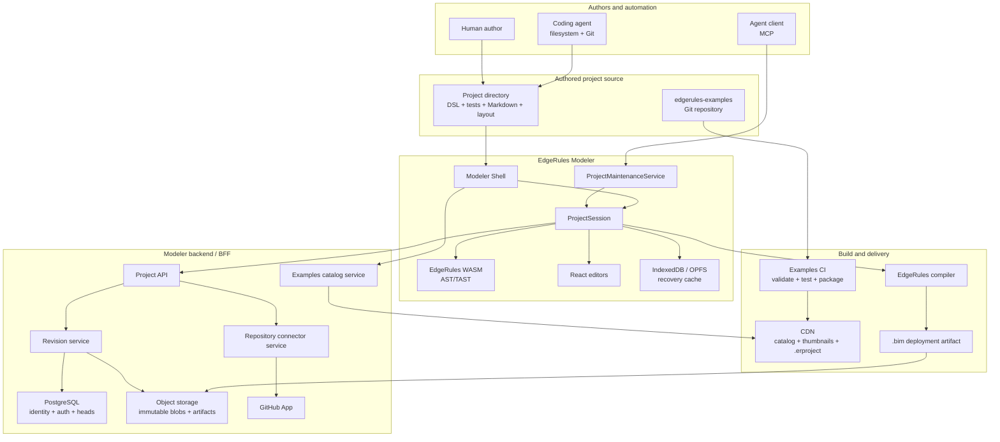

## 4. Representation and authority model

### 4.1 Authority table

| Representation          | Purpose                                        |            Authored? |              Durable? | Authority                        |
| ----------------------- | ---------------------------------------------- | -------------------: | --------------------: | -------------------------------- |
| `model/main.edge`       | Human/agent source and Git review              |                  Yes |                   Yes | Authored model source            |
| EdgeRules Portable JSON | API exchange, validation, normalized snapshots |                   No | As a derived artifact | Canonical machine serialization  |
| Engine AST              | CRUD and structured editing                    |           Indirectly |                    No | In-memory semantic working state |
| Engine TAST             | Linked execution plan                          |                   No |        Optional cache | Derived runtime state            |
| Invalid DSL draft       | In-progress Code Editor text                   | Yes, but uncommitted |  Recovery stores only | Local working draft              |
| `.erproject`            | Import/export and transport                    |                   No |                   Yes | Packaged authored source         |
| `.bim`                  | Deployment and fast runtime startup            |                   No |                   Yes | Compiled deployment artifact     |

### 4.2 Why DSL is the authored source

| Criterion                        |                 DSL |                              Portable JSON |
| -------------------------------- | ------------------: | -----------------------------------------: |
| Agent token efficiency           |                Best |               Poor for large nested models |
| Human readability                |                Best |                                 Acceptable |
| Git diff quality                 |                Best | Good only with strict canonical formatting |
| Comments and explanatory context |             Natural |                                    Awkward |
| JSON Schema validation           |      Not applicable |                                       Best |
| Structured CRUD                  |  Through engine AST |                                    Natural |
| Stable machine interchange       |  Good after parsing |                                       Best |
| Runtime loading                  | Requires parse/link |                      Direct AST conversion |

**Decision:** do not make agents maintain generated Portable JSON merely because JSON is easier to validate. Validate
the DSL through the engine, then validate the generated Portable projection against its JSON Schema.

### 4.3 One-way authoring, symmetric conversion

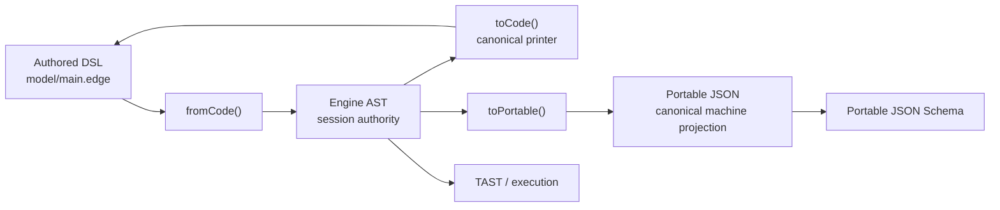

There are never two independently writable model files. Portable may be cached, packaged, or deployed, but its source
revision always identifies the DSL revision from which it was generated.

### 4.4 Required WASM API

```ts
interface MutableDecisionService {
  // Construction
  static fromCode(source: string): MutableDecisionService;
  static fromPortable(model: PortableRootContext): MutableDecisionService;

  // Deterministic serialization
  toCode(options?: { format?: 'canonical' }): string;
  toPortable(): PortableRootContext;

  // Existing semantic operations
  get(path: string, filter?: PortableFilter): PortableNode | PortableError;
  set(path: string, node: PortableNode): PortableNode | PortableError;
  remove(path: string): void | PortableError;
  rename(path: string, newName: string): void | PortableError;

  // Persistent project identity
  ensureEntityId(path: string): string | PortableError;
  pathForEntityId(id: string): string | PortableError;
}
```

Required invariants:

| Invariant                                                                                   | Gate                           |
| ------------------------------------------------------------------------------------------- | ------------------------------ |
| `fromCode(toCode(service))` preserves authored semantics                                    | Engine round-trip tests        |
| `fromPortable(toPortable(service))` preserves authored semantics                            | Engine round-trip tests        |
| DSL → Portable → DSL preserves authored semantics                                           | Cross-format property tests    |
| Portable → DSL → Portable produces normalized equivalent Portable                           | Canonicalization tests         |
| `toCode()` is deterministic for the same authored AST                                       | Snapshot/reproducibility tests |
| Structured CRUD followed by `toCode()` produces valid DSL                                   | CRUD integration tests         |
| Metadata required by the Modeler survives both formats                                      | Annotation/identity tests      |
| Linked/read-only projections are not written back as authored Portable                      | Portable normalization tests   |
| `ensureEntityId()` is idempotent and survives rename/move/round-trip                        | Persistent-identity tests      |
| `pathForEntityId()` resolves the current authored path or a structured missing-entity error | Identity lookup tests          |

### 4.5 Comments and formatting

| Concern                                       | Decision                                                                                                           |
| --------------------------------------------- | ------------------------------------------------------------------------------------------------------------------ |
| Formatting                                    | `toCode()` emits one deterministic canonical style.                                                                |
| Initial formatting churn                      | Accept one canonicalization diff when an older model is first structurally edited.                                 |
| Long-form documentation                       | Store in Markdown sidecars, not comments.                                                                          |
| Short implementation comments                 | Preserve as AST trivia where practical.                                                                            |
| Comments unsupported by structured round-trip | The engine must either preserve them or reject a supposedly lossless operation; silent deletion is not acceptable. |
| Semantic descriptions                         | Resolve the engine `@description` contract or keep descriptions solely in project documentation sidecars.          |

## 5. Authored project package

### 5.1 Directory layout

```text
loan-origination/
├── edgerules.project.json              # Required project manifest
├── model/
│   └── main.edge                       # Required authored model source
├── tests/
│   ├── eligibility.tests.json          # Optional, one independently mergeable suite
│   └── pricing.tests.json
├── docs/
│   ├── README.md                       # Optional project overview
│   ├── index.json                      # Optional entity-to-document bindings
│   └── nodes/
│       ├── 0190f5c0-....md
│       └── 0190f5c1-....md
├── flow/
│   └── layout.json                     # Optional presentation metadata
└── assets/
    └── thumbnail.webp                  # Optional public/catalog assets
```

Local generated data is outside the authored package or ignored:

```text
.edgerules/
├── cache/
│   ├── model.portable.json
│   └── schema.json
├── recovery/
└── results/
```

### 5.2 Manifest

```json
{
  "$schema": "https://schemas.edgerules.io/project/v1/project.schema.json",
  "kind": "EdgeRulesProject",
  "formatVersion": 1,
  "name": "loan-origination",
  "title": "Loan Origination",
  "summary": "Credit assessment and offer-generation example.",
  "industries": ["banking"],
  "tags": ["credit", "eligibility", "pricing"],
  "license": "Apache-2.0",
  "engine": {
    "languageVersion": "1",
    "minimumEngineVersion": "0.0.2"
  },
  "model": {
    "format": "dsl",
    "source": "model/main.edge"
  },
  "tests": ["tests/eligibility.tests.json", "tests/pricing.tests.json"],
  "documentation": {
    "overview": "docs/README.md",
    "index": "docs/index.json"
  },
  "flow": {
    "layout": "flow/layout.json"
  }
}
```

### 5.3 Metadata boundaries

| Metadata                     | Location                          | Reason                                         |
| ---------------------------- | --------------------------------- | ---------------------------------------------- |
| Package name/title/summary   | `edgerules.project.json`          | Portable, searchable project presentation      |
| Industry/tags/license        | `edgerules.project.json`          | Catalog and reuse policy                       |
| Project format version       | `edgerules.project.json`          | Package migration                              |
| DSL/language compatibility   | `edgerules.project.json`          | Load and tooling gate                          |
| Model execution name/version | DSL root / Portable root metadata | Execution-envelope contract                    |
| Cloud project UUID           | Cloud database                    | Copies and forks require new platform identity |
| Tenant/owner/members         | Cloud database                    | Authorization is not source content            |
| Connector/repository/branch  | Connector record                  | Environment-specific and often sensitive       |
| Head revision                | Repository/cloud envelope         | Mutable concurrency token                      |
| Revision author/message/time | Revision envelope or Git commit   | History, not authored state                    |
| Fork provenance              | Cloud/catalog relationship        | Must survive without polluting reusable source |
| Build compiler version       | Derived artifact manifest         | Reproducibility                                |

Rules:

1. A copied directory remains a valid project without retaining another user's cloud identity.
2. Forks retain internal model entity IDs so upstream comparison and merge remain possible.
3. Cloud `projectId` and project manifest `name` are different concepts.
4. Package format version, DSL language version, model execution version, release version, and compiler version are
   independently named and independently evolved.

## 6. Stable model identity

### 6.1 Problem

Tests, documentation, and flow metadata currently refer to mutable dotted paths. A rename performed outside the Modeler
can orphan all three sidecars.

### 6.2 Decision

Add an engine-owned persistent entity identity contract before the public project format becomes stable.

| Rule                    | Decision                                                                            |
| ----------------------- | ----------------------------------------------------------------------------------- |
| ID type                 | UUIDv7 or another standardized, opaque, collision-resistant identifier              |
| Scope                   | Unique within the project; globally unique generation makes merging simpler         |
| Allocation              | Lazy: required only when an addressable entity is referenced by a sidecar           |
| DSL representation      | Engine-defined metadata/annotation supported by the authoritative DSL specification |
| Portable representation | Reserved `@id` metadata owned by `edgerules-v2`                                     |
| Rename/move             | ID is preserved                                                                     |
| Copy/fork               | ID is preserved                                                                     |
| Duplicate node          | New ID is allocated                                                                 |
| Merge collision         | Validator rejects two live entities with one ID                                     |
| Type definitions        | Must support IDs if documentation/tests/flow can reference them                     |
| Expression internals    | No persistent ID unless they become externally addressable                          |
| Lookup API              | `ensureEntityId(path)` and `pathForEntityId(id)` are engine operations              |

The exact DSL syntax belongs in the authoritative `edgerules-v2` DSL and Portable specifications. The React repository
must not privately invent it.

### 6.3 Entity reference

```ts
interface ModelEntityRef {
  id: string;
  path?: string; // Human-readable cache/hint, never identity.
}
```

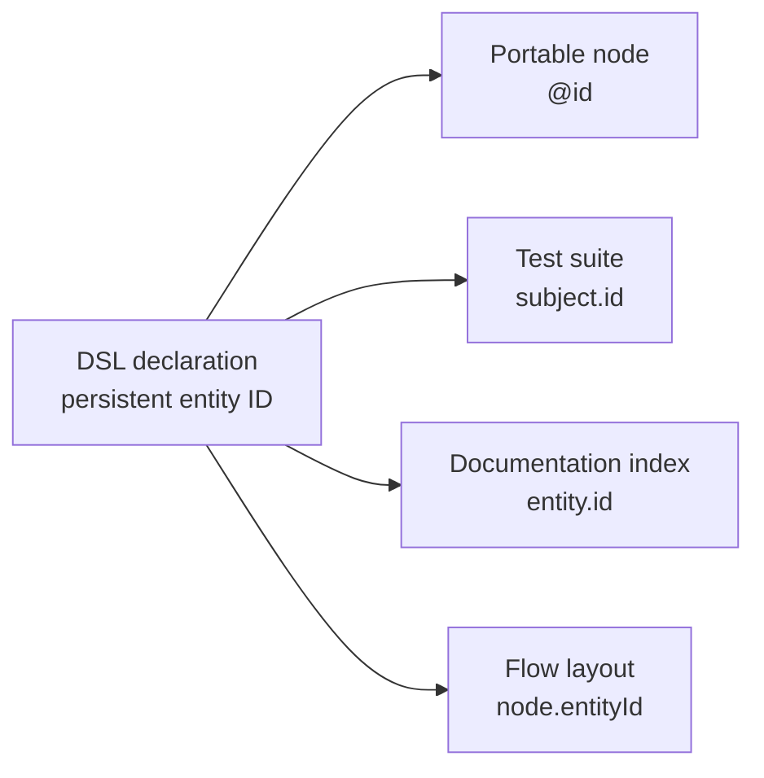

Until this contract is implemented:

- use paths;
- route every Modeler rename through one `ProjectSession` transaction;
- validate every cross-file path in CI;
- describe paths honestly as mutable references, not stable identity.

## 7. Test project format

### 7.1 Storage rules

| Concern        | Decision                                                                 |
| -------------- | ------------------------------------------------------------------------ |
| Granularity    | One JSON file per test suite/subject for smaller merge conflicts         |
| Schema         | Versioned JSON Schema Draft 2020-12                                      |
| Values         | Portable-compatible typed values, not UI-only raw cell strings           |
| Stable IDs     | Suite, case, and authored-row IDs are stable                             |
| Subject        | Persistent model entity reference; path retained only as display hint    |
| Derived rows   | Recomputed from model schema; not persisted unless explicitly customized |
| Results        | Never stored in authored test files                                      |
| Large fixtures | Referenced JSON files under `tests/fixtures/`                            |
| Execution      | Same suite format is used by Modeler, CI, and headless runner            |

### 7.2 Shape

```json
{
  "$schema": "https://schemas.edgerules.io/project/v1/test-suite.schema.json",
  "schemaVersion": 1,
  "id": "0190f5c0-6e62-7d1f-a6c4-b69fd19b6634",
  "name": "Eligibility",
  "subject": {
    "id": "0190f5b8-54f5-75fd-9df3-e52f948a49c1",
    "path": "eligibility"
  },
  "cases": [
    {
      "id": "0190f5c2-cc50-7b56-8c99-b5912b189ff3",
      "name": "Standard approval",
      "inputs": {
        "applicant.age": 32,
        "applicant.income": 72000
      },
      "expect": {
        "approved": true
      }
    }
  ]
}
```

### 7.3 Result lifecycle

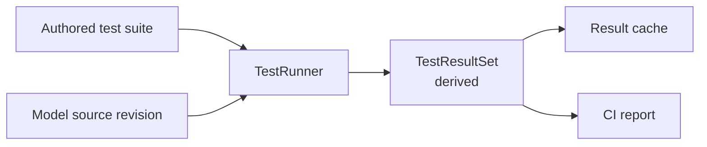

Results are keyed by `(sourceRevision, engineVersion, suiteId, caseId)` and become stale when any key changes.

## 8. Documentation project format

| Artifact                | Purpose                                                               |
| ----------------------- | --------------------------------------------------------------------- |
| `docs/README.md`        | Project overview, domain narrative, inputs/outputs, and usage         |
| `docs/index.json`       | Stable entity ID to Markdown document mapping                         |
| `docs/nodes/<id>.md`    | Long-form documentation for a model entity                            |
| DSL comments            | Short implementation context only                                     |
| Portable `@description` | Optional compact description only after engine round-trip is reliable |

Example index:

```json
{
  "$schema": "https://schemas.edgerules.io/project/v1/documentation-index.schema.json",
  "schemaVersion": 1,
  "entities": {
    "0190f5b8-54f5-75fd-9df3-e52f948a49c1": {
      "path": "eligibility",
      "document": "nodes/0190f5b8-54f5-75fd-9df3-e52f948a49c1.md"
    }
  }
}
```

Markdown is preferred over JSON string fields because it is more readable, more reviewable, and substantially more
token-efficient for coding agents.

## 9. Flow metadata

### 9.1 Authority split

| Concern                                            | Authority                                        |
| -------------------------------------------------- | ------------------------------------------------ |
| Executable rule semantics                          | DSL / engine AST                                 |
| Modeler node role and label that must round-trip   | Engine-owned DSL/Portable metadata               |
| Node position, size, collapsed state, group, color | `flow/layout.json`                               |
| Viewport and zoom                                  | `flow/layout.json`                               |
| Dependency edges                                   | Derived from the linked model                    |
| Manual edge routing/style                          | `flow/layout.json`, keyed by stable endpoint IDs |
| Selection, hover, open menus                       | Component-local state only                       |

`flow/layout.json` must never become an alternative executable graph model. A Flow Editor operation that changes
semantics commits to the engine AST and regenerates DSL in the same project transaction.

### 9.2 Flow relationship

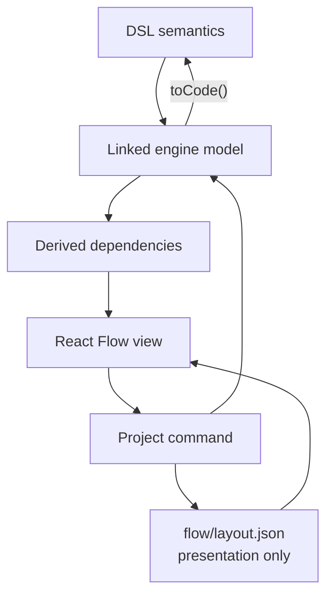

## 10. Project transfer and deployment packages

### 10.1 Artifact comparison

| Artifact              | Audience               | Contains authored files |            Contains Portable |            Contains TAST | Writable source |
| --------------------- | ---------------------- | ----------------------: | ---------------------------: | -----------------------: | --------------: |
| Project directory     | Humans, agents, Git    |                     Yes |     No, except ignored cache |                       No |             Yes |
| `.erproject`          | Import/export, sharing |                     Yes | Optional verified projection |                       No |              No |
| Cloud source revision | Modeler                |                     Yes |    Separate derived artifact |                       No |              No |
| `.bim`                | Runtime deployment     |                      No |                          Yes | Optional ABI-gated cache |              No |

### 10.2 `.erproject` layout

```text
loan-origination.erproject  (deterministic ZIP)
├── edgerules.project.json
├── model/main.edge
├── tests/...
├── docs/...
├── flow/...
├── assets/...
└── META-INF/
    ├── archive.json                   # Entry paths, sizes, SHA-256 hashes
    ├── model.portable.json            # Optional derived projection
    └── archive.sig                    # Optional detached signature
```

Import rules:

1. Reject absolute paths, `..` traversal, device names, unsupported links, and duplicate normalized paths.
2. Limit member count, individual decompressed size, and total decompressed size.
3. Verify every declared SHA-256 hash before parsing content.
4. Validate the project manifest and every referenced file.
5. Parse/link DSL with the declared compatible engine.
6. If a Portable projection is included, regenerate it from DSL and reject semantic mismatch.
7. Run migrations in memory and require an explicit save to write a migrated project.
8. Treat signatures as provenance, not as proof that project logic is safe.

### 10.3 `.bim`

The `.bim` design in
[`../edgerules-v2/doc/stories/PRECOMPILED_RULES_PROJECT_STORY.md`](../edgerules-v2/doc/stories/PRECOMPILED_RULES_PROJECT_STORY.md)
remains the deployment format:

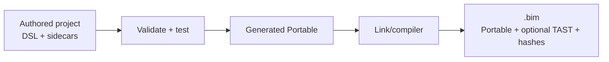

## 11. Public examples library

### 11.1 Source of truth

Create a separate repository:

```text
edgerules-examples/
├── examples/
│   ├── banking/
│   │   ├── loan-origination/
│   │   └── affordability/
│   ├── insurance/
│   ├── healthcare/
│   ├── logistics/
│   └── public-sector/
├── catalog/
│   └── entries/               # Editorial metadata keyed by example project/revision
├── schemas/                 # Pinned or vendored public project schemas
├── tooling/                 # Validation, test, packaging, catalog build
├── CODEOWNERS
└── .github/workflows/
```

Each example is a complete project that can be opened without special catalog-only model logic.

Catalog-only editorial data such as `featured`, curation order, reviewer, publication status, and maturity belongs under
`catalog/entries/`, not inside `edgerules.project.json`. Forking an example therefore copies only reusable project
content.

### 11.2 Publishing pipeline

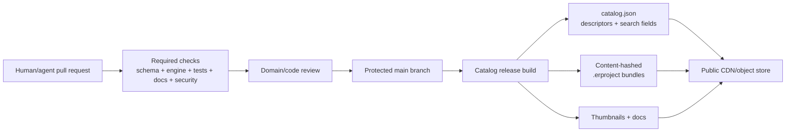

### 11.3 Required example checks

| Check                 | Failure condition                                          |
| --------------------- | ---------------------------------------------------------- |
| Manifest schema       | Invalid or unsupported project document                    |
| Engine parse/link     | DSL is not a valid linked model                            |
| DSL round-trip        | `toCode()` changes semantics or is nondeterministic        |
| Portable projection   | Generated Portable violates its schema                     |
| Test suites           | Any expected result fails                                  |
| Cross-file references | Missing entity, fixture, document, or asset                |
| Flow validation       | Layout points to nonexistent or duplicate entities         |
| Documentation         | Broken local links or missing required overview            |
| Metadata              | Missing license, summary, industry, maturity, or ownership |
| Secret scanning       | Credential or likely private data detected                 |
| Reproducibility       | Same source produces different package hashes              |
| Size policy           | Project or asset exceeds catalog limits                    |

### 11.4 Catalog storage

| Data                | Storage                                          | Loading policy                      |
| ------------------- | ------------------------------------------------ | ----------------------------------- |
| Example descriptors | Static `catalog.json` on CDN                     | Load once, cache with ETag          |
| Search              | Client-side index for approximately 200 examples | No search cluster required          |
| Project bundle      | Content-hashed `.erproject` object               | Lazy load on open/fork              |
| Thumbnail           | CDN                                              | Lazy load                           |
| Full documentation  | Bundle/CDN                                       | Load after project selection        |
| Release provenance  | Release manifest/attestation                     | Verify during publication or import |

### 11.5 Link and fork

| Operation                | Behavior                                                             |
| ------------------------ | -------------------------------------------------------------------- |
| Preview                  | Open immutable catalog revision read-only                            |
| Link                     | User library references the immutable catalog revision               |
| Fork                     | Create a new cloud project identity from the pinned catalog revision |
| Update linked example    | Move reference only after user accepts the new revision              |
| Merge upstream into fork | Three-way merge from recorded fork base                              |

Fork provenance belongs to the cloud/catalog relationship, not the authored project manifest.

## 12. Agentic maintenance architecture

### 12.1 Primary decision

> A plain Git project directory is the maintenance source of truth. MCP is an optional high-level semantic interface
> over the same directory or `ProjectSession`; it is not a separate project database.

This gives agents two complementary paths:

| Path             | Best for                                                                                           |
| ---------------- | -------------------------------------------------------------------------------------------------- |
| Filesystem + Git | Creating examples, broad DSL edits, Markdown, reviewable pull requests                             |
| Maintenance MCP  | Semantic rename/move, targeted model inspection, validation, test execution, cloud-hosted projects |

### 12.2 Why not MCP-only

| MCP-only risk                 | Git-directory mitigation                |
| ----------------------------- | --------------------------------------- |
| Tool/vendor lock-in           | Source remains normal files             |
| Opaque mutations              | Every result is visible as a Git diff   |
| Difficult offline maintenance | Files work with any editor or agent     |
| Tool availability limits      | CI and CLI expose the same validators   |
| Harder code review            | Pull requests show exact source changes |
| Accidental hidden state       | Package contains all authored data      |

### 12.3 Why still provide MCP

| Capability                | Value                                       |
| ------------------------- | ------------------------------------------- |
| Read one semantic subtree | Avoid sending a whole model to the agent    |
| Rename/move by entity ID  | Preserve tests, docs, and flow atomically   |
| Apply typed CRUD          | Prevent malformed manual cross-file changes |
| Validate and run tests    | Short feedback loop                         |
| Explain diagnostics       | Structured errors with source locations     |
| Inspect dependencies      | Agent need not infer the whole model graph  |
| Work on cloud projects    | No local clone required                     |

### 12.4 Protocol-neutral service

Implement a `ProjectMaintenanceService` first; expose it through CLI, internal application calls, and MCP adapters.

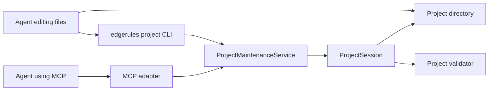

Suggested semantic operations:

| Operation            | Response policy                                                           |
| -------------------- | ------------------------------------------------------------------------- |
| `project.describe`   | Compact manifest, revision, capabilities, and validation status           |
| `model.read`         | Targeted DSL range or Portable subtree, never the entire model by default |
| `model.rename`       | Typed cross-slice transaction by persistent entity ID                     |
| `model.move`         | Typed cross-slice transaction                                             |
| `model.set`          | Portable node input, DSL regenerated by engine                            |
| `model.format`       | Canonical DSL diff                                                        |
| `model.dependencies` | Compact dependency graph around selected entities                         |
| `tests.list`         | IDs, names, and subjects only                                             |
| `tests.run`          | Selected suite/case result                                                |
| `project.validate`   | Structured diagnostics grouped by artifact                                |
| `project.diff`       | Authored-file diff only                                                   |
| `project.pack`       | Deterministic `.erproject` artifact                                       |

### 12.5 Token-efficiency rules

1. Default model reads to DSL.
2. Return Portable only for a requested path or CRUD payload.
3. Support field filters and depth limits.
4. Return references by ID plus short path, not repeated expanded nodes.
5. Paginate catalog and test listings.
6. Return diffs after mutation instead of full files.
7. Never embed generated Portable, test results, or schemas in routine agent context.
8. Let the agent edit Markdown directly.

### 12.6 Agent workflow

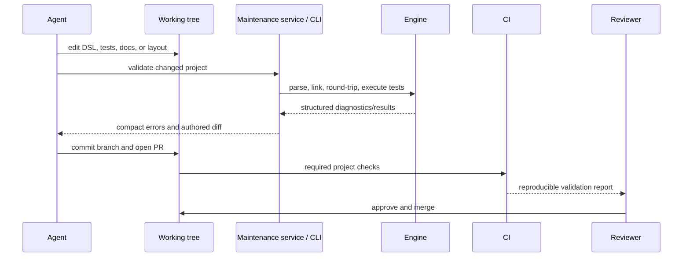

Agents never publish directly to the public catalog. Publication occurs from a protected, validated revision.

## 13. Cloud project storage

### 13.1 Component model

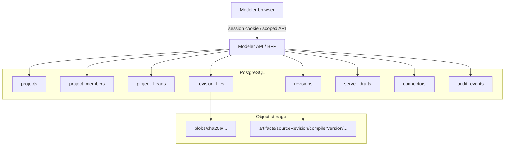

### 13.2 Logical data model

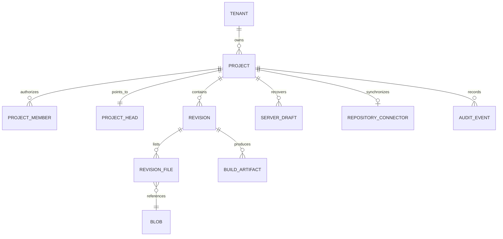

### 13.3 Durable layers

| Layer            | Contains                                                | Retention                       |
| ---------------- | ------------------------------------------------------- | ------------------------------- |
| Browser recovery | Last loaded source, invalid DSL draft, pending commands | Device/user policy              |
| Server draft     | Cross-device working checkpoint and base revision       | Compact/expire                  |
| Source revision  | Immutable authored project files                        | Durable history                 |
| Build artifact   | Portable, schema, `.erproject`, `.bim`, preview         | Rebuildable by compiler version |
| Catalog cache    | Public descriptors and bundle references                | CDN policy                      |

### 13.4 Cloud save

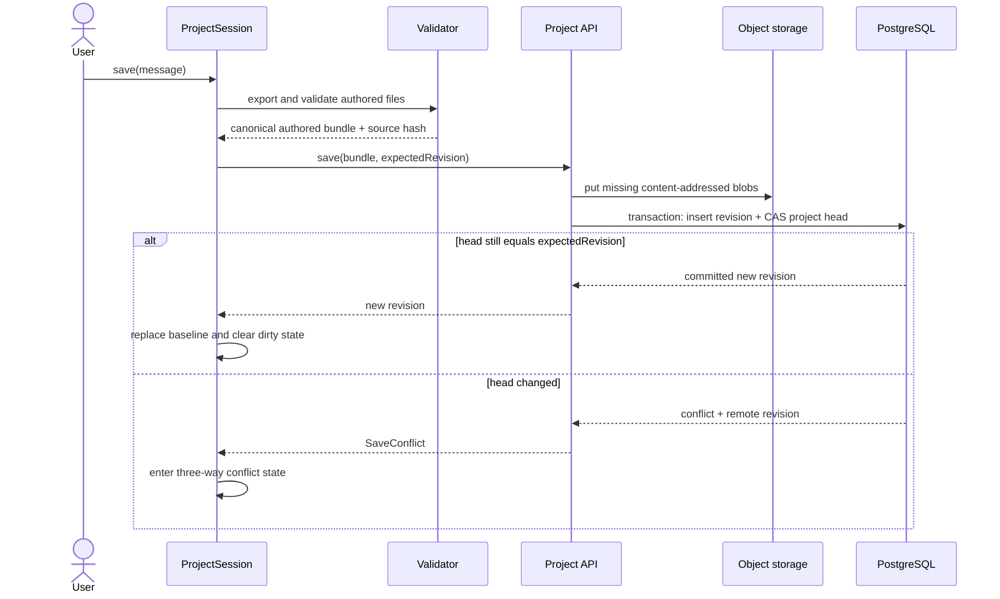

### 13.5 PostgreSQL versus S3 head

| Deployment            | Head authority                                                                  |
| --------------------- | ------------------------------------------------------------------------------- |
| EdgeRules cloud       | PostgreSQL row updated with compare-and-swap in a transaction                   |
| Standalone S3 adapter | Immutable revision prefixes plus conditional `HEAD.json` update with `If-Match` |
| Git repository        | Branch commit SHA and non-forced ref update                                     |

The React application never updates a collection of “current project files” independently.

### 13.6 Browser storage

Use IndexedDB or OPFS for:

- crash recovery;
- offline copy of the last loaded revision;
- invalid DSL drafts;
- pending command journal;
- optional derived test-result cache.

Do not use browser storage for:

- the only copy of a cloud project;
- provider credentials or long-lived tokens;
- silent conflict resolution;
- independent tests or documentation authorities.

## 14. Repository connectors

### 14.1 Git connector architecture

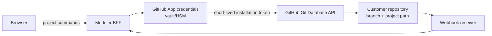

### 14.2 Direct browser Git decision

| Approach                                                | Decision                                                                |
| ------------------------------------------------------- | ----------------------------------------------------------------------- |
| Browser calls GitHub REST with a short-lived user token | Technically possible, not the default architecture                      |
| Browser stores PAT                                      | Forbidden                                                               |
| Browser ships GitHub App private key/client secret      | Forbidden                                                               |
| Browser implements generic Git smart protocol           | Not a production requirement                                            |
| Backend GitHub App                                      | Preferred GitHub connector                                              |
| Backend generic Git worker                              | Later adapter for GitLab, Bitbucket, or self-hosted Git                 |
| Local folder picker                                     | Optional progressive enhancement, not universal repository connectivity |

### 14.3 Repository locator

```ts
interface GitProjectLocator {
  provider: 'github';
  installationId: string; // Stored server-side.
  owner: string;
  repository: string;
  branch: string;
  projectPath: string;
}
```

### 14.4 Atomic Git save

1. Read expected branch commit SHA.
2. Load the project subtree and validate the base.
3. Create new blobs for changed authored files.
4. Create a tree based on the expected commit tree.
5. Create a commit whose parent is the expected SHA.
6. Update the branch ref with `force: false`.
7. Treat a non-fast-forward update as a save conflict.
8. Never force-push from the Modeler.

### 14.5 Cloud versus Git-connected projects

| Concern           | Cloud-native               | Git-connected                                           |
| ----------------- | -------------------------- | ------------------------------------------------------- |
| Source authority  | Cloud source revision      | Git branch/path                                         |
| Working draft     | Browser + server draft     | Browser + optional server working draft                 |
| Commit history    | Cloud revisions            | Git commits                                             |
| Concurrency token | Revision ID                | Commit SHA                                              |
| External changes  | Other Modeler sessions/API | Git pushes/webhooks                                     |
| Save              | CAS head update            | Commit + non-forced ref update                          |
| Offline recovery  | Browser draft              | Browser draft                                           |
| Permissions       | Tenant/project roles       | Modeler roles intersected with Git provider permissions |

The same `ProjectRepository` port serves both modes.

## 15. Project state architecture

### 15.1 Ownership

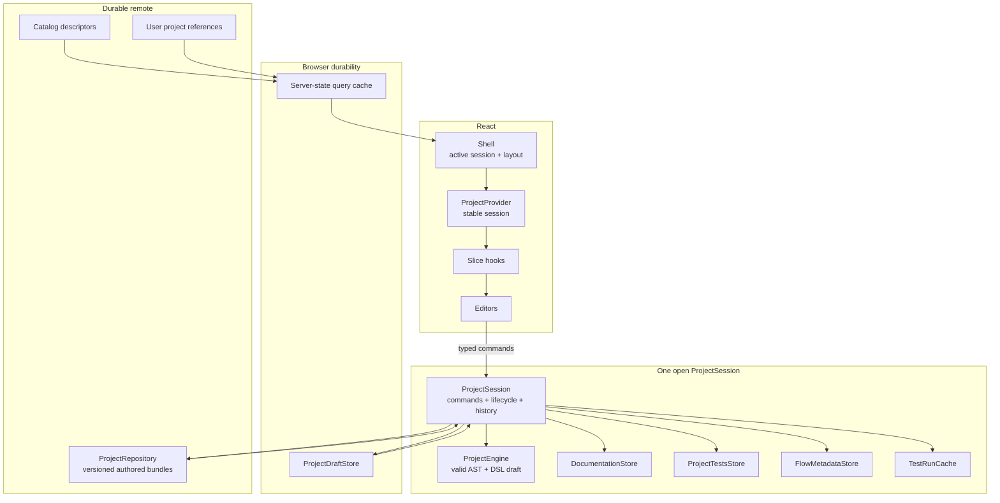

### 15.2 Session state

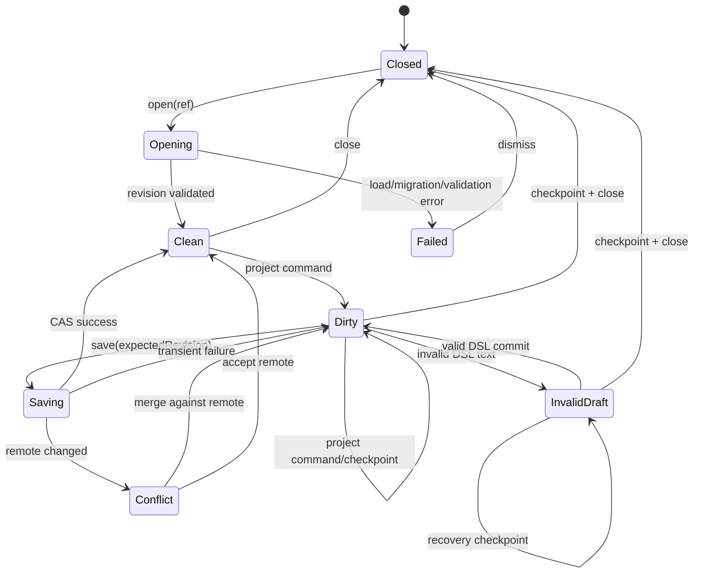

### 15.3 Cross-slice command

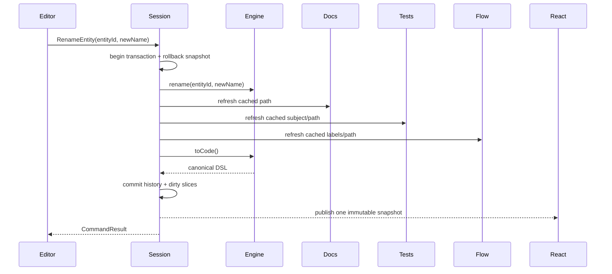

If any operation fails, the engine and every sidecar return to the rollback snapshot and subscribers see no partial
state.

### 15.4 React rules

| Rule                  | Decision                                                   |
| --------------------- | ---------------------------------------------------------- |
| Context value         | One stable `ProjectSession` reference                      |
| Subscription          | `useSyncExternalStore` through domain selectors            |
| Snapshot              | Immutable and referentially stable until its slice changes |
| Remote lists/catalogs | Server-state query cache                                   |
| Project mutation      | Typed `ProjectSession` command                             |
| Selection             | Store IDs/paths, derive objects                            |
| Component UI          | Keep hover, menus, dialogs, and uncommitted fields local   |
| Undo/redo             | Session command history, not React component history       |

## 16. Conflict and merge

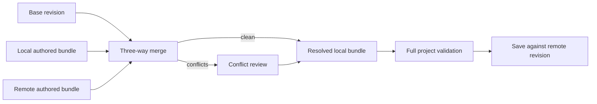

| Slice               | Strategy                                                                  |
| ------------------- | ------------------------------------------------------------------------- |
| DSL                 | Three-way text merge followed by parse/link; later AST/entity-aware merge |
| Manifest            | Field-level merge; format identity is never auto-merged                   |
| Tests               | Merge by stable suite/case/row IDs; same-value edits conflict             |
| Documentation index | Merge by entity ID                                                        |
| Markdown            | Standard three-way text merge                                             |
| Flow                | Merge by entity ID and property; same-property edits conflict             |
| Assets              | Hash comparison; divergent binary replacements conflict                   |

No authored slice uses silent last-writer-wins.

## 17. Schemas, validation, and migration

### 17.1 Schema set

```text
schemas.edgerules.io/project/v1/
├── project.schema.json
├── test-suite.schema.json
├── documentation-index.schema.json
├── flow-layout.schema.json
├── archive.schema.json
└── catalog.schema.json
```

Use JSON Schema Draft 2020-12.

### 17.2 Validation layers

| Layer                 | Validator                                         |
| --------------------- | ------------------------------------------------- |
| Syntax                | JSON parser, Markdown/path rules, DSL parser      |
| Document shape        | JSON Schema                                       |
| Model semantics       | EdgeRules linker                                  |
| Cross-file references | Project validator                                 |
| Stable IDs            | Project/engine identity validator                 |
| Tests                 | Headless EdgeRules test runner                    |
| Round-trip            | DSL/Portable conversion gates                     |
| Packaging             | Hash, path, size, and determinism checks          |
| Security              | Secret, archive, permission, and content policies |

### 17.3 Migration

1. Every document declares its own `schemaVersion` where it can evolve independently.
2. `edgerules.project.json.formatVersion` versions the aggregate contract.
3. Migrations are pure, ordered, deterministic functions.
4. Old documents migrate in memory before session construction.
5. Newer unsupported documents open read-only with an upgrade-required diagnostic.
6. Migration never silently writes back to Git or cloud.
7. A migrated project must pass current schema, engine, reference, and test validation before save.
8. Golden fixtures cover every supported upgrade path.

## 18. Security and tenancy

| Boundary         | Requirement                                                                           |
| ---------------- | ------------------------------------------------------------------------------------- |
| Browser ↔ API    | Authenticated session, CSRF protection where applicable, scoped authorization         |
| Project access   | Tenant membership and project role checked on every operation                         |
| GitHub           | Least-privilege GitHub App installation permissions                                   |
| Provider secrets | Vault/HSM/backend only                                                                |
| Browser cache    | No long-lived provider credentials                                                    |
| Object storage   | Private by default; signed/authorized reads                                           |
| Public examples  | Explicit public publication pipeline                                                  |
| Archives         | Traversal, symlink, duplicate-path, and zip-bomb defenses                             |
| Logs             | Redact inputs, secrets, tokens, and sensitive project content                         |
| Audit            | Record membership, connector, publication, destructive, and administrative operations |
| Deletion         | Tenant-aware soft-delete/retention followed by object garbage collection              |

## 19. Code and repository boundaries

Do not place cloud and Git provider implementations inside the React component library.

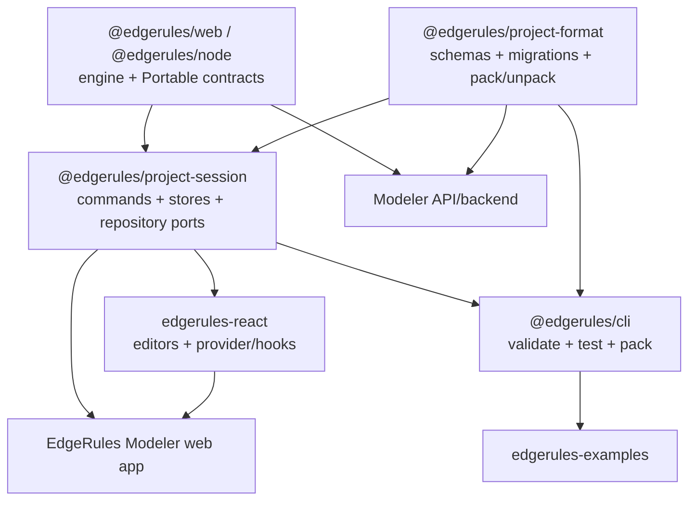

| Package/repository           | Responsibility                                                |
| ---------------------------- | ------------------------------------------------------------- |
| `edgerules-v2`               | DSL, Portable, engine identity, conversion, execution, `.bim` |
| `@edgerules/project-format`  | Public project types, JSON Schemas, migration, `.erproject`   |
| `@edgerules/project-session` | Framework-neutral working copy and repository ports           |
| `edgerules-react`            | Reusable React surfaces and thin session integration          |
| Modeler web app              | Shell, routing, workspace, catalog/user library UI            |
| Modeler backend              | Auth, tenants, cloud revision store, Git connectors, audit    |
| `edgerules-examples`         | Curated example source and catalog publication                |
| `@edgerules/cli`             | Agent/human validation, testing, conversion, and packaging    |

## 20. Implementation roadmap

```mermaid
flowchart LR
  A["1. ADRs + terminology"]
  B["2. Engine symmetry<br/>toCode + identity + round-trip"]
  C["3. Project schemas<br/>validator + migrations"]
  D["4. CLI<br/>validate + test + pack"]
  E["5. Session-owned stores<br/>commands + rollback"]
  F["6. ProjectProvider<br/>Shell integration"]
  G["7. Cloud revision store<br/>draft recovery"]
  H["8. Examples repository<br/>catalog pipeline"]
  I["9. GitHub App connector"]
  J["10. Conflict review<br/>upstream merge"]
  K["11. Optional MCP adapter"]

  A --> B --> C --> D --> E --> F --> G --> H --> I --> J --> K
```

### Phase gates

| Phase           | Required evidence                                                                |
| --------------- | -------------------------------------------------------------------------------- |
| Engine symmetry | Property/golden tests across DSL, Portable, CRUD, annotations, IDs, and comments |
| Project format  | Schemas, invalid fixtures, migration fixtures, canonical serializer              |
| CLI             | Same validation result locally and in CI                                         |
| Session         | Transaction rollback, one notification, undo/redo, multi-project isolation       |
| Cloud           | Concurrent-save conflict, authorization, reload, blob deduplication              |
| Examples        | All examples link and test with a pinned engine; deterministic catalog build     |
| GitHub          | Non-forced update conflict, webhook refresh, permission revocation               |
| Merge           | Base/local/remote fixtures for every authored slice                              |
| MCP             | Capability scoping, compact responses, audit, no hidden source mutations         |

## 21. Decision log

|   # | Decision                                                                          | Status   |
| --: | --------------------------------------------------------------------------------- | -------- |
|   1 | `ProjectSession`, not a state-owning React component, owns an open project.       | Accepted |
|   2 | React Context distributes a stable session reference.                             | Accepted |
|   3 | DSL is the authored Git source.                                                   | Accepted |
|   4 | Portable is the canonical machine serialization, not a second authored file.      | Accepted |
|   5 | `toCode()` is required and deterministic.                                         | Accepted |
|   6 | Portable projections are generated and schema-validated.                          | Accepted |
|   7 | Project directory, `.erproject`, and `.bim` are separate concepts.                | Accepted |
|   8 | All authored slices form one source revision.                                     | Accepted |
|   9 | Cloud identity and permissions stay outside project source.                       | Accepted |
|  10 | PostgreSQL owns cloud heads; object storage owns immutable content.               | Accepted |
|  11 | Browser stores are recovery/offline caches.                                       | Accepted |
|  12 | GitHub integration uses a backend GitHub App.                                     | Accepted |
|  13 | Public examples are authored in a dedicated Git repository.                       | Accepted |
|  14 | Catalog delivery uses a static index and immutable CDN artifacts.                 | Accepted |
|  15 | Agent changes flow through Git review and required checks.                        | Accepted |
|  16 | MCP is an optional adapter over a protocol-neutral maintenance service.           | Accepted |
|  17 | Agent reads default to compact DSL or targeted Portable subtrees.                 | Accepted |
|  18 | Stable IDs are engine-owned and allocated only to externally referenced entities. | Target   |
|  19 | Tests persist authored typed values, not results or UI-only raw state.            | Target   |
|  20 | Documentation uses Markdown plus an entity binding index.                         | Accepted |
|  21 | Flow layout is presentation only; semantic changes commit to DSL.                 | Accepted |
|  22 | Every save is conditional and conflicts are explicit.                             | Accepted |
|  23 | CRDTs are deferred until real-time collaboration is required.                     | Accepted |
|  24 | Cloud/Git adapters do not belong in `edgerules-react`.                            | Accepted |

## 22. Immediate architecture work

1. Update the engine specifications to distinguish **authored source** from **canonical machine serialization**.
2. Add `toCode()` to the WASM and TypeScript mutable service APIs.
3. Define deterministic DSL formatting and comment/trivia behavior.
4. Add the persistent entity ID contract to DSL, AST, CRUD, and Portable.
5. Publish Portable JSON Schema from the authoritative Portable types.
6. Specify `edgerules.project.json` and the first project sidecar schemas.
7. Replace path-only project sidecar contracts with `ModelEntityRef`.
8. Refactor documentation and tests services to support bulk import/export and injected persistence.
9. Build `edgerules project validate` before implementing cloud storage.
10. Move the unfinished project-state section in `docs/ARCHITECTURE.md` toward this global contract or replace it with a
    link to this document to avoid two competing architectures.

## 23. References

### EdgeRules

- [`docs/ARCHITECTURE.md`](docs/ARCHITECTURE.md)
- [`docs/BUG_REPORTS.md`](docs/BUG_REPORTS.md)
- [`../edgerules-v2/doc/architecture/ARCHITECTURE.md`](../edgerules-v2/doc/architecture/ARCHITECTURE.md)
- [`../edgerules-v2/doc/architecture/API_SPEC.md`](../edgerules-v2/doc/architecture/API_SPEC.md)
- [`../edgerules-v2/doc/architecture/EBNF.md`](../edgerules-v2/doc/architecture/EBNF.md)
- [`../edgerules-v2/doc/stories/PRECOMPILED_RULES_PROJECT_STORY.md`](../edgerules-v2/doc/stories/PRECOMPILED_RULES_PROJECT_STORY.md)
- [`../edgerules-v2/tests/wasm/`](../edgerules-v2/tests/wasm/)

### External standards and provider documentation

- [JSON Schema Draft 2020-12](https://json-schema.org/draft/2020-12)
- [React `useSyncExternalStore`](https://react.dev/reference/react/useSyncExternalStore)
- [GitHub REST API: Git trees](https://docs.github.com/en/rest/git/trees)
- [GitHub REST API: Git commits](https://docs.github.com/en/rest/git/commits)
- [GitHub REST API: Git references](https://docs.github.com/en/rest/git/refs)
- [GitHub App private-key management](https://docs.github.com/en/apps/creating-github-apps/authenticating-with-a-github-app/managing-private-keys-for-github-apps)
- [GitHub protected branches](https://docs.github.com/en/repositories/configuring-branches-and-merges-in-your-repository/managing-protected-branches/about-protected-branches)
- [GitHub artifact attestations](https://docs.github.com/en/actions/concepts/security/artifact-attestations)
- [Amazon S3 conditional writes](https://docs.aws.amazon.com/AmazonS3/latest/userguide/conditional-writes.html)
- [MDN Origin private file system](https://developer.mozilla.org/en-US/docs/Web/API/File_System_API/Origin_private_file_system)
- [MDN `showDirectoryPicker()`](https://developer.mozilla.org/en-US/docs/Web/API/Window/showDirectoryPicker)
