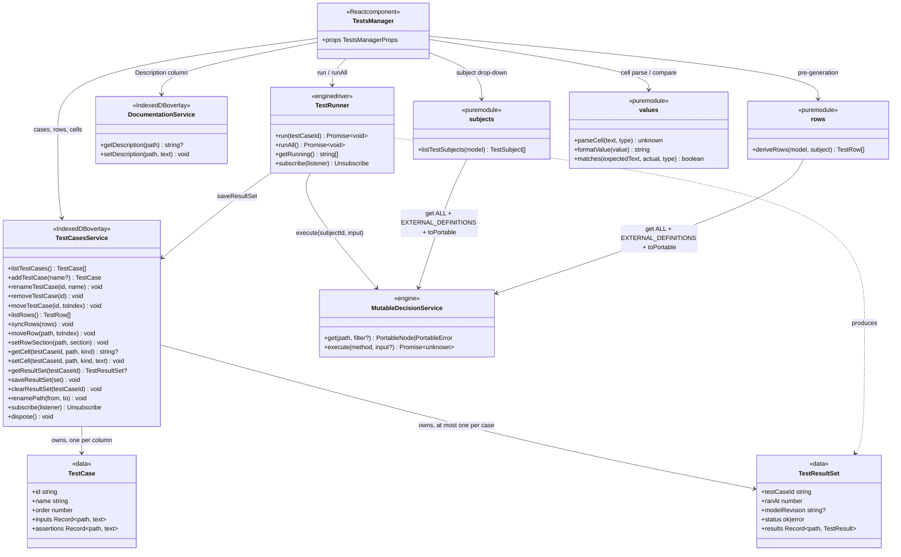
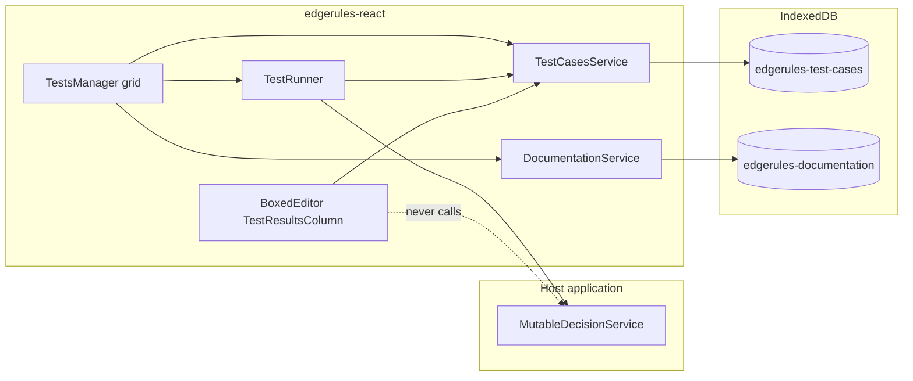
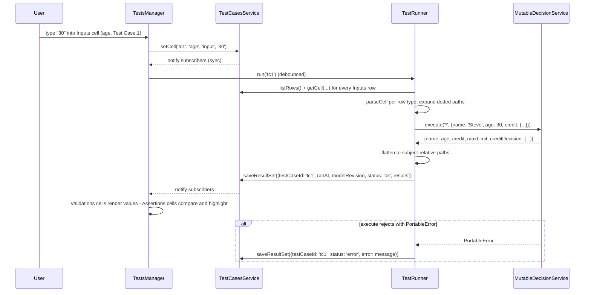
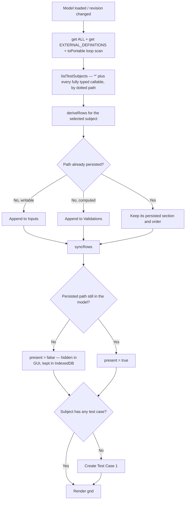

# Tests Manager Story

Tests Manager provides maintenance for all test cases of the selected model. Test cases, their input values, their
expected values, and their last computed results are persisted through `TestCasesService`; execution is performed by
`TestRunner` against the model's `MutableDecisionService`.

The three concerns are deliberately separate packages, mirroring how `DocumentationService` is separated from its
consumers (see [`DOCUMENTATION_SERVICE_STORY.md`](DOCUMENTATION_SERVICE_STORY.md)):

- `TestCasesService` — persistence only. It knows nothing about the engine and nothing about any component that reads
  it; its whole vocabulary is test cases, rows, values, and results.
- `TestRunner` — execution only. Binds inputs, calls `execute`, flattens the result, writes results back through
  `TestCasesService`.
- `TestsManager` — the React grid.

Because persistence is engine-free, any component can display results without running anything.
[`BOXED_EDITOR_SPEC.md`](BOXED_EDITOR_SPEC.md#testcasesservice-api)'s `TestResultsColumn` is one such consumer, and
Phase 4 points that spec at this package's types. The dependency runs one way only: consumers import from
`edgerules-react/test-cases-service`, never the reverse.

## Tests Manager GUI

- **Path column**: shows the path to the model field that is being tested, relative to the selected test subject.
- **Path column header**: a drop-down that selects the **test subject** — the whole model, or any callable whose
  parameters are all typed, at any context depth, listed by its dotted path.
- **Description column**: filled by `DocumentationService`, which either pulls an existing description found by model
  name + fully qualified path or lets the user add a new one.
- **Test Case columns**: each column is one test case. Test cases are added and removed through the column's context
  menu.
- **Paging**: when a subject has more test cases than fit, the GUI pages over test-case **columns**; the Path and
  Description columns are frozen and never page.
- **Assertions**: cells hold the value the user expects. A cell whose expected value does not equal the computed
  value is highlighted in red, and its tooltip shows the actual value.
- **Validations**: cells show the computed result. They are read-only and exist purely to inspect what a path
  evaluates to — useful when the user does not yet know the expected value.
- **`::`**: drag-and-drop handle for the row. Rows reorder within their own section.
- **`:`**: three-dots context-menu button.

### General Language

Tests Manager GUI follows the same language as Boxed Editor GUI:

- Every cell is single-height (40px) and grows only in 40px steps when it needs to wrap.
- Same icons for drag and drop, add, remove, and context menu.
- Same spacing, padding, margins, context-menu style, and row hover effects.

### Sections

Every subject's grid has the same three sections, in this fixed order. A path belongs to exactly one of them.

| Section       | Rows                                                              | Cell editable | Cell shows                                          |
|---------------|-------------------------------------------------------------------|---------------|-----------------------------------------------------|
| `Inputs`      | Writable leaves of the subject (typed holes / callable arguments) | Yes           | The value bound before execution                    |
| `Assertions`  | Computed paths the user has given an expected value for           | Yes           | Expected value; red + actual in tooltip on mismatch |
| `Validations` | Every other computed path                                         | No            | The computed value                                  |

`Assertions` and `Validations` are the same population of computed paths split by user intent: entering a value in a
`Validations` cell, or invoking **Move to Assertions**, promotes that row into `Assertions`; **Move to Validations**
demotes it and discards its expected values. This is why a path can never appear in both.

### Workbook Testing

The particular GUI shows how a `Workbook` is tested. A `Workbook` model is a `context` with multiple fields, so its
subject is the whole model (`*`).

|    | Model Name              ▼ | Description           | Test Case 1        : | Test Case 2        : | ... | Test Case N        : |
|----|---------------------------|-----------------------|----------------------|----------------------|-----|----------------------|
|    | Inputs                    |                       |                      |                      | ... |                      |
| :: | `name`                    | `User Name`           | `Steve`              | `John`               | ... | `Mary`               |
| :: | `age`                     | `User Age`            | `30`                 | `25`                 | ... | `40`                 |
| :: | `credit.balance`          | `User Credit Balance` | `1000`               | `0`                  | ... | `-100`               |
| :: | `credit.limit`            | `User Credit Limit`   | `2000`               | `0`                  | ... | `10000`              |
|    | ___                       | ___                   | ___                  | ___                  | ___ | ___                  |
|    | Assertions                |                       | `2/2` ✓              | `2/2` ✓              | ... | `1/2` ✗              |
| :: | `creditDecision.approved` | `Credit Approved`     | `true`               | `true`               | ... | `false`              |
| :: | `creditDecision.limit`    | `Credit Limit`        | `10000`              | `10000`              | ... | `10000`              |
|    | ___                       | ___                   | ___                  | ___                  | ___ | ___                  |
|    | Validations               |                       |                      |                      | ... |                      |
| :: | `maxLimit`                | `Maximum Limit`       | `10000`              | `10000`              | ... | `10000`              |

The `Assertions` section header carries each test case's pass counter. In `Test Case N` the applicant is declined
(`balance` is negative), so `creditDecision.limit` computes `0` while the cell expects `10000` — that cell renders red
and its tooltip reads `0`.

**Example model for the above test manager GUI:**

```edgerules
{
    maxLimit: 10000,
    name: <string, required: true>,
    age: <number, required: true>,
    credit: {
        balance: <number, required: true>,
        limit: <number, required: true>
    },
    creditDecision: {
        approved: if credit.balance >= 0 and age > 17 then true else false,
        limit: if approved then maxLimit else 0
    }
}
```

### Decision Service Testing

Every callable whose parameters are all typed is a decision-service entry point and gets its own subject, at any
context depth — `library.eligibility` is as testable as a root-level `creditDecision`. Its `Inputs` rows are the
parameters (complex parameter types expanded to leaves); its computed rows are the leaves of the return type.

All four callable metaphors execute identically (`execute(dottedPath, args)`), but each is discovered differently:

| Subject kind | Discovered by                                        | `@kind`           | Input rows    | Computed rows       |
|--------------|------------------------------------------------------|-------------------|---------------|---------------------|
| `function`   | `get('*', 'ALL')`, recursing into nested contexts    | `function-schema` | `@parameters` | leaves of `@return` |
| `ruleset`    | `get('*', 'ALL')`, recursing into nested contexts    | `ruleset-schema`  | `@parameters` | leaves of `@return` |
| `optimise`   | `get('*', 'EXTERNAL_DEFINITIONS')`                   | `optimise`        | `@parameters` | leaves of `@result` |
| `loop`       | `toPortable()` scan, then `get(path)` for the schema | `loop-schema`     | `@parameters` | leaves of `@return` |

The last two rows are engine quirks, not design choices. An `optimise` declaration is absent from `FIELDS` and `ALL`
entirely — its catalog row lives only in `EXTERNAL_DEFINITIONS`. A `loop` declaration is absent from *every* `get`
filter view, so the only way to enumerate loops is to scan `toPortable()` for `@kind: "loop"` entries and then
`get(path)` each one; this is filed in [`BUG_REPORTS.md`](BUG_REPORTS.md) and the scan can be dropped once listing
projects loops. `optimise` and `loop` are root-only by language rule, so only functions and rulesets nest.

A callable declared inside **another callable's body** (`func outer(): { func inner(): … }`) is an implementation
detail of its parent, not an entry point, and is not offered as a subject — even though the engine will happily
execute `outer.inner`. Subject discovery walks contexts, not function bodies.

A `func` body cannot read the enclosing context — the engine rejects it with `E101: function 'x' cannot read 'y' from
an enclosing context`. Everything a decision service needs must therefore arrive as a parameter, which is why
`maxLimit` below is one:

```edgerules
{
   type Credit: {
      balance: <number, required: true>,
      limit: <number, required: true>
   }
   maxLimit: 10000,
   func creditDecision(name: string, age: number, credit: Credit, cap: number): {
      approved: if credit.balance >= 0 and age > 17 then true else false,
      limit: if approved then cap else 0
   }
}
```

| creditDecision ▼ | Description           | Test Case 1 : | ... |
|------------------|-----------------------|---------------|-----|
| Inputs           |                       |               | ... |
| `name`           | `User Name`           | `Steve`       | ... |
| `age`            | `User Age`            | `30`          | ... |
| `credit.balance` | `User Credit Balance` | `1000`        | ... |
| `credit.limit`   | `User Credit Limit`   | `2000`        | ... |
| `cap`            | `Credit Cap`          | `10000`       | ... |
| ___              | ___                   | ___           | ___ |
| Assertions       |                       | `2/2` ✓       | ... |
| `approved`       | `Credit Approved`     | `true`        | ... |
| `limit`          | `Credit Limit`        | `10000`       | ... |

A callable whose return type is a scalar (`-> boolean`) has exactly one computed row, whose path is the empty string
and whose Path cell renders as `(result)`.

### Optimise Testing

An `optimise` subject's computed rows are the synthesized result record: the decision variables, plus the reserved
`status` / `objective` / `solver` / `notes` fields, plus one `bottlenecks.<constraint>` row per named constraint when
`bottlenecks: true`.

```edgerules
{
    optimise factoryProduction(workers: number, sticks: number, plates: number): {
        using: "highs"
        bottlenecks: true
        variables: {
            chairs: <number, integer: true, min: 0>
            tables: <number, integer: true, min: 0>
        }
        maximise: 15 * chairs + 40 * tables
        constraints: {
            workerCapacity: 1 * chairs + 3 * tables <= workers
            stickSupply: 4 * chairs + 4 * tables <= sticks
            plateSupply: 1 * chairs + 2 * tables <= plates
        }
        timeLimit: 1000
    }
}
```

| factoryProduction ▼          | Description         | Test Case 1 :     | ... |
|------------------------------|---------------------|-------------------|-----|
| Inputs                       |                     |                   | ... |
| `workers`                    | `Available Workers` | `8`               | ... |
| `sticks`                     | `Sticks In Stock`   | `40`              | ... |
| `plates`                     | `Plates In Stock`   | `12`              | ... |
| ___                          | ___                 | ___               | ___ |
| Assertions                   |                     | `2/2` ✓           | ... |
| `status`                     | `Solve Status`      | `optimal`         | ... |
| `objective`                  | `Total Value`       | `120`             | ... |
| ___                          | ___                 | ___               | ___ |
| Validations                  |                     |                   | ... |
| `chairs`                     | `Chairs To Build`   | `8`               | ... |
| `tables`                     | `Tables To Build`   | `0`               | ... |
| `bottlenecks.workerCapacity` | `Worker Bottleneck` | `15`              | ... |
| `solver`                     | `Solver Used`       | `highs-js 1.15.1` | ... |
| `notes`                      | `Solver Notes`      | `5 items`         | ... |

**EdgeRules ships no solver.** An `optimise` subject only runs if the host has registered one on the same
`MutableDecisionService` (see the engine repo's `OPTIMISE_SOLVER_HOSTING.md`). Without it the run does not fail loudly
— `execute` returns `Missing('factoryProduction')` — so `TestRunner` pre-flights the condition instead of recording
that as a result; see [Execution](#execution).

## Object Model

Paths are **relative to the subject**. `TestCasesService` stores them that way, and the qualified form used for
`DocumentationService` lookups and by consumers that address paths model-wide is derived:

```typescript
// '*' + 'credit.balance' -> 'credit.balance'; 'creditDecision' + 'approved' -> 'creditDecision.approved'
function qualifyPath(subjectId: string, path: string): string;
```

```typescript
// '*' for the whole model, otherwise the callable's dotted path (e.g. 'library.eligibility').
type TestSubjectId = string;

type TestSubjectKind = 'model' | 'function' | 'ruleset' | 'optimise' | 'loop';

interface TestSubject {
    id: TestSubjectId; // '*' or the callable's dotted path.
    kind: TestSubjectKind;
    name: string; // Label in the Path column header: the model name for '*', otherwise the dotted path.
}

type TestSectionId = 'inputs' | 'assertions' | 'validations';

// One grid row: which path it addresses and where it sits. Rows are subject-wide — every test case shares them.
interface TestRow {
    path: string; // Subject-relative; '' for a scalar-returning callable's single result row.
    section: TestSectionId;
    order: number; // Position within its section.
    type?: string; // Declared/inferred type name, used to parse cells and as the Path cell tooltip.
    present: boolean; // False once the model no longer declares this path — hidden in the GUI, kept in IndexedDB.
}

// Raw cell text exactly as typed, keyed by subject-relative path. Parsed per the row's type at run time.
type TestValuesByPath = Record<string, string>;

// One grid column: everything the user authored for it. A test case owns its values and nothing else —
// results are produced by running it and live separately (below).
interface TestCase {
    id: string; // Stable identifier; survives renames.
    name: string; // Column header, e.g. "Standard application".
    order: number;
    inputs: TestValuesByPath; // Values bound before execution; only `inputs`-section paths.
    assertions: TestValuesByPath; // Expected values; only `assertions`-section paths.
}

type TestResultStatus = 'ok' | 'error' | 'missing' | 'pending';

// One path's computed outcome. Carries no run metadata — that belongs to the run, not to each value.
interface TestResult {
    path: string; // Subject-relative, matching TestRow.path.
    value?: unknown; // Exactly what the engine returned for this path. Omitted when status is 'error'.
    error?: string; // Message when this path failed to evaluate.
    status: TestResultStatus;
}

// The outcome of running one test case once: run-level metadata plus one TestResult per path.
// Running the case again replaces the whole set — there is never more than one per test case.
interface TestResultSet {
    testCaseId: string;
    ranAt: number; // Epoch ms of the run.
    modelRevision?: string; // The `revision` in force during the run; drives staleness.
    status: 'ok' | 'error'; // 'error' when the run itself failed and no path was evaluated.
    error?: string; // Run-level failure: a PortableError from `execute`, or a missing solver.
    results: Record<string, TestResult>; // Keyed by subject-relative path.
}
```

Three separate things, deliberately: `TestRow` is the grid's shape and is shared by every column; `TestCase` is what
the user authored in one column; `TestResultSet` is what came back from running that column. Run metadata (`ranAt`,
`modelRevision`) and run-level failures sit once on the set rather than being copied onto every path.

`TestResult.value` is the engine's own return value, not a string: a `number` for a numeric path, an `array` for a
list, the engine's string form for dates (`2024-01-15`), durations (`P1D`), and special values (`Missing('credit')`).
Every shape the engine returns is JSON-serializable, so IndexedDB stores it by structured clone. Display formatting is
the reading component's job, not the service's.

These types are defined here and depend on nothing outside this package — no engine types, and no knowledge of any
component that reads them. `BoxedEditor`'s `TestResultsColumn` is a **consumer**: it imports `TestCase` /
`TestResultSet` from `edgerules-react/test-cases-service` (Phase 4 updates
[`BOXED_EDITOR_SPEC.md`](BOXED_EDITOR_SPEC.md#testcasesservice-api) accordingly). The dependency only ever points that
way.



### High-level structure



## Components

`TestsManager` lives at `src/components/tests-manager/` (subpath `edgerules-react/tests-manager`);
`TestCasesService` at `src/components/test-cases-service/` (subpath `edgerules-react/test-cases-service`), keeping it
importable by `BoxedEditor` without dragging in the grid or the engine.

```text
src/components/test-cases-service/
├─ index.ts                          — public exports
├─ test-cases-service-types.ts       — TestCasesService, TestCase, TestRow, TestResult, TestResultSet,
│                                       TestValuesByPath, TestCellKind, TestSectionId, TestResultStatus,
│                                       TestCasesServiceOptions, Unsubscribe
├─ createTestCasesService.ts         — factory: (modelName, subjectId, options?) -> TestCasesService
├─ indexedDbStore.ts                 — IndexedDB adapter: open/upgrade, hydrate-all-for-subject, put, delete
├─ useTestCases.ts                   — hook: ordered cases + current index + next()/prev()
├─ useTestResult.ts                  — hook: one path's TestResult out of the current case's TestResultSet
└─ __tests__/
   ├─ createTestCasesService.test.ts — hydration, case CRUD, row sync, cell round trip, result-set save/clear,
   │                                     renamePath across rows/values/results, dispose
   ├─ no-indexeddb-fallback.test.ts  — indexedDB unavailable -> in-memory only, no throw
   └─ hooks.test.tsx                 — RTL: both hooks re-render on service writes, unsubscribe on unmount

src/components/tests-manager/
├─ index.ts                          — public exports
├─ TestsManager.tsx                  — root: subject state, pre-generation, providers, header + sections
├─ TestsManagerProps.ts              — TestsManagerProps (public)
├─ tests-manager-types.ts            — TestSubject, TestSubjectKind, TestRunner (public)
├─ model/
│  ├─ subjects.ts                    — listTestSubjects: '*' plus every fully typed callable — func/ruleset at
│  │                                    any context depth (ALL view), optimise (EXTERNAL_DEFINITIONS view),
│  │                                    loop (toPortable scan + get)
│  ├─ rows.ts                        — deriveRows: input vs computed leaves, user-type expansion, optimise
│  │                                    @result leaves; flattenResult for call-site paths the schema hides
│  ├─ values.ts                      — parseCell / formatValue / matches (type-directed)
│  └─ inputs.ts                      — dotted subject-relative paths -> nested input object for execute()
├─ runner/
│  └─ createTestRunner.ts            — factory: (service, testCasesService, subject) -> TestRunner;
│                                       solver pre-flight, serialized runs, PortableError handling
├─ context/
│  ├─ TestsManagerContext.tsx        — services, subject, readOnly, revision
│  └─ TestsManagerUiContext.tsx      — ephemeral UI: page index, active editing cell, running case ids
├─ hooks/
│  ├─ useTestSubjects.ts             — memoized listTestSubjects for the current model revision
│  ├─ useTestRows.ts                 — useSyncExternalStore over TestCasesService.listRows()
│  ├─ useTestCaseColumns.ts          — visible page of test cases + paging controls
│  └─ useCell.ts                     — one cell's persisted text, computed value, and match state
├─ grid/
│  ├─ TestsGrid.tsx                  — grid shell, frozen Path/Description columns, column paging
│  ├─ SubjectHeaderCell.tsx          — the Path column header drop-down
│  ├─ TestCaseHeaderCell.tsx         — case name, three-dots menu, run indicator
│  ├─ SectionHeaderRow.tsx           — Inputs / Assertions / Validations separators; pass counter
│  ├─ TestRowLine.tsx                — one row: drag handle, path cell, description cell, its case cells
│  ├─ InputCell.tsx                  — editable, type-directed parsing
│  ├─ AssertionCell.tsx              — editable expected value; red + actual-value tooltip on mismatch
│  └─ ValidationCell.tsx             — read-only computed value
├─ menu/
│  ├─ actions.ts                     — TestCaseAction / TestRowAction registries
│  └─ TestsMenu.tsx                  — shared MUI menu for the column and row three-dots buttons
├─ dnd/
│  └─ useRowDrag.ts                  — within-section row reordering
└─ __tests__/
   ├─ TestsManager.test.tsx          — rendering, subject switch, sections, paging, readOnly
   ├─ pre-generation.test.tsx        — first-run generation, new field appended to Validations, removed field hidden
   ├─ execution.test.tsx             — input edit -> run -> results, assertion pass/fail highlighting
   ├─ subjects.test.ts               — discovery of all four callable kinds, nested callables by dotted path,
   │                                    body-nested callables excluded, untyped-parameter exclusion
   ├─ rows.test.ts                   — input vs computed classification, user-type expansion, scalar return,
   │                                    optimise @result leaves, call-site paths appended from a run result
   ├─ optimise.test.tsx              — optimise subject end to end with a registered solver; the missing-solver
   │                                    pre-flight banner when none is registered
   └─ values.test.ts                 — parse / format / compare per type, special values
```

## Persistence

`TestCasesService` is loaded for one `(modelName, subjectId)` pair and disposed when that pair is unloaded, so no
method takes a subject argument — a grid, or a results column, only ever shows one subject at a time. `TestsManager`
constructs a new instance when the subject drop-down changes.

Like `DocumentationService`, the API is synchronous over an in-memory cache, with IndexedDB written in the background;
persistence failures never roll back the in-memory value.

```typescript
type Unsubscribe = () => void;

type TestCellKind = 'input' | 'assertion'; // Which of a TestCase's two value maps a cell belongs to.

interface TestCasesServiceOptions {
    // IndexedDB database name. Defaults to 'edgerules-test-cases'.
    dbName?: string;

    // Called when a background IndexedDB operation fails. In-memory state is unaffected. Omit to ignore silently.
    onPersistError?: (error: unknown, context: { op: string; path?: string; testCaseId?: string }) => void;
}

interface TestCasesService {
    // --- test cases (grid columns) ---
    listTestCases(): TestCase[]; // Ordered by TestCase.order; each carries its own inputs/assertions.
    getTestCase(testCaseId: string): TestCase | undefined;

    addTestCase(name?: string): TestCase; // Appends with empty value maps; defaults the name to "Test Case N".
    renameTestCase(testCaseId: string, name: string): void;

    removeTestCase(testCaseId: string): void; // Also drops that case's values and its result set.
    moveTestCase(testCaseId: string, toIndex: number): void;

    // --- rows (shared by every column) ---
    listRows(): TestRow[]; // Ordered by section, then TestRow.order.
    syncRows(rows: TestRow[]): void; // Reconciles derived rows with persisted ones (see Tests Pre-Generation).
    moveRow(path: string, toIndex: number): void; // Within the row's own section.
    setRowSection(path: string, section: TestSectionId): void; // Promote/demote between assertions and validations.

    // --- cells: accessors into one test case's inputs/assertions map ---
    getCell(testCaseId: string, path: string, kind: TestCellKind): string | undefined; // Raw text as typed.
    setCell(testCaseId: string, path: string, kind: TestCellKind, text: string): void; // Empty string removes the entry.

    // --- results ---
    getResultSet(testCaseId: string): TestResultSet | undefined; // Undefined until the case has been run.
    saveResultSet(set: TestResultSet): void; // Replaces the case's previous set outright.
    clearResultSet(testCaseId: string): void;

    // Migrate rows, cell keys, and result keys when a node's path changes (called after a successful rename/move).
    renamePath(from: string, to: string): void;

    // Notified after any in-memory change, and once after initial IndexedDB hydration completes.
    subscribe(listener: () => void): Unsubscribe;

    // Closes the IndexedDB connection and drops listeners; an in-flight hydration result is discarded on arrival.
    dispose(): void;
}

function createTestCasesService(
    modelName: string,
    subjectId: TestSubjectId,
    options?: TestCasesServiceOptions,
): TestCasesService;
```

### IndexedDB schema

Two object stores in one database, split along the two write rhythms: authored values change on cell commit, results
change on run.

| Item         | `testCases` store                                              | `testResults` store                                                                           |
|--------------|----------------------------------------------------------------|-----------------------------------------------------------------------------------------------|
| Key path     | `['modelName', 'subjectId']`                                   | `['modelName', 'subjectId', 'testCaseId']`                                                    |
| Record shape | `{ modelName, subjectId, cases: TestCase[], rows: TestRow[] }` | `{ modelName, subjectId, testCaseId, set: TestResultSet }`                                    |
| Hydration    | one `get` on construction                                      | one cursor read over `IDBKeyRange.bound([modelName, subjectId], [modelName, subjectId, '￿'])` |
| Write        | whole-record `put` on any case/row/cell change                 | one `put` per completed run; `delete` on clear or case removal                                |

Each store writes whole records rather than per-cell rows. A subject's authored data is one small JSON document — tens
of cases by tens of paths — so a whole-record `put` on cell commit is cheaper than maintaining a key per cell, and it
keeps `TestCase` atomic: a case and its values can never be half-persisted.

Compound array keys avoid inventing (and escaping) a delimiter that cannot appear in an EdgeRules path — the same
reasoning as [`DOCUMENTATION_SERVICE_STORY.md`](DOCUMENTATION_SERVICE_STORY.md)'s Resolved Decision #5.

### Cell values

Cells store the **raw text the user typed**; parsing is type-directed, using the row's declared type, so `30` in a
`number` row binds the number `30` rather than the string `"30"`.

| Row type                          | Cell text        | Bound / compared value               |
|-----------------------------------|------------------|--------------------------------------|
| `string`                          | `Steve`          | `"Steve"` (never quoted by the user) |
| `number`                          | `30`, `-100`     | `30`, `-100`                         |
| `boolean`                         | `true` / `false` | `true` / `false`                     |
| `date`, `time`, `datetime`        | `2024-01-15`     | the ISO string the engine emits      |
| `duration`, `period`              | `P1D`            | the ISO-8601 string the engine emits |
| `array`, user-defined type, `any` | JSON             | the parsed JSON value                |
| any type, cell left empty         | (empty)          | not bound / not asserted             |

An empty `Inputs` cell binds nothing — the engine then supplies the field's `default`, or `Missing(...)` when it has
none. An empty `Assertions` cell asserts nothing and never renders red. Text that cannot be parsed for the row's type
marks the cell invalid without running.

Assertion comparison parses the expected text per the row type and does a structural deep-equal against
`TestResult.value`. Special values reach the host as strings (`Missing('credit')`, `Invalid(number, 'x')`), so
asserting one is just asserting that string.

## Execution

`TestRunner` owns every engine call. `TestsManager` never calls `execute` directly.

```typescript
interface TestRunner {
    // Runs one case: binds its Inputs cells, executes the subject, writes results through TestCasesService.
    run(testCaseId: string): Promise<void>;

    // Runs every case of the subject, sequentially.
    runAll(): Promise<void>;

    // Test case ids with a run in flight; drives the per-column running indicator.
    getRunning(): readonly string[];

    subscribe(listener: () => void): Unsubscribe;
}

function createTestRunner(
    service: MutableDecisionService,
    testCases: TestCasesService,
    subject: TestSubject,
    options?: { modelRevision?: string },
): TestRunner;
```

Binding rules:

- Only `Inputs` rows are bound. Sending a value for a computed path does not override it — the engine ignores it while
  echoing it back into the result, which is recorded in [`BUG_REPORTS.md`](BUG_REPORTS.md). Restricting the payload to
  writable paths is what keeps `Validations` cells showing computed values rather than the user's own input.
- Dotted subject-relative paths are expanded into a **nested** input object (`credit.balance` → `{credit: {balance:
  …}}`). A dotted key passed literally binds nothing.
- Subject `*` executes `execute('*', input)`; a callable subject executes `execute(subjectId, args)` with `args` keyed
  by parameter name.
- The returned object is flattened back into subject-relative paths. A scalar return flattens to the single path `''`.
  Paths in the result that have no row yet are reported back for reconciliation (see
  [Rows the schema does not reveal](#rows-the-schema-does-not-reveal)).
- `execute` rejecting with a `PortableError` (`EntryNotFound`, `Execution`, …) fails the whole run: the saved
  `TestResultSet` carries `status: 'error'` and the message, with no per-path results at all. The column header shows
  the error badge and its cells render empty — a run-level failure is recorded once, not smeared across every row.

**Solver pre-flight.** A model or subject that involves an `optimise` needs a solver the host registered on the same
`MutableDecisionService`; EdgeRules ships none. When one is missing, `execute` does not reject — it returns
`Missing('<name>')`, which would otherwise be recorded as an ordinary result and fail every assertion for an unclear
reason. `TestRunner` therefore refuses the run up front when `service.requiresSolver()` is `true` and no
`service.solverHandler` is set, saving the same run-level `status: 'error'` set with a message naming the missing
solver. `TestsManager` shows a grid-level banner rather than a per-cell failure. Registering the solver is the host's
job, done
once before `TestsManager` mounts.

Runs are triggered by: committing an `Inputs` cell edit (debounced, that case only), a `revision` prop change (all
cases), and the explicit **Run** / **Run all** menu actions. Runs for one subject are serialized — a run requested
while one is in flight replaces any queued run for the same case.

### Stale results

A result set is stale when its `modelRevision` differs from the `revision` currently in force — the model has been
edited
since the value was computed. A stale result is **greyed out and no longer asserted**: `Validations` cells render the
last known value in the muted style, and `Assertions` cells drop their pass/fail highlighting entirely rather than
score an expected value against a value the current model would not produce. The `Assertions` section header shows no
counter for a stale column. Re-running the case restores normal rendering.

With the default `autoRun: true` a `revision` change re-runs every case immediately, so staleness is a brief
transitional state; with `autoRun: false` it persists until the user runs the case, which is exactly when suppressing
a misleading green tick matters.



## Context Menu And Actions

**Test-case column menu** (the `:` in a column header):

| Action              | Effect                                                                   |
|---------------------|--------------------------------------------------------------------------|
| `Run`               | Runs this case now.                                                      |
| `Run all`           | Runs every case of the subject.                                          |
| `Rename`            | Inline-edits the case name.                                              |
| `Duplicate`         | Copies input and assertion cells into a new case appended at the end.    |
| `Insert left/right` | Adds an empty case at that position.                                     |
| `Move left/right`   | Reorders the column.                                                     |
| `Clear results`     | Drops this case's results, leaving inputs and assertions.                |
| `Delete`            | Removes the case with its cells and results; disabled for the last case. |

**Row menu** (three-dots revealed on hover in the Path cell):

| Action                    | Available in           | Effect                                                     |
|---------------------------|------------------------|------------------------------------------------------------|
| `Move to Assertions`      | `Validations`          | Promotes the row; seeds each cell with the computed value. |
| `Move to Validations`     | `Assertions`           | Demotes the row and discards its expected values.          |
| `Clear values`            | `Inputs`, `Assertions` | Clears this row's cells across every case.                 |
| `Copy actual to expected` | `Assertions`           | Overwrites expected with the computed value, per case.     |

**Grid-level actions** live in the toolbar next to the subject drop-down: `Add test case`, `Run all`, and the paging
controls.

## Tests Pre-Generation

On mount, and whenever `revision` changes, `TestsManager` derives the subject's rows from the engine and reconciles
them with what is persisted. At least one test case always exists for the model subject and for every decision-service
entry point, so a user never faces an empty grid.



Derivation rules for `deriveRows`, read off `get('*', 'ALL')`, `get('*', 'EXTERNAL_DEFINITIONS')`, and a
`toPortable()` scan for `loop` declarations:

- A `@kind: 'type'` node with `writeOnly: true` is an **input** leaf; with `readOnly: true` it is a **computed** leaf.
  A `@kind: 'expression'` node is a computed leaf.
- Nested `@kind: 'context'` nodes are recursed into, joining segments with `.`.
- An input leaf whose `type` names a user-defined type is expanded into that type's own leaves, read from the same
  `ALL` view's `type-definition` entries — the engine does not resolve such paths itself (`get('credit.balance')` on a
  `credit: <Credit>` hole returns `EntryNotFound`).
- `array`-typed leaves are not expanded; the row holds one JSON cell.
- `function-schema`, `ruleset-schema`, `loop-schema`, and `optimise` entries are not rows of the `*` subject, and
  neither are `type-definition` entries; they are subjects (or type sources) in their own right. A context that holds
  only callables therefore contributes no rows.
- For a callable subject, input rows come from `@parameters` (same expansion rules) and computed rows from the leaves
  of `@return` (`@result` for an `optimise`) — one row with path `''` when that is a scalar type name. A `loop`'s
  `@state` is iteration bookkeeping, not part of the result, and produces no rows.

### Rows the schema does not reveal

A `@kind: 'invocation'` field is a call site: `get` reports only `@type: 'object'` for it, never the leaves of what it
returns. The `plan: factoryProduction(...)` field above is the clearest case — `get('*', 'ALL')` shows one opaque
`plan` node, while running the model yields `plan.status`, `plan.objective`, `plan.chairs`,
`plan.bottlenecks.workerCapacity`, and `plan.notes`.

Row derivation therefore has a second source: **paths observed in a run result**. After each run, `TestsManager`
flattens the result, and any path with no row yet is appended to `Validations` through the same `syncRows`
reconciliation. Schema-derived rows appear before the first run; call-site leaves appear after it. Both are persisted
identically, so the grid is stable from the second load onward.

A path that disappears from the model is only hidden (`present: false`); nothing is deleted from IndexedDB, so
restoring the field restores its test data. Purging orphaned rows belongs to the future project-saving story.

Subject discovery excludes a callable with any untyped parameter: the engine reports those as `"any"` in
`@parameters`, and a row with no declared type has no parsing rule.

## Component API

```typescript
interface TestsManagerProps {
    service: MutableDecisionService; // The model authority. TestRunner executes against it; TestsManager never mutates it.
    modelName: string; // IndexedDB namespace for this model's test data and descriptions.
    documentationService?: DocumentationService; // Supplies the Description column; the column is read-only without it.
    subjectId?: TestSubjectId; // Controlled subject selection. Uncontrolled and defaulting to '*' when omitted.
    onSubjectChange?: (subjectId: TestSubjectId) => void; // Fired when the Path column header drop-down changes.
    revision?: string | number; // Host-controlled invalidation token. Change it after model edits made elsewhere.
    readOnly?: boolean; // Disables cell editing, reordering, and case CRUD; running stays available.
    pageSize?: number; // Test-case columns per page. Defaults to 10.
    autoRun?: boolean; // Whether committing an input re-runs its case automatically. Defaults to true.
    onRunComplete?: (set: TestResultSet) => void; // Fired after each completed run, successful or failed.
    className?: string;
    sx?: SxProps<Theme>;
}
```

## Testing Strategy

- Unit and RTL tests run against a **real** `MutableDecisionService` from `@edgerules/node`, per
  [`CLAUDE.md`](../CLAUDE.md) — never a mocked engine.
- IndexedDB is supplied by `fake-indexeddb`, imported locally in the test files that need it (a substitute for a
  missing browser API in `jsdom`, not a mock of application logic), matching
  [`DOCUMENTATION_SERVICE_STORY.md`](DOCUMENTATION_SERVICE_STORY.md)'s Testing Strategy.
- If a run exposes a WASM/DSL gap, append a reproducible entry to [`BUG_REPORTS.md`](BUG_REPORTS.md) rather than
  compensating in React.

## Storybook stories

1. `TestsManager` on the Workbook model — all three sections, several test cases, one deliberately failing assertion.
2. `TestsManager` on a model with decision-service entry points — subject drop-down switching between `*`, a root
   `func`, a `ruleset`, a nested `library.eligibility` shown by its dotted path, and a `loop`, including a callable
   excluded for having an untyped parameter.
3. `TestsManager` on an `optimise` subject with a solver registered by the story's own decorator — the result record's
   `status` / `objective` / variable / `bottlenecks.*` rows — plus the same model with no solver, showing the
   pre-flight banner.
4. `TestsManager` with more test cases than `pageSize` — column paging with frozen Path/Description columns.
5. `TestsManager` wired to a `DocumentationService` shared with another component, showing descriptions staying in
   sync both ways.
6. `TestsManager` with a model edited live (host bumps `revision`) — new fields appearing in `Validations`, removed
   fields disappearing, all cases re-running.
7. `TestsManager` in `readOnly` mode.

## Tasks

**Phase 1: `TestCasesService`**

- [ ] Ensure project compiles and existing tests are passing
- [ ] Add `test-cases-service-types.ts` with the types from [Object Model](#object-model)
  and [Persistence](#persistence)
- [ ] Add `indexedDbStore.ts`: the `testCases` and `testCells` stores, hydrate/put/delete
- [ ] Add `createTestCasesService.ts`: in-memory cache, synchronous API, async hydration, best-effort persistence,
  `onPersistError`, no-`indexedDB` in-memory-only fallback
- [ ] Add `useTestCases.ts` and `useTestResult.ts`
- [ ] Add `package.json` `./test-cases-service` export and the matching `tsup.config.ts` entry
- [ ] Add the three `__tests__/` files listed in [Components](#components)
- [ ] Mark all checkboxes as done in this document once verified

**Phase 2: Model derivation and execution**

- [ ] Ensure project compiles and existing tests are passing
- [ ] Add `model/subjects.ts` — the `ALL` view recursed into nested contexts, the `EXTERNAL_DEFINITIONS` view, and the
  `toPortable()` `loop` scan — plus `model/rows.ts` (including `optimise` `@result` leaves and `flattenResult`),
  `model/values.ts`, `model/inputs.ts`
- [ ] Add `runner/createTestRunner.ts` including the solver pre-flight, serialized runs, and `PortableError` handling
- [ ] Add `subjects.test.ts`, `rows.test.ts`, `values.test.ts`, and runner coverage against `@edgerules/node`
  (a `registerSolver` stub covers the `optimise` path — `highs` is not a dependency of this repo)
- [ ] Mark all checkboxes as done in this document once verified

**Phase 3: The grid**

- [ ] Ensure project compiles and existing tests are passing
- [ ] Add contexts, hooks, `grid/`, `menu/`, `dnd/`, and `TestsManager.tsx` per [Components](#components)
- [ ] Implement pre-generation and reconciliation per [Tests Pre-Generation](#tests-pre-generation), including
  appending call-site paths discovered in run results
- [ ] Implement stale-result rendering per [Stale results](#stale-results) and the missing-solver banner
- [ ] Add `package.json` `./tests-manager` export and the matching `tsup.config.ts` entry
- [ ] Add `TestsManager.test.tsx`, `pre-generation.test.tsx`, `execution.test.tsx`, `optimise.test.tsx`
- [ ] Add the Storybook stories listed above
- [ ] Mark all checkboxes as done in this document once verified

**Phase 4: Quality gate**

- [ ] Ensure project compiles and existing tests are passing
- [ ] Update `docs/BOXED_EDITOR_SPEC.md`'s [`TestCasesService` API](BOXED_EDITOR_SPEC.md#testcasesservice-api) section
  to reference this package instead of defining the interface inline (including `TestResult.value`'s type, per
  Resolved Decision #9), and its ["Service composition"](BOXED_EDITOR_SPEC.md#service-composition) table row
  accordingly
- [ ] Update `README.md`'s Project Structure to list `tests-manager` and `test-cases-service`
- [ ] Update `docs/BUG_REPORTS.md` with any engine gaps found during Phases 1–3
- [ ] Perform linting and formatting (`npm run format`, `npm run typecheck`)
- [ ] Review the implementation against this document
- [ ] Mark all checkboxes as done in this document once verified

## Resolved Decisions

| #  | Decision                                               | Resolution                                                                                                                                                                                                                                                                                                                                                                                              |
|----|--------------------------------------------------------|---------------------------------------------------------------------------------------------------------------------------------------------------------------------------------------------------------------------------------------------------------------------------------------------------------------------------------------------------------------------------------------------------------|
| 1  | Persistence split from execution                       | `TestCasesService` never imports the engine; `TestRunner` is the only piece that does. Any component can then read and display results with no engine dependency, and the persistence contract stays testable without a WASM instance.                                                                                                                                                                  |
| 2  | One service instance per `(model, subject)`            | `createTestCasesService(modelName, subjectId)` rather than a subject argument on every method. Any view over test data — a grid, a results column — shows one subject at a time, so threading a subject through every call would be noise. `TestsManager` swaps instances when the drop-down changes.                                                                                                   |
| 3  | Stable `id` for a test case                            | Cells and results key off `TestCase.id`, not the display name, so renaming a column never rewrites its data.                                                                                                                                                                                                                                                                                            |
| 4  | Results are persisted, not recomputed on read          | Results live in IndexedDB so a component can display them without an engine dependency. `ranAt` and `modelRevision` sit on the `TestResultSet` — properties of the run, not of each value — and let any consumer detect a set produced against a since-edited model.                                                                                                                                    |
| 5  | Subject-relative paths in storage                      | Rows and results store paths relative to the subject; `qualifyPath` derives the model-level form for `DocumentationService` lookups and for any consumer that addresses paths model-wide. Keeps a callable's `approved` from colliding with a root field of the same name.                                                                                                                              |
| 6  | Type-directed cell parsing                             | Cells store raw text and are parsed using the row's declared type, rather than requiring the user to type JSON. The engine coerces some mistyped input silently (a `"5"` string still arithmetics as `5`) but echoes the original string back in the result, which would make assertions confusing.                                                                                                     |
| 7  | Only writable paths are bound                          | Inputs are restricted to typed holes and callable parameters. Overriding a computed field is not supported by the engine and is silently ignored — see [Open Questions](#open-questions) #1 and the entry in [`BUG_REPORTS.md`](BUG_REPORTS.md).                                                                                                                                                        |
| 8  | Rulesets and optimisations are subjects too            | All three callable metaphors are executed identically (`execute(name, args)` — verified for `func`, `ruleset`, and `optimise`), so all three are subjects. Excluding `ruleset` would leave decision tables untestable and excluding `optimise` would leave it with no test surface at all, since it has no standalone editor either.                                                                    |
| 9  | `TestResult.value` is `unknown`, not `string`          | `execute` returns real JS values — numbers, booleans, arrays, nested objects — and only dates, durations, and special values arrive as strings. Typing `value` as `string` would force every producer to stringify and every consumer to parse back, and would deny a reading component the array it needs to render something like "N items". `BOXED_EDITOR_SPEC.md` is corrected to match in Phase 4. |
| 10 | Run results are a second row source                    | A `@kind: 'invocation'` field is opaque in every `get` view (`@type: 'object'`, no leaves), so a schema-only derivation would leave every call site — including every `optimise` call site — as one unusable row. Reconciling the flattened run result through the same `syncRows` path covers that generically, instead of special-casing invocations.                                                 |
| 11 | Solver wiring stays the host's job                     | `TestRunner` never registers a solver: EdgeRules ships none, and choosing one is a host deployment decision. The runner only pre-flights the condition, because a missing solver produces `Missing('<name>')` rather than an error and would otherwise look like a modelling mistake.                                                                                                                   |
| 12 | Every callable is a subject, at any depth              | The drop-down lists callables by dotted path rather than root-level names only, so a model that organizes its logic under a `library:` context is testable. Callables declared inside another callable's **body** stay out: they are implementation details, and subject discovery walks contexts, not function bodies.                                                                                 |
| 13 | `tests-manager` is the GUI, `TestRunner` the executor  | The component directory and subpath are `tests-manager`; `TestRunner` names the execution service only. `README.md`'s Project Structure is updated to match in Phase 4, so one name never refers to two things.                                                                                                                                                                                         |
| 14 | Stale results are greyed and unasserted                | When `TestResultSet.modelRevision` no longer matches the current `revision`, values render muted and assertion highlighting is suppressed until the case re-runs — a green tick against a value the current model would not produce is worse than no tick. See [Stale results](#stale-results).                                                                                                         |
| 15 | Descriptions key off the qualified path alone          | No section discriminator in the `DocumentationService` key. A collision needs a model that names a context exactly like a callable, which the engine already rejects as a duplicate name.                                                                                                                                                                                                               |
| 16 | Values live on the test case, results in their own set | A `TestCase` owns the two maps the user authored (`inputs`, `assertions`); a `TestResultSet` owns one run's output plus its metadata. Splitting them keeps authored data and derived data from sharing a lifetime, makes "run the case again" a single whole-set replace, and stops run metadata from being duplicated onto every path.                                                                 |

## Open Questions

1. **Renaming a context orphans every subject beneath it.** A subject id is a dotted path, and it is part of the
   IndexedDB key for that subject's cases, rows, and results. `TestCasesService.renamePath(from, to)` migrates paths
   *within* one subject, but nothing migrates the subject id itself: renaming `library` to `lib` silently strands all
   test data for `library.eligibility`, which reappears as a brand-new empty subject. The same happens when a callable
   is renamed or moved between contexts. `BoxedEditor` and `ProjectExplorer` can both perform such renames.
   Question to address: how does a subject's stored test data follow its callable?
   Option 1: add `renameSubject(from, to)` to `TestCasesService` (a key rewrite across both stores), and have the
   editor command layer call it after a successful rename/move, exactly as it already calls `renamePath` on the
   overlays.
   Option 2: key stored test data by a stable synthetic subject id held in the model as an annotation, so paths can
   change freely — heavier, and it puts authoring metadata into the model that the engine currently drops
   (see [`BUG_REPORTS.md`](BUG_REPORTS.md)'s `@description` entry).

## Follow-up Stories

Work items this story deliberately defers rather than blocks on. Each needs its own story before being built.

- **Full referential transparency support.** Today only typed holes and callable parameters can be bound, so an
  `Inputs` row can only exist for a writable path. Once the engine can honour a value supplied for any path, the
  `Inputs` section can widen to arbitrary computed paths and a test case becomes able to pin an intermediate
  derivation directly. Blocked on the engine — the current behavior (silently ignoring and echoing such input) is
  filed in [`BUG_REPORTS.md`](BUG_REPORTS.md).
- **`loop` discovery without a `toPortable()` scan.** Once listing a context projects `loop` declarations, subject
  discovery drops the extra scan and reads them from the same view as `func`/`ruleset`.
- **Purging orphaned test data.** Rows for paths the model no longer declares are hidden, never deleted. A purge
  belongs with the future project-saving story.
