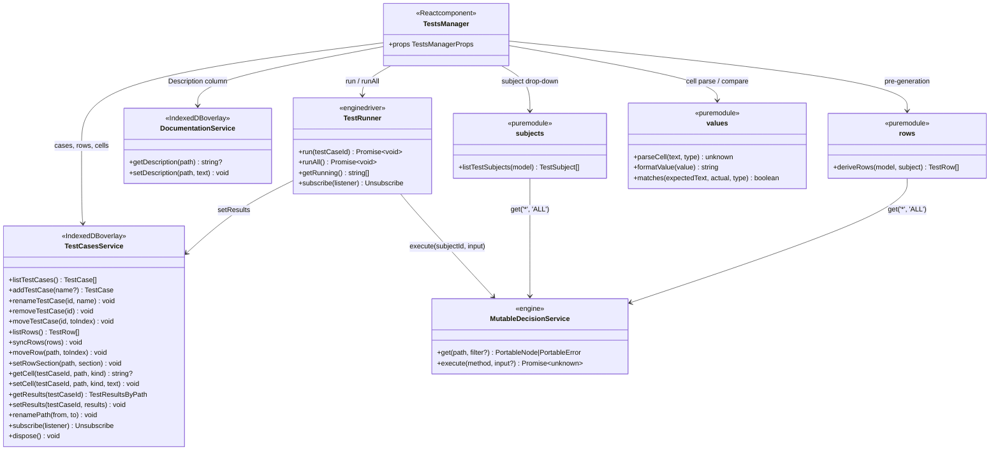
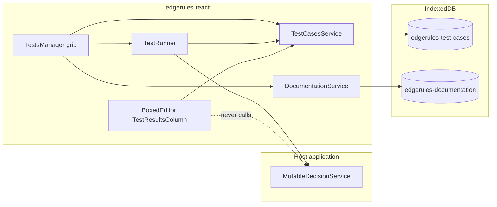
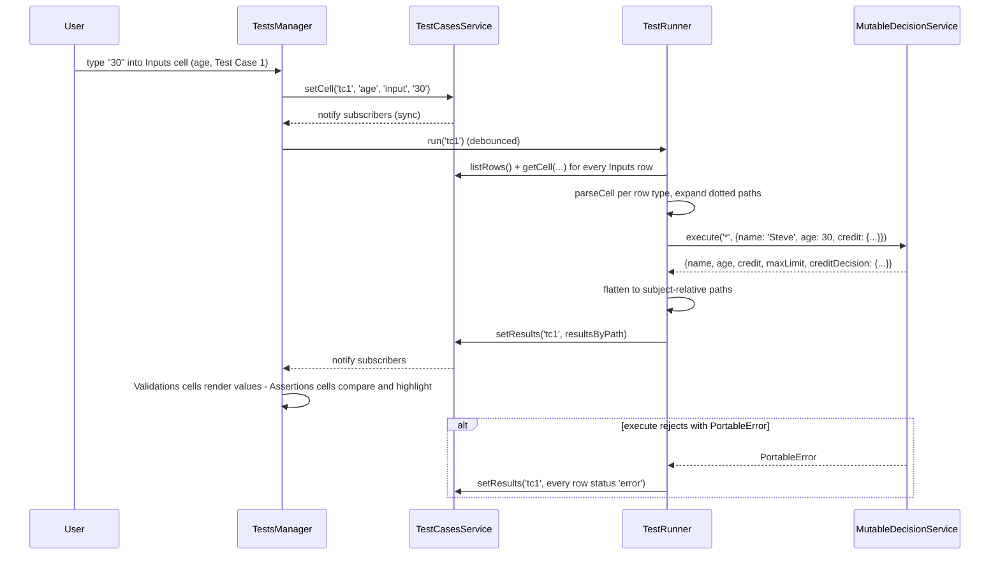
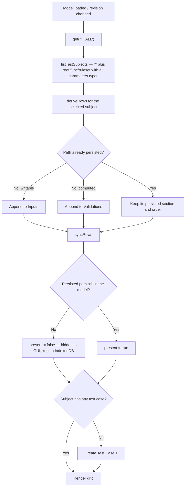

# Tests Manager Story

Tests Manager provides maintenance for all test cases of the selected model. Test cases, their input values, their
expected values, and their last computed results are persisted through `TestCasesService`; execution is performed by
`TestRunner` against the model's `MutableDecisionService`.

The three concerns are deliberately separate packages, mirroring how `DocumentationService` is separated from its
consumers (see [`DOCUMENTATION_SERVICE_STORY.md`](DOCUMENTATION_SERVICE_STORY.md)):

- `TestCasesService` — persistence only, engine-free. `BoxedEditor`'s `TestResultsColumn` consumes exactly the read
  subset of it defined in [`BOXED_EDITOR_SPEC.md`](BOXED_EDITOR_SPEC.md#testcasesservice-api), which is what lets
  `BoxedEditor` display results without ever touching the engine.
- `TestRunner` — execution only. Binds inputs, calls `execute`, flattens the result, writes results back through
  `TestCasesService`.
- `TestsManager` — the React grid.

## Tests Manager GUI

- **Path column**: shows the path to the model field that is being tested, relative to the selected test subject.
- **Path column header**: a drop-down that selects the **test subject** — the whole model, or any root-level `func` /
  `ruleset` / `optimise` whose parameters are all typed.
- **Description column**: filled by `DocumentationService`, which either pulls an existing description found by model
  name + fully qualified path or lets the user add a new one.
- **Test Case columns**: each column is one test case. Test cases are added and removed through the column's context
  menu.
- **Paging**: when a subject has more test cases than fit, the GUI pages over test-case **columns**; the Path and
  Description columns are frozen and never page.
- **Assertions**: cells hold the value the user expects. A cell whose expected value does not equal the computed
  value is highlighted in red, and its tooltip shows the actual value.
- **Validations**: cells show the computed result. They are read-only and exist purely to inspect what a path
  evaluates to — useful when the user does not yet know the expected value.
- **`::`**: drag-and-drop handle for the row. Rows reorder within their own section.
- **`:`**: three-dots context-menu button.

### General Language

Tests Manager GUI follows the same language as Boxed Editor GUI:

- Every cell is single-height (40px) and grows only in 40px steps when it needs to wrap.
- Same icons for drag and drop, add, remove, and context menu.
- Same spacing, padding, margins, context-menu style, and row hover effects.

### Sections

Every subject's grid has the same three sections, in this fixed order. A path belongs to exactly one of them.

| Section       | Rows                                                              | Cell editable | Cell shows                                          |
|---------------|-------------------------------------------------------------------|---------------|-----------------------------------------------------|
| `Inputs`      | Writable leaves of the subject (typed holes / callable arguments) | Yes           | The value bound before execution                    |
| `Assertions`  | Computed paths the user has given an expected value for           | Yes           | Expected value; red + actual in tooltip on mismatch |
| `Validations` | Every other computed path                                         | No            | The computed value                                  |

`Assertions` and `Validations` are the same population of computed paths split by user intent: entering a value in a
`Validations` cell, or invoking **Move to Assertions**, promotes that row into `Assertions`; **Move to Validations**
demotes it and discards its expected values. This is why a path can never appear in both.

### Workbook Testing

The particular GUI shows how a `Workbook` is tested. A `Workbook` model is a `context` with multiple fields, so its
subject is the whole model (`*`).

|    | Model Name              ▼ | Description           | Test Case 1        : | Test Case 2        : | ... | Test Case N        : |
|----|---------------------------|-----------------------|----------------------|----------------------|-----|----------------------|
|    | Inputs                    |                       |                      |                      | ... |                      |
| :: | `name`                    | `User Name`           | `Steve`              | `John`               | ... | `Mary`               |
| :: | `age`                     | `User Age`            | `30`                 | `25`                 | ... | `40`                 |
| :: | `credit.balance`          | `User Credit Balance` | `1000`               | `0`                  | ... | `-100`               |
| :: | `credit.limit`            | `User Credit Limit`   | `2000`               | `0`                  | ... | `10000`              |
|    | ___                       | ___                   | ___                  | ___                  | ___ | ___                  |
|    | Assertions                |                       | `2/2` ✓              | `2/2` ✓              | ... | `1/2` ✗              |
| :: | `creditDecision.approved` | `Credit Approved`     | `true`               | `true`               | ... | `false`              |
| :: | `creditDecision.limit`    | `Credit Limit`        | `10000`              | `10000`              | ... | `10000`              |
|    | ___                       | ___                   | ___                  | ___                  | ___ | ___                  |
|    | Validations               |                       |                      |                      | ... |                      |
| :: | `maxLimit`                | `Maximum Limit`       | `10000`              | `10000`              | ... | `10000`              |

The `Assertions` section header carries each test case's pass counter. In `Test Case N` the applicant is declined
(`balance` is negative), so `creditDecision.limit` computes `0` while the cell expects `10000` — that cell renders red
and its tooltip reads `0`.

**Example model for the above test manager GUI:**

```edgerules
{
    maxLimit: 10000,
    name: <string, required: true>,
    age: <number, required: true>,
    credit: {
        balance: <number, required: true>,
        limit: <number, required: true>
    },
    creditDecision: {
        approved: if credit.balance >= 0 and age > 17 then true else false,
        limit: if approved then maxLimit else 0
    }
}
```

### Decision Service Testing

A root-level `func` or `ruleset`, or `optimise` with fully typed parameters is a decision-service entry point and gets
its own subject. Its `Inputs` rows are the parameters (complex parameter types expanded to leaves); its computed rows
are the leaves of the return type.

A `func` body cannot read the enclosing context — the engine rejects it with `E101: function 'x' cannot read 'y' from
an enclosing context`. Everything a decision service needs must therefore arrive as a parameter, which is why
`maxLimit` below is one:

```edgerules
{
   type Credit: {
      balance: <number, required: true>,
      limit: <number, required: true>
   }
   maxLimit: 10000,
   func creditDecision(name: string, age: number, credit: Credit, cap: number): {
      approved: if credit.balance >= 0 and age > 17 then true else false,
      limit: if approved then cap else 0
   }
}
```

| creditDecision ▼ | Description           | Test Case 1 : | ... |
|------------------|-----------------------|---------------|-----|
| Inputs           |                       |               | ... |
| `name`           | `User Name`           | `Steve`       | ... |
| `age`            | `User Age`            | `30`          | ... |
| `credit.balance` | `User Credit Balance` | `1000`        | ... |
| `credit.limit`   | `User Credit Limit`   | `2000`        | ... |
| `cap`            | `Credit Cap`          | `10000`       | ... |
| ___              | ___                   | ___           | ___ |
| Assertions       |                       | `2/2` ✓       | ... |
| `approved`       | `Credit Approved`     | `true`        | ... |
| `limit`          | `Credit Limit`        | `10000`       | ... |

A callable whose return type is a scalar (`-> boolean`) has exactly one computed row, whose path is the empty string
and whose Path cell renders as `(result)`.

## Object Model

Paths are **relative to the subject**. `TestCasesService` stores them that way, and the qualified form used for
`DocumentationService` lookups and for `BoxedEditor` interop is derived:

```typescript
// '*' + 'credit.balance' -> 'credit.balance'; 'creditDecision' + 'approved' -> 'creditDecision.approved'
function qualifyPath(subjectId: string, path: string): string;
```

```typescript
// '*' for the whole model, otherwise the callable's root-level name.
type TestSubjectId = string;

type TestSubjectKind = 'model' | 'function' | 'ruleset' | 'optimise';

interface TestSubject {
    id: TestSubjectId; // '*' or the callable's name.
    kind: TestSubjectKind;
    name: string; // Label in the Path column header: the model name for '*', otherwise the callable name.
}

type TestSectionId = 'inputs' | 'assertions' | 'validations';

interface TestRow {
    path: string; // Subject-relative; '' for a scalar-returning callable's single result row.
    section: TestSectionId;
    order: number; // Position within its section.
    type?: string; // Declared/inferred type name, used to parse cells and as the Path cell tooltip.
    present: boolean; // False once the model no longer declares this path — hidden in the GUI, kept in IndexedDB.
}

interface TestCase {
    id: string; // Stable identifier; survives renames.
    name: string; // Column header, e.g. "Standard application".
    order: number;
}

type TestResultStatus = 'ok' | 'error' | 'missing' | 'pending';

interface TestResult {
    testCaseId: string;
    path: string; // Subject-relative, matching TestRow.path.
    value?: unknown; // Exactly what the engine returned for this path. Omitted when status is 'error'.
    error?: string; // Message when the path failed to evaluate for this case.
    status: TestResultStatus;
    ranAt: number; // Epoch ms of the run that produced this result.
    modelRevision?: string; // The `revision` prop in force during that run; drives staleness.
}

type TestResultsByPath = Record<string, TestResult>;
```

> Architect notes: all model around TestCase is confusing for me - maybe I misunderstood it and/or ite requires better
> explanation: I expected that TestCase owns user entered sets of Record<Path,Value> that are input values and
> assertions. TestResult better not have ranAt and modelRevision on each path/value mapping. I expected One TestCase
> will have one TestResultSet that will have many TestResult[]... fix these things or explain what is the point of this
> model.

"`TestResult` extends" - test result must not extend anything! Tests manager and the whole     
testing framework does not know anything about boxed editor!

`TestResult` extends [`BOXED_EDITOR_SPEC.md`](BOXED_EDITOR_SPEC.md#testcasesservice-api)'s with `ranAt` and
`modelRevision`, so a consumer can tell a fresh result from one produced against a since-edited model. `BoxedEditor`
may ignore both.

`value` is the engine's own return value, not a string: a `number` for a numeric path, an `array` for a list, the
engine's string form for dates (`2024-01-15`), durations (`P1D`), and special values (`Missing('credit')`). Every
shape the engine returns is JSON-serializable, so IndexedDB stores it by structured clone. Display formatting stays
the consumer's job — which is what lets `BoxedEditor` render an array as `N items` (Resolved Decision #9).



### High-level structure



## Components

`TestsManager` lives at `src/components/tests-manager/` (subpath `edgerules-react/tests-manager`);
`TestCasesService` at `src/components/test-cases-service/` (subpath `edgerules-react/test-cases-service`), keeping it
importable by `BoxedEditor` without dragging in the grid or the engine.

```text
src/components/test-cases-service/
├─ index.ts                          — public exports
├─ test-cases-service-types.ts       — TestCasesService, TestCase, TestRow, TestResult, TestResultsByPath,
│                                       TestSectionId, TestResultStatus, TestCasesServiceOptions, Unsubscribe
├─ createTestCasesService.ts         — factory: (modelName, subjectId, options?) -> TestCasesService
├─ indexedDbStore.ts                 — IndexedDB adapter: open/upgrade, hydrate-all-for-subject, put, delete
├─ useTestCases.ts                   — hook: ordered cases + current index + next()/prev()
├─ useTestResult.ts                  — hook: one path's TestResult for the current case
└─ __tests__/
   ├─ createTestCasesService.test.ts — hydration, case CRUD, row sync, cell round trip, results, renamePath, dispose
   ├─ no-indexeddb-fallback.test.ts  — indexedDB unavailable -> in-memory only, no throw
   └─ hooks.test.tsx                 — RTL: both hooks re-render on service writes, unsubscribe on unmount

src/components/tests-manager/
├─ index.ts                          — public exports
├─ TestsManager.tsx                  — root: subject state, pre-generation, providers, header + sections
├─ TestsManagerProps.ts              — TestsManagerProps (public)
├─ tests-manager-types.ts            — TestSubject, TestSubjectKind, TestRunner (public)
├─ model/
│  ├─ subjects.ts                    — listTestSubjects: root callables with fully typed parameters, plus '*'
│  ├─ rows.ts                        — deriveRows: input vs computed leaves, user-type expansion
│  ├─ values.ts                      — parseCell / formatValue / matches (type-directed)
│  └─ inputs.ts                      — dotted subject-relative paths -> nested input object for execute()
├─ runner/
│  └─ createTestRunner.ts            — factory: (service, testCasesService, subject) -> TestRunner
├─ context/
│  ├─ TestsManagerContext.tsx        — services, subject, readOnly, revision
│  └─ TestsManagerUiContext.tsx      — ephemeral UI: page index, active editing cell, running case ids
├─ hooks/
│  ├─ useTestSubjects.ts             — memoized listTestSubjects for the current model revision
│  ├─ useTestRows.ts                 — useSyncExternalStore over TestCasesService.listRows()
│  ├─ useTestCaseColumns.ts          — visible page of test cases + paging controls
│  └─ useCell.ts                     — one cell's persisted text, computed value, and match state
├─ grid/
│  ├─ TestsGrid.tsx                  — grid shell, frozen Path/Description columns, column paging
│  ├─ SubjectHeaderCell.tsx          — the Path column header drop-down
│  ├─ TestCaseHeaderCell.tsx         — case name, three-dots menu, run indicator
│  ├─ SectionHeaderRow.tsx           — Inputs / Assertions / Validations separators; pass counter
│  ├─ TestRowLine.tsx                — one row: drag handle, path cell, description cell, its case cells
│  ├─ InputCell.tsx                  — editable, type-directed parsing
│  ├─ AssertionCell.tsx              — editable expected value; red + actual-value tooltip on mismatch
│  └─ ValidationCell.tsx             — read-only computed value
├─ menu/
│  ├─ actions.ts                     — TestCaseAction / TestRowAction registries
│  └─ TestsMenu.tsx                  — shared MUI menu for the column and row three-dots buttons
├─ dnd/
│  └─ useRowDrag.ts                  — within-section row reordering
└─ __tests__/
   ├─ TestsManager.test.tsx          — rendering, subject switch, sections, paging, readOnly
   ├─ pre-generation.test.tsx        — first-run generation, new field appended to Validations, removed field hidden
   ├─ execution.test.tsx             — input edit -> run -> results, assertion pass/fail highlighting
   ├─ subjects.test.ts               — subject discovery incl. untyped-parameter exclusion
   ├─ rows.test.ts                   — input vs computed classification, user-type expansion, scalar return
   └─ values.test.ts                 — parse / format / compare per type, special values
```

## Persistence

`TestCasesService` is loaded for one `(modelName, subjectId)` pair and disposed when that pair is unloaded. One
instance therefore has the exact read surface `BoxedEditor` expects (`listTestCases()` / `getResults(testCaseId)` with
no subject argument); `TestsManager` constructs a new instance when the subject drop-down changes.

Like `DocumentationService`, the API is synchronous over an in-memory cache, with IndexedDB written in the background;
persistence failures never roll back the in-memory value.

```typescript
type Unsubscribe = () => void;

type TestCellKind = 'input' | 'assertion';

interface TestCasesServiceOptions {
    // IndexedDB database name. Defaults to 'edgerules-test-cases'.
    dbName?: string;

    // Called when a background IndexedDB operation fails. In-memory state is unaffected. Omit to ignore silently.
    onPersistError?: (error: unknown, context: { op: string; path?: string; testCaseId?: string }) => void;
}

interface TestCasesService {
    // --- test cases (grid columns) ---
    listTestCases(): TestCase[]; // Ordered by TestCase.order.
    addTestCase(name?: string): TestCase; // Appends; defaults the name to "Test Case N".
    renameTestCase(testCaseId: string, name: string): void;

    removeTestCase(testCaseId: string): void; // Also removes that case's cells and results.
    moveTestCase(testCaseId: string, toIndex: number): void;

    // --- rows ---
    listRows(): TestRow[]; // Ordered by section, then TestRow.order.
    syncRows(rows: TestRow[]): void; // Reconciles derived rows with persisted ones (see Tests Pre-Generation).
    moveRow(path: string, toIndex: number): void; // Within the row's own section.
    setRowSection(path: string, section: TestSectionId): void; // Promote/demote between assertions and validations.

    // --- cells ---
    getCell(testCaseId: string, path: string, kind: TestCellKind): string | undefined; // Raw text as typed.
    setCell(testCaseId: string, path: string, kind: TestCellKind, text: string): void; // Empty string clears it.

    // --- results ---
    getResults(testCaseId: string): TestResultsByPath;

    setResults(testCaseId: string, results: TestResultsByPath): void; // Replaces the whole set for that case.

    // Migrate rows, cells, and results when a node's path changes (called after a successful rename/move).
    renamePath(from: string, to: string): void;

    // Notified after any in-memory change, and once after initial IndexedDB hydration completes.
    subscribe(listener: () => void): Unsubscribe;

    // Closes the IndexedDB connection and drops listeners; an in-flight hydration result is discarded on arrival.
    dispose(): void;
}

function createTestCasesService(
    modelName: string,
    subjectId: TestSubjectId,
    options?: TestCasesServiceOptions,
): TestCasesService;
```

### IndexedDB schema

Two object stores in one database, because cases/rows are per-subject metadata while cells and results are per-cell
data with a much higher write rate.

| Item          | `testCases` store                                              | `testCells` store                                                                                                                                                                                       |
|---------------|----------------------------------------------------------------|---------------------------------------------------------------------------------------------------------------------------------------------------------------------------------------------------------|
| Key path      | `['modelName', 'subjectId']`                                   | `['modelName', 'subjectId', 'testCaseId', 'kind', 'path']`                                                                                                                                              |
| Record shape  | `{ modelName, subjectId, cases: TestCase[], rows: TestRow[] }` | `{ modelName, subjectId, testCaseId, kind, path, text?, result? }`                                                                                                                                      |
| `kind` values | —                                                              | the two `TestCellKind`s plus `'result'`, so a run's output shares one store and one hydration pass with the values that produced it; `text` is set for `'input'`/`'assertion'`, `result` for `'result'` |
| Hydration     | one `get` on construction                                      | one cursor read over `IDBKeyRange.bound([modelName, subjectId], [modelName, subjectId, '￿'])`                                                                                                           |
| Write         | whole-record `put` on any case/row change                      | per-cell `put`; `delete` when `text` is cleared                                                                                                                                                         |

Compound array keys avoid inventing (and escaping) a delimiter that cannot appear in an EdgeRules path — the same
reasoning as [`DOCUMENTATION_SERVICE_STORY.md`](DOCUMENTATION_SERVICE_STORY.md)'s Resolved Decision #5.

### Cell values

Cells store the **raw text the user typed**; parsing is type-directed, using the row's declared type, so `30` in a
`number` row binds the number `30` rather than the string `"30"`.

| Row type                          | Cell text        | Bound / compared value               |
|-----------------------------------|------------------|--------------------------------------|
| `string`                          | `Steve`          | `"Steve"` (never quoted by the user) |
| `number`                          | `30`, `-100`     | `30`, `-100`                         |
| `boolean`                         | `true` / `false` | `true` / `false`                     |
| `date`, `time`, `datetime`        | `2024-01-15`     | the ISO string the engine emits      |
| `duration`, `period`              | `P1D`            | the ISO-8601 string the engine emits |
| `array`, user-defined type, `any` | JSON             | the parsed JSON value                |
| any type, cell left empty         | (empty)          | not bound / not asserted             |

An empty `Inputs` cell binds nothing — the engine then supplies the field's `default`, or `Missing(...)` when it has
none. An empty `Assertions` cell asserts nothing and never renders red. Text that cannot be parsed for the row's type
marks the cell invalid without running.

Assertion comparison parses the expected text per the row type and does a structural deep-equal against
`TestResult.value`. Special values reach the host as strings (`Missing('credit')`, `Invalid(number, 'x')`), so
asserting one is just asserting that string.

## Execution

`TestRunner` owns every engine call. `TestsManager` never calls `execute` directly.

```typescript
interface TestRunner {
    // Runs one case: binds its Inputs cells, executes the subject, writes results through TestCasesService.
    run(testCaseId: string): Promise<void>;

    // Runs every case of the subject, sequentially.
    runAll(): Promise<void>;

    // Test case ids with a run in flight; drives the per-column running indicator.
    getRunning(): readonly string[];

    subscribe(listener: () => void): Unsubscribe;
}

function createTestRunner(
    service: MutableDecisionService,
    testCases: TestCasesService,
    subject: TestSubject,
    options?: { modelRevision?: string },
): TestRunner;
```

Binding rules:

- Only `Inputs` rows are bound. Sending a value for a computed path does not override it — the engine ignores it while
  echoing it back into the result, which is recorded in [`BUG_REPORTS.md`](BUG_REPORTS.md). Restricting the payload to
  writable paths is what keeps `Validations` cells showing computed values rather than the user's own input.
- Dotted subject-relative paths are expanded into a **nested** input object (`credit.balance` → `{credit: {balance:
  …}}`). A dotted key passed literally binds nothing.
- Subject `*` executes `execute('*', input)`; a callable subject executes `execute(subjectId, args)` with `args` keyed
  by parameter name.
- The returned object is flattened back into subject-relative paths. A scalar return flattens to the single path `''`.
- `execute` rejecting with a `PortableError` (`EntryNotFound`, `Execution`, …) fails the whole case: every row of that
  column gets `status: 'error'` with the message, and the column header shows the error badge.

Runs are triggered by: committing an `Inputs` cell edit (debounced, that case only), a `revision` prop change (all
cases), and the explicit **Run** / **Run all** menu actions. Runs for one subject are serialized — a run requested
while one is in flight replaces any queued run for the same case.



## Context Menu And Actions

**Test-case column menu** (the `:` in a column header):

| Action              | Effect                                                                   |
|---------------------|--------------------------------------------------------------------------|
| `Run`               | Runs this case now.                                                      |
| `Run all`           | Runs every case of the subject.                                          |
| `Rename`            | Inline-edits the case name.                                              |
| `Duplicate`         | Copies input and assertion cells into a new case appended at the end.    |
| `Insert left/right` | Adds an empty case at that position.                                     |
| `Move left/right`   | Reorders the column.                                                     |
| `Clear results`     | Drops this case's results, leaving inputs and assertions.                |
| `Delete`            | Removes the case with its cells and results; disabled for the last case. |

**Row menu** (three-dots revealed on hover in the Path cell):

| Action                    | Available in           | Effect                                                     |
|---------------------------|------------------------|------------------------------------------------------------|
| `Move to Assertions`      | `Validations`          | Promotes the row; seeds each cell with the computed value. |
| `Move to Validations`     | `Assertions`           | Demotes the row and discards its expected values.          |
| `Clear values`            | `Inputs`, `Assertions` | Clears this row's cells across every case.                 |
| `Copy actual to expected` | `Assertions`           | Overwrites expected with the computed value, per case.     |

**Grid-level actions** live in the toolbar next to the subject drop-down: `Add test case`, `Run all`, and the paging
controls.

## Tests Pre-Generation

On mount, and whenever `revision` changes, `TestsManager` derives the subject's rows from the engine and reconciles
them with what is persisted. At least one test case always exists for the model subject and for every decision-service
entry point, so a user never faces an empty grid.



Derivation rules for `deriveRows`, all read off one `get('*', 'ALL')` call:

- A `@kind: 'type'` node with `writeOnly: true` is an **input** leaf; with `readOnly: true` it is a **computed** leaf.
  A `@kind: 'expression'` node is a computed leaf.
- Nested `@kind: 'context'` nodes are recursed into, joining segments with `.`.
- An input leaf whose `type` names a user-defined type is expanded into that type's own leaves, read from the same
  `ALL` view's `type-definition` entries — the engine does not resolve such paths itself (`get('credit.balance')` on a
  `credit: <Credit>` hole returns `EntryNotFound`).
- `array`-typed leaves are not expanded; the row holds one JSON cell.
- `function-schema`, `ruleset-schema`, and `type-definition` entries are not rows of the `*` subject; they are
  subjects (or type sources) in their own right.
- For a callable subject, input rows come from `@parameters` (same expansion rules) and computed rows from the leaves
  of `@return` — one row with path `''` when `@return` is a scalar type name.

A path that disappears from the model is only hidden (`present: false`); nothing is deleted from IndexedDB, so
restoring the field restores its test data. Purging orphaned rows belongs to the future project-saving story.

Subject discovery excludes a callable with any untyped parameter: the engine reports those as `"any"` in
`@parameters`, and a row with no declared type has no parsing rule.

## Component API

```typescript
interface TestsManagerProps {
    service: MutableDecisionService; // The model authority. TestRunner executes against it; TestsManager never mutates it.
    modelName: string; // IndexedDB namespace for this model's test data and descriptions.
    documentationService?: DocumentationService; // Supplies the Description column; the column is read-only without it.
    subjectId?: TestSubjectId; // Controlled subject selection. Uncontrolled and defaulting to '*' when omitted.
    onSubjectChange?: (subjectId: TestSubjectId) => void; // Fired when the Path column header drop-down changes.
    revision?: string | number; // Host-controlled invalidation token. Change it after model edits made elsewhere.
    readOnly?: boolean; // Disables cell editing, reordering, and case CRUD; running stays available.
    pageSize?: number; // Test-case columns per page. Defaults to 10.
    autoRun?: boolean; // Whether committing an input re-runs its case automatically. Defaults to true.
    onRunComplete?: (testCaseId: string, results: TestResultsByPath) => void; // Fired after each successful run.
    className?: string;
    sx?: SxProps<Theme>;
}
```

## Testing Strategy

- Unit and RTL tests run against a **real** `MutableDecisionService` from `@edgerules/node`, per
  [`CLAUDE.md`](../CLAUDE.md) — never a mocked engine.
- IndexedDB is supplied by `fake-indexeddb`, imported locally in the test files that need it (a substitute for a
  missing browser API in `jsdom`, not a mock of application logic), matching
  [`DOCUMENTATION_SERVICE_STORY.md`](DOCUMENTATION_SERVICE_STORY.md)'s Testing Strategy.
- If a run exposes a WASM/DSL gap, append a reproducible entry to [`BUG_REPORTS.md`](BUG_REPORTS.md) rather than
  compensating in React.

## Storybook stories

1. `TestsManager` on the Workbook model — all three sections, several test cases, one deliberately failing assertion.
2. `TestsManager` on a model with decision-service entry points — subject drop-down switching between `*`, a `func`,
   and a `ruleset`, including a callable excluded for having an untyped parameter.
3. `TestsManager` with more test cases than `pageSize` — column paging with frozen Path/Description columns.
4. `TestsManager` wired to a `DocumentationService` shared with another component, showing descriptions staying in
   sync both ways.
5. `TestsManager` with a model edited live (host bumps `revision`) — new fields appearing in `Validations`, removed
   fields disappearing, all cases re-running.
6. `TestsManager` in `readOnly` mode.

## Tasks

**Phase 1: `TestCasesService`**

- [ ] Ensure project compiles and existing tests are passing
- [ ] Add `test-cases-service-types.ts` with the types from [Object Model](#object-model)
  and [Persistence](#persistence)
- [ ] Add `indexedDbStore.ts`: the `testCases` and `testCells` stores, hydrate/put/delete
- [ ] Add `createTestCasesService.ts`: in-memory cache, synchronous API, async hydration, best-effort persistence,
  `onPersistError`, no-`indexedDB` in-memory-only fallback
- [ ] Add `useTestCases.ts` and `useTestResult.ts`
- [ ] Add `package.json` `./test-cases-service` export and the matching `tsup.config.ts` entry
- [ ] Add the three `__tests__/` files listed in [Components](#components)
- [ ] Mark all checkboxes as done in this document once verified

**Phase 2: Model derivation and execution**

- [ ] Ensure project compiles and existing tests are passing
- [ ] Add `model/subjects.ts`, `model/rows.ts`, `model/values.ts`, `model/inputs.ts`
- [ ] Add `runner/createTestRunner.ts` including serialized runs and `PortableError` handling
- [ ] Add `subjects.test.ts`, `rows.test.ts`, `values.test.ts`, and runner coverage against `@edgerules/node`
- [ ] Mark all checkboxes as done in this document once verified

**Phase 3: The grid**

- [ ] Ensure project compiles and existing tests are passing
- [ ] Add contexts, hooks, `grid/`, `menu/`, `dnd/`, and `TestsManager.tsx` per [Components](#components)
- [ ] Implement pre-generation and reconciliation per [Tests Pre-Generation](#tests-pre-generation)
- [ ] Add `package.json` `./tests-manager` export and the matching `tsup.config.ts` entry
- [ ] Add `TestsManager.test.tsx`, `pre-generation.test.tsx`, `execution.test.tsx`
- [ ] Add the Storybook stories listed above
- [ ] Mark all checkboxes as done in this document once verified

**Phase 4: Quality gate**

- [ ] Ensure project compiles and existing tests are passing
- [ ] Update `docs/BOXED_EDITOR_SPEC.md`'s [`TestCasesService` API](BOXED_EDITOR_SPEC.md#testcasesservice-api) section
  to reference this package instead of defining the interface inline (including `TestResult.value`'s type, per
  Resolved Decision #9), and its ["Service composition"](BOXED_EDITOR_SPEC.md#service-composition) table row
  accordingly
- [ ] Update `README.md`'s Project Structure to list `tests-manager` and `test-cases-service`
- [ ] Update `docs/BUG_REPORTS.md` with any engine gaps found during Phases 1–3
- [ ] Perform linting and formatting (`npm run format`, `npm run typecheck`)
- [ ] Review the implementation against this document
- [ ] Mark all checkboxes as done in this document once verified

## Resolved Decisions

| # | Decision                                      | Resolution                                                                                                                                                                                                                                                                                                                                                                            |
|---|-----------------------------------------------|---------------------------------------------------------------------------------------------------------------------------------------------------------------------------------------------------------------------------------------------------------------------------------------------------------------------------------------------------------------------------------------|
| 1 | Persistence split from execution              | `TestCasesService` stays engine-free and gains write methods; `TestRunner` is the only piece that imports the engine. This preserves `BOXED_EDITOR_SPEC.md`'s promise that `BoxedEditor` displays results without running the engine, while giving Tests Manager the writes it needs.                                                                                                 |
| 2 | One service instance per `(model, subject)`   | `createTestCasesService(modelName, subjectId)` rather than a subject argument on every method — so `BoxedEditor` consumes the exact read surface its spec already defines (`listTestCases()`, `getResults(id)`), and `TestsManager` swaps instances when the drop-down changes.                                                                                                       |
| 3 | Stable `id` for a test case                   | Cells and results key off `TestCase.id`, not the display name, so renaming a column never rewrites its data.                                                                                                                                                                                                                                                                          |
| 4 | Results are persisted, not recomputed on read | Results live in IndexedDB because `BoxedEditor` reads them without an engine. `ranAt` + `modelRevision` let any consumer detect a result produced against a since-edited model.                                                                                                                                                                                                       |
| 5 | Subject-relative paths in storage             | Rows and results store paths relative to the subject; `qualifyPath` derives the model-level form for `DocumentationService` and `BoxedEditor` interop. Keeps a callable's `approved` from colliding with a root field of the same name.                                                                                                                                               |
| 6 | Type-directed cell parsing                    | Cells store raw text and are parsed using the row's declared type, rather than requiring the user to type JSON. The engine coerces some mistyped input silently (a `"5"` string still arithmetics as `5`) but echoes the original string back in the result, which would make assertions confusing.                                                                                   |
| 7 | Only writable paths are bound                 | Inputs are restricted to typed holes and callable parameters. Overriding a computed field is not supported by the engine and is silently ignored — see [Open Questions](#open-questions) #1 and the entry in [`BUG_REPORTS.md`](BUG_REPORTS.md).                                                                                                                                      |
| 8 | Rulesets are subjects too                     | A root-level `ruleset` is callable with typed parameters exactly like a `func` (`get` returns `@kind: 'ruleset-schema'` with `@parameters`), and `execute('risk', {age: 20})` works. Excluding rulesets would leave decision tables untestable.                                                                                                                                       |
| 9 | `TestResult.value` is `unknown`, not `string` | `execute` returns real JS values — numbers, booleans, arrays, nested objects — and only dates, durations, and special values arrive as strings. Typing `value` as `string` would force every producer to stringify and every consumer to parse back, and would defeat `BoxedEditor`'s own "arrays render as `N items`" rule. `BOXED_EDITOR_SPEC.md` is corrected to match in Phase 4. |

## Open Questions

1. **"User can set any value to the model" is not what the engine does.** The premise that referential transparency
   lets a test case pin any path is not supported: `execute` only binds typed holes and parameters. Supplying a
   computed path is accepted, ignored during evaluation, and then echoed into the result as though it had applied
   (reproduced and filed in [`BUG_REPORTS.md`](BUG_REPORTS.md)). This story therefore restricts `Inputs` to writable
   paths.
   Question to address: is pinning arbitrary computed paths a requirement for Tests Manager, or is binding typed holes
   and parameters sufficient?
   Option 1: keep this story's scope — inputs are writable paths only — and treat overrides as an engine feature
   request tracked separately.
   Option 2: emulate overrides in the React layer by `set()`-ing the path before the run and restoring it after. This
   mutates the authored model for the duration of a run, races with any other editor open on the same service, and
   changes `TestsManager` from a read-only consumer of the model into a mutator. Not recommended.

> Architect notes: we have a current engine limitation that prevents user setting any path he wants: for now only typed
> holes and parameters can be set. Mark this for the future as "Full referential transparency support". Add Followup
> section in the story to track this.

2. **Component naming across the docs.** `README.md` and `BOXED_EDITOR_SPEC.md` both name this component **Test
   Runner**; this story names it **Tests Manager** and reserves `TestRunner` for the execution service. Leaving both
   names in circulation guarantees confusion about which is the GUI.
   Question to address: which name is canonical?
   Option 1: adopt `tests-manager` for the GUI and `TestRunner` for the execution service as this story does, and
   rename the `test-runner` entry in `README.md`'s Project Structure (a Phase 4 task already).
   Option 2: keep `test-runner` as the component directory and rename the execution service to something else
   (`TestExecutor`).

> Architect notes: Option 1: adopt `tests-manager` for the GUI and `TestRunner` for the execution service as this story
> does.

3. **Only root-level callables are subjects.** The engine executes nested callables fine — `execute('nested.inner',
   {x: 5})` returns a value — so restricting the drop-down to the first level is a product decision, not a technical
   limit. A model that organizes its functions under a `library:` context (as the reference loan-origination model
   does) would expose no callable subjects at all.
   Question to address: should the drop-down list nested callables with fully typed parameters as well?
   Option 1: root level only, as specified — the drop-down stays short and matches "decision service entry point".
   Option 2: list every callable with fully typed parameters at any depth, shown by its dotted path.

> Architect notes: Option 2: list every callable with fully typed parameters at any depth, shown by its dotted path. We
> will allow testing absolutely all callables.

4. **Staleness display.** `TestResult.modelRevision` records which revision produced a result, but the GUI behavior
   when it no longer matches is unspecified. With `autoRun` on, a revision change re-runs everything and the window is
   momentary; with `autoRun` off it can persist indefinitely.
   Question to address: how should a stale result render?
   Option 1: grey out stale result cells and suppress assertion highlighting until the case is re-run.
   Option 2: keep showing the last known value unchanged, with a stale badge on the column header only.

> Architect notes: Option 1: grey out stale result cells and suppress assertion highlighting until the case is re-run.

5. **Description scope for callable subjects.** Descriptions are keyed by qualified path, so a `func` parameter named
   `age` and a root field named `age` get separate descriptions — correct. But the return-value rows of a callable
   (`creditDecision.approved`) share a key with a root context field of that path if the model happens to have one.
   Question to address: should description keys carry a section discriminator, or is the qualified path enough?
   Option 1: qualified path only — collisions require a model that names a root context exactly like a callable,
   which the engine already forbids as a duplicate name.
   Option 2: prefix callable-subject rows in the description key (e.g. `creditDecision()::approved`).

> Architect notes: the qualified path is enough
