# Test Runner

`edgerules-testing` is a separate repository and npm library that contains and exposes TestRunner. 

## General Development Rules 

- TypeScript code is written using the best OOP practices.
- Each TypeScript class is defined in it's own deticated file, fo example `class TestRunner {...}` is defined in `TestRunner.ts`
- TypeScript class represents a logical component. 
- Component class file can alos has definitions of related interfaces, types or enumerations.
- All methods (internal and external) are defined as a class methods.
- Common functions are defined in `utils.ts`, common types and interfaces in `types.ts`, common constants or other structures in `constants.ts`.

## Summary

Tets runner is a stand alone component that executes EdgeRules test suites against EdgeRules model or decision service method.

- Test Suite: contains many test cases and one common EdgeRules method or model name.
- Test Case: contains input, assertions and verifications. 
- Executed Test Case: contains assertion keys with match information and output data.

## Test Sources

- json files: each json file is a test case, can be uploaded or read from fs or IndexedDB table.
- csv file: can contain the whole test suite. CSV file name is model or method to be executed name. Can be uploaded or from fs.
- SQL file: can contain many test suites (TEST_SUITES) and many test cases (TEST_CASES, test site id) with results (TEST_RESULTS -> test case id)

## Test Execution

- From command line
- From React components

## Engine

The engine is injected, never imported. Core declares `MutableDecisionService` structurally; both `@edgerules/node/mutable` and `@edgerules/web/mutable` satisfy it.

## Domain vocabulary

| Term | Meaning |
|---|---|
| `TestSubject` | What is under test: the whole model (`*`) or one callable's dotted path |
| `TestSuite` | Everything authored for one subject — its rows and its cases — plus their latest results |
| `TestRow` | One subject-relative path, in the inputs, assertions or validations section |
| `TestCase` | One column: input values and expected values for every row |
| `TestSuiteSnapshot` | A suite as persisted: `{ rows, cases, results }`, no behaviour |
| `CaseOutcome` | The result of executing one case once |
| `RunSummary` | Totals for one batch run |

## Published packages

Three npm packages across two repositories. Exact names, one row each — the diagram below labels them with a
namespace identifier because mermaid's grammar rejects `@` and `/`, so read the mapping from this table.

| npm package name | Diagram namespace | Repository · directory | Contents | Runtime dependencies | Entry points |
|---|---|---|---|---|---|
| `@edgerules/testing` | `edgerules_testing` | `edgerules-testing` · `packages/testing/` | Executor, runners, suite, ports, formatters, codecs | **none** | `.` |
| `@edgerules/testing-node` | `edgerules_testing_node` | `edgerules-testing` · `packages/testing-node/` | SQLite and filesystem adapters, Node engine, CLI | `@edgerules/testing`, `@edgerules/node` | `.` · bin `edgerules-test` |
| `edgerules-react` | `edgerules_react` | `edgerules-react` · repo root | React components, hooks, browser adapters | `@edgerules/testing`, `@dnd-kit/*` | `.` · `./tests-manager` · `./code-editor` · … |

`edgerules-testing` is a **new repository** holding the first two packages in an npm workspace, versioned in
lockstep. `edgerules-react` stays as it is and consumes `@edgerules/testing` as a published dependency.

`@edgerules/portable` is a types-only devDependency and optional peer of all three — nothing imports it at runtime.
`@edgerules/web` is an optional peer of `edgerules-react`: the host constructs the engine and injects it.

## Architecture

```mermaid
classDiagram
  direction TB

  namespace edgerules_testing {
    class MutableDecisionService {
      <<interface>>
      +get(path, filter?) PortableGetResult
      +execute(method, input?) Promise~unknown~
      +requiresSolver() boolean
    }
    class TestSuiteRepository {
      <<interface>>
      +load(model, subject) Promise~TestSuiteSnapshot~
      +saveCases(model, subject, cases, rows) Promise~void~
      +saveResults(model, subject, set) Promise~void~
      +deleteResults(model, subject, caseId) Promise~void~
      +close() void
    }
    class DatasetReader {
      <<interface>>
      +describe() Promise~DatasetSchema~
      +count() Promise~number~
      +read() AsyncIterable~DatasetRow~
      +close() void
    }
    class ReportWriter {
      <<interface>>
      +open(meta: RunMetadata) Promise~void~
      +write(outcome: CaseOutcome) Promise~void~
      +close(summary: RunSummary) Promise~void~
    }
    class ReportFormatter {
      <<interface>>
      +header(meta: RunMetadata) string
      +entry(outcome: CaseOutcome) string
      +footer(summary: RunSummary) string
    }
    class TestCaseExecutor {
      -service: MutableDecisionService
      -subject: TestSubject
      +constructor(service, subject, options?)
      +run(request: CaseRequest) Promise~CaseOutcome~
    }
    class InteractiveTestRunner {
      -executor: TestCaseExecutor
      -suite: TestSuite
      +constructor(executor, suite)
      +run(caseId) Promise~void~
      +runAll() Promise~void~
      +getRunning() ReadonlyArray~string~
      +subscribe(listener) Unsubscribe
      +dispose() void
    }
    class BatchTestRunner {
      -executor: TestCaseExecutor
      +constructor(executor, options?)
      +run(reader: DatasetReader, writer: ReportWriter) Promise~RunSummary~
      +cancel() void
    }
    class TestSuite {
      -repository: TestSuiteRepository
      +constructor(model, subject, repository, options?)
      +listCases() ReadonlyArray~TestCase~
      +listRows() ReadonlyArray~TestRow~
      +syncRows(rows) void
      +getCell(caseId, path, kind) string
      +setCell(caseId, path, kind, text) void
      +getResults(caseId) TestResultSet
      +saveResults(set) void
      +renamePath(from, to) void
      +subscribe(listener) Unsubscribe
      +dispose() void
    }
    class MemoryTestSuiteRepository
    class JUnitFormatter
    class JsonFormatter
    class CsvFormatter
  }

  namespace edgerules_testing_node {
    class NodeDecisionService
    class SqliteTestSuiteRepository
    class SqliteDatasetReader
    class CsvFileDatasetReader
    class JsonFileDatasetReader
    class FileReportWriter
    class TestCli {
      +constructor(argv)
      +run() Promise~number~
    }
  }

  namespace edgerules_react {
    class IndexedDbTestSuiteRepository
    class BrowserFileDatasetReader
    class DownloadReportWriter
    class TestsManager
  }

  TestCaseExecutor o-- MutableDecisionService
  InteractiveTestRunner o-- TestCaseExecutor
  InteractiveTestRunner o-- TestSuite
  BatchTestRunner o-- TestCaseExecutor
  TestSuite o-- TestSuiteRepository
  ReportWriter o-- ReportFormatter
  BatchTestRunner ..> DatasetReader
  BatchTestRunner ..> ReportWriter

  TestSuiteRepository <|.. MemoryTestSuiteRepository
  ReportFormatter <|.. JUnitFormatter
  ReportFormatter <|.. JsonFormatter
  ReportFormatter <|.. CsvFormatter

  MutableDecisionService <|.. NodeDecisionService
  TestSuiteRepository <|.. SqliteTestSuiteRepository
  DatasetReader <|.. SqliteDatasetReader
  DatasetReader <|.. CsvFileDatasetReader
  DatasetReader <|.. JsonFileDatasetReader
  ReportWriter <|.. FileReportWriter
  TestCli o-- BatchTestRunner
  TestCli o-- NodeDecisionService

  TestSuiteRepository <|.. IndexedDbTestSuiteRepository
  DatasetReader <|.. BrowserFileDatasetReader
  ReportWriter <|.. DownloadReportWriter
  TestsManager o-- InteractiveTestRunner
```



Relationships are structural only: `<|..` realization, `o--` aggregation of an injected collaborator, `..>` a
dependency on a parameter type. Every arrow crossing a namespace boundary points **into** `edgerules_testing` — the
two outer packages implement its ports and never reference each other.

`edgerules_react` never constructs a decision service; the host injects one satisfying `MutableDecisionService`.
`edgerules_testing_node` constructs its own through `NodeDecisionService`, because a CLI has no host to inject one.

Namespace identifiers are diagram labels only — see the Published packages table for the npm name and repository
each one stands for.

## Why a separate repository

The runner belongs in its own repository, `edgerules-testing`, not in `edgerules-react`.

- **The volatile surface has no React consumer.** `BatchTestRunner`, `DatasetReader`, `ReportWriter`, SQLite and the
  CLI — where nearly all the new work lands — are never imported by a browser bundle. Only
  `InteractiveTestRunner` and `TestSuite` face the UI, and they face it through a small, stable API.
- **The coupling is one publish, not a loop.** `edgerules-react` consumes a published `@edgerules/testing` and
  rewrites its imports once. There is no ongoing cross-repo edit cycle, because the CLI never changes what the grid
  consumes.
- **CI has nothing in common.** A Node version matrix with real SQLite files against Storybook, Playwright and jsdom.
  Every SQLite commit would otherwise pay for a browser test run.
- **npm identity.** A CLI installed with `npx` whose repository field reads "react" is wrong, and it keeps
  `edgerules-react` honestly a React library rather than a grab bag.

`edgerules-react` keeps the browser adapters — `IndexedDbTestSuiteRepository`, `BrowserFileDatasetReader`,
`DownloadReportWriter` — under `src/adapters/`, alongside the components that use them. Storybook, Playwright and
stories stay exactly where they are.

## Repository structure

```
edgerules-testing/                   # new repository, npm workspace root, private
├── package.json                     # "workspaces": ["packages/*"]
└── packages/
    ├── testing/                     # -> @edgerules/testing
    │   └── src/
    │       ├── execution/           # TestCaseExecutor
    │       ├── runners/             # InteractiveTestRunner, BatchTestRunner
    │       ├── suite/               # TestSuite, MemoryTestSuiteRepository
    │       ├── model/               # inputs, paths, rows, subjects, values, pathLanguage
    │       ├── ports/               # TestSuiteRepository, DatasetReader, ReportWriter, ReportFormatter
    │       ├── codecs/              # CsvCodec, JsonCodec, JUnitFormatter, JsonFormatter, CsvFormatter
    │       └── index.ts
    └── testing-node/                # -> @edgerules/testing-node
        └── src/
            ├── sqlite/              # SqliteTestSuiteRepository, SqliteDatasetReader
            ├── fs/                  # CsvFileDatasetReader, JsonFileDatasetReader, FileReportWriter
            ├── engine/              # NodeDecisionService
            ├── cli/                 # TestCli + bin entry
            └── index.ts
```

Directory names are unscoped (`packages/testing/`); the npm name in each manifest is scoped
(`@edgerules/testing`). The workspace root is private and never published.

## Data types

| Type | Shape |
|---|---|
| `CaseRequest` | `{ caseId, rows: TestRow[], inputs: TestValuesByPath, assertions?: TestValuesByPath }` |
| `CaseOutcome` | `{ caseId, status: 'ok'\|'error', error?, results: Record<path, TestResult>, discovered: TestRow[], ranAt, durationMs }` |
| `TestSuiteSnapshot` | `{ rows: TestRow[], cases: TestCase[], results: TestResultSet[] }` |
| `DatasetRow` | `{ id, inputs: TestValuesByPath, assertions?: TestValuesByPath }` |
| `DatasetSchema` | `{ inputPaths: string[], assertionPaths: string[] }` |
| `RunMetadata` | `{ model, subject, modelRevision?, startedAt }` |
| `RunSummary` | `{ total, passed, failed, errored, startedAt, durationMs }` |
| `PortableGetResult` | `PortableNode \| PortableError` |

`DatasetReader.count()`, `TestSuite.getCell()` and `TestSuite.getResults()` resolve `undefined` where the diagram
omits it for brevity.

## OOP conventions

- One class per file, file named after the class. No factory functions, no module-level singletons.
- **Constructor injection only.** Every collaborator arrives through the constructor; nothing is resolved from a
  registry or a global.
- Methods React calls detached — `useSyncExternalStore(runner.subscribe, runner.getRunning)` — are arrow-function
  fields, not prototype methods, which would lose `this`.
- Anything holding a handle (database, listeners, file descriptors) implements `dispose()`.
- Private state uses `#private` fields. Substitution happens at the port interfaces, so class nominality costs
  nothing and real encapsulation is worth having.

## Two runners, one executor

`TestCaseExecutor` owns the semantics of a single case: bind inputs, execute the subject, flatten the result, compare
against assertions. It holds no storage and publishes no events.

`InteractiveTestRunner` drives a grid — it persists every outcome through `TestSuite` and notifies subscribers, so a
UI stays live. `BatchTestRunner` streams a dataset at bounded concurrency, writes outcomes straight to a
`ReportWriter`, and never touches suite storage. Sharing the executor is what guarantees a case cannot pass in the
grid and fail in CI.

## CLI

`@edgerules/testing-node` declares a single bin, so `npx` resolves it without a `--package` flag:

```
npx @edgerules/testing-node run model.er --cases suite.sqlite --report junit:results.xml
npx @edgerules/testing-node run model.er --cases cases.csv --concurrency 8
npx --package @edgerules/testing-node edgerules-test --help    # explicit form
```

| Requirement | Consequence |
|---|---|
| Cold start under `npx` | Subcommands `import()` SQLite and the WASM engine lazily; `--help` and `--version` load neither |
| CI contract | Exit `0` all passed · `1` assertion failures · `2` execution or configuration error |
| Single bin | `"bin": { "edgerules-test": "./dist/cli.js" }`, ESM with `#!/usr/bin/env node` |

Commands: `run` (execute a dataset), `list` (enumerate a model's subjects), `export` (dump a suite or its results
through a formatter).

## Boundary enforcement

| Guard | Mechanism |
|---|---|
| No DOM in core | `packages/testing/tsconfig.json` with `"lib": ["ES2022"]` — no `DOM` |
| No Node in core | Build-output test: `packages/testing/dist/**` contains no `node:` specifier |
| No React in core | Same test: no `react` import; `"dependencies": {}` in its manifest |
| Loud failure | `testing-node` uses `node:`-prefixed builtins, so a bundler that reaches it errors rather than polyfills |

## Testing

| Package | Environment | Engine |
|---|---|---|
| `@edgerules/testing` | vitest `node` | real `@edgerules/node` |
| `@edgerules/testing-node` | vitest `node` | real `@edgerules/node`, real temp SQLite files |
| `edgerules-react` (other repo) | vitest `jsdom` | real `@edgerules/node`, `fake-indexeddb` |

No mocked decision service anywhere; engine gaps are filed in [`engine-bug-reports.md`](engine-bug-reports.md).
