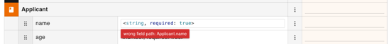

# Wrong path when just editing type field

1. Simply open `http://localhost:6006/?path=/story/boxed-editor-boxededitor--editable-expression`
2. Click on Applicant name field definition part to edit it
3. Error shows immediately: `wrong field path: Applicant.name`

there should not be any path error, because we're simply editing field's type definition.

# Cannot edit field name (expression name) at all

1. Open http://localhost:6006/?path=/story/boxed-editor-boxededitor--editable-expression
2. Simply click on (new item) - field is added - that is correct

There's no way to change added field name or existing field name

# Cannot add new field for type

1. Open `http://localhost:6006/?path=/story/boxed-editor-boxededitor--test-cases-and-test-runner`
2. Try pressing (new field) - nothing happens, no new field is added, no error is shown

# Test Runner Ignores nested fields

1. Open `http://localhost:6006/?path=/story/boxed-editor-boxededitor--test-cases-and-test-runner`
2. Add a (new item) under `application` context, type `'zzz'` as expression value, hit enter

As a result you will not see Test Case "Small loan" getting populated with this value