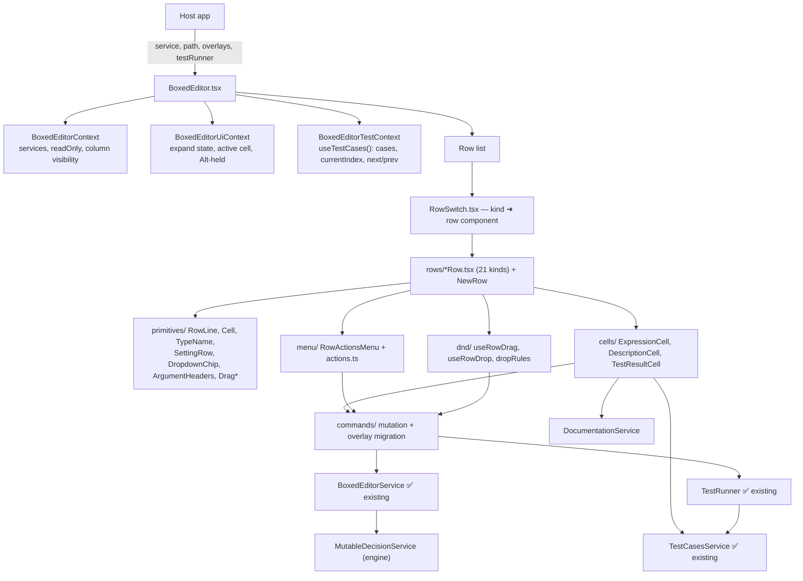
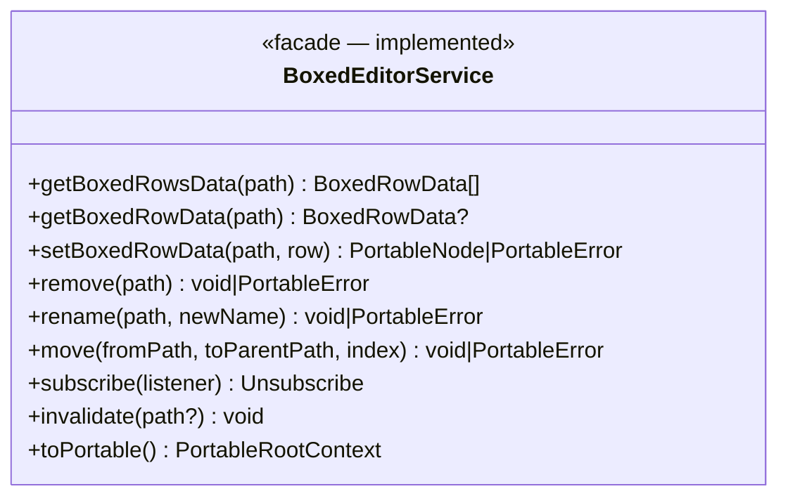

# Boxed Editor — Phase 1: Grid chrome, contexts, and the simple row kinds

> Self-contained plan for **Phase 1 of 8** of the `BoxedEditor` React UI implementation.
> Everything needed to implement this phase is in this file. Sibling phases live in `docs/boxed-editor/`.

## 1. Shared context

`BoxedEditor` (`src/components/boxed-editor/`, published as `edgerules-react/boxed-editor`) is the structured,
visual authoring surface for EdgeRules models: **a single flat treegrid of rows**. Its interaction model is
influenced by the boxed-expression / decision-modeling experiences of **Camunda** and **Trisotech** and by the
**DMN** standard, but it deliberately proposes more compact layouts and ergonomics than standard DMN boxed
expressions.

This repository contains **no rule-evaluation logic** — execution is delegated to the WASM engine from the sibling
`edgerules-v2` repo via `@edgerules/web` (browser) / `@edgerules/node` (tests), with shared TS types from
`@edgerules/portable` (`PortableNode`, `PortableError`, `PortableRootContext`).

### Already implemented — do not re-implement

`BoxedEditorService` + `normalize`/`denormalize`/`rowCache` (`boxed-editor/service/`), `BoxedRowData` /
`BoxedTableRowData` / `SignatureParameter` (`boxed-editor/boxed-editor-types.ts`), `TestCasesService`, `TestRunner`,
`DocumentationService`. The service is the model's only surface; the UI is a pure renderer plus a command layer.

### References

| What                          | Where                                                                                                                                                                                                                           |
| ----------------------------- | ------------------------------------------------------------------------------------------------------------------------------------------------------------------------------------------------------------------------------- |
| GUI wireframe (authoritative) | `/Users/rimvydasbingelis/Projects/EdgeRules/edgerules-react-frames/src` — `App.tsx` (composition/occupancy), `boxed/actions.ts` (row kinds + menus), `boxed/*.tsx` (per-construct rendering), `hooks/useAltHeld.ts` (type reveal) |
| Reference screenshot          | `docs/screenshots/reference.png`                                                                                                                                                                                                 |
| Engine CRUD / DSL             | `../edgerules-v2/doc/architecture/CRUD_SPEC.md`                                                                                                                                                                                  |

### Coding standards (from `CLAUDE.md`)

- TypeScript + React function components only.
- New components ship `*.test.tsx` / `*.test.ts` (RTL) in a component-local `__tests__/` folder **plus** a Storybook story.
- Tests run against the **real** engine (`@edgerules/node`) — never a mock. Only the environment is substituted:
  `fake-indexeddb` for `indexedDB`, and a `registerSolver` stub for the LP solver EdgeRules does not ship.
- Keep exported props/types minimal — they become the npm public API.
- Engine/DSL bugs go to `docs/BUG_REPORTS.md`; never compensate in React.

## 2. Goal of this phase

Stand up the grid itself: the 40 px primitives, the three React contexts, the row-derivation hooks, the row switch,
and the four simplest row kinds (`model`, `field`, `context`, `complexType`) — enough for a real model to render and
for Alt-reveal to work.

Prerequisite: **Phase 0** (public `BoxedEditorProps`, `createTestRunner` / `qualifyPath` exports) is done.

## 3. The complete row-kind vocabulary

Every row is exactly one `BoxedRowKind`. `RowSwitch` must map all 21 kinds; **this phase implements the first four**
and may render a placeholder for the rest (filled in by Phases 3–4).

| Kind                            | What it is                                                                                | Phase |
| ------------------------------- | ----------------------------------------------------------------------------------------- | ----- |
| `model`                         | Model header: name; occupies the whole top row, fixed position                            | **1** |
| `field`                         | **The one generic leaf row** — class field, typed input, or plain expression              | **1** |
| `context`                       | Named nested object that can contain other rows                                           | **1** |
| `complexType`                   | Named, reusable type definition containing `field` rows                                   | **1** |
| `list`                          | Header of a homogeneous scalar list                                                       | 3     |
| `list-item`                     | One scalar item of a list                                                                 | 3     |
| `relation`                      | Header of a homogeneous complex-object collection; carries the column names               | 3     |
| `relation-item`                 | One record of a relation, one cell per relation column                                    | 3     |
| `function`                      | A named callable (`func`); tall row, argument headers under the value column              | 4     |
| `function-result`               | The synthesized `result` line of a function body                                          | 4     |
| `ruleset`                       | A named rule matrix (DMN-style decision table); tall row, condition/action column headers | 4     |
| `rule`                          | One row of a ruleset's rule matrix                                                        | 4     |
| `ruleset-default`               | Singleton fallback-result row (shown when no rule matches)                                | 4     |
| `ruleset-hit-policy`            | Fixed `hitPolicy` setting row                                                             | 4     |
| `optimisation`                  | A named linear optimisation problem (`optimise`); tall row, argument headers              | 4     |
| `optimisation-variable-group`   | Fixed `variables:` section header                                                         | 4     |
| `optimisation-variable`         | One decision variable (a Typed Input Wrapper)                                             | 4     |
| `optimisation-objective`        | Fixed `maximise`/`minimise` row (exactly one, required)                                   | 4     |
| `optimisation-constraint-group` | Fixed `constraints:` section header                                                       | 4     |
| `optimisation-constraint`       | One named linear constraint                                                               | 4     |
| `optimisation-setting`          | Fixed `using` / `bottlenecks` / `timeLimit` setting rows                                  | 4     |

### Row-kind consolidation (why there is only one `field`)

A class field (`name: <string, required: true>` under a `complexType`), a typed input
(`applicationDate: <date, required: true>` under a `context`), and a plain computed expression
(`payment: monthly(application.amount)` at the model root) all render through the **exact same `Row` component with
the exact same action list** — only the parent container differs. `BoxedRowKind` therefore has a single `field` kind
for all of them, rather than a separate kind per parent context.

### Row heights

Full-height ("tall", 80 px) rows carry their own argument/column headers in the `ValueColumn`: `function`, `ruleset`,
`optimisation`, `model`. Everything else is single-height (40 px) and grows only in 40 px steps if it needs to wrap.
Exact column occupancy (which rows span `NameColumn`+`ValueColumn` as one cell vs. keep them separate) is read
straight from the wireframe's `App.tsx`, the living reference for every row's layout.

### The four kinds implemented here

| Row Type     | Key           | Menu actions (built in Phase 5)                                                                            | Short description                                                    |
| ------------ | ------------- | ----------------------------------------------------------------------------------------------------------- | -------------------------------------------------------------------- |
| Model Header | `model`       | Add Field, Add Function, Add Optimisation, Add Decision Table, Add Relation, Add List, Model Settings, View as code | Root row: model name; fixed position, not sortable, not deletable |
| Type Field   | `field`       | Convert to Context, Convert to Relation, Convert to List, Duplicate, Delete                                | Generic leaf: class field, typed input, or computed expression       |
| Context      | `context`     | Add Field, Add Function, Add Decision Table, Add Relation, Add List, Duplicate, Delete, Expand/Collapse     | Named nested object                                                  |
| Complex Type | `complexType` | Add Field, Duplicate, Delete, Expand/Collapse                                                              | Reusable named type definition                                       |

In this phase render the row bodies and the **Actions column button**; the menu contents themselves land in Phase 5.

## 4. GUI language

Strict spacing policy:

- The smallest `cell` is **40×40 px**.
- A row grows vertically only in 40 px steps: 80, 120, 160…
- A cell grows horizontally only in 40 px steps: 80, 120, 160…
- All cell text is vertically centred; all cells align with each other — no mid-positioning or pixel offsets. The
  whole GUI can be sketched on a school maths workbook.

Columns:

| Column              | Purpose                                                                                                         |
| ------------------- | ----------------------------------------------------------------------------------------------------------------- |
| `NameColumn`        | Grid-based; leading cells are skipped to render context-tree depth                                              |
| `ValueColumn`       | Expression value, function/ruleset/optimisation argument headers, list items, relation cells, rule cells         |
| `DescriptionColumn` | Free-text description; may be empty (populated in Phase 7 — render the empty column now)                        |
| `TestResultsColumn` | That row's computed value for the **selected** test case; header carries the case name, `1/N`, and previous/next (Phase 7) |
| `ActionsColumn`     | Vertical three-dot context-menu button, one `cell`                                                              |

Column visibility is driven by `showDescription`, `showTestResults` (and `showHeader` for the `model` row), read from
`BoxedEditorContext`.

### Type disclosure (Resolved Decision #9)

Every type is a **tooltip on its owning name/header cell** (`NameColumn` for `field`/`context`/`complexType`;
argument/column headers for `function`/`ruleset`/`optimisation`/`relation`), revealed two ways:

- **Hover** a name/header cell → its tooltip opens, showing that one type.
- **Hold Alt** anywhere on the page → **every** type tooltip in the tree opens at once, so the whole model's types
  can be scanned without hovering row by row. Releasing Alt (or the window losing focus) closes them all.

The wireframe implements this with a page-level `AltHeldContext` (`useAltHeldState` listens for `keydown`/`keyup` on
`"Alt"` and `blur`) read by every `TypeName`-wrapped cell alongside its own hover state — see `hooks/useAltHeld.ts`
and `boxed/primitives.tsx`'s `TypeName`. The `showType` prop gates the whole interaction.

### Drag handles (visual only in this phase)

The function icon, the ruleset icon, the optimisation icon, the type icon, and the 6-dot expression handle each drag
the row **and its children**. Drag behaviour is Phase 6; render the handles now.

**Not draggable / not sortable:** `model`, `function-result`, `ruleset-default`, `ruleset-hit-policy`,
`optimisation-variable-group`, `optimisation-objective`, `optimisation-constraint-group`, `optimisation-setting` —
all fixed, single-value or section-header settings rendered via the `SettingRow` primitive with a **gear icon**
instead of a drag handle (see `primitives.tsx`'s `SettingRow` doc comment in the wireframe).

Under `readOnly`, handles stay **visible** (the icons are the handles; the 6-dot handle is a grouping cue) but drag
is suppressed — neither hidden nor greyed (Resolved Decision #4).

## 5. Component composition



### Full file layout (built across Phases 1–7)

`service/`, `boxed-editor-types.ts`, and `index.ts` already exist — extend, don't recreate.

```
src/components/boxed-editor/
├─ index.ts                            — (exists) add BoxedEditor + props exports
├─ BoxedEditor.tsx                     — root: validates `path`, mounts providers, header row, root row list
├─ BoxedEditorProps.ts                 — (Phase 0) public props + open-target types
├─ boxed-editor-types.ts               — (exists) service + row data types
├─ service/                            — (exists, done)
├─ context/
│  ├─ BoxedEditorContext.tsx           — services, readOnly, column visibility, revision
│  ├─ BoxedEditorUiContext.tsx         — per-row expand/collapse, active editing cell path, Alt-held
│  └─ BoxedEditorTestContext.tsx       — (Phase 7) hoists useTestCases() once; selected case + next/prev
├─ hooks/
│  ├─ useBoxedEditorService.ts         — reads BoxedEditorContext
│  ├─ useBoxedRows.ts                  — useSyncExternalStore(service.subscribe, () => getBoxedRowsData(path))
│  ├─ useDescription.ts                — (Phase 7)
│  ├─ useRowTestResult.ts              — (Phase 7)
│  ├─ useAltHeld.ts                    — global Alt-key listener feeding BoxedEditorUiContext
│  └─ useRowActions.ts                 — (Phase 5)
├─ commands/                           — (Phase 2+)
├─ rows/                               — one component per BoxedRowKind (21) + NewRow.tsx + RowSwitch.tsx
├─ cells/                              — ExpressionCell.tsx (Phase 2), DescriptionCell.tsx, TestResultCell.tsx (Phase 7)
├─ primitives/                         — RowLine, Cell, TypeName, Drag, ColumnDragHandle, TallIconHandle,
│                                         SettingRow, DropdownChip, ArgumentHeaders
├─ menu/                               — (Phase 5)
├─ dnd/                                — (Phase 6)
└─ __tests__/                          — (existing service tests stay) + BoxedEditor.test.tsx, row-kinds.test.tsx,
                                          alt-reveal.test.tsx, dnd.test.tsx, duplicate-rename.test.tsx,
                                          commands.test.tsx, test-results.test.tsx
```

## 6. The service contract this phase consumes



| Method                   | UI caller in this phase                                             |
| ------------------------ | ------------------------------------------------------------------- |
| `getBoxedRowsData(path)` | `useBoxedRows(path)` snapshot — the whole row tree under a container |
| `getBoxedRowData(path)`  | One row, e.g. the model header or a parent's table metadata         |
| `subscribe(listener)`    | `useSyncExternalStore` in `useBoxedRows`                            |
| `invalidate(path?)`      | The `revision` prop changing (edits made outside this editor)       |

### Guarantees the UI relies on (and must not duplicate)

| Guarantee               | Detail                                                                                                                                                                                                             |
| ----------------------- | -------------------------------------------------------------------------------------------------------------------------------------------------------------------------------------------------------------------- |
| Normalization is done   | Sort order, relation-vs-list classification, metadata stripping, row-kind consolidation, and `function-result` synthesis all happen in `normalize.ts`. **Render rows in the order returned — never re-sort in React.** |
| Cell text is opaque     | `value`/`conditions`/`actions`/`cells` are DSL text produced from Portable and sent back verbatim; the engine re-parses. The view never parses DSL.                                                                  |
| Errors come back verbatim | Mutations return the engine's `PortableError` and leave the cache untouched for that path, so the last-good row stays visible. Bad `path` reads return `undefined`/`[]`.                                            |
| Referential stability   | `getBoxedRowsData(path)` returns the same array identity while nothing under `path` changed, and the cache is cleared **before** `subscribe` listeners fire — safe for `useSyncExternalStore`.                        |
| Annotations are ignored | `@node` / `@node-name` are neither read nor written by the facade (Resolved Decision #16). Do not build UI on them.                                                                                                  |
| Factory is not deduplicating | `createBoxedEditorService(mutable)` returns a fresh facade (fresh cache, fresh bus) per call. The host constructs **one** instance and passes it down; a second GUI over the same engine must be told to `invalidate()`. |

### Normalization rules the renderer must honour (contract, not work)

**DSL ➜ BoxedEditor:** (1) inline functions gain a synthesized `result` field; (2) context elements are re-sorted:
`complexType` → `function` → `ruleset` → `optimisation` → everything else (`context`/`list`/`relation`/`field`), each
group in source order, with a function body's synthesized `result` sorted last within that function.

**Metadata handling:** Portable metadata (`@kind`, `@description`, `@node`, `@node-name`, `@model-name`,
`@model-version`) is never rendered as a child row. The `model` row presents applicable model metadata. Descriptions
live in an IndexedDB overlay, not in `@description` (Resolved Decision #10).

### Path conventions

Paths are the **engine's CRUD paths** — do not invent UI-only paths. `"*"` is the model root; context fields use dot
paths (`application.amount`); collection items use indexes (`applicants[0]`); function/ruleset/optimisation bodies
are addressed through their authored field path (`monthly.result`, `risk.rules[2].then.limit`,
`factoryProduction.variables.chairs`). Authoritative syntax and filters:
`../edgerules-v2/doc/architecture/CRUD_SPEC.md`.

## 7. React integration

**Single source of truth — do not duplicate the model in React state.** The authored model lives behind
`MutableDecisionService`; `BoxedEditorService` is a stateless-derivation facade over it. React stores **no copy of
the row tree**: rows are derived on demand, cached inside the facade, and bound with `useSyncExternalStore`
(Resolved Decision #6).

| State                                              | Owner                                                       | Lifetime            |
| -------------------------------------------------- | ----------------------------------------------------------- | ------------------- |
| Model structure (rows)                             | `MutableDecisionService`, via the facade's cache             | persisted           |
| Descriptions / test cases / results                | `DocumentationService` / `TestCasesService` (IndexedDB)      | persisted (overlay) |
| Selected test-case index, running set              | `useTestCases` / `TestRunner`, hoisted into `BoxedEditorTestContext` | ephemeral   |
| Per-row expand, active editing cell path, Alt-held | `BoxedEditorUiContext`                                       | ephemeral           |

Hooks introduced here (internal contract; only `BoxedEditor` is exported):

| Hook                      | Reads                                                                           |
| ------------------------- | --------------------------------------------------------------------------------- |
| `useBoxedEditorService()` | the facade from `BoxedEditorContext`                                              |
| `useBoxedRows(path)`      | `useSyncExternalStore(service.subscribe, () => service.getBoxedRowsData(path))`    |
| `useAltHeld()`            | whether Alt is held, from `BoxedEditorUiContext`                                   |

**Reactivity requirements:**

- `getBoxedRowsData(path)` is referentially stable while nothing under `path` changed — a committed mutation
  produces a new reference only for the affected subtree.
- External edits are signalled by changing `revision`; the provider calls `service.invalidate()` on change.
- Descriptions, test cases, and results are separate stores, so editing a description or pressing previous/next
  re-renders only the affected `DescriptionColumn` / `TestResultsColumn` cells — never the box rows.

## 8. Error handling in this phase

| Scope       | Trigger                                                                | Behavior                                                        |
| ----------- | ------------------------------------------------------------------------ | ---------------------------------------------------------------- |
| **Fatal**   | the `path` prop or its schema fails to load (bad `path`, corrupt model) | the treegrid is replaced by an alert; nothing is editable        |

Path-scoped, deferred, and run-level errors arrive with Phases 2 and 7.

## 9. Tasks

- [x] Ensure project compiles and existing tests are passing
- [x] Add `primitives/`: `RowLine`, `Cell`, `TypeName`, `Drag`, `ColumnDragHandle`, `TallIconHandle`, `SettingRow`,
      `DropdownChip`, `ArgumentHeaders` — ported ~1:1 from the wireframe's `primitives.tsx`, honouring the 40 px grid
- [x] Add `context/BoxedEditorContext.tsx` (services, `readOnly`, column visibility, `revision` → `invalidate()`) and
      `context/BoxedEditorUiContext.tsx` (expand state, active cell path, Alt-held)
- [x] Add `hooks/useBoxedEditorService.ts`, `hooks/useBoxedRows.ts`, `hooks/useAltHeld.ts`
- [x] Add `rows/RowSwitch.tsx` plus `ModelHeaderRow`, `FieldRow`, `ContextRow`, `ComplexTypeRow`
- [x] Add `BoxedEditor.tsx`: `path` validation (fatal alert on failure), providers, optional header row, root row list
- [x] Add `__tests__/BoxedEditor.test.tsx` and `__tests__/alt-reveal.test.tsx` against a real
      `MutableDecisionService` from `@edgerules/node`
- [x] Mark all checkboxes as done in this document once verified

## 10. Verification

| Test file              | Covers                                                                                                |
| ---------------------- | ------------------------------------------------------------------------------------------------------- |
| `BoxedEditor.test.tsx` | rendering at root and focused paths, fatal vs. path-scoped errors, `readOnly`, column visibility props |
| `alt-reveal.test.tsx`  | hover vs. Alt-held type tooltip behavior                                                              |

Both run against a real `MutableDecisionService` from `@edgerules/node` — never a mock.
