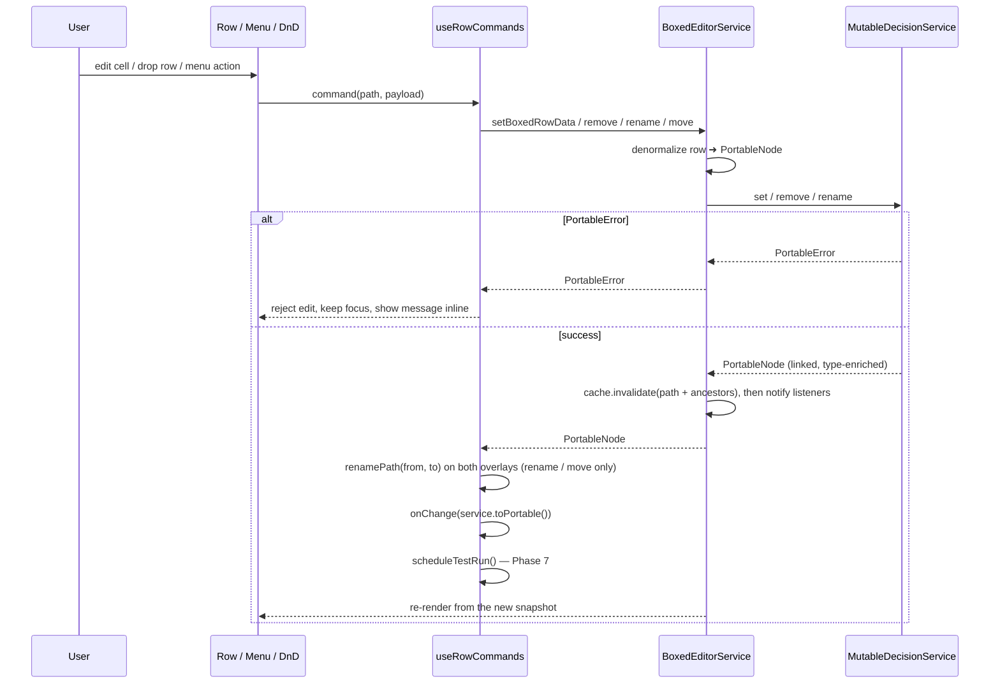

# Boxed Editor — Phase 2: Expression cell and the language service

> Self-contained plan for **Phase 2 of 8** of the `BoxedEditor` React UI implementation.
> Everything needed to implement this phase is in this file. Sibling phases live in `docs/boxed-editor/`.

## 1. Shared context

`BoxedEditor` (`src/components/boxed-editor/`, published as `edgerules-react/boxed-editor`) renders EdgeRules models
as **a single flat treegrid of rows** (Camunda / Trisotech / DMN-influenced, but more compact). The repo has **no
rule-evaluation logic** — execution is delegated to the WASM engine from the sibling `edgerules-v2` repo via
`@edgerules/web` (browser) / `@edgerules/node` (tests); shared types come from `@edgerules/portable`
(`PortableNode`, `PortableError`, `PortableRootContext`).

**Already implemented — do not re-implement:** `BoxedEditorService` + `normalize`/`denormalize`/`rowCache`
(`boxed-editor/service/`), `BoxedRowData` / `BoxedTableRowData` (`boxed-editor/boxed-editor-types.ts`),
`TestCasesService`, `TestRunner`, `DocumentationService`.

**Wireframe (authoritative GUI reference):**
`/Users/rimvydasbingelis/Projects/EdgeRules/edgerules-react-frames/src` — `App.tsx`, `boxed/actions.ts`,
`boxed/*.tsx`, `hooks/useAltHeld.ts`. Screenshot: `docs/screenshots/reference.png`.

**Coding standards (`CLAUDE.md`):** TypeScript + React function components; RTL tests in a component-local
`__tests__/` + a Storybook story; tests use the **real** engine (`@edgerules/node`) — never a mock, only
`fake-indexeddb` and a `registerSolver` stub are substituted; minimal public exports; engine/DSL bugs go to
`docs/BUG_REPORTS.md` instead of React workarounds.

**Prerequisites:** Phase 0 (public props) and Phase 1 (primitives, contexts, `useBoxedRows`, `RowSwitch`,
`model`/`field`/`context`/`complexType` rows).

## 2. Goal of this phase

Make cells **editable**: one CodeMirror-backed expression editor at a time, model-scoped completions, and the
command layer that turns every edit into a service mutation with correct error and `onChange` semantics.

## 3. Expression editing & language service

- **One active editor invariant.** At most **one** cell across the whole tree mounts the CodeMirror `CodeEditorCell`
  at a time; every other cell renders static text. `languageService` (the `CodeEditorService` prop) feeds diagnostics
  and completions to that single active cell only. The active cell path is UI state in `BoxedEditorUiContext`
  (added in Phase 1).
- **Model-scoped analysis (embedding).** A cell holds one expression but must be analyzed **in the scope of the
  surrounding model** so completions resolve sibling fields and types. The active cell wraps its text in a synthetic
  DSL prefix/suffix built from the current model, calls the language service on the whole document, and maps
  positions back into the cell. The existing `embedService` / `CodeEditorEmbedContext`
  (`src/components/code-editor/language/service`) already implements this and **is reused**; the synthetic wrapper is
  **never persisted**.
- Commit on **blur / Enter**; Escape reverts to the last committed text.
- Under `readOnly`, cells never enter edit mode.

### Cell text is opaque

`value` / `conditions` / `actions` / `cells` are DSL text produced from Portable and sent back **verbatim**; the
engine re-parses. **The view never parses DSL.**

### Cell value mapping (leaf/expression cases relevant here)

| Portable node                      | `kind`  | Cell text                                             |
| ---------------------------------- | ------- | ------------------------------------------------------- |
| expression / scalar                | `field` | its authored DSL text (`amount / 12`)                 |
| typed input (`@kind: "type"`)      | `field` | a type constraint, e.g. `<number, required: true>`     |
| invocation (`@kind: "invocation"`) | `field` | the call text, e.g. `monthly(application.amount)`       |
| computed array / loop              | `field` | the raw loop text; never expands into item rows         |

An **invocation** is a single, non-expandable expression cell — editing the call edits its `value` text. A computed,
non-CRUD-addressable array (e.g. `for … return …`) renders as a single `field` row showing its result summary;
**loops have no `BoxedRowKind`** — loop text is opaque expression content.

## 4. The command layer

`commands/useRowCommands.ts` is the single dispatch point for every mutating action in the editor (this phase wires
value + name commits; Phases 3–7 add the rest through the same hook).

| Service method                | Command-layer caller                                                                 |
| ----------------------------- | -------------------------------------------------------------------------------------- |
| `setBoxedRowData(path, row)`  | Every value/name/cell/column/parameter/setting edit and every `Add…` / `Convert to…`  |
| `remove(path)`                | `Delete`, cleared-name special actions, `Delete "‹column›" Column`                    |
| `rename(path, newName)`       | Name-cell commit on a named kind                                                      |
| `move(from, toParent, index)` | A completed, `dropRules`-approved drop (Phase 6)                                      |
| `toPortable()`                | The `onChange` payload                                                                |

### Writes are whole-node

`setBoxedRowData` denormalizes the row **including its `children`** into one `PortableNode`. Container edits
(add/remove/reorder a `list`/`relation`/`rule`/optimisation child) rewrite the **whole parent** — engine arrays are
append-only and reject gaps.

**Optimisation is whole-definition:** `optimise` is a root-only whole-node CRUD surface. Optimisation child paths
(`factoryProduction.variables.chairs`) are **row identities, not engine CRUD locations** — the facade merges a child
edit into the owning declaration and writes it once. Address optimisation children by these paths anyway; the facade
translates.

### Edit ➜ persist ➜ refresh



`onChange(snapshot: PortableRootContext)` fires **exactly once per successful committed mutation** — never on a
rejected edit, never twice for one commit. Overlay `renamePath` calls and the debounced test run are hung off the
same success branch (Phases 6 and 7).

### `commands/rowFactories.ts`

Produces the default `BoxedRowData` for each `Add…` / `Convert to…` action, so the menu layer (Phase 5) only has to
pick a factory and a target path. Factories needed eventually: `field`, `context`, `complexType`, `function` (+
`function-result`), `ruleset` (+ `rule`, `ruleset-default`, `ruleset-hit-policy`), `optimisation` (+ variable /
objective / constraint / settings), `list` + `list-item`, `relation` + `relation-item`. Start with the ones Phase 1's
row kinds need (`field`, `context`, `complexType`) and extend as later phases land — but put the file in place now.

## 5. Error handling

| Scope           | Trigger                                                                                | Behavior                                                                                                       |
| --------------- | ---------------------------------------------------------------------------------------- | ---------------------------------------------------------------------------------------------------------------- |
| **Fatal**       | the `path` prop or its schema fails to load (bad `path`, corrupt model)                | the treegrid is replaced by an alert; nothing is editable (Phase 1)                                             |
| **Path-scoped** | `set`/`rename`/`remove`/`move` returns a `PortableError`, or a cell fails to parse/link | the edit is **rejected**, the cell **keeps focus** and shows the message **inline**; the rest of the tree stays interactive |
| **Deferred**    | a write succeeds structurally but breaks a reference elsewhere                          | **not rolled back** (Resolved Decision #12); surfaces later as a path-scoped error on whichever row is next read/evaluated |

**Errors come back verbatim.** Mutations return the engine's `PortableError` and leave the facade cache untouched for
that path, so the **last-good row stays visible**.

**No rollback on link breakage.** Per `CRUD_SPEC.md`, `set`/`rename`/`remove` succeed even when they break a
reference elsewhere; the facade does not re-validate or reverse. Rollback-on-write was rejected: it would make
renaming a referenced field impossible, since the reference update always lands in a later commit.

## 6. Path conventions

Paths are the **engine's CRUD paths** — never invent UI-only paths. `"*"` is the model root; context fields use dot
paths (`application.amount`); collection items use indexes (`applicants[0]`); function/ruleset/optimisation bodies
are addressed through their authored field path (`monthly.result`, `risk.rules[2].then.limit`,
`factoryProduction.variables.chairs`). Authoritative syntax and filters:
`../edgerules-v2/doc/architecture/CRUD_SPEC.md`.

## 7. Files touched

```
src/components/boxed-editor/
├─ cells/ExpressionCell.tsx        — NEW: static text ⇄ CodeEditorCell swap
├─ commands/useRowCommands.ts      — NEW: mutation dispatch, error surfacing, onChange
├─ commands/rowFactories.ts        — NEW: default BoxedRowData per Add… / Convert to…
└─ __tests__/commands.test.tsx     — NEW
```

## 8. Tasks

- [ ] Ensure project compiles and existing tests are passing
- [ ] Add `cells/ExpressionCell.tsx`: static text ⇄ `CodeEditorCell` swap, enforcing the one-active-editor invariant
- [ ] Reuse `embedService` / `CodeEditorEmbedContext` for model-scoped completions; never persist the synthetic wrapper
- [ ] Add `commands/useRowCommands.ts` + `commands/rowFactories.ts`: mutation dispatch, `PortableError` → inline
      path-scoped error, `onChange` once per successful commit
- [ ] Add `__tests__/commands.test.tsx` for value/name commits, rejection handling, and `onChange` count
- [ ] Mark all checkboxes as done in this document once verified

## 9. Verification

`__tests__/commands.test.tsx` (real `MutableDecisionService` from `@edgerules/node`) covers:

- committing a value edit and a name edit (`rename` on named kinds);
- a rejected edit: `PortableError` returned → cell keeps focus, message inline, previous row still rendered;
- `onChange` fires exactly once per successful commit and not at all on rejection;
- only one CodeMirror editor is mounted at a time.

Later phases extend this same file to every remaining action.
