# Boxed Editor — Phase 4: `function`, `ruleset`, `optimisation` families

> Self-contained plan for **Phase 4 of 8** of the `BoxedEditor` React UI implementation.
> Everything needed to implement this phase is in this file. Sibling phases live in `docs/boxed-editor/`.

## 1. Shared context

`BoxedEditor` (`src/components/boxed-editor/`, published as `edgerules-react/boxed-editor`) renders EdgeRules models
as **a single flat treegrid of rows** (Camunda / Trisotech / DMN-influenced, but more compact). The repo has **no
rule-evaluation logic** — execution is delegated to the WASM engine from the sibling `edgerules-v2` repo via
`@edgerules/web` (browser) / `@edgerules/node` (tests); shared types come from `@edgerules/portable`
(`PortableNode`, `PortableError`, `PortableRootContext`).

**Already implemented — do not re-implement:** `BoxedEditorService` + `normalize`/`denormalize`/`rowCache`
(`boxed-editor/service/`), `BoxedRowData` / `BoxedTableRowData` / `SignatureParameter`
(`boxed-editor/boxed-editor-types.ts`), `TestCasesService`, `TestRunner`, `DocumentationService`.

### References for this phase

| What                          | Where                                                                                                                                        |
| ----------------------------- | ---------------------------------------------------------------------------------------------------------------------------------------------- |
| GUI wireframe (authoritative) | `/Users/rimvydasbingelis/Projects/EdgeRules/edgerules-react-frames/src` — `App.tsx` (composition/occupancy), `boxed/*.tsx` (per-construct rendering) |
| Ruleset DSL                   | `../edgerules-v2/doc/architecture/dsl/RULESET_METAPHOR_SPEC.md`, `../edgerules-v2/doc/reference/RULESETS_REFERENCE.md`                        |
| Optimisation DSL              | `../edgerules-v2/doc/architecture/dsl/OPTIMISATION_METAPHOR_SPEC.md`, `../edgerules-v2/doc/reference/OPTIMISE_REFERENCE.md`                   |
| Engine CRUD                   | `../edgerules-v2/doc/architecture/CRUD_SPEC.md`                                                                                              |
| Real usage examples           | `../edgerules-v2/tests/wasm/` — CI-run TypeScript examples of every DSL feature; trust these over prose docs                                  |

**Coding standards (`CLAUDE.md`):** TypeScript + React function components; RTL tests in a component-local
`__tests__/` + a Storybook story; tests use the **real** engine (`@edgerules/node`) — never a mock, only
`fake-indexeddb` and a `registerSolver` stub (EdgeRules ships no LP solver) are substituted; minimal public exports;
engine/DSL bugs go to `docs/BUG_REPORTS.md` instead of React workarounds.

**Prerequisites:** Phases 1–3 (primitives incl. `ArgumentHeaders`, `SettingRow`, `DropdownChip`, `TallIconHandle`;
contexts; `useBoxedRows`; `RowSwitch`; `ExpressionCell`; `useRowCommands`; `NewRow`).

## 2. Goal of this phase

Implement the three "knowledge element" families and every fixed child row they own, completing the 21-kind row
vocabulary.

## 3. GUI language recap

- Smallest `cell` is **40×40 px**; rows grow vertically only in 40 px steps (80, 120, 160…); cells grow horizontally
  only in 40 px steps; text vertically centred; every cell aligned to the grid.
- **Tall (80 px) rows: `function`, `ruleset`, `optimisation`** (and `model`) — they carry their own argument/column
  headers inside the `ValueColumn`. Everything else is 40 px and grows only in 40 px steps when wrapping.
- Columns: `NameColumn` (depth via skipped leading cells), `ValueColumn`, `DescriptionColumn`, `TestResultsColumn`,
  `ActionsColumn`.
- **Type disclosure:** each argument/column header cell carries its type as a tooltip — hover shows one; **holding
  Alt** opens every tooltip in the tree at once (`showType` gates it).
- **Drag handles:** the function icon, the ruleset icon and the optimisation icon each drag the row **and its
  children**. Fixed rows use the `SettingRow` primitive with a **gear icon** instead of a drag handle.

## 4. Row kinds implemented here

| Row Type                      | Key                             | Menu actions (wired in Phase 5)                                                                                                           | Short description                                            |
| ----------------------------- | ------------------------------- | ------------------------------------------------------------------------------------------------------------------------------------------- | ------------------------------------------------------------ |
| Function                      | `function`                      | Add Argument, Duplicate, Delete "‹arg›" Argument (per arg), Delete, Expand/Collapse, View as code                                          | A named callable (`func`)                                    |
| Function Result               | `function-result`               | Duplicate, Delete                                                                                                                         | The synthesized `result` line of a function body; not draggable |
| Decision Table                | `ruleset`                       | Add Rule, Add Condition Column, Add Action Column, Delete "‹column›" Column (per column), Duplicate, Delete, Expand/Collapse, View as code | A named rule matrix (DMN-style decision table)               |
| Rule                          | `rule`                          | Duplicate, Delete                                                                                                                         | One row of a decision table's rule matrix                    |
| Ruleset Default               | `ruleset-default`               | Delete                                                                                                                                    | Singleton fallback row shown when no rule matches; not duplicable |
| Ruleset Hit Policy            | `ruleset-hit-policy`            | *(none — edited via its own picker chip)*                                                                                                 | Fixed `hitPolicy` setting                                    |
| Optimisation                  | `optimisation`                  | Add Argument, Delete "‹arg›" Argument (per arg), Duplicate, Delete, Expand/Collapse, View as code                                          | A named linear optimisation problem (`optimise`)             |
| Optimisation Variable Group   | `optimisation-variable-group`   | Add Variable                                                                                                                              | Fixed `variables:` section header; not draggable             |
| Optimisation Variable         | `optimisation-variable`         | Duplicate, Delete                                                                                                                         | One decision variable (a Typed Input Wrapper)                |
| Optimisation Objective        | `optimisation-objective`        | Switch to Minimise/Maximise                                                                                                               | Fixed `maximise`/`minimise` row; exactly one, required; not draggable |
| Optimisation Constraint Group | `optimisation-constraint-group` | Add Constraint                                                                                                                            | Fixed `constraints:` section header; not draggable           |
| Optimisation Constraint       | `optimisation-constraint`       | Duplicate, Delete                                                                                                                         | One named linear constraint                                  |
| Optimisation Setting          | `optimisation-setting`          | *(none — edited via its own control)*                                                                                                     | Fixed `using` / `bottlenecks` / `timeLimit` settings         |

**Not draggable / not sortable:** `function-result`, `ruleset-default`, `ruleset-hit-policy`,
`optimisation-variable-group`, `optimisation-objective`, `optimisation-constraint-group`, `optimisation-setting`
(plus `model` from Phase 1) — all rendered via `SettingRow` with a gear icon.

## 5. Ruleset and optimisation row composition

`ruleset` and `optimisation` are the two kinds whose children are a **fixed shape** rather than a freely-ordered
container. This is the structural reference for both — row order and which children are fixed vs. repeatable must
match it exactly:

```mermaid
flowchart TD
    subgraph Ruleset["ruleset — tall row: parameters + condition/action column headers"]
        direction TB
        Rule1["rule (repeatable, sortable)"]
        Rule2["rule (repeatable, sortable)"]
        RuleNew["(new rule) placeholder"]
        Default["ruleset-default — absent when hitPolicy is collect-matches"]
        HitPolicy["ruleset-hit-policy — fixed, not draggable"]
    end

    subgraph Optimisation["optimisation — tall row: parameters"]
        direction TB
        Using["optimisation-setting: using — fixed"]
        Bottlenecks["optimisation-setting: bottlenecks — fixed"]
        VarGroup["optimisation-variable-group — fixed section header"]
        Var1["optimisation-variable (repeatable, sortable)"]
        Var2["optimisation-variable (repeatable, sortable)"]
        VarNew["(new variable) placeholder"]
        Objective["optimisation-objective — fixed, exactly one"]
        ConGroup["optimisation-constraint-group — fixed section header"]
        Con1["optimisation-constraint (repeatable, sortable)"]
        Con2["optimisation-constraint (repeatable, sortable)"]
        ConNew["(new constraint) placeholder"]
        TimeLimit["optimisation-setting: timeLimit — fixed"]
        VarGroup --> Var1 & Var2 & VarNew
        ConGroup --> Con1 & Con2 & ConNew
    end
```



- **Ruleset vs. the standalone Decision Table Editor (Resolved Decision #13):** `src/components/decision-table`
  already ships `DecisionTableEditor`. The inline `ruleset` rendering here is a **compact, fully-editable-in-place
  view, not a preview** — real add-rule / add-column / delete-column actions, matching how `relation`/`list` are
  edited in place. `onOpenNode({kind: 'ruleset'})` stays as an escape hatch for full-screen ergonomics (bulk column
  resize, keyboard cell navigation, large rule counts) — symmetric with `View as code`.
- **Optimisation has no standalone editor at all.** `BoxedEditor` is its only GUI, so the inline row tree above must
  be complete on its own.
- `optimise` may only be declared at the **model root** — nested is a link-time error
  (`OPTIMISATION_METAPHOR_SPEC.md` §3).

## 6. Cell value mapping

| Portable node                                  | `kind`                          | Cell text                                                                                                      |
| ---------------------------------------------- | ------------------------------- | ---------------------------------------------------------------------------------------------------------------- |
| ruleset condition cell (`when`, cell-map form) | `rule` (in `conditions`)        | the unary test literal, e.g. `18..25`, `< 30000`; **empty = "any"** (the key is omitted on write, not written as `''`) |
| ruleset condition, boolean-expression form     | `rule` (`conditionsExpression`) | one **spanning** cell holding the whole `when` expression, e.g. `age >= 18 and income < 30000`                   |
| ruleset action cell (`then`)                   | `rule` (in `actions`)           | the output field's DSL literal, e.g. `"high"`, `1000`                                                            |
| ruleset rule priority                          | `rule` (`priority`)             | an integer, **editable only under `hitPolicy: "best-match"`**                                                    |
| ruleset default cell                           | `ruleset-default` (`actions`)   | the fallback output's DSL literal; the row is **absent when `hitPolicy` is `"collect-matches"`**                  |
| ruleset `hitPolicy`                            | `ruleset-hit-policy`            | `"first-match"` \| `"unique-match"` \| `"collect-matches"` \| `"best-match"`                                     |
| optimise decision variable                     | `optimisation-variable`         | a Typed Input Wrapper, e.g. `<number, integer: true, min: 0>`                                                     |
| optimise objective                             | `optimisation-objective`        | the linear expression, e.g. `15 * chairs + 40 * tables`                                                          |
| optimise constraint                            | `optimisation-constraint`       | the named linear comparison, e.g. `1 * chairs + 3 * tables <= workers`                                           |
| optimise `using` / `bottlenecks` / `timeLimit` | `optimisation-setting`          | the literal enum/boolean/number, e.g. `"highs"`, `true`, `1000`                                                  |
| expression / scalar (function body, result)    | `field` / `function-result`     | its authored DSL text (`amount / 12`)                                                                            |

Cell text is **opaque**: DSL text in, DSL text out, verbatim; the view never parses DSL. `hitPolicy` uses the
`DropdownChip` primitive; `optimisation-setting` rows use `SettingRow` with the control appropriate to their literal
type.

## 7. Mutation rules for these families

- **Writes are whole-node.** `setBoxedRowData` denormalizes the row **including its `children`** into one
  `PortableNode`. Container edits (add/remove/reorder a `rule` or an optimisation child) rewrite the **whole
  parent** — engine arrays are append-only and reject gaps.
- **Optimisation is whole-definition.** `optimise` is a **root-only whole-node CRUD surface**. Optimisation child
  paths (`factoryProduction.variables.chairs`) are **row identities, not engine CRUD locations** — the facade merges
  a child edit into the owning declaration and writes it once. Address optimisation children by these paths anyway;
  the facade translates.
- **Normalization is done by the service.** Inline functions gain a synthesized `result` field; context elements are
  re-sorted `complexType` → `function` → `ruleset` → `optimisation` → everything else, each group in source order,
  with a function body's synthesized `result` sorted last within that function. Single-`result` functions collapse
  back to inline functions on write. **Render rows in the order returned — never re-sort in React.**
- Errors: a returned `PortableError` is surfaced by `useRowCommands` as a path-scoped inline error — edit rejected,
  focus kept, last-good row still visible. No rollback for writes that break references elsewhere
  (Resolved Decision #12).

## 8. Append placeholders relevant here

| Container Kind                  | Placeholder Row Kind      | Label              |
| ------------------------------- | ------------------------- | ------------------ |
| `function` (body)               | `field`                   | "(new item)"       |
| `ruleset`                       | `rule`                    | "(new rule)"       |
| `optimisation-variable-group`   | `optimisation-variable`   | "(new variable)"   |
| `optimisation-constraint-group` | `optimisation-constraint` | "(new constraint)" |

(`rows/NewRow.tsx` from Phase 3 provides the mechanism.)

## 9. Path conventions

Function/ruleset/optimisation bodies are addressed through their authored field path — `monthly.result`,
`risk.rules[2].then.limit`, `factoryProduction.variables.chairs`. `"*"` is the model root. Never invent UI-only
paths. Authoritative syntax: `../edgerules-v2/doc/architecture/CRUD_SPEC.md`.

## 10. Files touched

```
src/components/boxed-editor/rows/
├─ FunctionRow.tsx                     ├─ OptimisationRow.tsx
├─ FunctionResultRow.tsx               ├─ OptimisationSettingRow.tsx
├─ RulesetRow.tsx                      ├─ OptimisationVariableGroupRow.tsx
├─ RuleRow.tsx                         ├─ OptimisationVariableRow.tsx
├─ RulesetDefaultRow.tsx               ├─ OptimisationObjectiveRow.tsx
├─ RulesetHitPolicyRow.tsx             ├─ OptimisationConstraintGroupRow.tsx
└─ RowSwitch.tsx (extend)              └─ OptimisationConstraintRow.tsx

src/components/boxed-editor/commands/rowFactories.ts — add factories for every kind above
src/components/boxed-editor/__tests__/row-kinds.test.tsx — extend
```

## 11. Tasks

- [x] Ensure project compiles and existing tests are passing
- [x] Add `FunctionRow` + `FunctionResultRow` with `ArgumentHeaders`; Add/Delete Argument
      (structural — the row/`ArgumentHeaders` support it; the menu action itself is Phase 5 wiring)
- [x] Add `RulesetRow` (parameters + condition/action header groups), `RuleRow` (cell-map **and**
      `conditionsExpression` forms, `priority` under `best-match` only), `RulesetDefaultRow`, `RulesetHitPolicyRow`
      (`DropdownChip`)
- [x] Add `OptimisationRow`, `OptimisationSettingRow`, `OptimisationVariableGroupRow`, `OptimisationVariableRow`,
      `OptimisationObjectiveRow`, `OptimisationConstraintGroupRow`, `OptimisationConstraintRow`, honouring the
      [row composition](#5-ruleset-and-optimisation-row-composition) order and non-draggable set
- [x] Extend `__tests__/row-kinds.test.tsx` to cover every remaining kind
- [x] Mark all checkboxes as done in this document once verified

## 12. Verification

`__tests__/row-kinds.test.tsx` (real `MutableDecisionService` from `@edgerules/node`, plus a `registerSolver` stub)
must contain **one case per `BoxedRowKind`**, including the full `ruleset` and `optimisation` families:

- an inline function and a multi-statement function body, plus a no-argument function and a nested function;
- `ArgumentHeaders` rendering and Add / Delete Argument on both `function` and `optimisation`;
- both rule condition forms; empty condition cell means "any" and omits the key on write;
- `priority` editable only under `hitPolicy: "best-match"`; `ruleset-default` absent under `"collect-matches"`;
- the optimisation child order from §5, the fixed/non-draggable set, and `Switch to Minimise/Maximise` keeping the
  expression unchanged.
