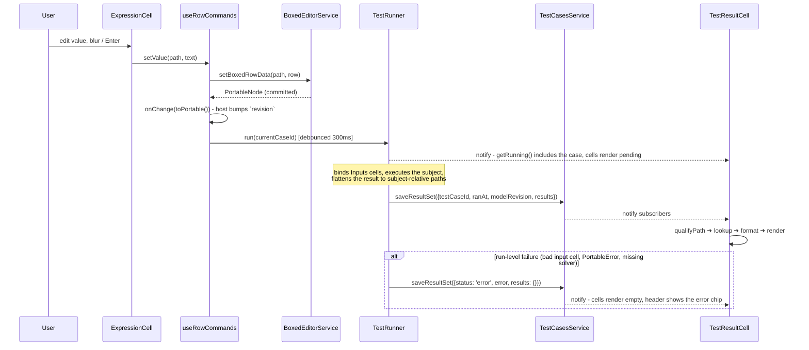
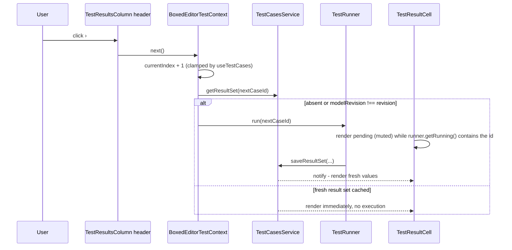

# Boxed Editor — Phase 7: Description and live test-result columns

> Self-contained plan for **Phase 7 of 8** of the `BoxedEditor` React UI implementation.
> Everything needed to implement this phase is in this file. Sibling phases live in `docs/boxed-editor/`.

## 1. Shared context

`BoxedEditor` (`src/components/boxed-editor/`, published as `edgerules-react/boxed-editor`) renders EdgeRules models
as **a single flat treegrid of rows** (Camunda / Trisotech / DMN-influenced, but more compact). The repo has **no
rule-evaluation logic** — execution is delegated to the WASM engine from the sibling `edgerules-v2` repo via
`@edgerules/web` (browser) / `@edgerules/node` (tests); shared types come from `@edgerules/portable`.

**Already implemented — do not re-implement:** `BoxedEditorService` + `normalize`/`denormalize`/`rowCache`;
`TestCasesService`, `useTestCases`, `useTestResult` (`src/components/test-cases-service/`); `TestRunner`
(`createTestRunner`) and `TestsManager` (`src/components/tests-manager/`); `DocumentationService`, `useDescription`
(`src/components/documentation-service/`).

**Contracts owned elsewhere:** `docs/specs/TESTS_MANAGER_SPEC.md` (`TestCase`, `TestResultSet`, `TestResult`,
`TestCasesService`, `TestRunner`) and `docs/DOCUMENTATION_SERVICE_STORY.md` (`DocumentationService`,
`DocumentationServiceOptions`, `Unsubscribe`, `useDescription`). `BoxedEditor` declares **no local copy** of either
contract.

**Coding standards (`CLAUDE.md`):** TypeScript + React function components; RTL tests in a component-local
`__tests__/` + a Storybook story; tests use the **real** engine (`@edgerules/node`) — never a mock, only
`fake-indexeddb` for `indexedDB` and a `registerSolver` stub for the LP solver are substituted; minimal public
exports; engine/DSL bugs go to `docs/BUG_REPORTS.md`.

**Prerequisites:** Phases 1–6.

## 2. Goal of this phase

Fill the last two columns: free-text descriptions, and **live** test results for the selected test case — including
the re-run triggers, staleness, pending and error states.

## 3. Service composition — three independent, path-keyed sources

Only the first derives from the authored model; the other two are volatile authoring overlays in IndexedDB (outside
the DSL). Keeping them apart is what stops a description edit or a test-case switch from invalidating the structural
row tree (Resolved Decision #1).

| Source                 | Owns                                        | Keyed by                                          | Storage                         | Feeds             |
| ---------------------- | ------------------------------------------- | ------------------------------------------------- | ------------------------------- | ----------------- |
| `BoxedEditorService`   | Portable-derived structure (`BoxedRowData`) | fully qualified `path`                            | the authored model (via engine) | Name / Value cols |
| `DocumentationService` | free-text descriptions                      | fully qualified `path`                            | IndexedDB (model name + path)   | DescriptionColumn |
| `TestCasesService`     | test cases, cells, and result sets          | **subject-relative** path (`qualifyPath` bridges) | IndexedDB (model + subject)     | TestResultsColumn |

`BoxedEditorService` does **not** fold descriptions or test results into rows — those overlays are read directly by
their column cells, so a `BoxedRowData` stays a pure projection of the Portable model. Because they are separate
stores, editing a description or pressing previous/next re-renders only the affected column cells — never the box
rows.

## 4. `DocumentationService` API (consumed, not defined here)

A path-keyed free-text overlay. `DescriptionColumn` reads and writes it; the command layer calls `renamePath` after
a successful rename/move (Phase 6).

```typescript
getDescription(path: string): string | undefined;       // DescriptionColumn value, or undefined when unset
setDescription(path: string, description: string): void; // Commit an edit; empty string clears
renamePath(from: string, to: string): void;              // Called after a successful rename/move
subscribe(listener: () => void): Unsubscribe;            // Backs useDescription's useSyncExternalStore
```

When no `documentationService` prop is provided the `DescriptionColumn` renders **empty and read-only**.

Descriptions stay in this IndexedDB overlay; `@description` metadata in Portable is left untouched
(Resolved Decision #10).

## 5. `TestCasesService` API (consumed, not defined here)

From `BoxedEditor`'s point of view it is a **read-only reader plus a run target**: `TestRunner` writes results,
`BoxedEditor` reads them and asks for a re-run — it never imports the engine or `TestsManager`.

| Used for                                       | Call                                                               |
| ---------------------------------------------- | -------------------------------------------------------------------- |
| Header case list, `i/N`, previous/next         | `useTestCases(testCasesService)`                                   |
| One row's value for the selected case          | `useTestResult(service, testCaseId, qualifyPath(subjectId, path))` |
| Freshness check before a navigation-driven run | `getResultSet(testCaseId)` → compare `modelRevision`               |
| Path migration after a rename/move             | `renamePath(from, to)`                                             |

`TestResultSet.results` is keyed by **subject-relative** path while rows carry **fully qualified** paths, so a cell
derives its key with `qualifyPath(subjectId, path)` before reading (Resolved Decision #17; `qualifyPath` lives in
`test-cases-service` since Phase 0). `testSubjectId` defaults to `'*'`.

## 6. Live test results

Because `TESTS_MANAGER_SPEC.md` is implemented, `BoxedEditor` shows **live** results rather than whatever a host
happened to have run: after every committed model change the selected test case is re-run immediately, and paging
through cases runs whichever case the user lands on if its results are missing or stale.

`BoxedEditor` still **never imports the engine** (Resolved Decision #19). The **host** constructs `TestRunner`
(`createTestRunner(mutable, testCasesService, subject, { modelRevision })`) and passes it in as `testRunner`;
`BoxedEditor` only calls `run(testCaseId)` and reads results back through `TestCasesService`.

### Column layout

| Part         | Content                                                                                                          |
| ------------ | ------------------------------------------------------------------------------------------------------------------ |
| Header       | selected case name · `i/N` counter · `‹` previous / `›` next buttons · running spinner · run-level error chip     |
| Per-row cell | that row's value for the selected case, formatted per [Result formatting](#8-result-formatting)                   |

### Triggers

| Trigger                                              | Action                                                        |
| ---------------------------------------------------- | --------------------------------------------------------------- |
| Successful commit (`set`/`remove`/`rename`/`move`)   | `run(currentCaseId)` — coalesced, **trailing 300 ms debounce** |
| `‹` / `›` / case selection change                    | `run(newCaseId)` **only if** its result set is absent or stale |
| Mount, and `revision` change                         | Same freshness check for the selected case                     |
| Description edit, expand/collapse, Alt-reveal, hover | **Nothing** — overlays and UI state never trigger execution    |
| `autoRunTests: false`, or no `testRunner` / no cases | Nothing runs; cells render whatever is already persisted       |

A result set is **stale** when its `modelRevision` differs from the revision in force. Only the selected case is
re-run on a commit; the others go stale and are refreshed lazily when navigated to — which is exactly what makes
previous/next a run trigger. Overlapping runs are safe: `TestRunner` generation-guards each case and discards an
older run's result on arrival.

Because a debounced auto-run fires **after** the model already changed, the runner's `modelRevision` must stay
current: the **host** memoizes `createTestRunner(...)` on `[mutable, testCasesService, subject, revision]` (exactly
as `TestsManager` does) and bumps `revision` from `onChange`. Without that, results are never marked stale and
navigation stops re-running. Document this in the Storybook story and the props docs.

### Commit ➜ re-run ➜ display



### Previous / next navigation



## 7. React wiring

| State                                 | Owner                                                                | Lifetime            |
| ------------------------------------- | -------------------------------------------------------------------- | ------------------- |
| Descriptions / test cases / results   | `DocumentationService` / `TestCasesService` (IndexedDB)              | persisted (overlay) |
| Selected test-case index, running set | `useTestCases` / `TestRunner`, hoisted into `BoxedEditorTestContext` | ephemeral           |

| Hook                     | Reads                                                                                                            |
| ------------------------ | ------------------------------------------------------------------------------------------------------------------ |
| `useDescription(path)`   | thin wrapper delegating to `edgerules-react/documentation-service`'s `useDescription(documentationService, path)` |
| `useRowTestResult(path)` | the package's `useTestResult(testCasesService, currentCaseId, qualifyPath(subjectId, path))`                     |

`BoxedEditorTestContext` hoists `useTestCases(testCasesService)` **once** (not per row) and exposes the selected
case, `next`/`prev`, and the runner's `getRunning()` snapshot. The `TestResultsColumn` is **hidden entirely** when no
`testCasesService` is provided; `showTestResults` / `showDescription` gate the columns otherwise.

## 8. Result formatting

`TestResult.value` is `unknown` — the engine's **real JS value**, not a pre-formatted string (Resolved Decision #5).
`BoxedEditor` owns all display formatting:

| Value                          | Rendered as                                         |
| ------------------------------ | ----------------------------------------------------- |
| number / boolean               | locale-formatted                                    |
| string                         | as-is, truncated with a tooltip past one cell       |
| date / duration / special      | the engine's string form                            |
| array                          | `N items`                                           |
| nested object                  | `{…}`, full value in the tooltip                    |
| `status: 'error'` for the path | the message, muted                                  |
| no result / not yet run        | empty cell                                          |
| stale result set               | last known value, **muted and italic**              |
| run in flight                  | muted placeholder while `getRunning()` has the case |

## 9. Error handling

| Scope         | Trigger                                                                                     | Behavior                                                                       |
| ------------- | --------------------------------------------------------------------------------------------- | -------------------------------------------------------------------------------- |
| **Run-level** | `TestRunner` records `status: 'error'` (unparseable input, `PortableError`, missing solver) | the `TestResultsColumn` **header** shows the message; that case's cells render empty |

Fatal / path-scoped / deferred model errors are unchanged from earlier phases.

## 10. Files touched

```
src/components/boxed-editor/
├─ cells/DescriptionCell.tsx            — NEW
├─ cells/TestResultCell.tsx             — NEW
├─ context/BoxedEditorTestContext.tsx   — NEW
├─ hooks/useDescription.ts              — NEW (delegates to documentation-service)
├─ hooks/useRowTestResult.ts            — NEW (qualifyPath lookup + formatting)
├─ rows/*Row.tsx                        — mount the two column cells
├─ commands/useRowCommands.ts           — debounced scheduleTestRun() on successful commit
└─ __tests__/test-results.test.tsx      — NEW
```

## 11. Tasks

- [ ] Ensure project compiles and existing tests are passing
- [ ] Add `cells/DescriptionCell.tsx` + `hooks/useDescription.ts`; empty and read-only when no `documentationService`
- [ ] Add `context/BoxedEditorTestContext.tsx` hoisting `useTestCases(testCasesService)` once, exposing the selected
      case, `next`/`prev`, and the runner's `getRunning()` snapshot
- [ ] Add the `TestResultsColumn` header: case name, `i/N`, previous/next, running spinner, run-level error chip
- [ ] Add `cells/TestResultCell.tsx` + `hooks/useRowTestResult.ts`: `qualifyPath` lookup and the
      [Result formatting](#8-result-formatting) table
- [ ] Implement the [Triggers](#triggers) table: debounced `run(currentCaseId)` after every successful commit, and a
      freshness-checked run on mount / `revision` change / case selection change
- [ ] Add `__tests__/test-results.test.tsx` (real engine + `fake-indexeddb` + solver stub) covering every trigger,
      staleness, pending, and run-level error rendering
- [ ] Mark all checkboxes as done in this document once verified

## 12. Verification

`__tests__/test-results.test.tsx` covers: auto-run after commit (debounced/coalesced — a burst of edits produces one
execution), previous/next re-run **only** when absent or stale, pending and stale rendering, run-level error, the
subject-relative `qualifyPath` lookup, and every row of the formatting table.

## 13. Open questions to flag (decide in Phase 8)

1. **Debounce window for auto-run.** 300 ms trailing debounce is specified so a burst of cell edits or a drag
   produces one execution rather than several; whether that is right for large models is unverified.
   *Option 1:* keep 300 ms fixed and internal. *Option 2:* expose it as a prop (`autoRunDelayMs`, default 300).
2. **Non-selected cases after a model change.** Only the selected case is re-run on commit; the rest go stale until
   navigated to. *Option 1:* current design. *Option 2:* `runner.runAll()` on commit when the case count is below a
   threshold.
