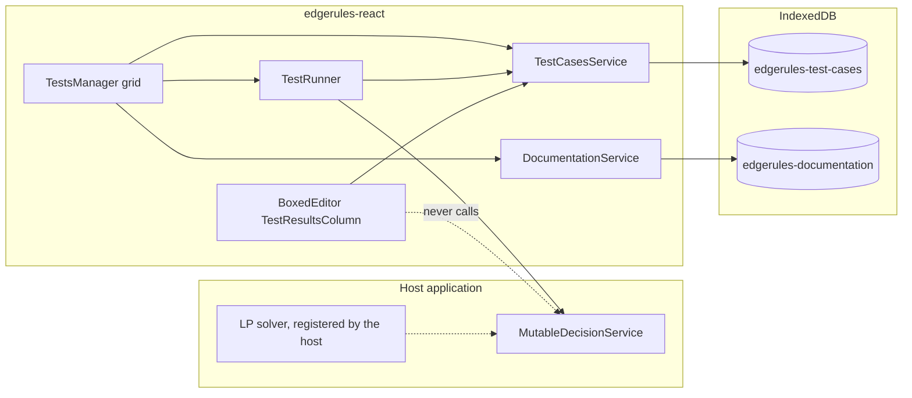
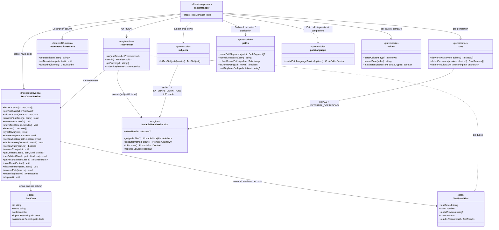
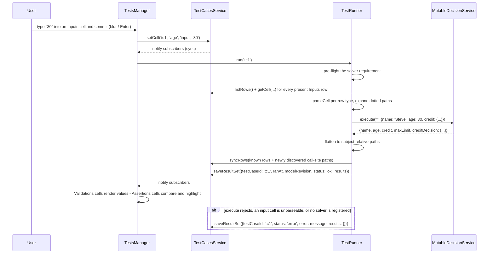
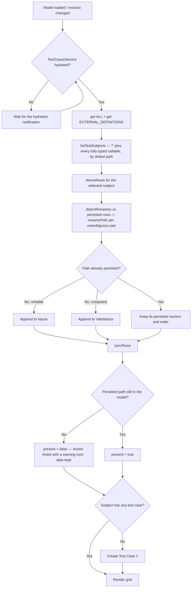

# Tests Manager Specification

Tests Manager maintains all test cases of a selected model. Test cases, their input values, their expected values, and
their last computed results are persisted through `TestCasesService`; execution is performed by `TestRunner` against the
model's `MutableDecisionService`.

The three concerns are deliberately separate, mirroring how `DocumentationService` is separated from its consumers (see
[`DOCUMENTATION_SERVICE_STORY.md`](DOCUMENTATION_SERVICE_STORY.md)):

- `TestCasesService` — persistence only. It knows nothing about the engine and nothing about any component that reads
  it; its whole vocabulary is test cases, rows, values, and results.
- `TestRunner` — execution only. Binds inputs, calls `execute`, flattens the result, writes results back through
  `TestCasesService`.
- `TestsManager` — the React grid.

Because persistence is engine-free, any component can display results without running anything.
[`BOXED_EDITOR_STORY.md`](../BOXED_EDITOR_STORY.md#testcasesservice-api)'s `TestResultsColumn` is the designed consumer of
that split. The dependency runs one way only: consumers import from `edgerules-react/test-cases-service`, never the
reverse.

## High-level structure



## Tests Manager GUI

- **Path column**: shows the path to the model field that is being tested, relative to the selected test subject. The
  column sizes itself to the longest path (capped); a path that still overflows is truncated from the **front**
  (`..creditLine[0].balance`), since the tail is what identifies the field. A cell is read-only text until clicked,
  at which point it becomes a `CodeEditorCell` over the raw path — see [Indexed paths](#indexed-paths).
- **Path column header**: a drop-down that selects the **test subject** — the whole model, or any callable whose
  parameters are all typed, at any context depth, listed by its dotted path.
- **Description column**: filled by `DocumentationService`, keyed by the qualified path. Empty and read-only when the
  host passes no service.
- **Test Case columns**: each column is one test case. A column header has three fixed parts — a drag handle, a
  click-to-edit name, and a three-dots menu — plus a running indicator while a run is in flight.
- **Toolbar** (above the grid): `Add test case`, `Run all`, and the paging controls; a warning banner appears here when
  the model needs an optimisation solver and none is registered.
- **Paging**: when a subject has more test cases than `pageSize`, the GUI pages over test-case **columns**; the Path and
  Description columns are frozen (sticky) and never page.
- **Assertions**: cells hold the value the user expects. A cell whose expected value does not equal the computed value
  is highlighted in red, and its tooltip shows the actual value.
- **Validations**: cells show the computed result. They are read-only and exist purely to inspect what a path evaluates
  to — useful when the user does not yet know the expected value.

### General Language

Tests Manager GUI follows the same language as Boxed Editor GUI:

- Every cell is single-height (40px) and grows only in 40px steps when it needs to wrap — a row's height is driven by
  its Description text, the header row's by the longest visible case name.
- Same icons for drag and drop (`DragIndicator`), add (`Add`), and context menu (`MoreVert`).
- Same spacing, padding, margins, context-menu style, and full cell borders.

### Sections

Every subject's grid has the same three sections, in this fixed order. A path belongs to exactly one of them.

| Section       | Rows                                                              | Cell editable | Cell shows                                          |
|---------------|-------------------------------------------------------------------|---------------|-----------------------------------------------------|
| `Inputs`      | Writable leaves of the subject (typed holes / callable arguments) | Yes           | The value bound before execution                    |
| `Assertions`  | Computed paths the user has given an expected value for           | Yes           | Expected value; red + actual in tooltip on mismatch |
| `Validations` | Every other computed path                                         | No            | The computed value                                  |

`Assertions` and `Validations` are the same population of computed paths split by user intent: **Move to Assertions**
promotes a row into `Assertions` (seeding each cell with the currently computed value); **Delete** on an `Assertions`
row demotes it back to `Validations` and discards its expected values. This is why a path can never appear in both.

### Indexed paths

A field declared as a list is not one opaque JSON cell. Every array — at any depth, in `Inputs` as in the computed
sections — pre-generates **element `[0]`** alongside the whole-list row, expanded through its element type just like a
user-defined type is:

| Model declaration                     | Rows                                                                                                                          |
|---------------------------------------|-------------------------------------------------------------------------------------------------------------------------------|
| `history: <number[]>`                 | `history`, `history[0]`                                                                                                       |
| `application.applicant: <Applicant[]>` | `application.applicant`, `application.applicant[0].name`, `application.applicant[0].creditLine`, `application.applicant[0].creditLine[0].balance`, … |
| `grid: <number[][]>`                  | `grid`, `grid[0]`, `grid[0][0]`                                                                                               |

`[0]` is the only index a schema can describe, so it is the only one derived — and it is always derived, so every list
has at least one addressable element in each section without the user doing anything. Further elements come from the
row menu's **Duplicate**, which bumps the path's deepest index to the first value no row is using yet
(`applicant[0].creditLine[0].balance` → `applicant[0].creditLine[1].balance`) and inserts the copy directly below its
source, carrying every case's cell text. It is offered only for a row whose path carries an index: a duplicate is one
more element of a list the model already declares, never a new field. There is deliberately no "add row" — the grid's
population comes from the model.

Clicking a Path cell opens a `CodeEditorCell` over the raw path (Enter commits, Escape cancels, blur commits), which is
how a duplicate gets retargeted at, say, a second applicant rather than a second credit line. A path that addresses
nothing the model declares — a mistyped field, a syntactically broken path, or one another row already occupies — is
shown in the error colour, while typing and after; only a collision (or an empty path) is refused on commit, since a
path the model does not declare *yet* is still the user's to enter.

That editor runs against a **path language service**, not the model's own
([`model/pathLanguage.ts`](../src/components/tests-manager/model/pathLanguage.ts)). A row path is subject-relative and
is only ever a path, so the engine's whole-model `diagnostics`/`completions` are the wrong tool for it — they report
the first segment of every valid path as an unknown reference and offer built-ins that can never appear in a path (see
[`TEST_MANAGER_BUGS.md`](TEST_MANAGER_BUGS.md)). Instead:

- **Diagnostics** mark the first segment the subject does not declare, from that segment to the end of the path
  (`'nope' is not a field of 'application.applicant[0]'`), plus malformed syntax and collisions with another row. A
  subject whose schema could not be read flags nothing rather than painting every path red.
- **Completions** are drawn from the subject's addressable paths, canonicalized to `[0]` for matching and re-indexed
  back to whatever the user typed (`applicant[3].creditLine[1].` completes to that element's fields). They are ordered
  shallowest-first, and replace the whole cell, so picking a deep leaf is one choice.

Syntax highlighting, Enter/Escape/blur semantics, and everything else come from `CodeEditorCell` unchanged.

A row the user duplicated or retyped is marked `custom` and is never derived again, so it is exempt from the
`present: false` flagging that tracks the model dropping a field (see
[Renamed and removed paths](#renamed-and-removed-paths)) — whether its path still means anything is what the Path cell
already says. Its own menu carries **Delete row**, which removes it with its cells and results; a derived row has no
such entry, since its path belongs to the model.

### Workbook Testing

A `Workbook` model is a `context` with multiple fields, so its subject is the whole model (`*`).

|   | Model Name              ▼ | Description           | Test Case 1        ⋮ | Test Case 2        ⋮ | ... | Test Case N        ⋮ |
|---|---------------------------|-----------------------|----------------------|----------------------|-----|----------------------|
|   | Inputs                    |                       |                      |                      | ... |                      |
| ⠿ | `name`                    | `User Name`           | `Steve`              | `John`               | ... | `Mary`               |
| ⠿ | `age`                     | `User Age`            | `30`                 | `25`                 | ... | `40`                 |
| ⠿ | `credit.balance`          | `User Credit Balance` | `1000`               | `0`                  | ... | `-100`               |
| ⠿ | `credit.limit`            | `User Credit Limit`   | `2000`               | `0`                  | ... | `10000`              |
|   | ___                       | ___                   | ___                  | ___                  | ___ | ___                  |
|   | Assertions                |                       | `2/2` ✓              | `2/2` ✓              | ... | `1/2` ✗              |
| ⠿ | `creditDecision.approved` | `Credit Approved`     | `true`               | `true`               | ... | `false`              |
| ⠿ | `creditDecision.limit`    | `Credit Limit`        | `10000`              | `10000`              | ... | `10000`              |
|   | ___                       | ___                   | ___                  | ___                  | ___ | ___                  |
|   | Validations               |                       |                      |                      | ... |                      |
| ⠿ | `maxLimit`                | `Maximum Limit`       | `10000`              | `10000`              | ... | `10000`              |

The `Assertions` section header carries each test case's pass counter, counting only rows that have a non-empty
expected value and are still declared by the model. In `Test Case N` the applicant is declined (`balance` is negative),
so `creditDecision.limit` computes `0` while the cell expects `10000` — that cell renders red and its tooltip reads
`0`.

**Example model for the above test manager GUI:**

```edgerules
{
    maxLimit: 10000,
    name: <string, required: true>,
    age: <number, required: true>,
    credit: {
        balance: <number, required: true>,
        limit: <number, required: true>
    },
    creditDecision: {
        approved: if credit.balance >= 0 and age > 17 then true else false,
        limit: if approved then maxLimit else 0
    }
}
```

### Decision Service Testing

Every callable whose parameters are all typed is a decision-service entry point and gets its own subject, at any
context depth — `library.eligibility` is as testable as a root-level `creditDecision`. Its `Inputs` rows are the
parameters (complex parameter types expanded to leaves); its computed rows are the leaves of the return type.

All four callable metaphors execute identically (`execute(dottedPath, args)`), but each is discovered differently:

| Subject kind | Discovered by                                     | `@kind`           | Input rows    | Computed rows       |
|--------------|---------------------------------------------------|-------------------|---------------|---------------------|
| `function`   | `get('*', 'ALL')`, recursing into nested contexts | `function-schema` | `@parameters` | leaves of `@return` |
| `ruleset`    | `get('*', 'ALL')`, recursing into nested contexts | `ruleset-schema`  | `@parameters` | leaves of `@return` |
| `loop`       | `get('*', 'ALL')`, recursing into nested contexts | `loop-schema`     | `@parameters` | leaves of `@return` |
| `optimise`   | `get('*', 'EXTERNAL_DEFINITIONS')`                | `optimise`        | `@parameters` | leaves of `@result` |

The last row is an engine quirk, not a design choice: an `optimise` declaration is absent from `FIELDS` and `ALL`
entirely, so its catalog row lives only in `EXTERNAL_DEFINITIONS`. `optimise` is root-only by language rule;
functions, rulesets, and loops nest.

A callable declared inside **another callable's body** (`func outer(): { func inner(): … }`) is an implementation
detail of its parent, not an entry point, and is not offered as a subject — even though the engine will happily
execute `outer.inner`. Subject discovery walks contexts, not function bodies.

A `func` body cannot read the enclosing context — the engine rejects it with `E101: function 'x' cannot read 'y' from
an enclosing context`. Everything a decision service needs must therefore arrive as a parameter, which is why
`maxLimit` below is one:

```edgerules
{
   type Credit: {
      balance: <number, required: true>,
      limit: <number, required: true>
   }
   maxLimit: 10000,
   func creditDecision(name: string, age: number, credit: Credit, cap: number): {
      approved: if credit.balance >= 0 and age > 17 then true else false,
      limit: if approved then cap else 0
   }
}
```

| creditDecision ▼ | Description           | Test Case 1 ⋮ | ... |
|------------------|-----------------------|---------------|-----|
| Inputs           |                       |               | ... |
| `name`           | `User Name`           | `Steve`       | ... |
| `age`            | `User Age`            | `30`          | ... |
| `credit.balance` | `User Credit Balance` | `1000`        | ... |
| `credit.limit`   | `User Credit Limit`   | `2000`        | ... |
| `cap`            | `Credit Cap`          | `10000`       | ... |
| ___              | ___                   | ___           | ___ |
| Assertions       |                       | `2/2` ✓       | ... |
| `approved`       | `Credit Approved`     | `true`        | ... |
| `limit`          | `Credit Limit`        | `10000`       | ... |

A callable whose return type is a scalar (`-> boolean`) has exactly one computed row, whose path is the empty string
and whose Path cell renders as `(result)`.

### Optimise Testing

An `optimise` subject's computed rows are the synthesized result record: the decision variables, plus the reserved
`status` / `objective` / `solver` / `notes` fields, plus one `bottlenecks.<constraint>` row per named constraint when
`bottlenecks: true`.

```edgerules
{
    optimise factoryProduction(workers: number, sticks: number, plates: number): {
        using: "highs"
        bottlenecks: true
        variables: {
            chairs: <number, integer: true, min: 0>
            tables: <number, integer: true, min: 0>
        }
        maximise: 15 * chairs + 40 * tables
        constraints: {
            workerCapacity: 1 * chairs + 3 * tables <= workers
            stickSupply: 4 * chairs + 4 * tables <= sticks
            plateSupply: 1 * chairs + 2 * tables <= plates
        }
        timeLimit: 1000
    }
}
```

| factoryProduction ▼          | Description         | Test Case 1 ⋮     | ... |
|------------------------------|---------------------|-------------------|-----|
| Inputs                       |                     |                   | ... |
| `workers`                    | `Available Workers` | `8`               | ... |
| `sticks`                     | `Sticks In Stock`   | `40`              | ... |
| `plates`                     | `Plates In Stock`   | `12`              | ... |
| ___                          | ___                 | ___               | ___ |
| Assertions                   |                     | `2/2` ✓           | ... |
| `status`                     | `Solve Status`      | `optimal`         | ... |
| `objective`                  | `Total Value`       | `120`             | ... |
| ___                          | ___                 | ___               | ___ |
| Validations                  |                     |                   | ... |
| `chairs`                     | `Chairs To Build`   | `8`               | ... |
| `tables`                     | `Tables To Build`   | `0`               | ... |
| `bottlenecks.workerCapacity` | `Worker Bottleneck` | `15`              | ... |
| `solver`                     | `Solver Used`       | `highs-js 1.15.1` | ... |
| `notes`                      | `Solver Notes`      | `5 items`         | ... |

**EdgeRules ships no solver.** An `optimise` subject only runs if the host has registered one on the same
`MutableDecisionService` (see the engine repo's `OPTIMISE_SOLVER_HOSTING.md`). Without it the run does not fail loudly
— `execute` returns `Missing('factoryProduction')` — so `TestRunner` pre-flights the condition instead of recording
that as a result; see [Execution](#execution).

## Object Model

The persistence types are defined in
[`test-cases-service-types.ts`](../src/components/test-cases-service/test-cases-service-types.ts); the engine-facing
ones in [`tests-manager-types.ts`](../src/components/tests-manager/tests-manager-types.ts).

| Type                              | Represents                                                                                  |
|-----------------------------------|----------------------------------------------------------------------------------------------|
| `TestSubjectId`                   | `'*'` for the whole model, otherwise the callable's dotted path (`library.eligibility`).     |
| `TestSubject` / `TestSubjectKind` | One entry in the Path-header drop-down: its id, its kind, and its display label.             |
| `TestRow`                         | One grid row — path, section, order, declared type, whether the model still declares it, and whether the user authored it. |
| `TestCase`                        | One grid column — everything the user authored: name, order, `inputs` and `assertions` maps. |
| `TestValuesByPath`                | Raw cell text exactly as typed, keyed by subject-relative path.                              |
| `TestResult`                      | One path's computed outcome — value or error, plus a status.                                 |
| `TestResultSet`                   | One run of one test case — run metadata plus one `TestResult` per path.                      |
| `TestCasesService`                | The persistence API (see [Persistence](#persistence)).                                       |
| `TestRunner`                      | The execution API (see [Execution](#execution)).                                             |
| `MutableDecisionService`          | Structural subset of the engine's dev-build service the runner and derivation need.          |

Three of these are deliberately separate: `TestRow` is the grid's shape and is shared by every column; `TestCase` is
what the user authored in one column; `TestResultSet` is what came back from running that column. Run metadata
(`ranAt`, `modelRevision`) and run-level failures sit once on the set rather than being copied onto every path.

Paths are **relative to the subject**. `TestCasesService` stores them that way; the qualified, model-wide form used
for `DocumentationService` lookups is derived by `qualifyPath(subjectId, path)` in
[`model/inputs.ts`](../src/components/tests-manager/model/inputs.ts) (`'*'` + `credit.balance` → `credit.balance`;
`creditDecision` + `approved` → `creditDecision.approved`).

`TestResult.value` is the engine's own return value, not a string: a `number` for a numeric path, an `array` for a
list, the engine's string form for dates (`2024-01-15`), durations (`P1D`), and special values (`Missing('credit')`).
Every shape the engine returns is JSON-serializable, so IndexedDB stores it by structured clone. Display formatting is
the reading component's job, not the service's.



## Components

`TestsManager` lives at `src/components/tests-manager/` (subpath `edgerules-react/tests-manager`);
`TestCasesService` at `src/components/test-cases-service/` (subpath `edgerules-react/test-cases-service`), keeping it
importable by `BoxedEditor` without dragging in the grid or the engine.

```text
src/components/test-cases-service/
├─ index.ts                          — public exports
├─ test-cases-service-types.ts       — every persistence type (see Object Model)
├─ createTestCasesService.ts         — factory: (modelName, subjectId, options?) -> TestCasesService
├─ renameTestSubject.ts              — standalone key rewrite across both stores when a callable or a containing
│                                       context is renamed/moved
├─ indexedDbStore.ts                 — IndexedDB adapter: open/upgrade, hydrate, put, delete, per-model cursor reads
├─ useTestCases.ts                   — hook: ordered cases + a clamped current index + next()/prev()
├─ useTestResult.ts                  — hook: one path's TestResult out of a case's TestResultSet
└─ __tests__/                        — persistence, subject rename, no-IndexedDB fallback, and the two hooks

src/components/tests-manager/
├─ index.ts                          — public exports
├─ TestsManager.tsx                  — root: subject state, service/runner construction, pre-generation, providers
├─ TestsManagerProps.ts              — TestsManagerProps (public)
├─ tests-manager-types.ts            — TestSubject, TestSubjectKind, TestRunner, MutableDecisionService (public)
├─ model/
│  ├─ subjects.ts                    — listTestSubjects
│  ├─ rows.ts                        — deriveRows, detectRenames, flattenResult
│  ├─ paths.ts                       — row-path syntax: segments, index normalization, known-path universe,
│  │                                    next duplicate path
│  ├─ pathLanguage.ts                — CodeEditorService for the Path cell: path diagnostics + path completions
│  ├─ values.ts                      — parseCell / formatValue / matches (type-directed)
│  └─ inputs.ts                      — qualifyPath; dotted subject-relative paths -> nested execute() input
├─ runner/
│  ├─ createTestRunner.ts            — solver pre-flight, binding, execute dispatch, result assembly, run generations
│  └─ __tests__/                     — the runner as a standalone unit, no React
├─ context/
│  ├─ TestsManagerContext.tsx        — services, subject, readOnly, revision, pageSize, autoRun; DocumentationService
│  └─ TestsManagerUiContext.tsx      — ephemeral UI: page index, active editing cell
├─ hooks/
│  ├─ useTestSubjects.ts             — memoized listTestSubjects for the current model revision
│  ├─ useTestRows.ts                 — useSyncExternalStore over TestCasesService.listRows()
│  ├─ useTestCaseColumns.ts          — visible page of test cases + paging controls
│  ├─ useCell.ts                     — one cell's persisted text, computed value, staleness, and match state
│  ├─ useKnownPaths.ts               — the subject's addressable paths, for Path cell validation
│  └─ useForceUpdate.ts              — re-render on service notifications where no stable snapshot exists
├─ grid/
│  ├─ TestsGrid.tsx                  — grid shell, frozen Path/Description columns, toolbar, paging, solver banner
│  ├─ SubjectHeaderCell.tsx          — the Path column header drop-down
│  ├─ TestCaseHeaderCell.tsx         — drag handle, click-to-edit name, three-dots menu, run indicator
│  ├─ SectionHeaderRow.tsx           — Inputs / Assertions / Validations separators; pass counter
│  ├─ TestRowLine.tsx                — one row: drag handle, path cell, row menu, description cell, its case cells
│  ├─ PathCell.tsx                   — path-column sizing + front-truncation, type tooltip, click-to-edit path
│  │                                    with unknown-path highlighting
│  ├─ InputCell.tsx                  — editable, type-directed parsing, invalid-cell marking
│  ├─ AssertionCell.tsx              — editable expected value; red + actual-value tooltip on mismatch
│  ├─ ValidationCell.tsx             — read-only computed value, muted when stale
│  └─ gridStyle.ts / wrapping.ts     — shared cell borders, fill-cell styling, 40px row-height stepping
├─ menu/
│  ├─ actions.tsx                    — test-case column and row action registries
│  └─ TestsMenu.tsx                  — shared MUI menu for both three-dots buttons
├─ dnd/
│  ├─ useRowDrag.ts                  — within-section row reordering
│  └─ useColumnDrag.ts               — test-case column reordering, resolved against the unpaged case list
└─ __tests__/                        — grid rendering/paging/readOnly, header layout + column drag, pre-generation,
                                       execution + row-menu content, indexed paths (derivation, Duplicate, path
                                       editing, path diagnostics/completions), subjects, rows, values, paths,
                                       pathLanguage, optimise
```

## Persistence

`TestCasesService` is loaded for one `(modelName, subjectId)` pair and disposed when that pair is unloaded, so no
method takes a subject argument — a grid, or a results column, only ever shows one subject at a time. `TestsManager`
constructs a new instance when the subject drop-down changes.

Like `DocumentationService`, the API is synchronous over an in-memory cache, with IndexedDB written in the background;
persistence failures never roll back the in-memory value. Read methods memoize their clones per mutation, so
`useSyncExternalStore` sees a referentially stable snapshot between notifications.

Construction kicks off hydration, and subscribers are notified once it completes. Local writes made before hydration
resolves win over whatever IndexedDB eventually returns for cases and rows — a synchronous caller must never see its
own edit vanish underneath it. Result sets merge instead, being additive and keyed.

`createTestCasesService(modelName, subjectId, options?)` takes an optional `dbName` (defaults to
`edgerules-test-cases`) and an `onPersistError` callback; when `indexedDB` is unavailable the service runs in-memory
only and never throws.

`renameTestSubject(modelName, from, to, options?)` rewrites stored test data when a callable — or a context containing
callables — is renamed or moved, covering every subject id equal to `from` or prefixed `from.` across both object
stores. It is a module-level async function rather than an instance method, because one rename usually affects
subjects that have no live instance and there is no in-memory cache to serve it from. Renaming `library` to `lib`
therefore carries `library.eligibility`'s cases, rows, and results to `lib.eligibility` along with every other subject
under that context. The host's command layer calls it after a successful `rename`/`move`; a live instance for an
affected subject must be disposed and reconstructed with the new id, since the rewrite does not reach into open
instances.

### IndexedDB schema

Two object stores in one database, split along the two write rhythms: authored values change on cell commit, results
change on run.

| Item         | `testCases` store                                              | `testResults` store                                                                           |
|--------------|----------------------------------------------------------------|-----------------------------------------------------------------------------------------------|
| Key path     | `['modelName', 'subjectId']`                                   | `['modelName', 'subjectId', 'testCaseId']`                                                    |
| Record shape | `{ modelName, subjectId, cases: TestCase[], rows: TestRow[] }` | `{ modelName, subjectId, testCaseId, set: TestResultSet }`                                    |
| Hydration    | one `get` on construction                                      | one cursor read over `IDBKeyRange.bound([modelName, subjectId], [modelName, subjectId, '￿'])` |
| Write        | whole-record `put` on any case/row/cell change                 | one `put` per completed run; `delete` on clear or case removal                                |

Each store writes whole records rather than per-cell rows. A subject's authored data is one small JSON document — tens
of cases by tens of paths — so a whole-record `put` on cell commit is cheaper than maintaining a key per cell, and it
keeps `TestCase` atomic: a case and its values can never be half-persisted. `renameTestSubject` reads across a whole
model with the same prefix-bound cursor technique.

Compound array keys avoid inventing (and escaping) a delimiter that cannot appear in an EdgeRules path — the same
reasoning as [`DOCUMENTATION_SERVICE_STORY.md`](DOCUMENTATION_SERVICE_STORY.md)'s Resolved Decision #5.

### Cell values

Cells store the **raw text the user typed**; parsing is type-directed, using the row's declared type, so `30` in a
`number` row binds the number `30` rather than the string `"30"`.

| Row type                          | Cell text        | Bound / compared value               |
|-----------------------------------|------------------|--------------------------------------|
| `string`                          | `Steve`          | `"Steve"` (never quoted by the user) |
| `number`                          | `30`, `-100`     | `30`, `-100`                         |
| `boolean`                         | `true` / `false` | `true` / `false`                     |
| `date`, `time`, `datetime`        | `2024-01-15`     | the ISO string the engine emits      |
| `duration`, `period`              | `P1D`            | the ISO-8601 string the engine emits |
| `array`, user-defined type, `any` | JSON             | the parsed JSON value                |
| any type, cell left empty         | (empty)          | not bound / not asserted             |

An empty `Inputs` cell binds nothing — the engine then supplies the field's `default`, or `Missing(...)` when it has
none. An empty `Assertions` cell asserts nothing and never renders red. Text that cannot be parsed for the row's type
marks the cell invalid; running it records a run-level error naming the offending path instead of executing.

Assertion comparison parses the expected text per the row type and does a structural deep-equal against
`TestResult.value`. Special values reach the host as strings (`Missing('credit')`, `Invalid(number, 'x')`) whatever the
declared type, so asserting one is just asserting that string. An array value is displayed as `N items` rather than
dumped as JSON, since a cell has no room for one.

## Execution

`TestRunner` owns every engine call — `TestsManager` never calls `execute` directly. It is created per
`(service, testCasesService, subject)`, with an optional `modelRevision` to stamp onto each result set.

Binding rules:

- Only `Inputs` rows the model still declares are bound. Sending a value for a computed path does not override it —
  the engine ignores it while echoing it back into the result, which is recorded in
  [`BUG_REPORTS.md`](BUG_REPORTS.md). Restricting the payload to writable paths is what keeps `Validations` cells
  showing computed values rather than the user's own input.
- Dotted subject-relative paths are expanded into a **nested** input object (`credit.balance` → `{credit: {balance:
  …}}`). A dotted key passed literally binds nothing. An indexed segment nests through an array instead
  (`applicant[0].name` → `{applicant: [{name: …}]}`). Shallower paths bind first, so a list typed wholesale into its
  own row is written before the indexed cells that address into it, and the more specific cell wins.
- Subject `*` executes `execute('*', input)`; a callable subject executes `execute(subjectId, args)` with `args` keyed
  by parameter name.
- The returned value is flattened back into subject-relative paths; an array yields both its own path and one indexed
  path per element (capped at 200), so an indexed row finds its computed value. A scalar return flattens to `''`.
  Paths in the result that have no row yet are appended as `Validations` rows before results are recorded (see
  [Rows the schema does not reveal](#rows-the-schema-does-not-reveal)).
- A successful run records one `TestResult` per known, still-declared path, with status `ok`.
- Failures are recorded once at run level, never smeared across every row: `execute` rejecting with a `PortableError`
  (`EntryNotFound`, `Execution`, …), an unparseable input cell, or a missing solver all save a `TestResultSet` with
  `status: 'error'` and a message, and no per-path results at all. The column's cells then render empty.

**Solver pre-flight.** A model or subject that involves an `optimise` needs a solver the host registered on the same
`MutableDecisionService`; EdgeRules ships none. When one is missing, `execute` does not reject — it returns
`Missing('<name>')`, which would otherwise be recorded as an ordinary result and fail every assertion for an unclear
reason. `TestRunner` therefore refuses the run up front when `service.requiresSolver()` is `true` and no
`service.solverHandler` is set, saving that run-level error naming the missing solver; `TestsManager` shows the same
condition as a grid-level banner. Registering the solver is the host's job, done once before `TestsManager` mounts.

Runs are triggered by committing an `Inputs` cell edit (blur or Enter, that case only, when `autoRun` is on), a
`revision` prop change (all cases, when `autoRun` is on), and the explicit **Run** / **Run all** actions. Each run for
a case takes a generation number; when a newer run for the same case starts, the older one's result is discarded on
arrival rather than overwriting the newer one. `runAll` runs the subject's cases sequentially.

### Stale results

A result set is stale when its `modelRevision` differs from the `revision` currently in force — the model has been
edited since the value was computed. A stale result is **greyed out and no longer asserted**: `Validations` cells
render the last known value muted and italic, and `Assertions` cells drop their pass/fail highlighting entirely rather
than score an expected value against a value the current model would not produce. The `Assertions` section header
shows no counter for a stale column. Re-running the case restores normal rendering.

With the default `autoRun: true` a `revision` change re-runs every case immediately, so staleness is a brief
transitional state; with `autoRun: false` it persists until the user runs the case, which is exactly when suppressing
a misleading green tick matters.



## Context Menu And Actions

**Test-case column menu** (the three dots in a column header). Renaming and reordering are not menu entries — the
header name is click-to-edit and columns reorder via the header's own drag handle.

| Action          | Effect                                                                          |
|-----------------|----------------------------------------------------------------------------------|
| `Run`           | Runs this case now.                                                             |
| `Run all`       | Runs every case of the subject, sequentially.                                   |
| `Clone`         | Copies input and assertion cells into a new case inserted right after this one. |
| `Clear results` | Drops this case's results, leaving inputs and assertions.                       |
| `Delete`        | Removes the case with its cells and results; disabled when it is the only case. |

**Row menu** (three dots in their own column beside the Path cell). A row with no applicable action — an `Inputs` row
on a path with no index — has its button disabled.

| Action                    | Available in           | Effect                                                                                    |
|---------------------------|------------------------|---------------------------------------------------------------------------------------------|
| `Duplicate`               | any indexed path       | Copies the row to the next free index, right below it, with every case's cell text.        |
| `Move to Assertions`      | `Validations`          | Promotes the row and seeds each case's cell with that case's computed value.               |
| `Delete`                  | `Assertions`, derived  | Demotes the row back to `Validations`, discarding its expected values.                     |
| `Copy actual to expected` | `Assertions`           | Overwrites expected with the computed value, per case.                                     |
| `Delete row`              | user-authored rows     | Removes the row outright, with its cells and results.                                      |

**Grid-level actions** live in the toolbar above the grid: `Add test case`, `Run all`, and the paging controls (shown
only when there is more than one page). A trailing icon column also carries an "add test case at end" button.

**Drag and drop**: rows reorder within their own section — one `DndContext` per section, so a row can never be dropped
among another section's rows — and test-case columns reorder by dragging a column header, with the drop index resolved
against the full unpaged case list rather than the visible page.

## Tests Pre-Generation

On mount, and whenever `revision` changes, `TestsManager` derives the subject's rows from the engine and reconciles
them with what is persisted. Pre-generation waits for the service's initial hydration notification, so it never
overwrites persisted data with a freshly derived, empty grid. At least one test case always exists, so a user never
faces an empty grid.



Derivation rules for `deriveRows`, read off `get('*', 'ALL')` and `get('*', 'EXTERNAL_DEFINITIONS')`:

- A `@kind: 'type'` node with `writeOnly: true` is an **input** leaf; otherwise it is a computed leaf. A
  `@kind: 'expression'` node is a computed leaf.
- Nested `@kind: 'context'` nodes are recursed into, joining segments with `.`.
- A leaf whose `type` names a user-defined type is expanded into that type's own leaves, read from the same `ALL`
  view's root-level `type-definition` entries — the engine does not resolve such paths itself (`get('credit.balance')`
  on a `credit: <Credit>` hole returns `EntryNotFound`). Expansion recurses and is cycle-guarded.
- An `array`-typed leaf yields its own row (whose cell holds the whole list as JSON) plus the leaves of element `[0]`,
  expanded recursively through `items` — see [Indexed paths](#indexed-paths).
- `function-schema`, `ruleset-schema`, `loop-schema`, `optimise`, and `type-definition` entries are not rows of the
  `*` subject; they are subjects (or type sources) in their own right. A context that holds only callables therefore
  contributes no rows.
- For a callable subject, input rows come from `@parameters` (same expansion rules) and computed rows from the leaves
  of `@return` (`@result` for an `optimise`) — one row with path `''` when that is a scalar type name. A `loop`'s
  `@state` is iteration bookkeeping, not part of the result, and produces no rows.
- Freshly derived computed rows always land in `Validations`; a persisted promotion to `Assertions` is preserved by
  `syncRows`, not by the derivation.

Subject discovery excludes a callable with any untyped parameter: the engine reports those as `"any"` in
`@parameters`, and a row with no declared type has no parsing rule.

### Renamed and removed paths

This applies to derived rows only — a `custom` row (see [Indexed paths](#indexed-paths)) is never derived, so it is
neither flagged nor rename-matched. A path that disappears from the model is only flagged (`present: false`), never
deleted: the row stays visible, tinted
and carrying a warning icon explaining that it is kept for reference and will not be used in future runs. Its data
survives in IndexedDB, so restoring the field restores its test data, and its leftover assertion never counts toward a
pass counter. Purging orphaned rows belongs to the future project-saving story.

A rename is detected between two consecutive derivations and migrated through `renamePath`, so the user's authored
values follow the field. A disappearance is paired with an appearance only when it is the **unique** candidate in the
same section with the same type; an ambiguous match is left undetected and falls through to the ordinary
delete-plus-add behavior, since guessing wrong would silently misattribute one field's data to another.

### Rows the schema does not reveal

A `@kind: 'invocation'` field is a call site: `get` reports only `@type: 'object'` for it, never the leaves of what it
returns. A `plan: factoryProduction(...)` field is the clearest case — `get('*', 'ALL')` shows one opaque `plan` node,
while running the model yields `plan.status`, `plan.objective`, `plan.chairs`, `plan.bottlenecks.workerCapacity`, and
`plan.notes`.

Row derivation therefore has a second source: **paths observed in a run result**. After each run, `TestRunner`
flattens the result and appends any path with no row yet to `Validations` through the same `syncRows` reconciliation,
inferring a lightweight type from the returned value. Schema-derived rows appear before the first run; call-site
leaves appear after it. Both are persisted identically, so the grid is stable from the second load onward.

## Component API

Props are defined in [`TestsManagerProps.ts`](../src/components/tests-manager/TestsManagerProps.ts).

| Prop                   | Default    | Purpose                                                                                 |
|------------------------|------------|------------------------------------------------------------------------------------------|
| `service`              | (required) | The model authority. `TestRunner` executes against it; `TestsManager` never mutates it.  |
| `modelName`            | (required) | IndexedDB namespace for this model's test data and descriptions.                         |
| `documentationService` | —          | Supplies the Description column; the column is empty and read-only without it.           |
| `subjectId`            | `'*'`      | Controlled subject selection; uncontrolled when omitted.                                 |
| `onSubjectChange`      | —          | Fired when the Path column header drop-down changes.                                     |
| `revision`             | —          | Host-controlled invalidation token. Change it after model edits made elsewhere.          |
| `readOnly`             | `false`    | Disables cell editing, reordering, and case CRUD; running stays available.                |
| `pageSize`             | `10`       | Test-case columns per page.                                                              |
| `autoRun`              | `true`     | Whether committing an input, or a `revision` change, re-runs automatically.               |
| `onRunComplete`        | —          | Fired after each completed run, successful or failed.                                     |
| `className` / `sx`     | —          | Styling passthrough to the root `Box`.                                                   |

## Testing Strategy

Each of the three units is tested on its own, before anything composes them. Only two things are ever substituted, and
both are environment, not logic: the browser's `indexedDB` (absent from `jsdom`) and the LP solver (which EdgeRules
does not ship). The engine is never mocked, per [`CLAUDE.md`](../CLAUDE.md).

| Unit                                      | Runs against                                                      | Substituted                             | Kind           |
|-------------------------------------------|-------------------------------------------------------------------|-----------------------------------------|----------------|
| `TestCasesService`                        | itself — no engine import exists in the package                   | `fake-indexeddb`                        | unit           |
| `useTestCases` / `useTestResult`          | a real `TestCasesService`                                         | `fake-indexeddb`                        | RTL            |
| `subjects` / `rows` / `values` / `inputs` / `paths` / `pathLanguage` | a real `MutableDecisionService` from `@edgerules/node` | nothing    | unit, pure     |
| `TestRunner`                              | a real `MutableDecisionService` **and** a real `TestCasesService` | `fake-indexeddb`, `registerSolver` stub | unit, no React |
| `TestsManager`                            | all of the above, really wired                                    | `fake-indexeddb`, `registerSolver` stub | RTL            |

- **`TestCasesService` needs no engine at all.** Its tests construct it directly and assert persistence behavior:
  hydration, case CRUD, row sync, cell round trips, result-set replacement, `renamePath` across rows/values/results,
  and the no-`indexedDB` in-memory fallback. If a test in this package ever needs `@edgerules/node`, the package has
  taken on a dependency it should not have.
- **`TestRunner` is tested with the real engine**, because its entire job is binding to and interpreting `execute` —
  a stubbed engine would only assert that the stub matches the author's belief about the engine, and that belief has
  been wrong more than once (input echo, `Missing` on a missing solver, `loop` schema visibility). It uses a real
  `TestCasesService` too: an in-repo collaborator with no I/O beyond IndexedDB, so there is nothing to gain from
  faking it.
- **`fake-indexeddb`** is a spec-compliant in-memory implementation of the browser API, imported locally in the files
  that need it rather than globally in `vitest.setup.ts`, so the no-`indexedDB` fallback test can still observe a
  genuinely absent global. Same arrangement as
  [`DOCUMENTATION_SERVICE_STORY.md`](DOCUMENTATION_SERVICE_STORY.md)'s Testing Strategy.
- **The solver stub** returns a fixed `LpOutcome` for a known small problem. It substitutes a component EdgeRules
  deliberately does not ship (the host wires one — see [Optimise Testing](#optimise-testing)); the engine still
  verifies the returned solution itself, so the stub cannot fake a passing test. `highs` is not a dependency of this
  repo.
- If a run exposes a WASM/DSL gap, append a reproducible entry to [`BUG_REPORTS.md`](BUG_REPORTS.md) rather than
  compensating in React.
- **Anything about painting or stacking is an e2e test**, not an RTL one: jsdom has no layout, so a popup being
  covered by the rows below it is invisible to it. `e2e/tests-manager.spec.ts` drives the real Storybook build in
  Chromium and hit-tests the open completion popup — see [`TEST_MANAGER_BUGS.md`](TEST_MANAGER_BUGS.md).

## Storybook stories

Stories live in `stories/tests-manager/TestsManager.stories.tsx`, each building a real service from a model source:

1. `Workbook` — all three sections over the workbook model, exercising promote-to-assertion and the mismatch highlight.
2. `DecisionServiceEntryPoints` — the subject drop-down switching between `*`, a root `func`, a `ruleset`, a nested
   callable shown by its dotted path, and a `loop`, including a callable excluded for an untyped parameter.
3. `OptimiseWithSolver` — an `optimise` subject with a solver registered by the story's own decorator, showing the
   result record's `status` / `objective` / variable / `bottlenecks.*` rows.
4. `OptimiseWithoutSolver` — the same model with no solver, showing the pre-flight banner.
5. `ColumnPaging` — more test cases than `pageSize`, with frozen Path/Description columns.
6. `SharedDocumentationService` — descriptions staying in sync with another component both ways.
7. `LiveModelEdits` — a model edited live (the harness bumps `revision`): new fields appear, removed fields are
   flagged, and all cases re-run.
8. `IndexedArrayPaths` — a model of applicants each holding credit lines: pre-generated `[0]` paths at every depth,
   **Duplicate**, and click-to-edit paths with the unknown-path highlight.
9. `ReadOnly` — `readOnly` mode.

## Clarifications

| #  | Decision                                                           | Rationale                                                                                                                                                                                                                                                                                        |
|----|--------------------------------------------------------------------|--------------------------------------------------------------------------------------------------------------------------------------------------------------------------------------------------------------------------------------------------------------------------------------------------|
| 1  | Persistence split from execution                                   | `TestCasesService` never imports the engine; `TestRunner` is the only piece that does. Any component can then read and display results with no engine dependency, and the persistence contract stays testable without a WASM instance.                                                            |
| 2  | One service instance per `(model, subject)`                        | `createTestCasesService(modelName, subjectId)` rather than a subject argument on every method. Any view over test data shows one subject at a time, so threading a subject through every call would be noise. `TestsManager` swaps instances when the drop-down changes.                          |
| 3  | Stable `id` for a test case                                        | Cells and results key off `TestCase.id`, not the display name, so renaming a column never rewrites its data.                                                                                                                                                                                     |
| 4  | Results are persisted, not recomputed on read                      | Results live in IndexedDB so a component can display them without an engine dependency. `ranAt` and `modelRevision` sit on the `TestResultSet` — properties of the run, not of each value — and let any consumer detect a set produced against a since-edited model.                             |
| 5  | Subject-relative paths in storage                                  | Rows and results store paths relative to the subject; `qualifyPath` derives the model-level form. Keeps a callable's `approved` from colliding with a root field of the same name.                                                                                                               |
| 6  | Type-directed cell parsing                                         | Cells store raw text parsed via the row's declared type, rather than requiring the user to type JSON. The engine coerces some mistyped input silently (a `"5"` string still arithmetics as `5`) but echoes the original string back in the result, which would make assertions confusing.         |
| 7  | Only writable paths are bound                                      | Inputs are restricted to typed holes and callable parameters. Overriding a computed field is not supported by the engine and is silently ignored — see [Future Improvements](#future-improvements) and the entry in [`BUG_REPORTS.md`](BUG_REPORTS.md).                                          |
| 8  | Rulesets and optimisations are subjects too                        | All callable metaphors execute identically (`execute(name, args)`), so all are subjects. Excluding `ruleset` would leave decision tables untestable, and excluding `optimise` would leave it with no test surface at all, since it has no standalone editor either.                              |
| 9  | `TestResult.value` is `unknown`, not `string`                      | `execute` returns real JS values — numbers, booleans, arrays, nested objects — and only dates, durations, and special values arrive as strings. Typing `value` as `string` would force every producer to stringify and every consumer to parse back.                                             |
| 10 | Run results are a second row source                                | A `@kind: 'invocation'` field is opaque in every `get` view, so a schema-only derivation would leave every call site as one unusable row. Reconciling the flattened run result through the same `syncRows` path covers that generically, instead of special-casing invocations.                  |
| 11 | Solver wiring stays the host's job                                 | `TestRunner` never registers a solver: EdgeRules ships none, and choosing one is a host deployment decision. The runner only pre-flights the condition, because a missing solver produces `Missing('<name>')` rather than an error and would otherwise look like a modelling mistake.             |
| 12 | Every callable is a subject, at any depth                          | The drop-down lists callables by dotted path rather than root-level names only, so a model that organizes its logic under a `library:` context is testable. Callables declared inside another callable's **body** stay out: they are implementation details.                                      |
| 13 | `tests-manager` is the GUI, `TestRunner` the executor              | The component directory and subpath are `tests-manager`; `TestRunner` names the execution service only, so one name never refers to two things.                                                                                                                                                  |
| 14 | Stale results are greyed and unasserted                            | When `TestResultSet.modelRevision` no longer matches the current `revision`, values render muted and assertion highlighting is suppressed until the case re-runs — a green tick against a value the current model would not produce is worse than no tick.                                       |
| 15 | Descriptions key off the qualified path alone                      | No section discriminator in the `DocumentationService` key. A collision needs a model that names a context exactly like a callable, which the engine already rejects as a duplicate name.                                                                                                         |
| 16 | Values live on the test case, results in their own set             | A `TestCase` owns the two maps the user authored; a `TestResultSet` owns one run's output plus its metadata. Splitting them keeps authored and derived data from sharing a lifetime, makes "run the case again" a single whole-set replace, and stops run metadata from being duplicated.        |
| 17 | `TestRunner` ships inside `tests-manager`, not as a fourth package | It is exported from `edgerules-react/tests-manager` and buildable/testable on its own, but gets no subpath of its own: it has exactly one consumer and, unlike `TestCasesService`, no reason to be importable without the engine. Revisit if a headless CI runner ever wants it alone.            |
| 18 | Subject renames rewrite keys, via a standalone `renameTestSubject` | A subject id is a dotted path and part of the IndexedDB key, so a context rename would otherwise strand every subject beneath it. Keeping the path as the key — rather than a synthetic id stored in the model — avoids putting authoring metadata into a model the engine currently drops it from. |
| 19 | A removed path is flagged, not hidden                              | A row the model no longer declares stays visible, tinted and warning-iconed, rather than vanishing: its authored data is kept, and silently dropping a row the user filled in reads as data loss. It is excluded from binding, from results, and from pass counters.                             |
| 20 | Column rename and reorder are direct manipulation                  | The case name is click-to-edit in the header and columns reorder by dragging the header handle, so the column menu carries only actions with no direct-manipulation equivalent (`Run`, `Run all`, `Clone`, `Clear results`, `Delete`).                                                            |
| 21 | A new test case inherits the previous case's inputs                | Filling in a second or third case is then a tweak rather than a retype. Assertions always start blank — a promoted row is shared, but what each case expects of it is not.                                                                                                                       |
| 22 | Pre-generation waits for hydration                                 | `TestCasesService` is synchronous over an in-memory cache that IndexedDB fills asynchronously. Deriving rows before hydration lands would mark the service locally mutated and discard the very data hydration was about to deliver.                                                              |
| 23 | Run generations rather than a queue                                | Each run for a case takes a generation number, and a superseded run's result is discarded on arrival. Typing quickly across several cells therefore leaves the last edit's result standing, not whichever engine call happened to return last.                                                   |
| 24 | Arrays derive element `[0]`, and keep their whole-list row too     | A JSON blob is unusable for an array of records, and an element-only expansion would remove the one cell that can bind or assert a whole list. Keeping both costs one row and makes binding precedence explicit (shallower first, indexed cells override), which is also how a user pastes a list and then tweaks one field of it. |
| 25 | Extra elements are duplicated, never added                         | The schema describes element `[0]` and nothing else, so any further row is a copy of a path the model already declares. Framing it as **Duplicate** (rather than a free-form "add row") keeps every row anchored to something real and makes the type of the new row known — it is the source's. |
| 26 | The Path cell gets a path language service, not the model's        | The engine's `diagnostics`/`completions` analyze a whole model source, so a bare subject-relative path lints as an unknown reference and completes to built-ins. Path diagnostics and path completions come from the derived schema instead (indexes normalized to `[0]`), which is subject-correct and needs nothing wired by the host. |
| 27 | A user-authored row is `custom`, and exempt from removal flagging  | `present: false` means "the model dropped this derived path". A duplicated or retyped row is in no derived snapshot by construction, so applying that rule to it would flag every duplicate as deleted. Its correctness is shown by the Path cell instead, and `Delete row` — offered only for such rows — is how it goes away. |

## Open Questions

1. `qualifyPath` is defined in `tests-manager/model/inputs.ts` and is exported from neither package's public surface,
   while [`BOXED_EDITOR_STORY.md`](../BOXED_EDITOR_STORY.md#testcasesservice-api) expects to import it from
   `edgerules-react/test-cases-service`. Whether it moves into `test-cases-service` (which owns subject-relative
   paths) or is exported from `tests-manager` needs deciding when `TestResultsColumn` is built.
2. `TestResultStatus` declares `missing` and `pending` alongside `ok` and `error`, but `TestRunner` only ever writes
   `ok` per path — every failure is recorded at run level. Whether per-path statuses are needed at all, or the type
   should narrow, stays open until a consumer needs the distinction.

## Future Improvements

- **Full referential transparency support.** Today only typed holes and callable parameters can be bound, so an
  `Inputs` row can only exist for a writable path. Once the engine can honour a value supplied for any path, the
  `Inputs` section can widen to arbitrary computed paths and a test case becomes able to pin an intermediate
  derivation directly. Blocked on the engine — the current behavior (silently ignoring and echoing such input) is
  filed in [`BUG_REPORTS.md`](BUG_REPORTS.md).
- **Purging orphaned test data.** Rows for paths the model no longer declares are flagged, never deleted. A purge
  belongs with the future project-saving story.
- **`BoxedEditor`'s `TestResultsColumn`.** The engine-free split exists precisely so a Boxed Editor column can display
  a case's results without running anything; that column is specified in
  [`BOXED_EDITOR_STORY.md`](../BOXED_EDITOR_STORY.md#testcasesservice-api) but not yet built.
